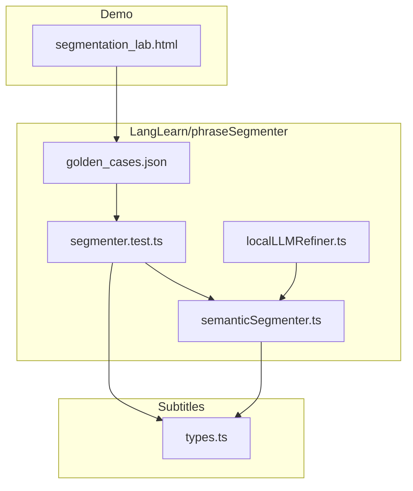
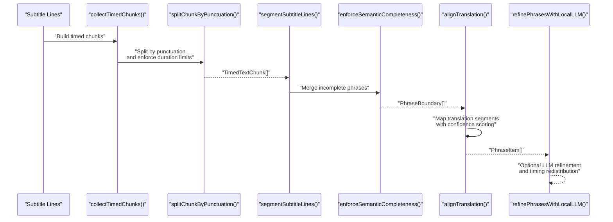
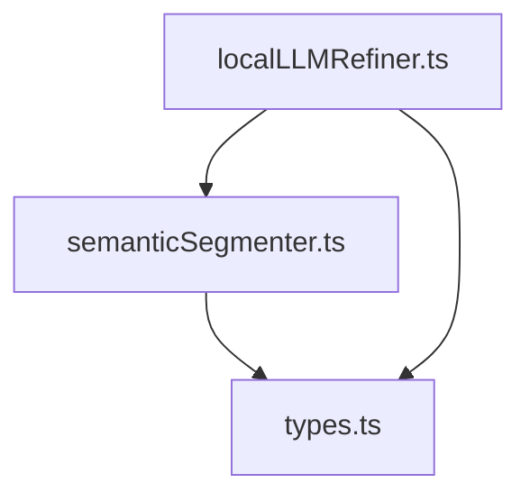

# Phrase Segmenter

<cite>
**Referenced Files in This Document**
- [semanticSegmenter.ts](file://src/langLearn/phraseSegmenter/semanticSegmenter.ts)
- [segmenter.test.ts](file://src/langLearn/phraseSegmenter/segmenter.test.ts)
- [golden_cases.json](file://src/langLearn/phraseSegmenter/golden_cases.json)
- [types.ts](file://src/subtitles/types.ts)
- [localLLMRefiner.ts](file://src/langLearn/phraseSegmenter/localLLMRefiner.ts)
- [segmentation_lab.html](file://demo/segmentation_lab.html)
</cite>

## Table of Contents
1. [Introduction](#introduction)
2. [Project Structure](#project-structure)
3. [Core Components](#core-components)
4. [Architecture Overview](#architecture-overview)
5. [Detailed Component Analysis](#detailed-component-analysis)
6. [Dependency Analysis](#dependency-analysis)
7. [Performance Considerations](#performance-considerations)
8. [Troubleshooting Guide](#troubleshooting-guide)
9. [Conclusion](#conclusion)

## Introduction
This document describes the phrase segmentation system used to break subtitle text into meaningful linguistic segments with precise timing allocation. The system integrates token-based segmentation using Unicode character analysis and locale-aware word boundaries, distributes duration across segmented words while preserving speech rhythm, and aligns ASR-generated subtitles with translation text to maintain natural speech patterns. It covers algorithmic behavior across languages, punctuation and whitespace handling, edge cases (empty tokens, zero-duration segments), and performance considerations for real-time processing.

## Project Structure
The phrase segmentation logic resides in the LangLearn module under src/langLearn/phraseSegmenter. The core implementation is in semanticSegmenter.ts, with tests in segmenter.test.ts, golden cases in golden_cases.json, and optional local LLM refinement in localLLMRefiner.ts. The subtitle data structures are defined in src/subtitles/types.ts. A demo page demonstrates segmentation behavior in a browser lab.

**Diagram sources**
- [semanticSegmenter.ts](file://src/langLearn/phraseSegmenter/semanticSegmenter.ts)
- [segmenter.test.ts](file://src/langLearn/phraseSegmenter/segmenter.test.ts)
- [golden_cases.json](file://src/langLearn/phraseSegmenter/golden_cases.json)
- [types.ts](file://src/subtitles/types.ts)
- [localLLMRefiner.ts](file://src/langLearn/phraseSegmenter/localLLMRefiner.ts)
- [segmentation_lab.html](file://demo/segmentation_lab.html)

**Section sources**
- [semanticSegmenter.ts](file://src/langLearn/phraseSegmenter/semanticSegmenter.ts)
- [types.ts](file://src/subtitles/types.ts)

## Core Components
- Token-based segmentation: Uses Unicode word boundaries and punctuation classification to split text into timed chunks.
- Duration distribution: Allocates time across chunks proportionally to text weight (character count without spaces) and enforces hard limits.
- Semantic completeness: Merges incomplete phrases to preserve meaning and avoid unnatural boundaries.
- Translation alignment: Aligns original phrase boundaries with translation segments, with confidence scoring and optional LLM refinement.
- Real-time constraints: Enforces maximum phrase duration and word counts to keep rendering responsive.

Key exported APIs:
- segmentSubtitleLines(lines, options?): Produces phrase boundaries from subtitle lines.
- alignTranslation(origPhrases, transLines): Aligns translation lines to original phrases.
- refinePhrasesWithLocalLLM(phrases, options?): Optionally refines translation text and timings using a local LLM.

**Section sources**
- [semanticSegmenter.ts](file://src/langLearn/phraseSegmenter/semanticSegmenter.ts)
- [types.ts](file://src/subtitles/types.ts)

## Architecture Overview
The segmentation pipeline transforms raw subtitle lines into phrase boundaries, then aligns translation text while preserving timing and meaning.

**Diagram sources**
- [semanticSegmenter.ts](file://src/langLearn/phraseSegmenter/semanticSegmenter.ts)
- [localLLMRefiner.ts](file://src/langLearn/phraseSegmenter/localLLMRefiner.ts)

## Detailed Component Analysis

### Token-based segmentation and Unicode word boundaries
- Word detection uses Unicode property escapes to recognize letters and numbers across languages.
- Punctuation classification distinguishes strong (., !, ?, …) and soft (,, ;, :) boundaries.
- Text splitting preserves punctuation clusters and handles closing quotes and brackets.

Key functions:
- splitByPunctuationBoundaries(text): Splits text into segments respecting punctuation clusters.
- splitLongPartByWords(text): Splits overly long segments into manageable chunks.
- splitOverlongTextPart(text, estimatedDurationMs): Further splits by time slices when duration exceeds thresholds.

Behavior highlights:
- Strong punctuation forces hard breaks; soft punctuation enables logical splits.
- Unclosed brackets and incomplete question endings trigger merges to preserve meaning.
- Character trimming and spacing normalization ensure consistent joins.

**Section sources**
- [semanticSegmenter.ts](file://src/langLearn/phraseSegmenter/semanticSegmenter.ts)

### Duration distribution and timing allocation
- Timed chunks are built from either tokenized ASR data or fallback text lines.
- Duration is distributed proportionally to text weight (non-space length) across segments.
- Hard limits prevent excessively long phrases: maximum words per phrase and maximum duration.
- Long segments are sliced into smaller timed chunks to meet duration targets.

Important thresholds:
- MAX_WORDS_PER_PHRASE, MAX_DURATION_MS, HARD_GAP_MS, MIN_HARD_PAUSE_WORDS, MIN_HARD_PAUSE_DURATION_MS.

Edge handling:
- Zero-duration segments are skipped; overlapping phrases are resolved with a bounded overlap policy.

**Section sources**
- [semanticSegmenter.ts](file://src/langLearn/phraseSegmenter/semanticSegmenter.ts)

### Semantic completeness and phrase merging
- Incomplete phrases (e.g., ending with logical connectors or incomplete questions) are merged with subsequent phrases to preserve meaning.
- Unclosed brackets and soft punctuation below a threshold trigger merges.
- Overlapping phrase resolution ensures non-decreasing time stamps.

Merging criteria:
- Tail word sets (INCOMPLETE_TAIL_WORDS, INCOMPLETE_QUESTION_ENDINGS).
- Duration thresholds (MIN_PHRASE_DURATION_MS, MIN_MICRO_PHRASE_DURATION_MS).
- Word count thresholds (MIN_WORDS_FOR_INDEPENDENT_NON_TERMINAL_PHRASE, SOFT_TAIL_MIN_WORDS).

**Section sources**
- [semanticSegmenter.ts](file://src/langLearn/phraseSegmenter/semanticSegmenter.ts)

### Translation alignment and confidence scoring
- Original phrases are aligned to translation segments using temporal centers and overlap detection.
- Global timing shift estimation improves alignment robustness.
- Adjacent phrase rebalancing redistributes translation text to match original duration ratios.
- Confidence scoring penalizes timing mismatches, word ratio extremes, incomplete tails, and overflow.

Alignment features:
- Overlap scanning with slop tolerance.
- Expansion with next phrase when beneficial and gap constraints are met.
- Minimum translation part duration enforcement.

Confidence scoring factors:
- Timing ratio (ideal 0.6–1.6).
- Word ratio (ideal 0.3–3.0).
- Terminal punctuation presence.
- Overflow and very short translation penalties.

**Section sources**
- [semanticSegmenter.ts](file://src/langLearn/phraseSegmenter/semanticSegmenter.ts)

### Local LLM refinement (optional)
- Detects suspicious phrase pairs based on timing/word ratio imbalances and incomplete tails.
- Builds windows around suspicious areas and prompts a local LLM to rewrite translation boundaries.
- Redistributes timings according to original phrase durations within the window.
- Applies refinements selectively and logs progress.

Integration points:
- refinePhrasesWithLocalLLM(phrases, options) returns refined PhraseItem[].
- Uses WebGPU-backed WebLLM engine with configurable timeouts and window sizes.

**Section sources**
- [localLLMRefiner.ts](file://src/langLearn/phraseSegmenter/localLLMRefiner.ts)

### Data models and types
- SubtitleToken: text, startMs, durationMs, isWordLike.
- SubtitleLine: text, startMs, durationMs, speakerId, tokens.
- PhraseBoundary: text, startMs, endMs.
- PhraseItem: extended with translation text and confidence.

These types define the input/output contracts for segmentation and alignment.

**Section sources**
- [types.ts](file://src/subtitles/types.ts)

### Examples and expected behavior
- Sentence splitting by punctuation within a line.
- Long pause detection causing phrase breaks.
- Soft logical boundaries enabling natural splits.
- Long phrases without punctuation split into compact timed chunks.
- Translation alignment across multiple lines with confidence scoring.
- Golden cases demonstrate real TED Talk scenarios and question spillovers.

**Section sources**
- [segmenter.test.ts](file://src/langLearn/phraseSegmenter/segmenter.test.ts)
- [golden_cases.json](file://src/langLearn/phraseSegmenter/golden_cases.json)

## Dependency Analysis
The segmentation system depends on:
- Subtitle types for input representation.
- Unicode regex patterns for locale-aware word detection.
- Threshold constants controlling phrase length and duration.
- Optional WebLLM integration for refinement.

**Diagram sources**
- [types.ts](file://src/subtitles/types.ts)
- [semanticSegmenter.ts](file://src/langLearn/phraseSegmenter/semanticSegmenter.ts)
- [localLLMRefiner.ts](file://src/langLearn/phraseSegmenter/localLLMRefiner.ts)

**Section sources**
- [semanticSegmenter.ts](file://src/langLearn/phraseSegmenter/semanticSegmenter.ts)
- [types.ts](file://src/subtitles/types.ts)

## Performance Considerations
- Regex-based word detection and punctuation classification are linear in text length.
- Weighted distribution and chunk splitting operate in O(n) over segments.
- Overlapping resolution and semantic merging iterate through phrases once.
- Translation alignment uses binary search for nearest neighbor and sliding window scans.
- Optional LLM refinement adds latency proportional to window count and size; tuned via options.

Memory optimization techniques:
- Stream processing of chunks avoids building large intermediate arrays.
- In-place updates for rebalancing reduce allocations.
- Weighted splitting uses integer arithmetic with rounding to minimize floating-point overhead.
- Early exits for empty or trivial inputs.

Real-time constraints:
- Maximum phrase duration and word counts cap processing cost.
- Forced split windows limit excessive recursion.

[No sources needed since this section provides general guidance]

## Troubleshooting Guide
Common issues and resolutions:
- Empty or whitespace-only segments: Skipped during collection and joining; ensure tokens have non-empty text.
- Zero-duration segments: Ignored in timing calculations; verify token durations and line durations.
- Overlapping phrases: Automatically resolved with bounded overlap; check MAX_OVERLAP_RESOLUTION_MS.
- Translation overflow: Penalized in confidence; consider rebalancing or reducing window size.
- LLM unavailable: Gracefully falls back; enable WebGPU or disable local refinement.

Validation:
- Tests cover sentence splitting, long pauses, soft boundaries, and golden cases.
- Confidence scoring tests validate penalties for mismatched timing/word ratios.

**Section sources**
- [segmenter.test.ts](file://src/langLearn/phraseSegmenter/segmenter.test.ts)
- [semanticSegmenter.ts](file://src/langLearn/phraseSegmenter/semanticSegmenter.ts)

## Conclusion
The phrase segmentation system provides robust, locale-aware token-based segmentation with precise timing distribution and semantic completeness. It integrates seamlessly with ASR-generated subtitles and translation text, preserving natural speech rhythms and meaning. Optional local LLM refinement enhances alignment quality when available. The design balances correctness, performance, and real-time responsiveness, making it suitable for interactive subtitle rendering and language learning applications.