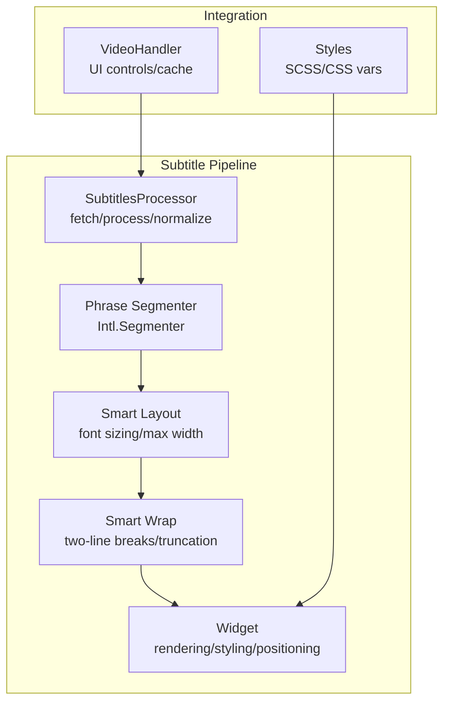
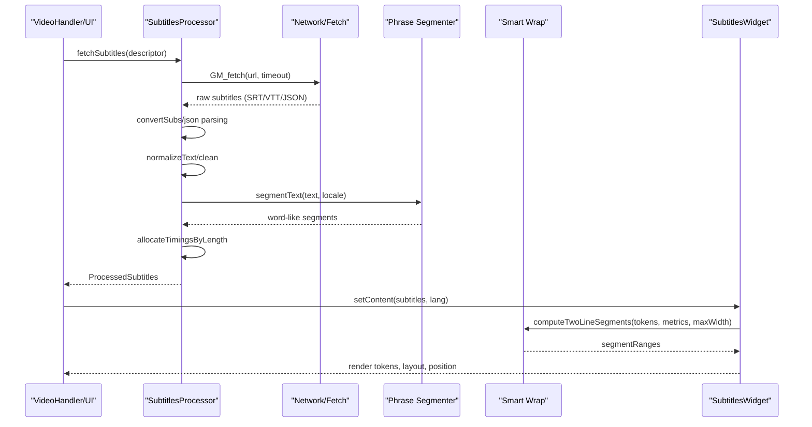
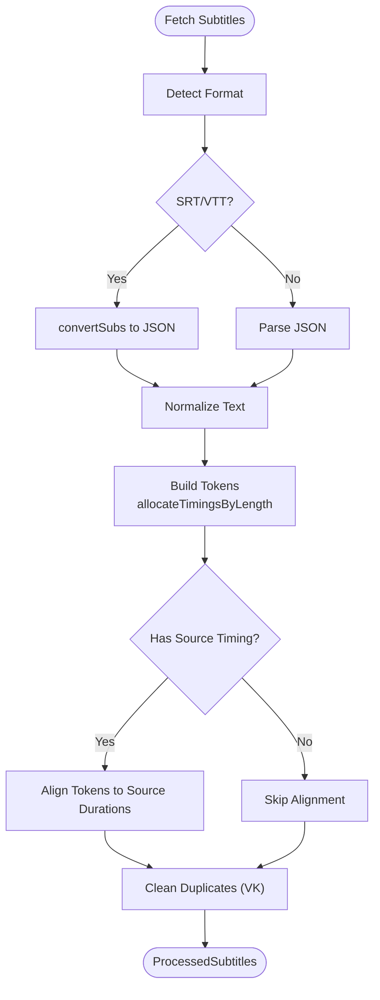
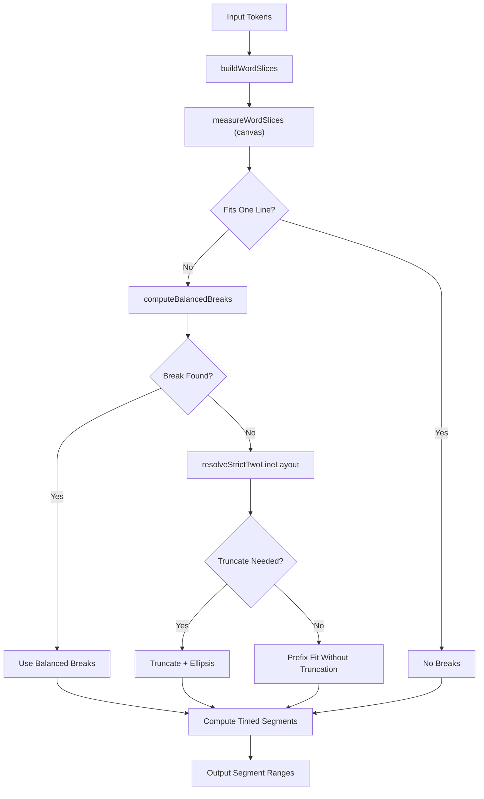
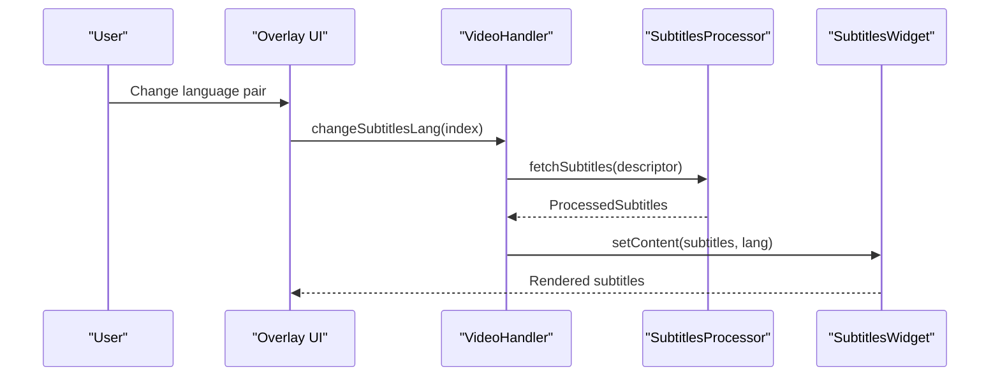
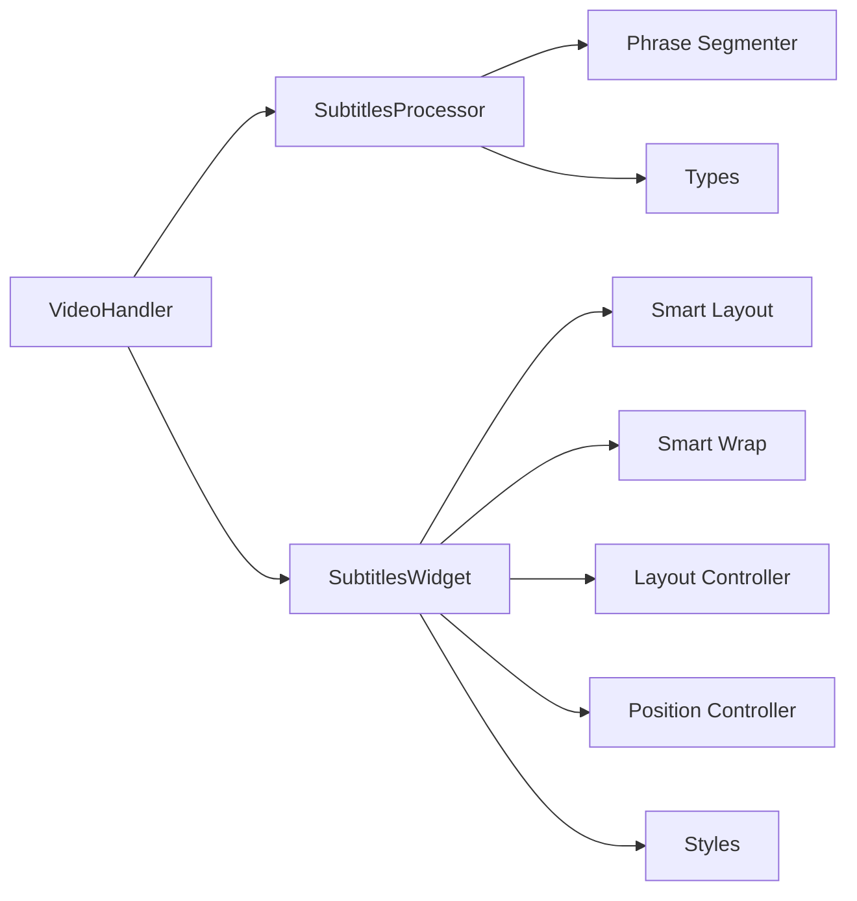

# Subtitle Processing System

<cite>
**Referenced Files in This Document**
- [processor.ts](file://src/subtitles/processor.ts)
- [segmenter.ts](file://src/subtitles/segmenter.ts)
- [smartLayout.ts](file://src/subtitles/smartLayout.ts)
- [smartWrap.ts](file://src/subtitles/smartWrap.ts)
- [widget.ts](file://src/subtitles/widget.ts)
- [types.ts](file://src/subtitles/types.ts)
- [layoutController.ts](file://src/subtitles/layoutController.ts)
- [positionController.ts](file://src/subtitles/positionController.ts)
- [subtitles.scss](file://src/styles/subtitles.scss)
- [subtitles.ts](file://src/videoHandler/modules/subtitles.ts)
- [segmentation_lab.html](file://demo/segmentation_lab.html)
</cite>

## Table of Contents
1. [Introduction](#introduction)
2. [Project Structure](#project-structure)
3. [Core Components](#core-components)
4. [Architecture Overview](#architecture-overview)
5. [Detailed Component Analysis](#detailed-component-analysis)
6. [Dependency Analysis](#dependency-analysis)
7. [Performance Considerations](#performance-considerations)
8. [Troubleshooting Guide](#troubleshooting-guide)
9. [Conclusion](#conclusion)

## Introduction
This document describes the subtitle processing system used in the English Teacher project. It covers the end-to-end pipeline for fetching, parsing, normalizing, segmenting, laying out, and rendering subtitles with intelligent timing alignment and smart wrapping. The system supports multiple subtitle formats (SRT, VTT, JSON), integrates with video timelines, synchronizes with audio, and provides a customizable widget with automatic positioning, sizing, and collision avoidance.

## Project Structure
The subtitle system is organized around several focused modules:
- Processor: format conversion, normalization, and token timing alignment
- Segmenter: locale-aware word segmentation
- Smart Layout: automatic font sizing and layout constraints
- Smart Wrap: two-line segmentation with balanced breaks and truncation
- Widget: rendering, styling, interactivity, and positioning
- Types: shared data structures
- Controllers: layout and positioning utilities
- Styles: CSS for rendering and visual effects
- Video Handler: integration with video playback and UI controls



**Diagram sources**
- [processor.ts:632-804](file://src/subtitles/processor.ts#L632-L804)
- [segmenter.ts:68-89](file://src/subtitles/segmenter.ts#L68-L89)
- [smartLayout.ts:105-137](file://src/subtitles/smartLayout.ts#L105-L137)
- [smartWrap.ts:631-657](file://src/subtitles/smartWrap.ts#L631-L657)
- [widget.ts:110-1738](file://src/subtitles/widget.ts#L110-L1738)
- [subtitles.ts:293-492](file://src/videoHandler/modules/subtitles.ts#L293-L492)
- [subtitles.scss:1-215](file://src/styles/subtitles.scss#L1-L215)

**Section sources**
- [processor.ts:1-878](file://src/subtitles/processor.ts#L1-L878)
- [segmenter.ts:1-89](file://src/subtitles/segmenter.ts#L1-L89)
- [smartLayout.ts:1-138](file://src/subtitles/smartLayout.ts#L1-L138)
- [smartWrap.ts:1-670](file://src/subtitles/smartWrap.ts#L1-L670)
- [widget.ts:1-1738](file://src/subtitles/widget.ts#L1-L1738)
- [types.ts:1-52](file://src/subtitles/types.ts#L1-L52)
- [layoutController.ts:1-37](file://src/subtitles/layoutController.ts#L1-L37)
- [positionController.ts:1-58](file://src/subtitles/positionController.ts#L1-L58)
- [subtitles.scss:1-215](file://src/styles/subtitles.scss#L1-L215)
- [subtitles.ts:1-492](file://src/videoHandler/modules/subtitles.ts#L1-L492)

## Core Components
- SubtitlesProcessor: Fetches subtitles, converts formats, normalizes text, builds tokens, aligns timings, and cleans duplicates
- Phrase Segmenter: Uses Intl.Segmenter or fallback regex to split text into word-like segments per locale
- Smart Layout: Computes font size, max width, and line length based on video aspect ratio and viewport
- Smart Wrap: Measures text widths, computes balanced two-line breaks, and optional truncation with ellipsis
- SubtitlesWidget: Renders tokens, manages highlighting, tooltips, drag positioning, and responsive layout
- Types: Defines token, line, subtitles, descriptor, and client interfaces
- Controllers: Utilities for time-based line lookup and position clamping
- Styles: CSS variables and rules for typography, background, shadows, and responsive behavior
- VideoHandler Integration: Loads, selects, proxies, and displays subtitles in the UI

**Section sources**
- [processor.ts:632-804](file://src/subtitles/processor.ts#L632-L804)
- [segmenter.ts:68-89](file://src/subtitles/segmenter.ts#L68-L89)
- [smartLayout.ts:105-137](file://src/subtitles/smartLayout.ts#L105-L137)
- [smartWrap.ts:631-657](file://src/subtitles/smartWrap.ts#L631-L657)
- [widget.ts:110-1738](file://src/subtitles/widget.ts#L110-L1738)
- [types.ts:7-52](file://src/subtitles/types.ts#L7-L52)
- [layoutController.ts:3-28](file://src/subtitles/layoutController.ts#L3-L28)
- [positionController.ts:27-57](file://src/subtitles/positionController.ts#L27-L57)
- [subtitles.scss:1-215](file://src/styles/subtitles.scss#L1-L215)
- [subtitles.ts:293-492](file://src/videoHandler/modules/subtitles.ts#L293-L492)

## Architecture Overview
The system follows a layered architecture:
- Data ingestion: fetch and format conversion
- Normalization: text cleaning, HTML stripping, punctuation spacing
- Timing alignment: token allocation by length and source timing overrides
- Segmentation: word-like segment building
- Layout: smart sizing and constraints
- Wrapping: two-line segmentation with cost-based optimization
- Rendering: lit-html templates, CSS variables, and interactive features



**Diagram sources**
- [processor.ts:564-592](file://src/subtitles/processor.ts#L564-L592)
- [processor.ts:632-691](file://src/subtitles/processor.ts#L632-L691)
- [segmenter.ts:68-89](file://src/subtitles/segmenter.ts#L68-L89)
- [smartWrap.ts:631-657](file://src/subtitles/smartWrap.ts#L631-L657)
- [widget.ts:1437-1464](file://src/subtitles/widget.ts#L1437-L1464)
- [subtitles.ts:349-361](file://src/videoHandler/modules/subtitles.ts#L349-L361)

## Detailed Component Analysis

### Subtitle Processor
Responsibilities:
- Format detection and conversion (SRT/VTT → JSON)
- Text normalization (HTML stripping, punctuation spacing, whitespace cleanup)
- YouTube-specific timing extraction and ASR token handling
- VK duplicate merging and token normalization
- Token timing alignment using source timings when available

Key algorithms:
- allocateTimingsByLength: distributes duration proportionally by text length
- collectSourceTimedWords: maps source token timings to target word segments
- buildLineTokens: combines segment-based timing with source timing overrides
- formatYoutubeSubtitles: parses YouTube events and segments into lines
- cleanJsonSubtitles: deduplicates adjacent cues and merges tokens by length



**Diagram sources**
- [processor.ts:564-592](file://src/subtitles/processor.ts#L564-L592)
- [processor.ts:632-691](file://src/subtitles/processor.ts#L632-L691)
- [processor.ts:693-787](file://src/subtitles/processor.ts#L693-L787)
- [processor.ts:454-562](file://src/subtitles/processor.ts#L454-L562)

**Section sources**
- [processor.ts:564-804](file://src/subtitles/processor.ts#L564-L804)
- [processor.ts:454-562](file://src/subtitles/processor.ts#L454-L562)

### Phrase Segmenter
Responsibilities:
- Locale-aware word segmentation using Intl.Segmenter
- Fallback regex-based segmentation when Intl is unavailable
- Classification of segments as word-like or punctuation/space

Implementation highlights:
- Canonicalizes locales and checks support
- Caches Segmenters by locale
- Returns segments with text, index, and isWordLike flag

**Section sources**
- [segmenter.ts:17-89](file://src/subtitles/segmenter.ts#L17-L89)

### Smart Layout Engine
Responsibilities:
- Compute font size based on anchor box height and aspect ratio
- Determine max width based on aspect-guidelines and character width estimation
- Derive target characters-per-line and enforce minimum width bounds
- Provide maxLength for time-based segmentation

Algorithm:
- estimate character width using EST_CHAR_WIDTH_RATIO
- clamp to min/max font sizes
- derive maxWidth from targetCPL and font size
- compute maxLength bounded by reasonable limits

**Section sources**
- [smartLayout.ts:28-137](file://src/subtitles/smartLayout.ts#L28-L137)

### Smart Wrapping System
Responsibilities:
- Measure word widths using canvas measurement
- Compute balanced two-line breaks minimizing residual slack and variance
- Apply sentence boundary splits to avoid breaking mid-sentence endings
- Support strict two-line layout with truncation and smart ellipsis

Core functions:
- buildWordSlices: creates slices spanning from a word to the next word
- measureWordSlices: computes prefix sums for widths/chars and trailing gaps
- fitsInTwoLines: checks if a range fits within maxWidth
- computeBalancedBreaks: finds optimal break minimizing cost
- computeTwoLineSegments: produces token ranges with precise start/endMs
- resolveStrictTwoLineLayout: fallback to prefix fit with truncation
- shouldShowSmartEllipsis: determines when to show ellipsis



**Diagram sources**
- [smartWrap.ts:81-137](file://src/subtitles/smartWrap.ts#L81-L137)
- [smartWrap.ts:139-178](file://src/subtitles/smartWrap.ts#L139-L178)
- [smartWrap.ts:228-255](file://src/subtitles/smartWrap.ts#L228-L255)
- [smartWrap.ts:298-353](file://src/subtitles/smartWrap.ts#L298-L353)
- [smartWrap.ts:380-436](file://src/subtitles/smartWrap.ts#L380-L436)
- [smartWrap.ts:631-657](file://src/subtitles/smartWrap.ts#L631-L657)

**Section sources**
- [smartWrap.ts:1-670](file://src/subtitles/smartWrap.ts#L1-L670)

### Subtitles Widget Rendering
Responsibilities:
- Render tokens with lit-html, applying breaks and optional ellipsis
- Manage highlighting of passed words based on midpoint timing
- Handle click-to-translate tooltips with service integration
- Drag-and-drop positioning with clamping and safe area awareness
- Responsive layout updates on resize and visual viewport changes
- Smart layout integration for font size, max width, and alignment

Key features:
- Memoization for token precomputation, measurements, and segmentation
- Guarded wrap width to prevent over-constrained wrapping
- Dynamic CSS variables for font size, opacity, and max width
- Multiline alignment switching from center to left when content spans multiple lines

```mermaid
classDiagram
class SubtitlesWidget {
-video : HTMLVideoElement
-container : HTMLElement
-portal : HTMLElement
-subtitles : ProcessedSubtitles
-smartLayoutEnabled : boolean
-smartFontSizePx : number
-smartMaxWidthPx : number
-maxLength : number
-position : {left, top}
+setContent(subtitles, lang)
+setSmartLayout(enabled)
+setFontSize(size)
+setMaxLength(len)
+setHighlightWords(value)
+setOpacity(rate)
+onClick(event)
+release()
-processTokens(tokens, time)
-renderTokens(tokens)
-applySubtitlePositionWithLayout(layout, anchorBox)
}
```

**Diagram sources**
- [widget.ts:110-1738](file://src/subtitles/widget.ts#L110-L1738)

**Section sources**
- [widget.ts:110-1738](file://src/subtitles/widget.ts#L110-L1738)
- [subtitles.scss:1-215](file://src/styles/subtitles.scss#L1-L215)

### Integration with Video Timeline and UI
Responsibilities:
- Load subtitles via VideoHandler, including caching and deduplication
- Select best subtitles based on language pair and provider preferences
- Proxy Yandex URLs when configured
- Update UI dropdown and enable/disable download button
- Toggle subtitles on/off and hotkey helpers



**Diagram sources**
- [subtitles.ts:293-361](file://src/videoHandler/modules/subtitles.ts#L293-L361)
- [processor.ts:789-804](file://src/subtitles/processor.ts#L789-L804)
- [widget.ts:1437-1464](file://src/subtitles/widget.ts#L1437-L1464)

**Section sources**
- [subtitles.ts:293-492](file://src/videoHandler/modules/subtitles.ts#L293-L492)

## Dependency Analysis
The system exhibits strong cohesion within functional layers and minimal coupling between modules. Dependencies:
- SubtitlesProcessor depends on segmenter, types, and external conversion utilities
- Widget depends on smartLayout, smartWrap, layoutController, positionController, and styles
- VideoHandler orchestrates UI, caching, and subtitle selection
- Styles are consumed by widget rendering



**Diagram sources**
- [processor.ts:1-878](file://src/subtitles/processor.ts#L1-L878)
- [segmenter.ts:1-89](file://src/subtitles/segmenter.ts#L1-L89)
- [smartLayout.ts:1-138](file://src/subtitles/smartLayout.ts#L1-L138)
- [smartWrap.ts:1-670](file://src/subtitles/smartWrap.ts#L1-L670)
- [widget.ts:1-1738](file://src/subtitles/widget.ts#L1-L1738)
- [layoutController.ts:1-37](file://src/subtitles/layoutController.ts#L1-L37)
- [positionController.ts:1-58](file://src/subtitles/positionController.ts#L1-L58)
- [subtitles.ts:1-492](file://src/videoHandler/modules/subtitles.ts#L1-L492)

**Section sources**
- [processor.ts:1-878](file://src/subtitles/processor.ts#L1-L878)
- [widget.ts:1-1738](file://src/subtitles/widget.ts#L1-L1738)
- [subtitles.ts:1-492](file://src/videoHandler/modules/subtitles.ts#L1-L492)

## Performance Considerations
- Memoization: Token precompute, line measure, and segmentation results are cached to avoid recomputation
- Canvas measurement: Off-DOM measurement minimizes layout thrashing
- Smart layout throttling: Layout recomputation is rate-limited and only triggered when needed
- Guarded wrap width: Prevents excessive truncation and maintains readability
- Efficient DOM updates: lit-html renders only changed subtrees
- Video frame loop: Optional requestVideoFrameCallback reduces polling overhead
- Minimizing DOM queries: Layout metrics and measurements are batched

[No sources needed since this section provides general guidance]

## Troubleshooting Guide
Common issues and remedies:
- Subtitles not appearing
  - Verify descriptor validity and URL accessibility
  - Check format support (SRT, VTT, JSON) and conversion path
  - Confirm language selection and provider availability
- Incorrect timing or overlapping lines
  - Inspect token allocation and source timing overrides
  - Validate segment ranges and timing boundaries
- Poor wrapping or truncation
  - Adjust smart layout settings and max width
  - Review character width estimation and guard ratios
- Positioning conflicts or off-screen placement
  - Ensure anchor box computation and bottom inset calculations
  - Check safe area insets and mobile viewport adjustments
- Translation tooltip not showing
  - Confirm translation service configuration and network access
  - Verify token click resolution and tooltip lifecycle

**Section sources**
- [processor.ts:564-592](file://src/subtitles/processor.ts#L564-L592)
- [widget.ts:1327-1436](file://src/subtitles/widget.ts#L1327-L1436)
- [positionController.ts:27-57](file://src/subtitles/positionController.ts#L27-L57)
- [subtitles.ts:349-361](file://src/videoHandler/modules/subtitles.ts#L349-L361)

## Conclusion
The subtitle processing system provides a robust, extensible pipeline for converting, normalizing, segmenting, and rendering subtitles with intelligent timing alignment and smart wrapping. Its modular design enables efficient caching, responsive layout, and seamless integration with video playback and UI controls. The combination of locale-aware segmentation, automatic layout sizing, and interactive widget features delivers a high-quality viewing experience across diverse formats and devices.