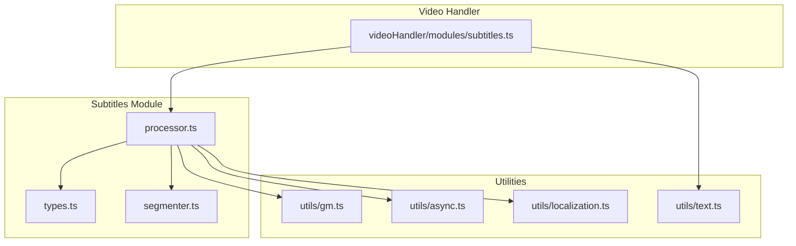
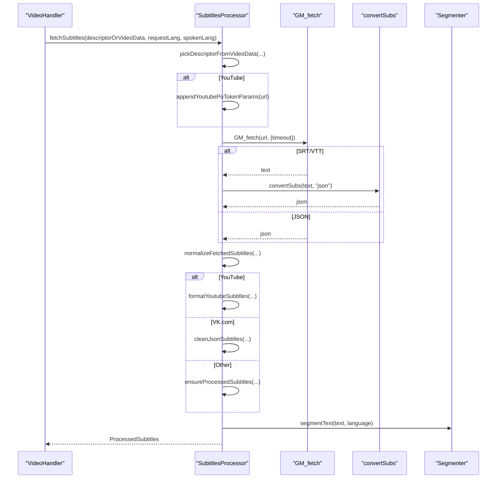
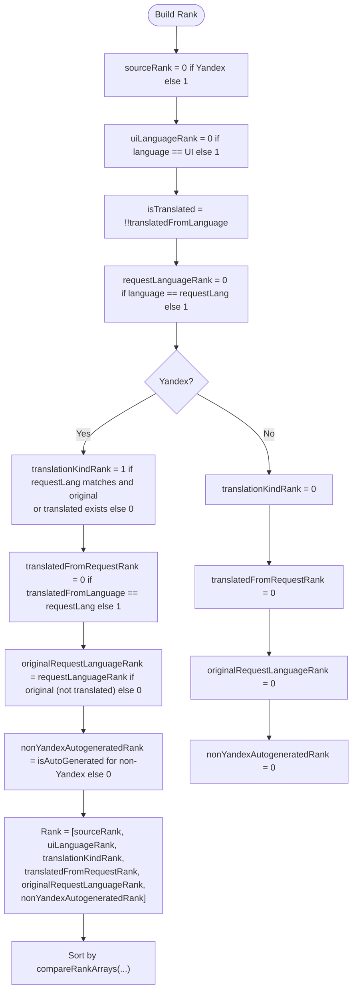
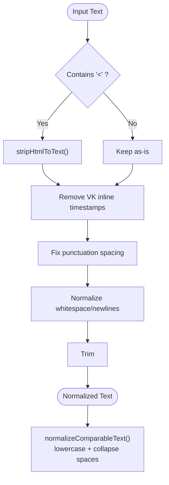
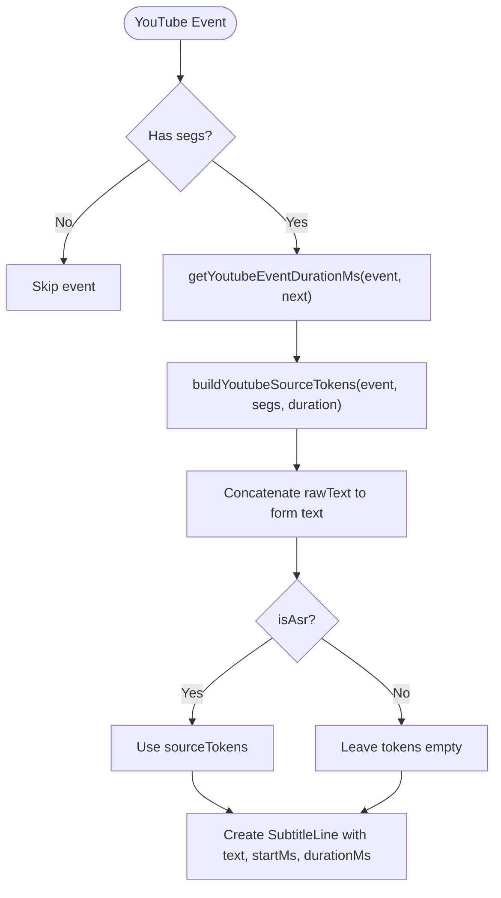
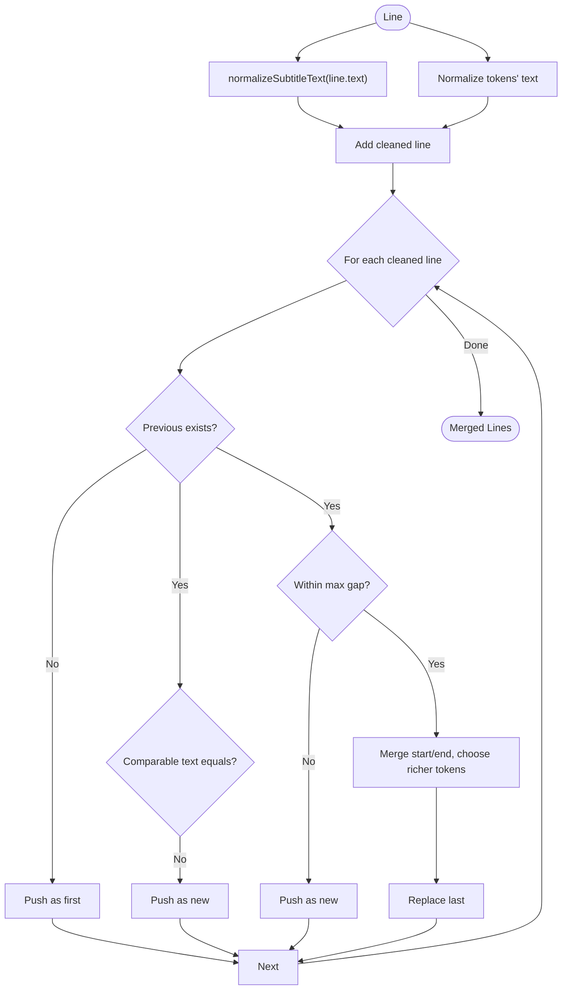
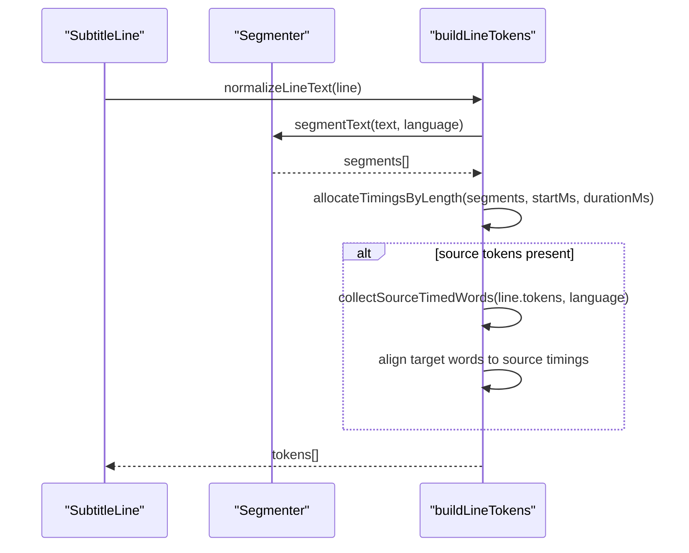
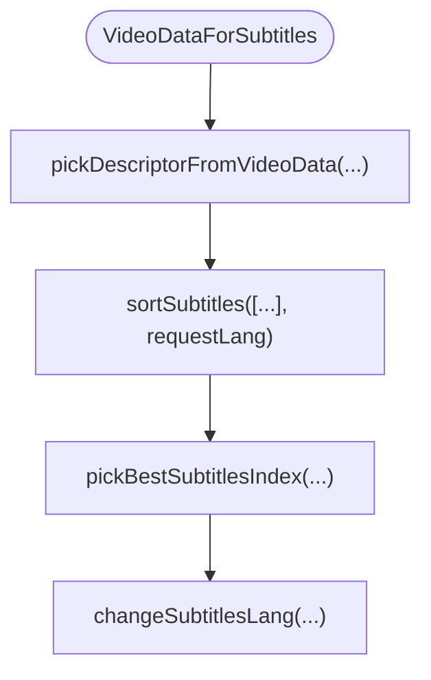
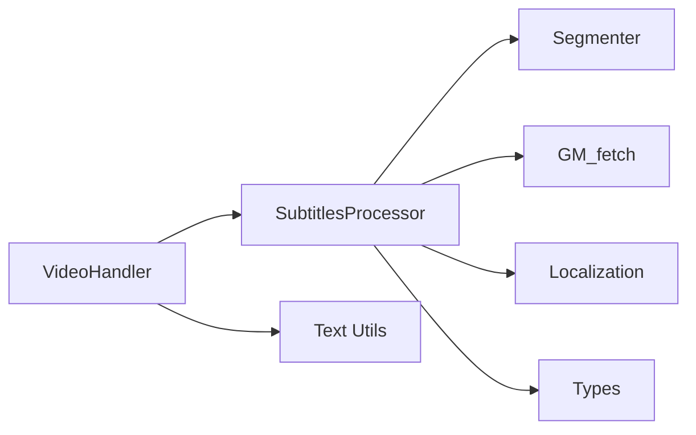

# Subtitle Processor

<cite>
**Referenced Files in This Document**
- [processor.ts](file://src/subtitles/processor.ts)
- [types.ts](file://src/subtitles/types.ts)
- [segmenter.ts](file://src/subtitles/segmenter.ts)
- [subtitles.ts](file://src/videoHandler/modules/subtitles.ts)
- [gm.ts](file://src/utils/gm.ts)
- [async.ts](file://src/utils/async.ts)
- [localization.ts](file://src/utils/localization.ts)
- [text.ts](file://src/utils/text.ts)
</cite>

## Table of Contents
1. [Introduction](#introduction)
2. [Project Structure](#project-structure)
3. [Core Components](#core-components)
4. [Architecture Overview](#architecture-overview)
5. [Detailed Component Analysis](#detailed-component-analysis)
6. [Dependency Analysis](#dependency-analysis)
7. [Performance Considerations](#performance-considerations)
8. [Troubleshooting Guide](#troubleshooting-guide)
9. [Conclusion](#conclusion)

## Introduction
This document describes the subtitle processor component responsible for discovering, fetching, normalizing, ranking, and tokenizing subtitle tracks across multiple providers (YouTube, VK.com, and Yandex). It explains the end-to-end pipeline from raw provider responses to normalized subtitle lines with precise token timings, including specialized handling for YouTube ASR tokens and VK.com duplicate merging. It also documents the subtitle ranking algorithm, text sanitization and normalization, and performance strategies for large subtitle files.

## Project Structure
The subtitle processor lives under the subtitles module and integrates with the video handler for selection and display. Supporting utilities provide HTTP fetching, asynchronous timeouts, localization, and text cleaning.

**Diagram sources**
- [processor.ts:1-878](file://src/subtitles/processor.ts#L1-L878)
- [types.ts:1-52](file://src/subtitles/types.ts#L1-L52)
- [segmenter.ts:1-89](file://src/subtitles/segmenter.ts#L1-L89)
- [subtitles.ts:1-492](file://src/videoHandler/modules/subtitles.ts#L1-L492)
- [gm.ts:1-248](file://src/utils/gm.ts#L1-L248)
- [async.ts:1-30](file://src/utils/async.ts#L1-L30)
- [localization.ts:1-36](file://src/utils/localization.ts#L1-L36)
- [text.ts:1-36](file://src/utils/text.ts#L1-L36)

**Section sources**
- [processor.ts:1-878](file://src/subtitles/processor.ts#L1-L878)
- [types.ts:1-52](file://src/subtitles/types.ts#L1-L52)
- [segmenter.ts:1-89](file://src/subtitles/segmenter.ts#L1-L89)
- [subtitles.ts:1-492](file://src/videoHandler/modules/subtitles.ts#L1-L492)
- [gm.ts:1-248](file://src/utils/gm.ts#L1-L248)
- [async.ts:1-30](file://src/utils/async.ts#L1-L30)
- [localization.ts:1-36](file://src/utils/localization.ts#L1-L36)
- [text.ts:1-36](file://src/utils/text.ts#L1-L36)

## Core Components
- SubtitlesProcessor: Central orchestrator for fetching, normalizing, ranking, and tokenizing subtitles.
- Subtitle types: Strongly typed structures for descriptors, lines, tokens, and payloads.
- Segmenter: Locale-aware word segmentation for accurate token timing.
- Video handler integration: Provider discovery, sorting, selection, and display.
- Utilities: HTTP fetching with fallbacks, timeouts, localization, and text cleaning.

**Section sources**
- [processor.ts:632-878](file://src/subtitles/processor.ts#L632-L878)
- [types.ts:7-51](file://src/subtitles/types.ts#L7-L51)
- [segmenter.ts:68-89](file://src/subtitles/segmenter.ts#L68-L89)
- [subtitles.ts:203-291](file://src/videoHandler/modules/subtitles.ts#L203-L291)

## Architecture Overview
The processor follows a pipeline:
- Descriptor selection: Choose a single subtitle descriptor from either explicit input or discovered providers.
- Provider-specific fetching: Normalize formats and apply provider-specific transformations.
- Tokenization: Build per-word tokens with startMs/durationMs aligned to source timings when available.
- Normalization: Clean text, strip HTML, fix punctuation spacing, and merge duplicates for VK.com.

**Diagram sources**
- [processor.ts:789-827](file://src/subtitles/processor.ts#L789-L827)
- [processor.ts:564-574](file://src/subtitles/processor.ts#L564-L574)
- [processor.ts:576-592](file://src/subtitles/processor.ts#L576-L592)
- [processor.ts:653-691](file://src/subtitles/processor.ts#L653-L691)
- [processor.ts:693-787](file://src/subtitles/processor.ts#L693-L787)
- [segmenter.ts:68-89](file://src/subtitles/segmenter.ts#L68-L89)
- [gm.ts:211-247](file://src/utils/gm.ts#L211-L247)

## Detailed Component Analysis

### Subtitle Ranking Algorithm
The ranking prioritizes:
- Provider preference: Yandex over others.
- UI language match: Matches current UI language.
- Translation kind (Yandex): Prefer original when request language matches; otherwise prefer translated variants.
- Translated-from-language alignment (Yandex): Match request language for translated tracks.
- Original request language alignment (Yandex): Favor original tracks matching request language.
- Auto-generated suppression (non-Yandex): Prefer non-auto-generated tracks.

**Diagram sources**
- [processor.ts:203-242](file://src/subtitles/processor.ts#L203-L242)
- [processor.ts:244-287](file://src/subtitles/processor.ts#L244-L287)

**Section sources**
- [processor.ts:203-242](file://src/subtitles/processor.ts#L203-L242)
- [processor.ts:244-287](file://src/subtitles/processor.ts#L244-L287)

### Text Sanitization and Normalization
- HTML stripping: Converts HTML to plain text using DOM template when available; otherwise strips tags.
- Inline timestamps removal: Removes VK inline timestamp markers before normalization.
- Punctuation spacing: Ensures proper spacing around punctuation.
- Whitespace cleanup: Normalizes newlines, removes excess spaces, and trims.
- Comparable text: Lowercases and collapses whitespace for duplicate detection.

**Diagram sources**
- [processor.ts:361-388](file://src/subtitles/processor.ts#L361-L388)
- [processor.ts:390-391](file://src/subtitles/processor.ts#L390-L391)

**Section sources**
- [processor.ts:361-388](file://src/subtitles/processor.ts#L361-L388)
- [processor.ts:390-391](file://src/subtitles/processor.ts#L390-L391)

### YouTube-Specific Processing
- Timestamp extraction: Computes per-event durations considering overlapping segments and next-event boundaries.
- Token building: Builds source tokens from YouTube segments with offsets; allocates remaining duration across segments.
- Optional ASR tokenization: For auto-generated tracks, preserves source tokens; otherwise leaves tokens empty.

**Diagram sources**
- [processor.ts:393-402](file://src/subtitles/processor.ts#L393-L402)
- [processor.ts:404-443](file://src/subtitles/processor.ts#L404-L443)
- [processor.ts:653-691](file://src/subtitles/processor.ts#L653-L691)

**Section sources**
- [processor.ts:393-402](file://src/subtitles/processor.ts#L393-L402)
- [processor.ts:404-443](file://src/subtitles/processor.ts#L404-L443)
- [processor.ts:653-691](file://src/subtitles/processor.ts#L653-L691)

### VK.com Cleaning and Duplicate Merging
- Text normalization: Applies the same HTML stripping and spacing rules.
- Token normalization: Normalizes each token’s text independently.
- Duplicate detection: Compares comparable texts; merges when duplicate and near in time.
- Timing merging: Chooses the merged start/end and retains richer tokens (by token-length tie-break).

**Diagram sources**
- [processor.ts:693-787](file://src/subtitles/processor.ts#L693-L787)

**Section sources**
- [processor.ts:693-787](file://src/subtitles/processor.ts#L693-L787)

### Tokenization and Word Timing Alignment
- Line text normalization: Uses either provided text or concatenates tokens.
- Word segmentation: Uses locale-aware segmenter or fallback regex-based segmentation.
- Duration allocation: Distributes duration proportionally by text length across segments.
- Source timing alignment: When source tokens exist, aligns target words to source timings using index mapping.

**Diagram sources**
- [processor.ts:448-562](file://src/subtitles/processor.ts#L448-L562)
- [segmenter.ts:68-89](file://src/subtitles/segmenter.ts#L68-L89)

**Section sources**
- [processor.ts:448-562](file://src/subtitles/processor.ts#L448-L562)
- [segmenter.ts:68-89](file://src/subtitles/segmenter.ts#L68-L89)

### Provider Discovery and Selection
- Descriptor selection: Picks a descriptor from video metadata or falls back to the first available.
- Sorting: Ranks descriptors using the ranking algorithm and sorts deterministically.
- Best-track selection: The video handler selects the best track based on language pair and provider preferences.

**Diagram sources**
- [processor.ts:90-113](file://src/subtitles/processor.ts#L90-L113)
- [processor.ts:259-287](file://src/subtitles/processor.ts#L259-L287)
- [subtitles.ts:203-291](file://src/videoHandler/modules/subtitles.ts#L203-L291)

**Section sources**
- [processor.ts:90-113](file://src/subtitles/processor.ts#L90-L113)
- [processor.ts:259-287](file://src/subtitles/processor.ts#L259-L287)
- [subtitles.ts:203-291](file://src/videoHandler/modules/subtitles.ts#L203-L291)

## Dependency Analysis
- SubtitlesProcessor depends on:
  - Segmenter for locale-aware word segmentation.
  - GM_fetch for robust HTTP retrieval with fallbacks and timeouts.
  - Localization for UI language comparisons.
  - convertSubs for SRT/VTT to JSON conversion.
- Video handler integrates with SubtitlesProcessor to:
  - Discover and sort tracks.
  - Proxy URLs when needed.
  - Render subtitles and expose download controls.

**Diagram sources**
- [processor.ts:1-26](file://src/subtitles/processor.ts#L1-L26)
- [segmenter.ts:1-89](file://src/subtitles/segmenter.ts#L1-L89)
- [gm.ts:211-247](file://src/utils/gm.ts#L211-L247)
- [localization.ts:34-36](file://src/utils/localization.ts#L34-L36)
- [types.ts:1-52](file://src/subtitles/types.ts#L1-L52)
- [subtitles.ts:1-492](file://src/videoHandler/modules/subtitles.ts#L1-L492)
- [text.ts:1-36](file://src/utils/text.ts#L1-L36)

**Section sources**
- [processor.ts:1-26](file://src/subtitles/processor.ts#L1-L26)
- [segmenter.ts:1-89](file://src/subtitles/segmenter.ts#L1-L89)
- [gm.ts:211-247](file://src/utils/gm.ts#L211-L247)
- [localization.ts:34-36](file://src/utils/localization.ts#L34-L36)
- [types.ts:1-52](file://src/subtitles/types.ts#L1-L52)
- [subtitles.ts:1-492](file://src/videoHandler/modules/subtitles.ts#L1-L492)
- [text.ts:1-36](file://src/utils/text.ts#L1-L36)

## Performance Considerations
- Early normalization and filtering: Drop invalid or empty lines/events early to reduce downstream work.
- Single-pass ranking: Precompute rank arrays once per descriptor to avoid repeated comparisons.
- Efficient text normalization: Use regex replacements in a single pass; avoid redundant allocations.
- Segmenter caching: Reuse Intl.Segmenter instances per locale to minimize overhead.
- Timings allocation: Use prefix sums for proportional duration distribution to avoid O(n^2) scans.
- Large file strategies:
  - Stream-like processing: Process in chunks if memory becomes constrained.
  - Defer tokenization: Only tokenize when needed for rendering.
  - Dedupe and merge: Merge duplicates early to reduce token counts.
- Network resilience:
  - Short timeouts for fast failure.
  - Retry via GM_xmlhttpRequest when fetch fails due to CORS.

[No sources needed since this section provides general guidance]

## Troubleshooting Guide
- Empty or invalid YouTube subtitles:
  - Symptom: Returned empty subtitles.
  - Cause: Malformed events or missing segments.
  - Action: Verify provider response and event structure; check logs for invalid format messages.
- VK.com duplicates and jitter:
  - Symptom: Repeated lines close in time.
  - Action: Ensure duplicate merging thresholds and comparable text checks are applied.
- Incorrect timings for auto-generated tracks:
  - Symptom: Misaligned word timings.
  - Action: Confirm whether the track is marked as ASR; for non-ASR, tokens remain empty by design.
- CORS failures on provider endpoints:
  - Symptom: Fetch errors or timeouts.
  - Action: Use GM_fetch which automatically retries via GM_xmlhttpRequest when fetch fails; verify host policies.
- Slow subtitle loading:
  - Symptom: Long delays when switching languages.
  - Action: Enable caching in the video handler; deduplicate concurrent requests; consider preloading popular tracks.

**Section sources**
- [processor.ts:658-660](file://src/subtitles/processor.ts#L658-L660)
- [processor.ts:693-787](file://src/subtitles/processor.ts#L693-L787)
- [processor.ts:653-691](file://src/subtitles/processor.ts#L653-L691)
- [gm.ts:211-247](file://src/utils/gm.ts#L211-L247)
- [subtitles.ts:447-491](file://src/videoHandler/modules/subtitles.ts#L447-L491)

## Conclusion
The subtitle processor provides a robust, extensible pipeline for fetching, normalizing, ranking, and tokenizing subtitles across providers. Its design emphasizes correctness (HTML stripping, punctuation normalization, duplicate merging), performance (segmenter caching, efficient allocation), and reliability (fallback HTTP transport, timeouts). The ranking algorithm and provider-specific logic ensure optimal track selection tailored to user language preferences and provider capabilities.