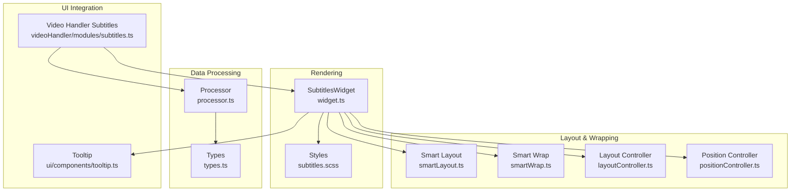
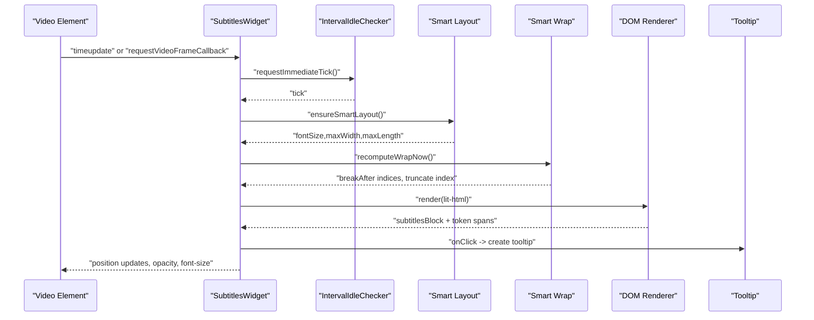
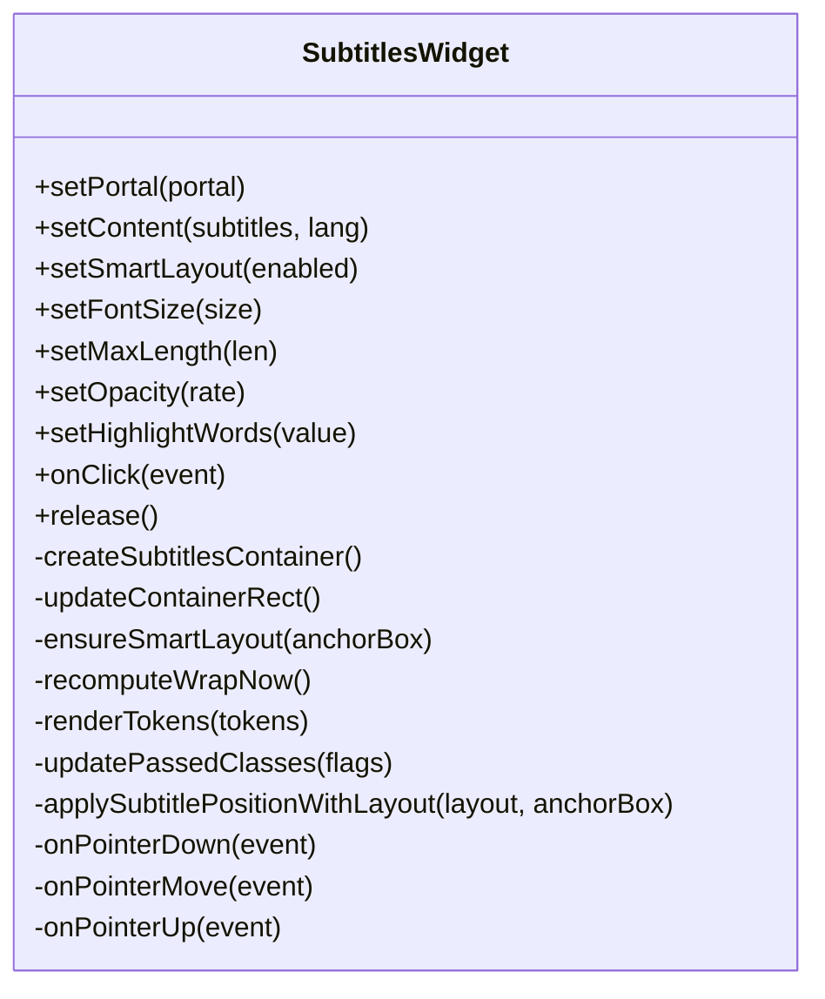
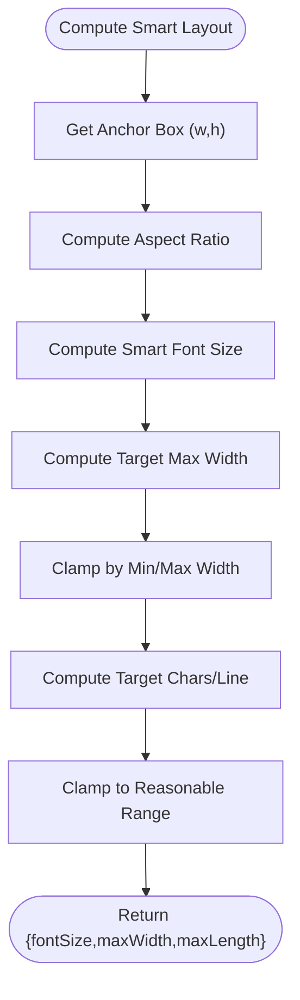
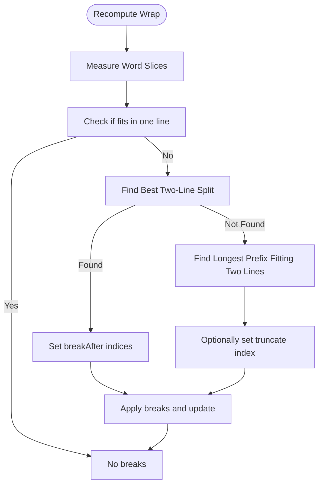
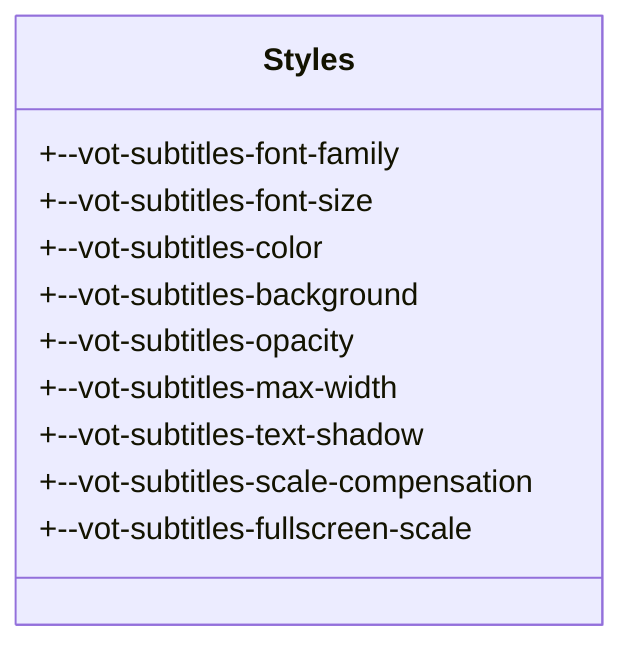
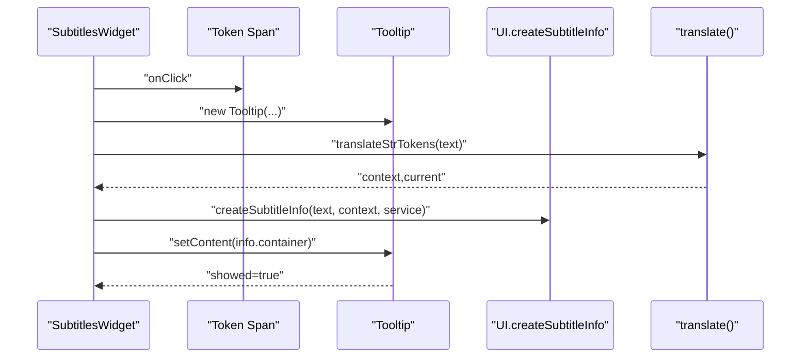
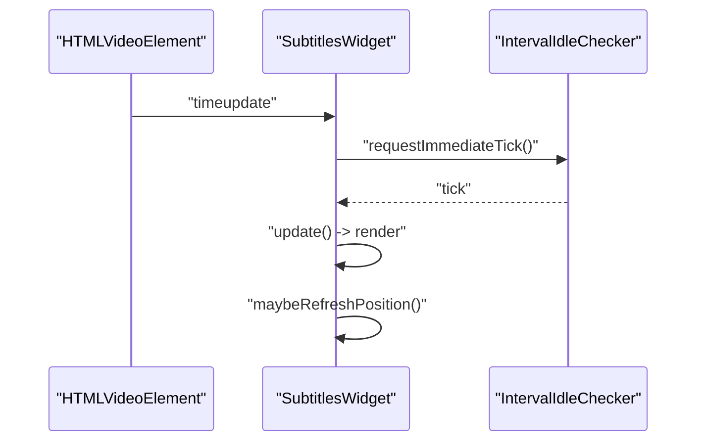
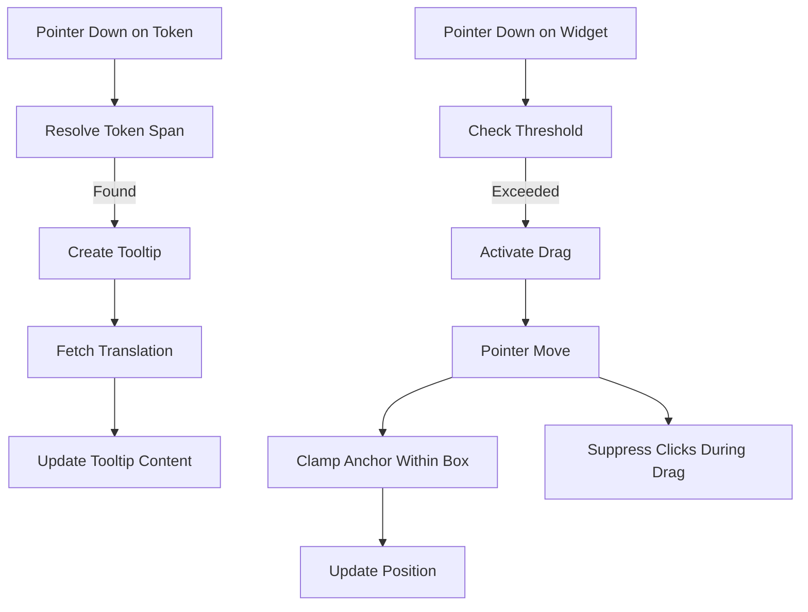
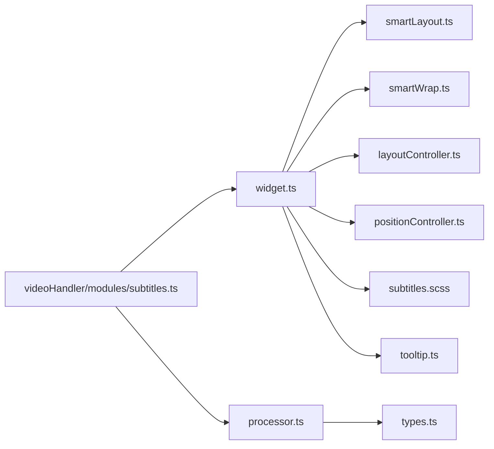

# Subtitle Widget

<cite>
**Referenced Files in This Document**
- [widget.ts](file://src/subtitles/widget.ts)
- [subtitles.scss](file://src/styles/subtitles.scss)
- [types.ts](file://src/subtitles/types.ts)
- [layoutController.ts](file://src/subtitles/layoutController.ts)
- [positionController.ts](file://src/subtitles/positionController.ts)
- [smartLayout.ts](file://src/subtitles/smartLayout.ts)
- [smartWrap.ts](file://src/subtitles/smartWrap.ts)
- [processor.ts](file://src/subtitles/processor.ts)
- [subtitles.ts](file://src/videoHandler/modules/subtitles.ts)
- [tooltip.ts](file://src/ui/components/tooltip.ts)
</cite>

## Table of Contents
1. [Introduction](#introduction)
2. [Project Structure](#project-structure)
3. [Core Components](#core-components)
4. [Architecture Overview](#architecture-overview)
5. [Detailed Component Analysis](#detailed-component-analysis)
6. [Dependency Analysis](#dependency-analysis)
7. [Performance Considerations](#performance-considerations)
8. [Troubleshooting Guide](#troubleshooting-guide)
9. [Conclusion](#conclusion)
10. [Appendices](#appendices)

## Introduction
This document describes the subtitle widget rendering system used in the video player. It covers DOM manipulation for creating and positioning subtitle elements, the styling system (fonts, sizes, colors, backgrounds), animation and transitions, event handling (clicks, drags, tooltips), integration with video timeline synchronization, real-time updates, responsive design, cross-browser compatibility, and performance optimization strategies.

## Project Structure
The subtitle system is composed of:
- A rendering widget that manages DOM creation, layout, and updates
- A smart layout engine that computes font size, max width, and line counts based on the video area
- A smart wrapping engine that segments tokens into lines and applies punctuation-aware breaks
- A processor that converts external subtitle formats into internal tokenized structures
- A styling layer with CSS custom properties for themeable appearance
- A tooltip component for interactive token-level translations
- A video handler module that integrates subtitles with the player UI

**Diagram sources**
- [widget.ts:110-180](file://src/subtitles/widget.ts#L110-L180)
- [subtitles.scss:1-215](file://src/styles/subtitles.scss#L1-215)
- [smartLayout.ts:105-137](file://src/subtitles/smartLayout.ts#L105-L137)
- [smartWrap.ts:631-656](file://src/subtitles/smartWrap.ts#L631-L656)
- [layoutController.ts:3-28](file://src/subtitles/layoutController.ts#L3-L28)
- [positionController.ts:27-57](file://src/subtitles/positionController.ts#L27-L57)
- [processor.ts:632-651](file://src/subtitles/processor.ts#L632-L651)
- [types.ts:7-24](file://src/subtitles/types.ts#L7-L24)
- [subtitles.ts:293-362](file://src/videoHandler/modules/subtitles.ts#L293-L362)
- [tooltip.ts:12-96](file://src/ui/components/tooltip.ts#L12-L96)

**Section sources**
- [widget.ts:110-180](file://src/subtitles/widget.ts#L110-L180)
- [subtitles.scss:1-215](file://src/styles/subtitles.scss#L1-215)
- [smartLayout.ts:105-137](file://src/subtitles/smartLayout.ts#L105-L137)
- [smartWrap.ts:631-656](file://src/subtitles/smartWrap.ts#L631-L656)
- [layoutController.ts:3-28](file://src/subtitles/layoutController.ts#L3-L28)
- [positionController.ts:27-57](file://src/subtitles/positionController.ts#L27-L57)
- [processor.ts:632-651](file://src/subtitles/processor.ts#L632-L651)
- [types.ts:7-24](file://src/subtitles/types.ts#L7-L24)
- [subtitles.ts:293-362](file://src/videoHandler/modules/subtitles.ts#L293-L362)
- [tooltip.ts:12-96](file://src/ui/components/tooltip.ts#L12-L96)

## Core Components
- SubtitlesWidget: central renderer that creates and updates the subtitle DOM, handles layout, wrapping, dragging, and tooltip interactions
- Smart layout: computes font size, max width, and line limits based on the anchor box (video area)
- Smart wrapping: builds word slices, measures widths, computes optimal line breaks, and truncates with ellipsis when needed
- Processor: fetches and normalizes subtitles, segments text into tokens with precise timings
- Styles: CSS custom properties and rules for typography, background, shadows, and responsive behavior
- Tooltip: reusable component for token-level translations with accessibility and transitions
- Video handler integration: selects tracks, loads subtitles, and wires them into the widget

**Section sources**
- [widget.ts:110-180](file://src/subtitles/widget.ts#L110-L180)
- [smartLayout.ts:105-137](file://src/subtitles/smartLayout.ts#L105-L137)
- [smartWrap.ts:631-656](file://src/subtitles/smartWrap.ts#L631-L656)
- [processor.ts:632-651](file://src/subtitles/processor.ts#L632-L651)
- [subtitles.scss:1-215](file://src/styles/subtitles.scss#L1-215)
- [tooltip.ts:12-96](file://src/ui/components/tooltip.ts#L12-L96)
- [subtitles.ts:293-362](file://src/videoHandler/modules/subtitles.ts#L293-L362)

## Architecture Overview
The widget orchestrates rendering and updates in response to video playback and layout changes. It uses a scheduler to batch updates, computes smart layout and wrapping, and renders tokens into a lit-html template. Styling is driven by CSS custom properties for themeability and responsiveness.

**Diagram sources**
- [widget.ts:423-463](file://src/subtitles/widget.ts#L423-L463)
- [widget.ts:1618-1632](file://src/subtitles/widget.ts#L1618-L1632)
- [widget.ts:1375-1436](file://src/subtitles/widget.ts#L1375-L1436)
- [widget.ts:1682-1691](file://src/subtitles/widget.ts#L1682-L1691)
- [smartLayout.ts:105-137](file://src/subtitles/smartLayout.ts#L105-L137)
- [smartWrap.ts:631-656](file://src/subtitles/smartWrap.ts#L631-L656)
- [tooltip.ts:161-163](file://src/ui/components/tooltip.ts#L161-L163)

## Detailed Component Analysis

### SubtitlesWidget: Rendering, Layout, and Interaction
Responsibilities:
- Creates and manages the subtitle container and block
- Computes anchor box from video bounds and container layout
- Applies smart layout (font size, max width, line count)
- Segments tokens into lines and wraps with punctuation-aware breaks
- Handles pointer drag to reposition the widget
- Renders tokens with lit-html and updates pass/fail classes for word highlighting
- Manages tooltip for token-level translations
- Integrates with video frame callbacks for smooth updates

Key behaviors:
- Container creation and pointer event binding
- Layout metrics computation and anchor box clamping
- Smart layout recomputation on interval
- Wrap recomputation when layout or font changes
- Render key memoization to avoid redundant DOM updates
- Drag gesture with threshold detection and suppression of clicks after drag
- Tooltip lifecycle and translation fetching

**Diagram sources**
- [widget.ts:110-180](file://src/subtitles/widget.ts#L110-L180)
- [widget.ts:343-361](file://src/subtitles/widget.ts#L343-L361)
- [widget.ts:500-510](file://src/subtitles/widget.ts#L500-L510)
- [widget.ts:296-335](file://src/subtitles/widget.ts#L296-L335)
- [widget.ts:1375-1436](file://src/subtitles/widget.ts#L1375-L1436)
- [widget.ts:1226-1307](file://src/subtitles/widget.ts#L1226-L1307)
- [widget.ts:1308-1322](file://src/subtitles/widget.ts#L1308-L1322)
- [widget.ts:718-793](file://src/subtitles/widget.ts#L718-L793)
- [widget.ts:616-717](file://src/subtitles/widget.ts#L616-L717)
- [widget.ts:1152-1211](file://src/subtitles/widget.ts#L1152-L1211)

**Section sources**
- [widget.ts:110-180](file://src/subtitles/widget.ts#L110-L180)
- [widget.ts:343-361](file://src/subtitles/widget.ts#L343-L361)
- [widget.ts:500-510](file://src/subtitles/widget.ts#L500-L510)
- [widget.ts:296-335](file://src/subtitles/widget.ts#L296-L335)
- [widget.ts:1375-1436](file://src/subtitles/widget.ts#L1375-L1436)
- [widget.ts:1226-1307](file://src/subtitles/widget.ts#L1226-L1307)
- [widget.ts:1308-1322](file://src/subtitles/widget.ts#L1308-L1322)
- [widget.ts:718-793](file://src/subtitles/widget.ts#L718-L793)
- [widget.ts:616-717](file://src/subtitles/widget.ts#L616-L717)
- [widget.ts:1152-1211](file://src/subtitles/widget.ts#L1152-L1211)

### Smart Layout Engine
Computes font size, max width, and line count based on the anchor box (video area) and aspect ratio. Uses conservative heuristics for character width and target characters-per-line, with bounds for minimum/maximum font size and width.

**Diagram sources**
- [smartLayout.ts:105-137](file://src/subtitles/smartLayout.ts#L105-L137)

**Section sources**
- [smartLayout.ts:105-137](file://src/subtitles/smartLayout.ts#L105-L137)

### Smart Wrapping Engine
Builds word slices from tokens, measures widths, and computes optimal line breaks. Supports:
- Balanced two-line splits
- Sentence boundary awareness
- Truncation with ellipsis when smart layout is enabled
- Prefix fitting for two-line layouts

**Diagram sources**
- [smartWrap.ts:631-656](file://src/subtitles/smartWrap.ts#L631-L656)
- [smartWrap.ts:380-436](file://src/subtitles/smartWrap.ts#L380-L436)
- [smartWrap.ts:298-338](file://src/subtitles/smartWrap.ts#L298-L338)

**Section sources**
- [smartWrap.ts:631-656](file://src/subtitles/smartWrap.ts#L631-L656)
- [smartWrap.ts:380-436](file://src/subtitles/smartWrap.ts#L380-L436)
- [smartWrap.ts:298-338](file://src/subtitles/smartWrap.ts#L298-L338)

### Styling System
The widget’s appearance is controlled via CSS custom properties and rules:
- Typography: font family, size, weight, line height, letter spacing
- Background: color and opacity via custom property
- Text shadow and anti-aliasing for readability
- Responsive sizing with viewport-relative fallbacks
- Safe area insets and bottom inset presets for mobile/fullscreen
- Hover and selection states for tokens
- Containment and isolation for stable layout and paint

**Diagram sources**
- [subtitles.scss:1-215](file://src/styles/subtitles.scss#L1-L215)

**Section sources**
- [subtitles.scss:1-215](file://src/styles/subtitles.scss#L1-L215)

### Tooltip Integration
On token click, the widget creates a tooltip anchored to the clicked token, fetches translations asynchronously, and updates the tooltip content. The tooltip component manages mounting, positioning, transitions, and accessibility attributes.

**Diagram sources**
- [widget.ts:1152-1211](file://src/subtitles/widget.ts#L1152-L1211)
- [tooltip.ts:161-163](file://src/ui/components/tooltip.ts#L161-L163)

**Section sources**
- [widget.ts:1152-1211](file://src/subtitles/widget.ts#L1152-L1211)
- [tooltip.ts:161-163](file://src/ui/components/tooltip.ts#L161-L163)

### Timeline Synchronization and Real-Time Updates
The widget listens to video playback events and uses requestVideoFrameCallback when available for smooth updates. It schedules updates at minimum intervals and batches layout changes via an idle checker.

**Diagram sources**
- [widget.ts:423-463](file://src/subtitles/widget.ts#L423-L463)
- [widget.ts:1579-1716](file://src/subtitles/widget.ts#L1579-L1716)

**Section sources**
- [widget.ts:423-463](file://src/subtitles/widget.ts#L423-L463)
- [widget.ts:1579-1716](file://src/subtitles/widget.ts#L1579-L1716)

### Event Handling: Clicks, Drags, and Accessibility
- Clicks: token click resolution, tooltip creation, translation fetching, and selection state
- Drags: pointer down/move/up with threshold detection, anchor clamping, and position updates
- Accessibility: tooltip aria-describedby linkage, keyboard focus/blur handling, and hover pointer events

**Diagram sources**
- [widget.ts:1098-1117](file://src/subtitles/widget.ts#L1098-L1117)
- [widget.ts:1152-1211](file://src/subtitles/widget.ts#L1152-L1211)
- [widget.ts:616-717](file://src/subtitles/widget.ts#L616-L717)
- [positionController.ts:27-57](file://src/subtitles/positionController.ts#L27-L57)

**Section sources**
- [widget.ts:1098-1117](file://src/subtitles/widget.ts#L1098-L1117)
- [widget.ts:1152-1211](file://src/subtitles/widget.ts#L1152-L1211)
- [widget.ts:616-717](file://src/subtitles/widget.ts#L616-L717)
- [positionController.ts:27-57](file://src/subtitles/positionController.ts#L27-L57)

## Dependency Analysis
The widget depends on:
- Layout and position utilities for anchor box and clamping
- Smart layout and wrapping for font sizing and line breaks
- Processor for normalized subtitle tokens
- Tooltip for interactive translations
- Video handler for track selection and loading

**Diagram sources**
- [widget.ts:110-180](file://src/subtitles/widget.ts#L110-L180)
- [smartLayout.ts:105-137](file://src/subtitles/smartLayout.ts#L105-L137)
- [smartWrap.ts:631-656](file://src/subtitles/smartWrap.ts#L631-L656)
- [layoutController.ts:3-28](file://src/subtitles/layoutController.ts#L3-L28)
- [positionController.ts:27-57](file://src/subtitles/positionController.ts#L27-L57)
- [processor.ts:632-651](file://src/subtitles/processor.ts#L632-L651)
- [types.ts:7-24](file://src/subtitles/types.ts#L7-L24)
- [subtitles.ts:293-362](file://src/videoHandler/modules/subtitles.ts#L293-L362)
- [tooltip.ts:12-96](file://src/ui/components/tooltip.ts#L12-L96)

**Section sources**
- [widget.ts:110-180](file://src/subtitles/widget.ts#L110-L180)
- [smartLayout.ts:105-137](file://src/subtitles/smartLayout.ts#L105-L137)
- [smartWrap.ts:631-656](file://src/subtitles/smartWrap.ts#L631-L656)
- [layoutController.ts:3-28](file://src/subtitles/layoutController.ts#L3-L28)
- [positionController.ts:27-57](file://src/subtitles/positionController.ts#L27-L57)
- [processor.ts:632-651](file://src/subtitles/processor.ts#L632-L651)
- [types.ts:7-24](file://src/subtitles/types.ts#L7-L24)
- [subtitles.ts:293-362](file://src/videoHandler/modules/subtitles.ts#L293-L362)
- [tooltip.ts:12-96](file://src/ui/components/tooltip.ts#L12-L96)

## Performance Considerations
- Minimizing DOM updates: render key memoization prevents unnecessary re-renders
- Batched updates: idle checker consolidates layout, wrap, and position updates
- Efficient wrapping: word slice measurement and prefix sums for fast width queries
- Smart layout throttling: periodic recomputation avoids constant recalculations
- Frame callback usage: requestVideoFrameCallback reduces jank during playback
- CSS containment: isolation and contain layout/paint improve stability
- Canvas-based measurement: off-DOM text measurement for accurate widths
- Drag suppression: prevents click events after drag gestures

[No sources needed since this section provides general guidance]

## Troubleshooting Guide
Common issues and remedies:
- Subtitles not appearing
  - Verify video element and container are present and sized
  - Ensure setContent is called with valid ProcessedSubtitles
  - Check that smart layout is enabled or manual font size is set
- Incorrect positioning
  - Confirm anchor box calculation and bottom inset presets
  - Ensure container has relative positioning if needed
  - Validate visual viewport events and resize observers
- Tooltip not showing
  - Check tooltip creation and content setting
  - Verify translation service availability and request IDs
  - Ensure target element is a token span with dataset attribute
- Drag not working
  - Confirm pointer capture and document listeners are attached
  - Check drag threshold and movement suppression logic
- Performance problems
  - Reduce highlight words if enabled
  - Disable smart layout temporarily to compare
  - Ensure requestVideoFrameCallback is available for smoother updates

**Section sources**
- [widget.ts:1437-1464](file://src/subtitles/widget.ts#L1437-L1464)
- [widget.ts:718-793](file://src/subtitles/widget.ts#L718-L793)
- [widget.ts:1152-1211](file://src/subtitles/widget.ts#L1152-L1211)
- [widget.ts:616-717](file://src/subtitles/widget.ts#L616-L717)

## Conclusion
The subtitle widget provides a robust, responsive, and performant rendering system for video subtitles. It combines smart layout and wrapping with efficient DOM updates, accessibility-friendly tooltips, and seamless integration with video playback. The modular design allows easy customization of fonts, colors, and behavior while maintaining smooth performance during playback.

[No sources needed since this section summarizes without analyzing specific files]

## Appendices

### Custom Styling Options
- Font family: adjust via CSS custom property for subtitles
- Font size: controlled by smart layout or manual override
- Color and background: customize via CSS variables for text and background
- Opacity: adjustable via opacity setter
- Text shadow: configurable via CSS custom property
- Responsive sizing: viewport-relative fallbacks and fullscreen scaling

**Section sources**
- [subtitles.scss:1-215](file://src/styles/subtitles.scss#L1-L215)
- [widget.ts:1522-1534](file://src/subtitles/widget.ts#L1522-L1534)
- [widget.ts:1495-1521](file://src/subtitles/widget.ts#L1495-L1521)

### Responsive Design and Cross-Browser Compatibility
- Mobile viewport detection and safe area handling
- Fullscreen and theater mode adaptations
- CSS containment and isolation for stable layout
- Canvas-based text measurement for consistent widths
- Pointer event handling for mouse/touch parity
- Accessible ARIA attributes for tooltips

**Section sources**
- [widget.ts:539-543](file://src/subtitles/widget.ts#L539-L543)
- [widget.ts:594-615](file://src/subtitles/widget.ts#L594-L615)
- [subtitles.scss:193-197](file://src/styles/subtitles.scss#L193-L197)
- [subtitles.scss:199-209](file://src/styles/subtitles.scss#L199-L209)
- [tooltip.ts:538-557](file://src/ui/components/tooltip.ts#L538-L557)