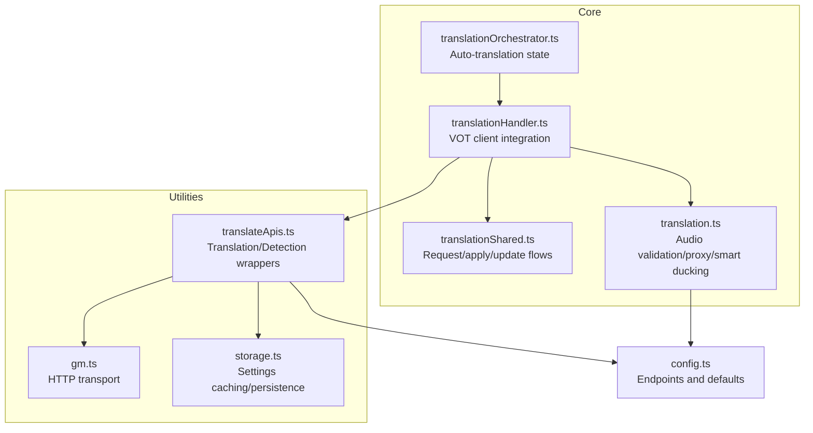
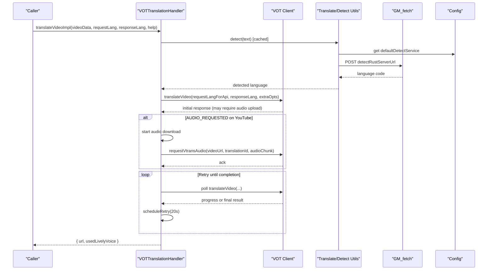
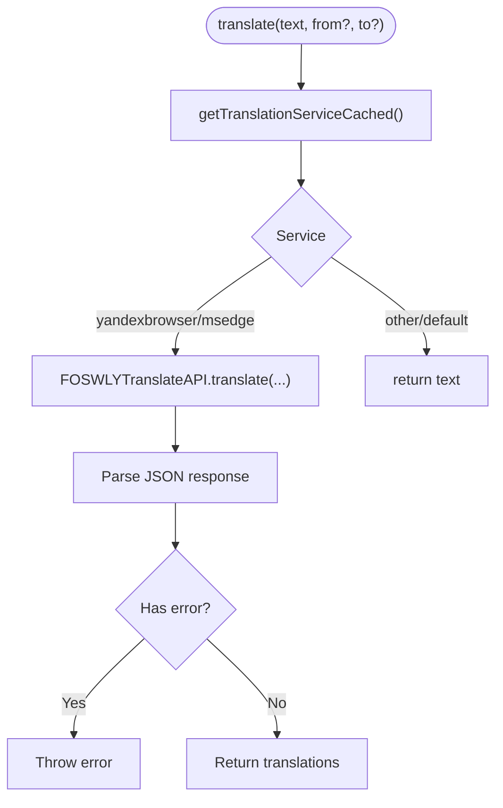
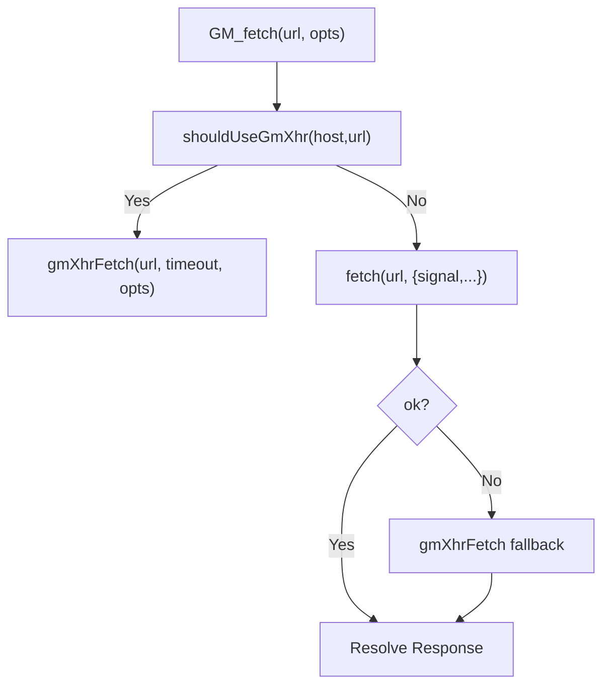
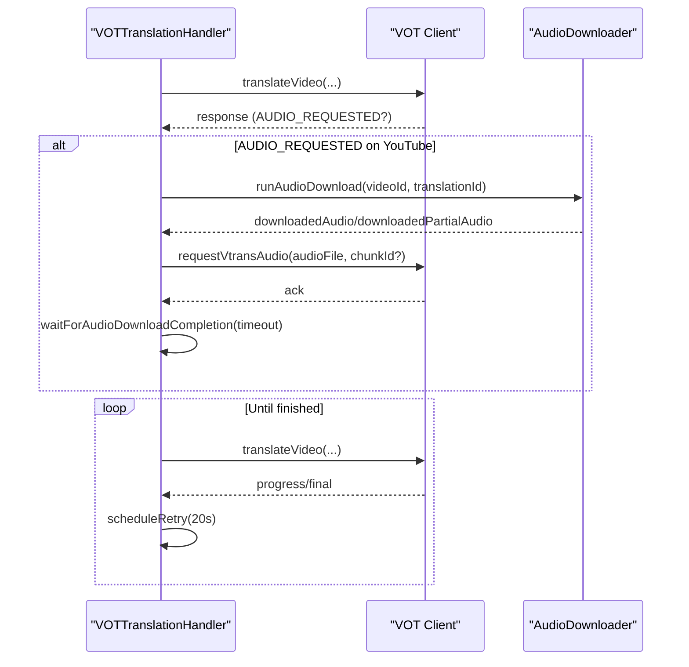
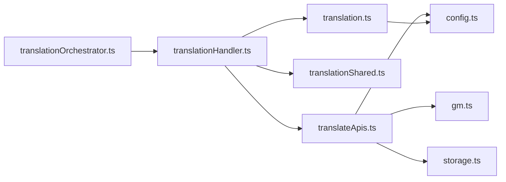

# Translation APIs

<cite>
**Referenced Files in This Document**
- [translateApis.ts](file://src/utils/translateApis.ts)
- [translateApis.ts](file://src/types/translateApis.ts)
- [config.ts](file://src/config/config.ts)
- [storage.ts](file://src/utils/storage.ts)
- [gm.ts](file://src/utils/gm.ts)
- [translationHandler.ts](file://src/core/translationHandler.ts)
- [translationOrchestrator.ts](file://src/core/translationOrchestrator.ts)
- [translation.ts](file://src/videoHandler/modules/translation.ts)
- [translationShared.ts](file://src/videoHandler/modules/translationShared.ts)
</cite>

## Table of Contents
1. [Introduction](#introduction)
2. [Project Structure](#project-structure)
3. [Core Components](#core-components)
4. [Architecture Overview](#architecture-overview)
5. [Detailed Component Analysis](#detailed-component-analysis)
6. [Dependency Analysis](#dependency-analysis)
7. [Performance Considerations](#performance-considerations)
8. [Troubleshooting Guide](#troubleshooting-guide)
9. [Conclusion](#conclusion)
10. [Appendices](#appendices)

## Introduction
This document describes the translation service interfaces and utilities used by the application. It covers:
- Translation and detection API types and configuration
- Request/response schemas and parameter validation rules
- VOT client integration patterns and authentication mechanisms
- Translation help API integration and language selection logic
- Utility functions for API interactions, error handling, and retry strategies
- Practical examples of API calls and response handling
- Relationship between translation services, API versioning, and backward compatibility
- Configuration options and customization points

## Project Structure
The translation subsystem spans several modules:
- Utilities for translation and detection
- Configuration constants for endpoints and defaults
- Storage utilities for settings caching and persistence
- HTTP transport abstraction for cross-origin and CORS-safe requests
- Core orchestration for VOT client requests and retries
- Video handler modules for applying translations and managing audio

**Diagram sources**
- [translateApis.ts:1-207](file://src/utils/translateApis.ts#L1-L207)
- [config.ts:1-63](file://src/config/config.ts#L1-L63)
- [storage.ts:1-380](file://src/utils/storage.ts#L1-L380)
- [gm.ts:1-248](file://src/utils/gm.ts#L1-L248)
- [translationHandler.ts:1-564](file://src/core/translationHandler.ts#L1-L564)
- [translationOrchestrator.ts:1-85](file://src/core/translationOrchestrator.ts#L1-L85)
- [translationShared.ts:1-193](file://src/videoHandler/modules/translationShared.ts#L1-L193)
- [translation.ts:1-1181](file://src/videoHandler/modules/translation.ts#L1-L1181)

**Section sources**
- [translateApis.ts:1-207](file://src/utils/translateApis.ts#L1-L207)
- [config.ts:1-63](file://src/config/config.ts#L1-L63)
- [storage.ts:1-380](file://src/utils/storage.ts#L1-L380)
- [gm.ts:1-248](file://src/utils/gm.ts#L1-L248)
- [translationHandler.ts:1-564](file://src/core/translationHandler.ts#L1-L564)
- [translationOrchestrator.ts:1-85](file://src/core/translationOrchestrator.ts#L1-L85)
- [translationShared.ts:1-193](file://src/videoHandler/modules/translationShared.ts#L1-L193)
- [translation.ts:1-1181](file://src/videoHandler/modules/translation.ts#L1-L1181)

## Core Components
- Translation and detection wrappers:
  - Provides a unified interface to choose among supported translation and detection services.
  - Implements caching for service selection to reduce storage reads.
  - Supports FOSWLY-backed translation/detection and a Rust-based language detector.
- HTTP transport:
  - GM_fetch routes requests via GM_xmlhttpRequest when needed to bypass CORS restrictions.
  - Applies timeouts and integrates with AbortSignals.
- Configuration:
  - Centralizes endpoint URLs, default services, and compatibility metadata.
- Storage:
  - VOTStorage abstracts GM/LocalStorage access and provides conversion for backward compatibility.
- VOT client integration:
  - Orchestrates translation requests, handles retries, manages audio downloads, and maps server errors to localized UI messages.
- Translation orchestration:
  - Manages auto-translation state transitions and deferral on mobile YouTube when muted.

**Section sources**
- [translateApis.ts:1-207](file://src/utils/translateApis.ts#L1-L207)
- [gm.ts:1-248](file://src/utils/gm.ts#L1-L248)
- [config.ts:1-63](file://src/config/config.ts#L1-L63)
- [storage.ts:1-380](file://src/utils/storage.ts#L1-L380)
- [translationHandler.ts:1-564](file://src/core/translationHandler.ts#L1-L564)
- [translationOrchestrator.ts:1-85](file://src/core/translationOrchestrator.ts#L1-L85)

## Architecture Overview
The translation pipeline integrates user settings, HTTP transport, and the VOT client to produce translated audio streams.

**Diagram sources**
- [translationHandler.ts:311-495](file://src/core/translationHandler.ts#L311-L495)
- [translateApis.ts:186-197](file://src/utils/translateApis.ts#L186-L197)
- [config.ts:24-25](file://src/config/config.ts#L24-L25)
- [gm.ts:211-247](file://src/utils/gm.ts#L211-L247)

## Detailed Component Analysis

### Translation and Detection Utilities
- Supported services:
  - Translation services: yandexbrowser, msedge (via FOSWLY)
  - Detection services: yandexbrowser, msedge, rust-server
- Caching:
  - In-memory cache with TTL for translation and detection service preferences to minimize storage reads.
- FOSWLY Translate API:
  - GET/POST endpoints for translation and detection.
  - Request bodies include text, target language, and service selector.
  - Error responses are normalized and surfaced as JavaScript errors.
- Rust-based language detection:
  - POST endpoint returns a plain text language code.

**Diagram sources**
- [translateApis.ts:167-184](file://src/utils/translateApis.ts#L167-L184)
- [translateApis.ts:66-144](file://src/utils/translateApis.ts#L66-L144)

**Section sources**
- [translateApis.ts:1-207](file://src/utils/translateApis.ts#L1-L207)
- [translateApis.ts:1-5](file://src/types/translateApis.ts#L1-L5)

### HTTP Transport (GM_fetch)
- Host-aware routing:
  - Uses GM_xmlhttpRequest for specific hosts to avoid CORS failures.
  - Falls back to native fetch and retries via GM_xmlhttpRequest on failure.
- Timeout and cancellation:
  - Integrates with AbortSignals and supports a configurable timeout.
- Headers and compatibility:
  - Normalizes headers and parses response headers from GM_xmlhttpRequest.

**Diagram sources**
- [gm.ts:58-81](file://src/utils/gm.ts#L58-L81)
- [gm.ts:211-247](file://src/utils/gm.ts#L211-L247)

**Section sources**
- [gm.ts:1-248](file://src/utils/gm.ts#L1-L248)

### Configuration Options
- Endpoints:
  - FOSWLY translate backend URL
  - Rust-based language detection URL
  - VOT backend URL and proxy worker host
- Defaults:
  - Default translation service
  - Default detection service
- Compatibility:
  - Actual compatibility version for storage migrations

**Section sources**
- [config.ts:1-63](file://src/config/config.ts#L1-L63)

### Storage and Settings Caching
- VOTStorage:
  - Abstracts GM_getValue/GM_setValue vs localStorage depending on environment.
  - Provides batched reads/writes and compatibility conversions.
- Settings cache:
  - In-memory cache for translation/detection service preferences with TTL.

**Section sources**
- [storage.ts:1-380](file://src/utils/storage.ts#L1-L380)
- [translateApis.ts:12-53](file://src/utils/translateApis.ts#L12-L53)

### VOT Client Integration and Retry Strategy
- Error mapping:
  - Maps known VOT client error shapes to localized UI errors.
- Retry scheduling:
  - Schedules retries with a fixed interval and respects AbortSignals.
- Lively voice fallback:
  - If the server reports “Lively voices” unavailable, retries without lively voice for the current session.
- Audio upload flow:
  - On YouTube, uploads full or partial audio chunks and waits for completion or a timeout.
- Localization and notifications:
  - Updates UI with ETA or localized messages and conditionally notifies desktop failures.

**Diagram sources**
- [translationHandler.ts:311-495](file://src/core/translationHandler.ts#L311-L495)
- [translationHandler.ts:126-234](file://src/core/translationHandler.ts#L126-L234)

**Section sources**
- [translationHandler.ts:1-564](file://src/core/translationHandler.ts#L1-L564)

### Translation Orchestration
- State machine:
  - Tracks idle, pending (auto), deferred (muted), and error states.
- Auto-translation eligibility:
  - Requires first play, auto-translate enabled, and a valid video ID.
- Deferred execution:
  - On mobile YouTube, defers until the user unmutes and resumes auto-translation.

**Section sources**
- [translationOrchestrator.ts:1-85](file://src/core/translationOrchestrator.ts#L1-L85)

### Applying Translation and Audio Management
- Audio validation:
  - Probes primary and direct URLs with HEAD or range requests to ensure validity.
- Proxy handling:
  - Proxies Yandex audio URLs via configured proxy worker host when enabled.
- Smart ducking:
  - Dynamically adjusts video volume based on translated audio RMS and runtime state.
- Refresh scheduling:
  - Schedules periodic refresh of translation audio based on TTL.

**Section sources**
- [translation.ts:573-651](file://src/videoHandler/modules/translation.ts#L573-L651)
- [translation.ts:759-772](file://src/videoHandler/modules/translation.ts#L759-L772)
- [translation.ts:400-565](file://src/videoHandler/modules/translation.ts#L400-L565)
- [translation.ts:653-665](file://src/videoHandler/modules/translation.ts#L653-L665)

### Translation Help and Request Language Selection
- Translation help normalization:
  - Ensures null or structured help data is normalized for downstream use.
- Request language selection:
  - Computes the effective request language for the API based on site-specific logic and user preferences.
- Shared request/apply/update flow:
  - Encapsulates the end-to-end process of requesting translation, applying the audio, and scheduling refresh.

**Section sources**
- [translationShared.ts:27-31](file://src/videoHandler/modules/translationShared.ts#L27-L31)
- [translationShared.ts:104-146](file://src/videoHandler/modules/translationShared.ts#L104-L146)
- [translation.ts:667-716](file://src/videoHandler/modules/translation.ts#L667-L716)

## Dependency Analysis

**Diagram sources**
- [translateApis.ts:1-207](file://src/utils/translateApis.ts#L1-L207)
- [config.ts:1-63](file://src/config/config.ts#L1-L63)
- [storage.ts:1-380](file://src/utils/storage.ts#L1-L380)
- [gm.ts:1-248](file://src/utils/gm.ts#L1-L248)
- [translationHandler.ts:1-564](file://src/core/translationHandler.ts#L1-L564)
- [translationShared.ts:1-193](file://src/videoHandler/modules/translationShared.ts#L1-L193)
- [translation.ts:1-1181](file://src/videoHandler/modules/translation.ts#L1-L1181)
- [translationOrchestrator.ts:1-85](file://src/core/translationOrchestrator.ts#L1-L85)

**Section sources**
- [translateApis.ts:1-207](file://src/utils/translateApis.ts#L1-L207)
- [translationHandler.ts:1-564](file://src/core/translationHandler.ts#L1-L564)
- [translationShared.ts:1-193](file://src/videoHandler/modules/translationShared.ts#L1-L193)
- [translation.ts:1-1181](file://src/videoHandler/modules/translation.ts#L1-L1181)
- [translationOrchestrator.ts:1-85](file://src/core/translationOrchestrator.ts#L1-L85)

## Performance Considerations
- Caching:
  - Settings cache reduces frequent storage reads during retries and error flows.
- Transport efficiency:
  - GM_fetch avoids redundant native fetch attempts and falls back quickly to GM_xmlhttpRequest when needed.
- Retry intervals:
  - Fixed 20-second polling reduces load while keeping responsiveness.
- Audio probing:
  - Limited attempts and short timeouts prevent long stalls on invalid URLs.

[No sources needed since this section provides general guidance]

## Troubleshooting Guide
- Translation errors:
  - Known VOT client error messages are mapped to localized UI errors for better user feedback.
- Aborted operations:
  - Properly handles AbortSignals and converts them to abort errors.
- Audio download failures:
  - On YouTube, falls back to a fail-audio endpoint when appropriate and minimizes repeated fallback requests.
- Notification of failures:
  - Conditionally notifies desktop alerts when translation errors are enabled and asynchronous waits occurred.

**Section sources**
- [translationHandler.ts:61-98](file://src/core/translationHandler.ts#L61-L98)
- [translationHandler.ts:196-234](file://src/core/translationHandler.ts#L196-L234)
- [translationShared.ts:171-192](file://src/videoHandler/modules/translationShared.ts#L171-L192)

## Conclusion
The translation subsystem combines configurable service selection, robust HTTP transport, and a resilient VOT client integration. It supports multiple translation and detection backends, applies intelligent retry and fallback strategies, and integrates with audio validation and smart ducking. Configuration and storage abstractions ensure backward compatibility and efficient settings management.

[No sources needed since this section summarizes without analyzing specific files]

## Appendices

### API Types and Schemas
- Translation service type:
  - Enumerated union of supported translation services.
- Detection service type:
  - Enumerated union of supported detection services.

**Section sources**
- [translateApis.ts:1-5](file://src/types/translateApis.ts#L1-L5)

### Authentication Mechanisms
- Token storage:
  - Account tokens and expiration are stored via VOTStorage.
- Profile updates:
  - Username and avatar ID can be updated post-authentication.

**Section sources**
- [storage.ts:139-190](file://src/utils/storage.ts#L139-L190)

### Backward Compatibility and Versioning
- Compatibility version:
  - Actual compatibility version is tracked to migrate legacy settings.
- Migration rules:
  - Converts numeric, boolean, array, and string values according to predefined rules.

**Section sources**
- [config.ts:62-62](file://src/config/config.ts#L62-L62)
- [storage.ts:24-48](file://src/utils/storage.ts#L24-L48)
- [storage.ts:139-190](file://src/utils/storage.ts#L139-L190)

### Practical Examples and Workflows
- Detect language:
  - Choose detection service from cache, call Rust endpoint, and return language code.
- Translate text:
  - Select translation service, prepare language pair, and call FOSWLY endpoint for single or multiple texts.
- Translate video:
  - Compute request language, request translation, handle audio upload on YouTube, and poll until completion with retries.

**Section sources**
- [translateApis.ts:186-197](file://src/utils/translateApis.ts#L186-L197)
- [translateApis.ts:167-184](file://src/utils/translateApis.ts#L167-L184)
- [translationHandler.ts:311-495](file://src/core/translationHandler.ts#L311-L495)