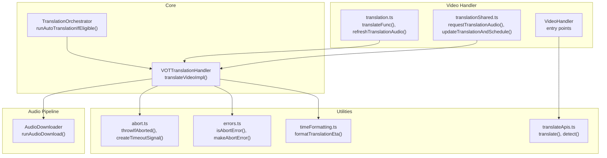
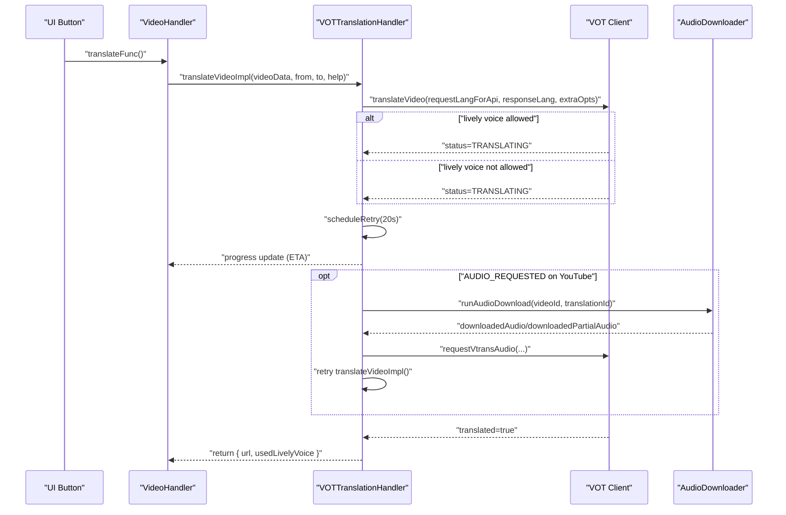
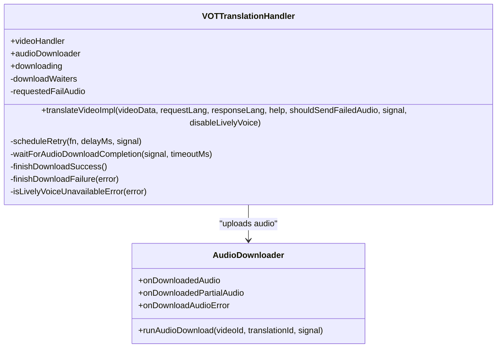
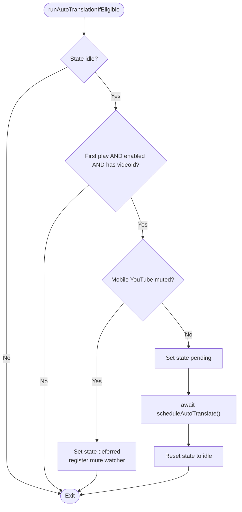
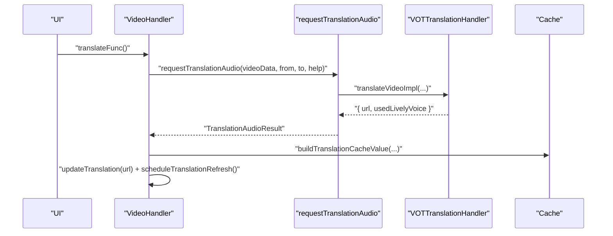
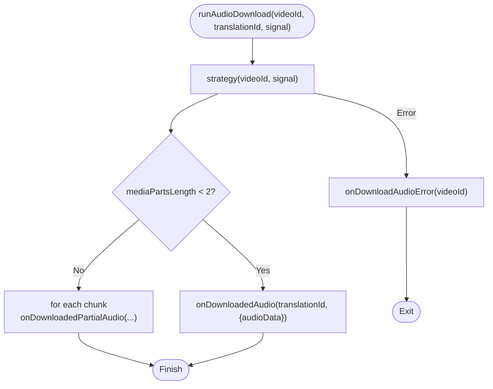
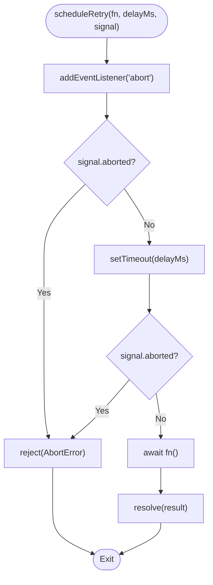
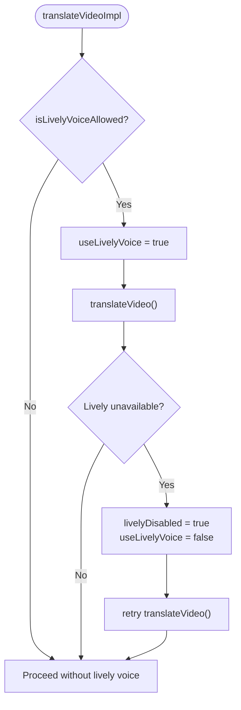
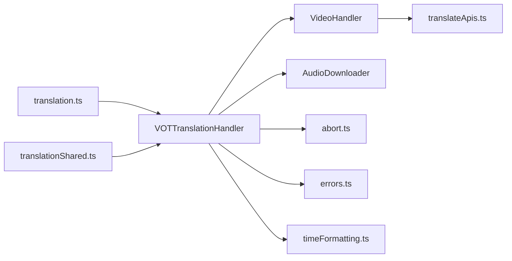

# Translation Engine

<cite>
**Referenced Files in This Document**
- [translationHandler.ts](file://src/core/translationHandler.ts)
- [translationOrchestrator.ts](file://src/core/translationOrchestrator.ts)
- [translation.ts](file://src/videoHandler/modules/translation.ts)
- [translationShared.ts](file://src/videoHandler/modules/translationShared.ts)
- [index.ts](file://src/index.ts)
- [abort.ts](file://src/utils/abort.ts)
- [errors.ts](file://src/utils/errors.ts)
- [timeFormatting.ts](file://src/utils/timeFormatting.ts)
- [audioDownloader/index.ts](file://src/audioDownloader/index.ts)
- [translateApis.ts](file://src/utils/translateApis.ts)
</cite>

## Table of Contents
1. [Introduction](#introduction)
2. [Project Structure](#project-structure)
3. [Core Components](#core-components)
4. [Architecture Overview](#architecture-overview)
5. [Detailed Component Analysis](#detailed-component-analysis)
6. [Dependency Analysis](#dependency-analysis)
7. [Performance Considerations](#performance-considerations)
8. [Troubleshooting Guide](#troubleshooting-guide)
9. [Conclusion](#conclusion)
10. [Appendices](#appendices)

## Introduction
This document describes the translation engine subsystem responsible for orchestrating video translation requests, managing retries and cancellations, integrating with external translation APIs, and handling lively voice features with automatic fallback. It explains the end-to-end workflow from video input to translated audio output, including request language selection, response language mapping, translation help integration, ETA reporting, and robust error handling.

## Project Structure
The translation engine spans several modules:
- Core orchestration and request handling
- Video handler and UI integration
- Audio download pipeline for asynchronous translation
- Utilities for cancellation, error normalization, and ETA formatting
- Optional translation help and external translation services

**Diagram sources**
- [translationHandler.ts:311-495](file://src/core/translationHandler.ts#L311-L495)
- [translationOrchestrator.ts:42-83](file://src/core/translationOrchestrator.ts#L42-L83)
- [translation.ts:975-1017](file://src/videoHandler/modules/translation.ts#L975-L1017)
- [translationShared.ts:33-61](file://src/videoHandler/modules/translationShared.ts#L33-L61)
- [index.ts:290-319](file://src/index.ts#L290-L319)
- [abort.ts:12-31](file://src/utils/abort.ts#L12-L31)
- [errors.ts:84-109](file://src/utils/errors.ts#L84-L109)
- [timeFormatting.ts:12-50](file://src/utils/timeFormatting.ts#L12-L50)
- [audioDownloader/index.ts:103-125](file://src/audioDownloader/index.ts#L103-L125)
- [translateApis.ts:167-197](file://src/utils/translateApis.ts#L167-L197)

**Section sources**
- [translationHandler.ts:105-124](file://src/core/translationHandler.ts#L105-L124)
- [translationOrchestrator.ts:21-83](file://src/core/translationOrchestrator.ts#L21-L83)
- [translation.ts:975-1017](file://src/videoHandler/modules/translation.ts#L975-L1017)
- [translationShared.ts:33-61](file://src/videoHandler/modules/translationShared.ts#L33-L61)
- [index.ts:290-319](file://src/index.ts#L290-L319)
- [audioDownloader/index.ts:87-125](file://src/audioDownloader/index.ts#L87-L125)
- [abort.ts:12-31](file://src/utils/abort.ts#L12-L31)
- [errors.ts:84-109](file://src/utils/errors.ts#L84-L109)
- [timeFormatting.ts:12-50](file://src/utils/timeFormatting.ts#L12-L50)
- [translateApis.ts:167-197](file://src/utils/translateApis.ts#L167-L197)

## Core Components
- VOTTranslationHandler: Implements the primary translation workflow, including request language mapping, lively voice feature gating, retry with exponential backoff, cancellation handling, audio upload pipeline, and error normalization.
- TranslationOrchestrator: Manages auto-translation eligibility and deferral (e.g., on mobile YouTube when muted).
- VideoHandler and translation modules: Provide UI hooks, caching, translation help normalization, and translation refresh logic.
- AudioDownloader: Streams audio chunks to the translation backend and emits completion events.
- Utilities: Abort handling, error normalization, ETA formatting, and optional translation/detection services.

**Section sources**
- [translationHandler.ts:105-124](file://src/core/translationHandler.ts#L105-L124)
- [translationOrchestrator.ts:21-83](file://src/core/translationOrchestrator.ts#L21-L83)
- [translation.ts:975-1017](file://src/videoHandler/modules/translation.ts#L975-L1017)
- [translationShared.ts:33-61](file://src/videoHandler/modules/translationShared.ts#L33-L61)
- [audioDownloader/index.ts:87-125](file://src/audioDownloader/index.ts#L87-L125)

## Architecture Overview
The translation engine integrates with the VOT client to request translations, optionally uploads audio for asynchronous processing, and monitors progress with periodic retries. It supports lively voice only for allowed language pairs and falls back automatically when unavailable. The system reports ETA and handles cancellations gracefully.

**Diagram sources**
- [translationHandler.ts:311-495](file://src/core/translationHandler.ts#L311-L495)
- [translation.ts:975-1017](file://src/videoHandler/modules/translation.ts#L975-L1017)
- [audioDownloader/index.ts:103-125](file://src/audioDownloader/index.ts#L103-L125)

## Detailed Component Analysis

### VOTTranslationHandler
Responsibilities:
- Request language selection and mapping for API calls
- Lively voice feature gating and automatic fallback
- Retry loop with exponential backoff and cancellation
- Audio upload pipeline for asynchronous translation
- Error normalization and user-visible messaging
- Progress reporting and ETA formatting

Key behaviors:
- Language mapping: Forces English for API requests when lively voice is enabled and response language is Russian.
- Lively voice availability: Detects server-side unavailability and retries once without lively voice.
- Retry scheduling: Uses a fixed 20-second interval with AbortSignal support.
- Audio pipeline: Uploads full or partial audio chunks and waits with a bounded timeout.
- Error mapping: Converts VOT client errors to localized UI errors when appropriate.

**Diagram sources**
- [translationHandler.ts:105-124](file://src/core/translationHandler.ts#L105-L124)
- [translationHandler.ts:311-495](file://src/core/translationHandler.ts#L311-L495)
- [audioDownloader/index.ts:87-125](file://src/audioDownloader/index.ts#L87-L125)

**Section sources**
- [translationHandler.ts:311-495](file://src/core/translationHandler.ts#L311-L495)
- [translationHandler.ts:256-309](file://src/core/translationHandler.ts#L256-L309)
- [translationHandler.ts:497-542](file://src/core/translationHandler.ts#L497-L542)

### TranslationOrchestrator
Responsibilities:
- Determine eligibility for auto-translation (first play, enabled, has video ID)
- Defer auto-translation on mobile YouTube when muted
- Trigger scheduled auto-translation and handle errors

**Diagram sources**
- [translationOrchestrator.ts:42-83](file://src/core/translationOrchestrator.ts#L42-L83)

**Section sources**
- [translationOrchestrator.ts:21-83](file://src/core/translationOrchestrator.ts#L21-L83)

### VideoHandler and Translation Modules
Responsibilities:
- Entry points for translation and refresh
- Normalization of translation help
- Caching and applying translation results
- Updating UI and scheduling refreshes

**Diagram sources**
- [translation.ts:975-1017](file://src/videoHandler/modules/translation.ts#L975-L1017)
- [translationShared.ts:33-61](file://src/videoHandler/modules/translationShared.ts#L33-L61)
- [translationShared.ts:80-102](file://src/videoHandler/modules/translationShared.ts#L80-L102)
- [translationShared.ts:148-169](file://src/videoHandler/modules/translationShared.ts#L148-L169)

**Section sources**
- [translation.ts:975-1017](file://src/videoHandler/modules/translation.ts#L975-L1017)
- [translationShared.ts:33-61](file://src/videoHandler/modules/translationShared.ts#L33-L61)
- [translationShared.ts:80-102](file://src/videoHandler/modules/translationShared.ts#L80-L102)
- [translationShared.ts:148-169](file://src/videoHandler/modules/translationShared.ts#L148-L169)

### Audio Download Pipeline
Responsibilities:
- Select and execute audio download strategy
- Emit full or partial audio chunks
- Dispatch completion or error events

**Diagram sources**
- [audioDownloader/index.ts:103-125](file://src/audioDownloader/index.ts#L103-L125)
- [audioDownloader/index.ts:28-85](file://src/audioDownloader/index.ts#L28-L85)

**Section sources**
- [audioDownloader/index.ts:87-125](file://src/audioDownloader/index.ts#L87-L125)
- [audioDownloader/index.ts:28-85](file://src/audioDownloader/index.ts#L28-L85)

### Retry Mechanism and Cancellation
- Fixed 20-second retry interval using a timeout scheduler with AbortSignal support.
- Race-safe abort handling ensures immediate rejection upon abort.
- Audio download completion waits with a bounded timeout to prevent indefinite blocking.

**Diagram sources**
- [translationHandler.ts:261-309](file://src/core/translationHandler.ts#L261-L309)
- [abort.ts:12-31](file://src/utils/abort.ts#L12-L31)

**Section sources**
- [translationHandler.ts:261-309](file://src/core/translationHandler.ts#L261-L309)
- [translationHandler.ts:497-542](file://src/core/translationHandler.ts#L497-L542)
- [abort.ts:12-31](file://src/utils/abort.ts#L12-L31)

### Lively Voice Feature and Fallback
- Allowed only for English-to-Russian with valid authentication.
- Automatically detects server-side unavailability and retries once without lively voice.
- Persists the decision to avoid re-attempting lively voice for subsequent retries.

**Diagram sources**
- [translationHandler.ts:338-388](file://src/core/translationHandler.ts#L338-L388)
- [index.ts:882-902](file://src/index.ts#L882-L902)

**Section sources**
- [translationHandler.ts:338-388](file://src/core/translationHandler.ts#L338-L388)
- [index.ts:866-902](file://src/index.ts#L866-L902)

### Translation Help Integration
- Translation help is normalized to null if undefined.
- Cache key includes a stable hash of translation help to ensure distinct cache entries per help configuration.

**Section sources**
- [translationShared.ts:27-31](file://src/videoHandler/modules/translationShared.ts#L27-L31)
- [index.ts:298-318](file://src/index.ts#L298-L318)

### ETA Calculation and Progress Reporting
- ETA is formatted using localized phrases based on remaining seconds.
- During long-running translations, the handler updates the UI with ETA or generic messages.

**Section sources**
- [translationHandler.ts:402-413](file://src/core/translationHandler.ts#L402-L413)
- [timeFormatting.ts:12-50](file://src/utils/timeFormatting.ts#L12-L50)

### External Translation API Integration
- Optional translation and detection services are provided via a wrapper around FOSWLY and a Rust-based detector.
- Services are selected from persisted settings with short-lived caching.

**Section sources**
- [translateApis.ts:167-197](file://src/utils/translateApis.ts#L167-L197)
- [translateApis.ts:22-53](file://src/utils/translateApis.ts#L22-L53)

## Dependency Analysis
- VOTTranslationHandler depends on VideoHandler for request language mapping, lively voice checks, and UI updates.
- AudioDownloader is event-driven and communicates with VOTTranslationHandler via emitted events.
- Utilities provide cross-cutting concerns for cancellation, error handling, and ETA formatting.
- Translation modules depend on VOTTranslationHandler for the core translation loop and on caching utilities for persistence.

**Diagram sources**
- [translationHandler.ts:105-124](file://src/core/translationHandler.ts#L105-L124)
- [translation.ts:975-1017](file://src/videoHandler/modules/translation.ts#L975-L1017)
- [translationShared.ts:33-61](file://src/videoHandler/modules/translationShared.ts#L33-L61)
- [index.ts:290-319](file://src/index.ts#L290-L319)
- [audioDownloader/index.ts:87-125](file://src/audioDownloader/index.ts#L87-L125)
- [abort.ts:12-31](file://src/utils/abort.ts#L12-L31)
- [errors.ts:84-109](file://src/utils/errors.ts#L84-L109)
- [timeFormatting.ts:12-50](file://src/utils/timeFormatting.ts#L12-L50)
- [translateApis.ts:167-197](file://src/utils/translateApis.ts#L167-L197)

**Section sources**
- [translationHandler.ts:105-124](file://src/core/translationHandler.ts#L105-L124)
- [translation.ts:975-1017](file://src/videoHandler/modules/translation.ts#L975-L1017)
- [translationShared.ts:33-61](file://src/videoHandler/modules/translationShared.ts#L33-L61)
- [index.ts:290-319](file://src/index.ts#L290-L319)
- [audioDownloader/index.ts:87-125](file://src/audioDownloader/index.ts#L87-L125)
- [abort.ts:12-31](file://src/utils/abort.ts#L12-L31)
- [errors.ts:84-109](file://src/utils/errors.ts#L84-L109)
- [timeFormatting.ts:12-50](file://src/utils/timeFormatting.ts#L12-L50)
- [translateApis.ts:167-197](file://src/utils/translateApis.ts#L167-L197)

## Performance Considerations
- Retry interval: Fixed 20 seconds balances responsiveness with server load.
- Audio download timeout: Limits wait time for audio completion to avoid indefinite blocking.
- Cache key stability: Includes translation help to ensure accurate caching across help variations.
- Short-lived settings cache: Reduces storage reads for translation/detection services.

[No sources needed since this section provides general guidance]

## Troubleshooting Guide
Common scenarios and handling:
- Aborted translation: Immediate exit with null result; ensure callers wrap operations with AbortSignal.
- Audio download failures: On non-YouTube hosts, returns localized error; on YouTube with audio download enabled, attempts a fallback endpoint once per video URL.
- Lively voice unavailable: Automatically retries once without lively voice and persists the decision.
- Server errors: Mapped to localized UI errors when applicable; failure notifications are posted respecting user preferences.

**Section sources**
- [translationHandler.ts:445-477](file://src/core/translationHandler.ts#L445-L477)
- [translationHandler.ts:196-234](file://src/core/translationHandler.ts#L196-L234)
- [translationHandler.ts:364-388](file://src/core/translationHandler.ts#L364-L388)
- [translationShared.ts:171-192](file://src/videoHandler/modules/translationShared.ts#L171-L192)

## Conclusion
The translation engine provides a robust, cancellable, and resilient pipeline for video translation. It intelligently manages language selection, lively voice fallback, asynchronous audio uploads, ETA reporting, and error handling. The modular design enables clear separation of concerns and facilitates maintainability and extensibility.

[No sources needed since this section summarizes without analyzing specific files]

## Appendices

### Practical Examples

- Example: Successful translation with lively voice
  - Request: English-to-Russian with lively voice enabled and authenticated
  - Outcome: Translation proceeds; returns URL and indicates lively voice was used

- Example: Lively voice fallback
  - Request: English-to-Russian with lively voice enabled
  - Server responds that lively voice is unavailable; engine retries once without lively voice and succeeds

- Example: Asynchronous audio upload on YouTube
  - Request: Translation returns AUDIO_REQUESTED
  - Engine downloads audio (full or partial chunks) and re-invokes translation with failed audio flag

- Example: Cancellation mid-process
  - Caller aborts the operation; engine exits early with null result and cleans up listeners

- Example: Error mapping
  - Server returns a known error shape; mapped to a localized UI error for display

**Section sources**
- [translationHandler.ts:338-388](file://src/core/translationHandler.ts#L338-L388)
- [translationHandler.ts:415-444](file://src/core/translationHandler.ts#L415-L444)
- [translationHandler.ts:445-477](file://src/core/translationHandler.ts#L445-L477)
- [translationShared.ts:171-192](file://src/videoHandler/modules/translationShared.ts#L171-L192)