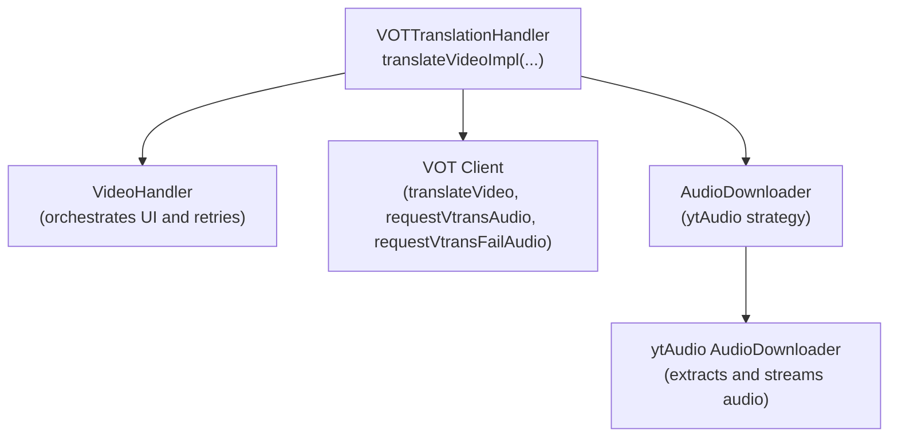
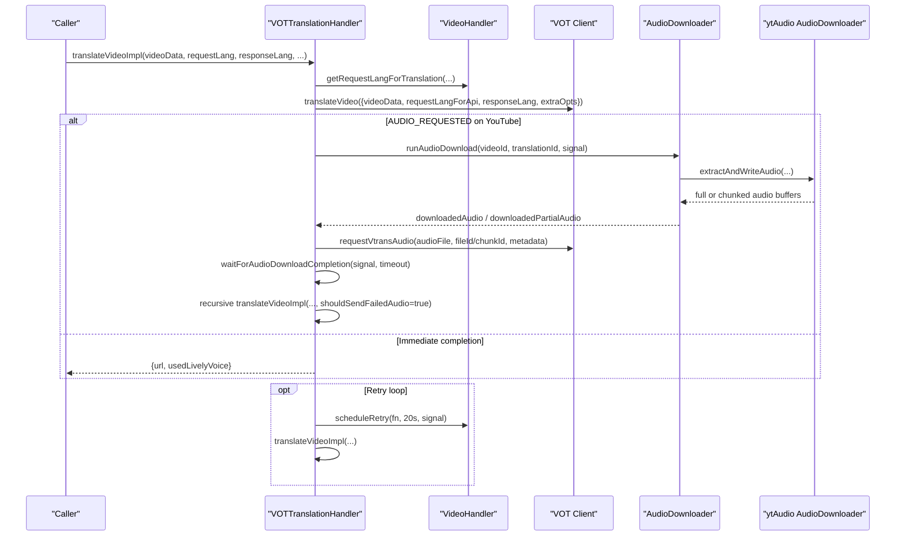
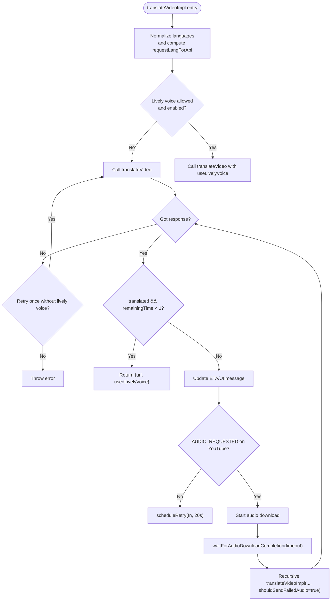
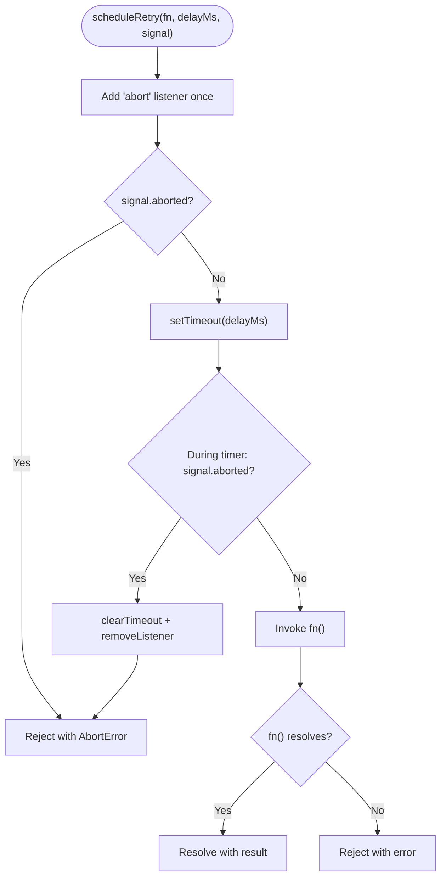
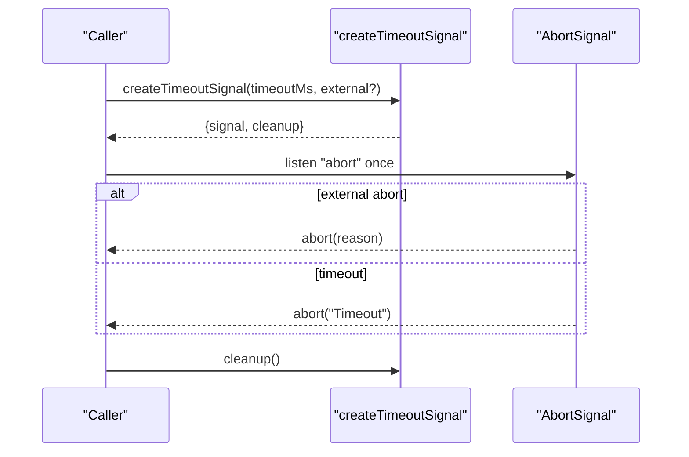
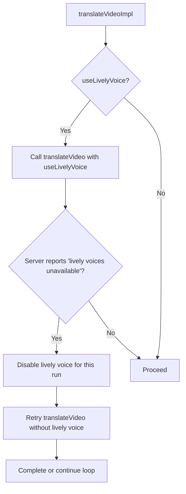
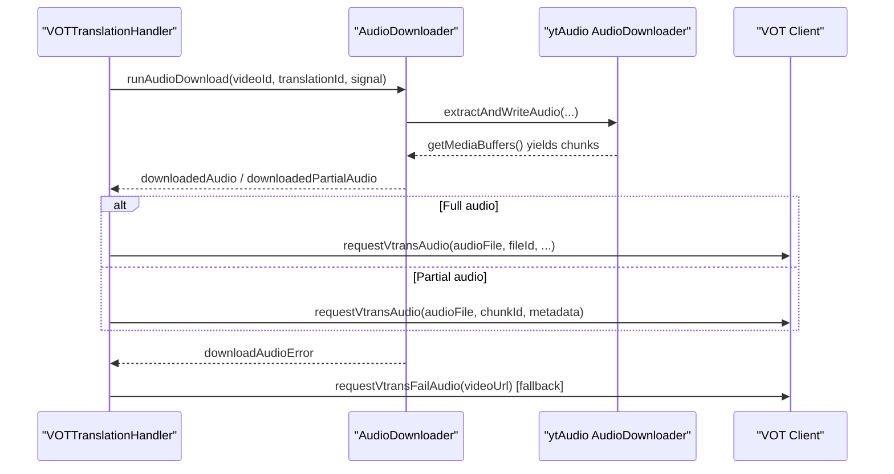
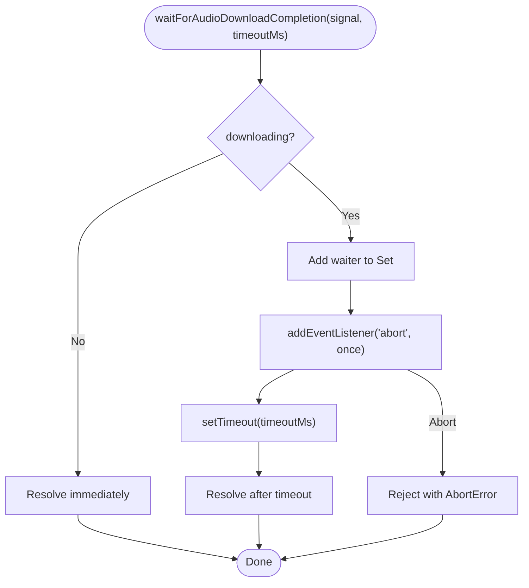
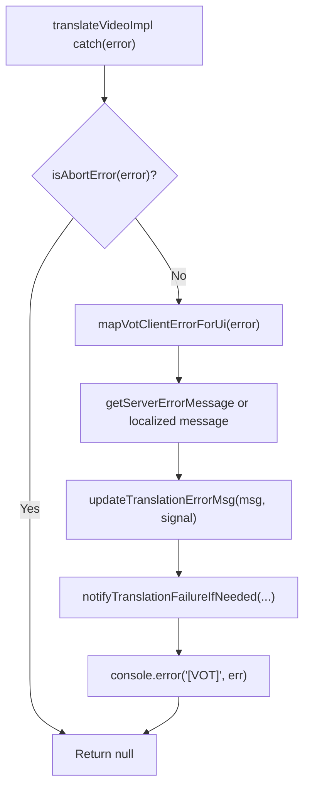
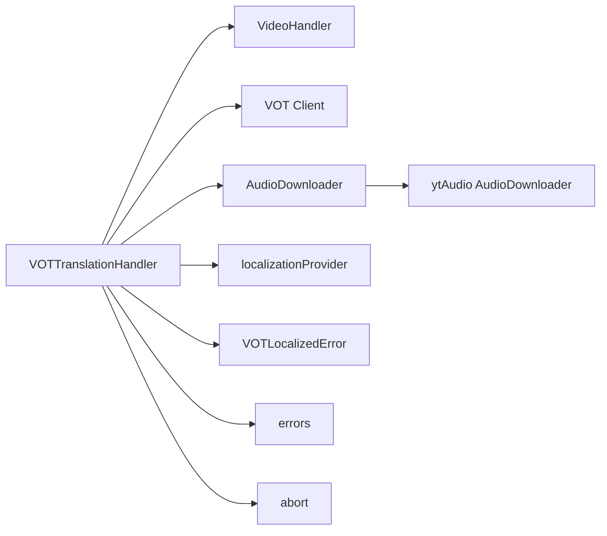

# Translation Handler

<cite>
**Referenced Files in This Document**
- [translationHandler.ts](file://src/core/translationHandler.ts)
- [abort.ts](file://src/utils/abort.ts)
- [errors.ts](file://src/utils/errors.ts)
- [VOTLocalizedError.ts](file://src/utils/VOTLocalizedError.ts)
- [localizationProvider.ts](file://src/localization/localizationProvider.ts)
- [audioDownloader/index.ts](file://src/audioDownloader/index.ts)
- [audioDownloader/strategies/index.ts](file://src/audioDownloader/strategies/index.ts)
- [audioDownloader/ytAudio/index.ts](file://src/audioDownloader/ytAudio/index.ts)
- [audioDownloader/ytAudio/src/AudioDownloader.ts](file://src/audioDownloader/ytAudio/src/AudioDownloader.ts)
- [types/audioDownloader.ts](file://src/types/audioDownloader.ts)
- [translation.ts](file://src/videoHandler/modules/translation.ts)
- [translationShared.ts](file://src/videoHandler/modules/translationShared.ts)
- [timeFormatting.ts](file://src/utils/timeFormatting.ts)
</cite>

## Table of Contents
1. [Introduction](#introduction)
2. [Project Structure](#project-structure)
3. [Core Components](#core-components)
4. [Architecture Overview](#architecture-overview)
5. [Detailed Component Analysis](#detailed-component-analysis)
6. [Dependency Analysis](#dependency-analysis)
7. [Performance Considerations](#performance-considerations)
8. [Troubleshooting Guide](#troubleshooting-guide)
9. [Conclusion](#conclusion)

## Introduction
This document explains the VOTTranslationHandler class, the core translation engine component responsible for orchestrating video translation requests, managing retry loops with exponential backoff, handling abort signals, coordinating audio downloads for YouTube videos, and implementing lively voice fallback logic. It also covers error handling, UI error localization, and practical usage patterns.

## Project Structure
The translation engine integrates tightly with:
- The VOT client (external dependency) for initiating translation and uploading audio
- The audio downloader subsystem for fetching YouTube audio in full or chunked form
- Localization and error utilities for user-facing messaging
- The video handler module for scheduling retries, updating UI, and coordinating actions

**Diagram sources**
- [translationHandler.ts:105-564](file://src/core/translationHandler.ts#L105-L564)
- [translation.ts:667-716](file://src/videoHandler/modules/translation.ts#L667-L716)
- [audioDownloader/index.ts:87-189](file://src/audioDownloader/index.ts#L87-L189)
- [audioDownloader/ytAudio/src/AudioDownloader.ts:357-667](file://src/audioDownloader/ytAudio/src/AudioDownloader.ts#L357-L667)

**Section sources**
- [translationHandler.ts:105-564](file://src/core/translationHandler.ts#L105-L564)
- [translation.ts:667-716](file://src/videoHandler/modules/translation.ts#L667-L716)

## Core Components
- VOTTranslationHandler: Implements the translation workflow, retry/backoff, abort handling, lively voice fallback, and audio upload coordination.
- AudioDownloader: Unified interface for audio download events and orchestration.
- ytAudio AudioDownloader: YouTube-specific audio extraction and streaming with chunking support.
- Localization and error utilities: Map server errors to localized UI messages and normalize abort semantics.

**Section sources**
- [translationHandler.ts:105-564](file://src/core/translationHandler.ts#L105-L564)
- [audioDownloader/index.ts:87-189](file://src/audioDownloader/index.ts#L87-L189)
- [audioDownloader/ytAudio/src/AudioDownloader.ts:357-667](file://src/audioDownloader/ytAudio/src/AudioDownloader.ts#L357-L667)
- [VOTLocalizedError.ts:1-21](file://src/utils/VOTLocalizedError.ts#L1-L21)
- [errors.ts:84-110](file://src/utils/errors.ts#L84-L110)

## Architecture Overview
The translation workflow is driven by translateVideoImpl. It:
- Normalizes request/response languages
- Optionally enables lively voice based on policy and user settings
- Calls the VOT client to initiate translation
- If audio is requested for YouTube, starts audio download and waits for completion
- Uploads either full audio or partial chunks to the VOT client
- Schedules periodic retries with exponential backoff until completion or cancellation

**Diagram sources**
- [translationHandler.ts:311-495](file://src/core/translationHandler.ts#L311-L495)
- [audioDownloader/index.ts:103-125](file://src/audioDownloader/index.ts#L103-L125)
- [audioDownloader/ytAudio/src/AudioDownloader.ts:610-667](file://src/audioDownloader/ytAudio/src/AudioDownloader.ts#L610-L667)

## Detailed Component Analysis

### VOTTranslationHandler.translateVideoImpl
Responsibilities:
- Normalize languages and compute requestLangForApi
- Determine lively voice allowance and user preference
- Attempt translation up to two times to handle “lively voices unavailable” server responses
- On AUDIO_REQUESTED for YouTube, trigger audio download and upload
- Upload full audio or partial chunks with metadata
- Wait for download completion with a bounded timeout
- Schedule retries with 20 seconds backoff and propagate AbortError semantics
- Map VOT client errors to localized UI errors and update error messages

Key behaviors:
- Abort handling: Uses throwIfAborted and AbortSignal to cancel work promptly
- Retry mechanism: scheduleRetry wraps fn with a timer and attaches abort listeners
- Download completion: waitForAudioDownloadCompletion coordinates multiple waiters and respects timeouts
- Lively voice fallback: Detects “lively voices unavailable” and disables lively voice for subsequent attempts

**Diagram sources**
- [translationHandler.ts:311-495](file://src/core/translationHandler.ts#L311-L495)

**Section sources**
- [translationHandler.ts:311-495](file://src/core/translationHandler.ts#L311-L495)
- [abort.ts:12-31](file://src/utils/abort.ts#L12-L31)
- [errors.ts:84-110](file://src/utils/errors.ts#L84-L110)

### Retry Mechanism with Exponential Backoff
- scheduleRetry creates a timer and attaches an AbortSignal listener
- It clears timers and cleans up listeners on abort
- Retries are scheduled every 20 seconds
- The caller can cancel retries by aborting the provided signal

**Diagram sources**
- [translationHandler.ts:261-309](file://src/core/translationHandler.ts#L261-L309)
- [abort.ts:12-31](file://src/utils/abort.ts#L12-L31)

**Section sources**
- [translationHandler.ts:261-309](file://src/core/translationHandler.ts#L261-L309)
- [abort.ts:12-31](file://src/utils/abort.ts#L12-L31)

### Abort Signal Management Patterns
- throwIfAborted normalizes cancellation across runtimes and throws a canonical AbortError
- createTimeoutSignal composes an AbortSignal that aborts either on external abort or timeout
- VOTTranslationHandler uses AbortSignal throughout: during translation, audio download, and waiters

**Diagram sources**
- [abort.ts:44-93](file://src/utils/abort.ts#L44-L93)

**Section sources**
- [abort.ts:3-93](file://src/utils/abort.ts#L3-L93)

### Lively Voice Feature and Automatic Fallback
- isLivelyVoiceUnavailableError detects server messages indicating lively voice is unsupported
- translateVideoImpl attempts translation twice: once with lively voice, then retries without it
- The decision is persisted across retries to avoid repeated attempts on unsupported pairs

**Diagram sources**
- [translationHandler.ts:256-388](file://src/core/translationHandler.ts#L256-L388)

**Section sources**
- [translationHandler.ts:256-388](file://src/core/translationHandler.ts#L256-L388)

### Audio Download Integration for YouTube Videos
- AudioDownloader exposes three events: downloadedAudio, downloadedPartialAudio, downloadAudioError
- VOTTranslationHandler subscribes to these events and uploads audio to VOT
- For single-part audio, uploaded as a single file; for multi-part, uploaded as chunks with metadata
- The handler tracks download progress and resolves waiters upon completion

**Diagram sources**
- [translationHandler.ts:126-234](file://src/core/translationHandler.ts#L126-L234)
- [audioDownloader/index.ts:28-85](file://src/audioDownloader/index.ts#L28-L85)
- [audioDownloader/ytAudio/src/AudioDownloader.ts:610-667](file://src/audioDownloader/ytAudio/src/AudioDownloader.ts#L610-L667)

**Section sources**
- [translationHandler.ts:126-234](file://src/core/translationHandler.ts#L126-L234)
- [audioDownloader/index.ts:28-85](file://src/audioDownloader/index.ts#L28-L85)
- [audioDownloader/ytAudio/src/AudioDownloader.ts:610-667](file://src/audioDownloader/ytAudio/src/AudioDownloader.ts#L610-L667)
- [types/audioDownloader.ts:75-89](file://src/types/audioDownloader.ts#L75-L89)

### Download Completion Waiting Mechanism
- waitForAudioDownloadCompletion registers a waiter entry and listens to AbortSignal
- Completes when finishDownloadSuccess is called or after a bounded timeout
- Ensures multiple waiters are resolved consistently

**Diagram sources**
- [translationHandler.ts:497-542](file://src/core/translationHandler.ts#L497-L542)

**Section sources**
- [translationHandler.ts:497-542](file://src/core/translationHandler.ts#L497-L542)

### Error Handling Strategies, VOT Client Error Mapping, and UI Localization
- mapVotClientErrorForUi converts known VOT client error shapes into VOTLocalizedError instances for UI
- getServerErrorMessage extracts server-provided messages when present
- VOTLocalizedError stores both unlocalized and localized messages for consistent reporting
- updateTranslationErrorMsg displays ETA or localized messages; notifyTranslationFailureIfNeeded emits desktop notifications when appropriate

**Diagram sources**
- [translationHandler.ts:445-477](file://src/core/translationHandler.ts#L445-L477)
- [VOTLocalizedError.ts:1-21](file://src/utils/VOTLocalizedError.ts#L1-L21)
- [errors.ts:84-110](file://src/utils/errors.ts#L84-L110)

**Section sources**
- [translationHandler.ts:61-98](file://src/core/translationHandler.ts#L61-L98)
- [VOTLocalizedError.ts:1-21](file://src/utils/VOTLocalizedError.ts#L1-L21)
- [errors.ts:84-110](file://src/utils/errors.ts#L84-L110)
- [translation.ts:171-193](file://src/videoHandler/modules/translation.ts#L171-L193)

### Practical Examples

- Successful translation with immediate completion:
  - Call translateVideoImpl with supported language pair
  - Expect a response with url and usedLivelyVoice flag

- Translation with lively voice fallback:
  - Initial request fails with “lively voices unavailable”
  - Handler retries once without lively voice and proceeds

- YouTube audio download and upload:
  - Server responds with AUDIO_REQUESTED
  - AudioDownloader streams audio; handler uploads either full or chunked audio
  - After upload, handler triggers a recursive translateVideoImpl with shouldSendFailedAudio=true

- Cancellation:
  - Pass an AbortSignal to translateVideoImpl
  - Any stage may abort; the handler converts to AbortError and returns null

- Error scenarios:
  - Network or server errors mapped to localized messages
  - Desktop notifications emitted when translateAPIErrors is enabled and hadAsyncWait is true

**Section sources**
- [translationHandler.ts:311-495](file://src/core/translationHandler.ts#L311-L495)
- [translation.ts:667-716](file://src/videoHandler/modules/translation.ts#L667-L716)
- [translationShared.ts:33-61](file://src/videoHandler/modules/translationShared.ts#L33-L61)

## Dependency Analysis
- VOTTranslationHandler depends on:
  - VideoHandler for language normalization, UI updates, and scheduling
  - VOT client for translation initiation and audio upload/fallback
  - AudioDownloader for YouTube audio extraction and chunking
  - Localization and error utilities for user-facing messages and abort semantics

**Diagram sources**
- [translationHandler.ts:105-564](file://src/core/translationHandler.ts#L105-L564)
- [translation.ts:667-716](file://src/videoHandler/modules/translation.ts#L667-L716)
- [audioDownloader/index.ts:87-189](file://src/audioDownloader/index.ts#L87-L189)
- [audioDownloader/ytAudio/src/AudioDownloader.ts:357-667](file://src/audioDownloader/ytAudio/src/AudioDownloader.ts#L357-L667)
- [localizationProvider.ts:39-273](file://src/localization/localizationProvider.ts#L39-L273)
- [VOTLocalizedError.ts:1-21](file://src/utils/VOTLocalizedError.ts#L1-L21)
- [errors.ts:84-110](file://src/utils/errors.ts#L84-L110)
- [abort.ts:12-31](file://src/utils/abort.ts#L12-L31)

**Section sources**
- [translationHandler.ts:105-564](file://src/core/translationHandler.ts#L105-L564)
- [translation.ts:667-716](file://src/videoHandler/modules/translation.ts#L667-L716)
- [audioDownloader/index.ts:87-189](file://src/audioDownloader/index.ts#L87-L189)

## Performance Considerations
- Chunked audio upload reduces memory pressure and improves resilience for large files
- Bounded download completion wait (e.g., 15 seconds) prevents indefinite blocking
- Retry backoff avoids excessive load on the VOT client and network
- Early abort handling ensures resources are released promptly

[No sources needed since this section provides general guidance]

## Troubleshooting Guide
- If translations stall, verify AbortSignal propagation and ensure actionsAbortController is active
- For “lively voices unavailable,” confirm the language pair supports lively voice; the handler will automatically retry without it
- If audio download fails, the handler attempts a fallback request to the fail-audio-js endpoint for YouTube when enabled
- For persistent errors, check localized messages and desktop notifications; enable translateAPIErrors to receive alerts

**Section sources**
- [translationHandler.ts:445-477](file://src/core/translationHandler.ts#L445-L477)
- [translation.ts:171-193](file://src/videoHandler/modules/translation.ts#L171-L193)

## Conclusion
VOTTranslationHandler centralizes the translation workflow, robustly handles aborts and retries, integrates YouTube audio downloads with chunking, and provides resilient fallbacks for lively voice. Its error mapping and localization pipeline ensures clear user feedback, while the structured retry and wait mechanisms improve reliability and performance.