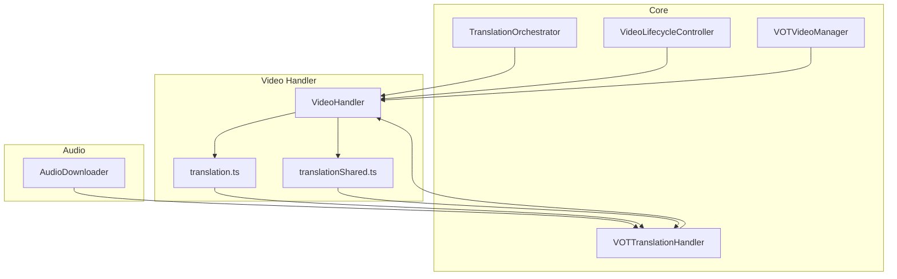
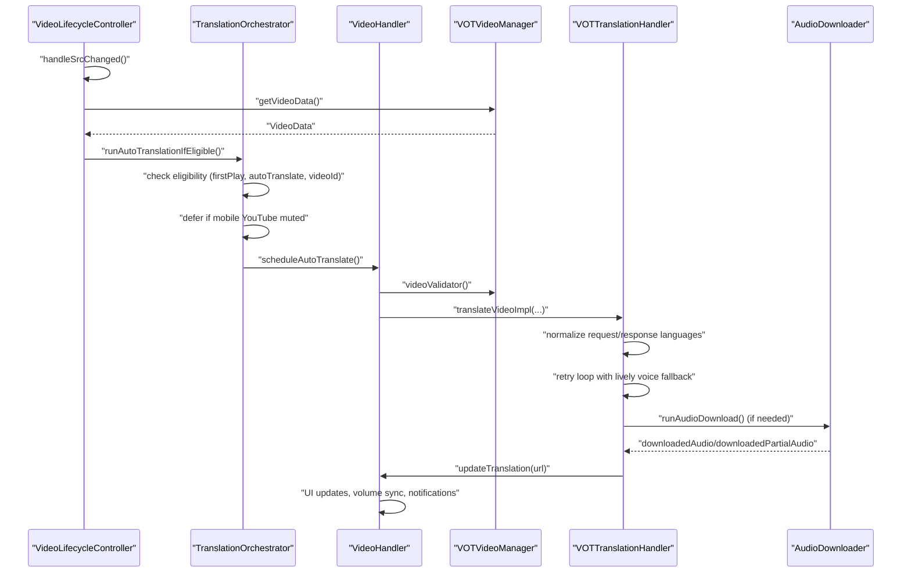
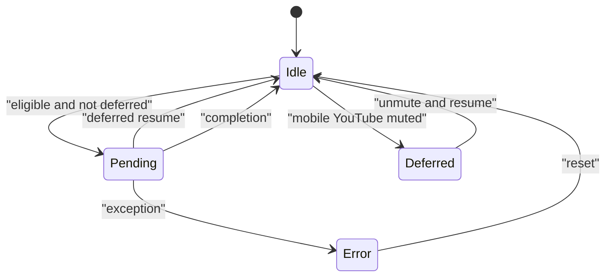
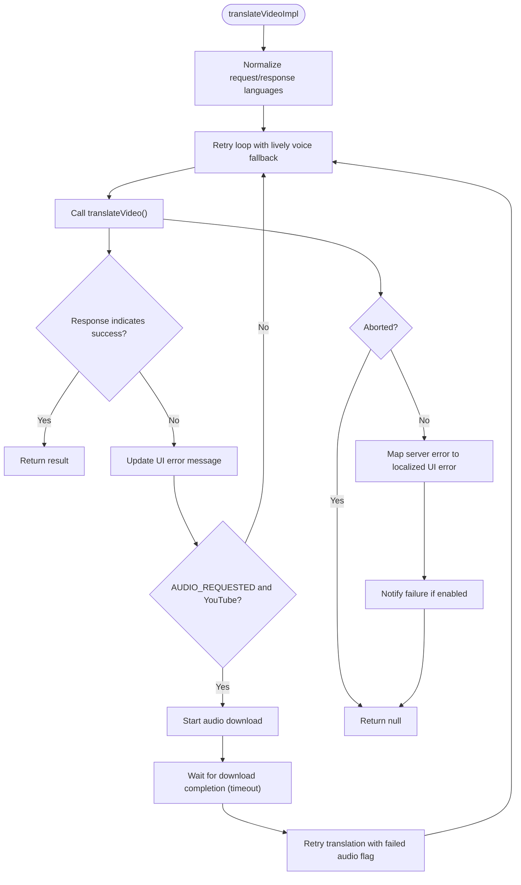
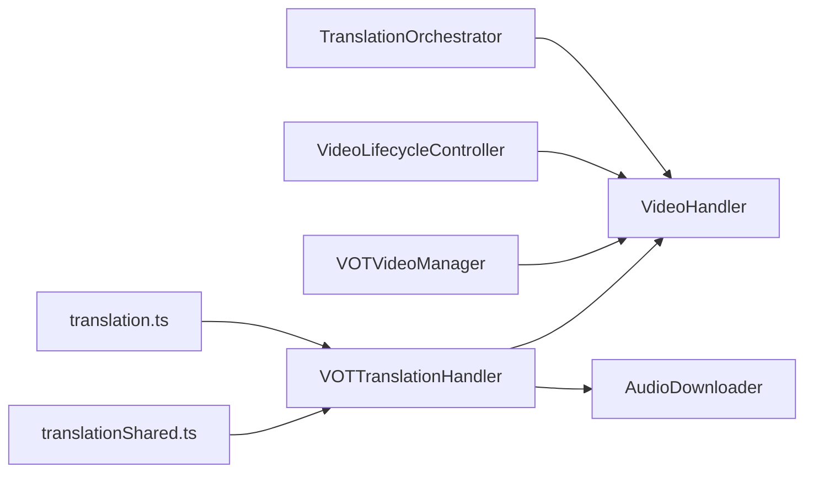

# Translation Orchestration

<cite>
**Referenced Files in This Document**
- [translationOrchestrator.ts](file://src/core/translationOrchestrator.ts)
- [translationHandler.ts](file://src/core/translationHandler.ts)
- [videoLifecycleController.ts](file://src/core/videoLifecycleController.ts)
- [index.ts](file://src/index.ts)
- [translation.ts](file://src/videoHandler/modules/translation.ts)
- [translationShared.ts](file://src/videoHandler/modules/translationShared.ts)
- [videoManager.ts](file://src/core/videoManager.ts)
- [audioDownloader/index.ts](file://src/audioDownloader/index.ts)
- [shared.ts](file://src/videoHandler/shared.ts)
- [init.ts](file://src/videoHandler/modules/init.ts)
</cite>

## Table of Contents
1. [Introduction](#introduction)
2. [Project Structure](#project-structure)
3. [Core Components](#core-components)
4. [Architecture Overview](#architecture-overview)
5. [Detailed Component Analysis](#detailed-component-analysis)
6. [Dependency Analysis](#dependency-analysis)
7. [Performance Considerations](#performance-considerations)
8. [Troubleshooting Guide](#troubleshooting-guide)
9. [Conclusion](#conclusion)

## Introduction
This document explains the translation orchestration system that coordinates translation requests across multiple components. It covers request routing, status tracking, progress monitoring, integration with video lifecycle management, translation state synchronization, and component communication patterns. It also details the orchestration of translation help integration, request language validation, response language mapping, coordination of asynchronous operations, timeout handling, and resource cleanup. Examples of translation request flows, state transitions, and error propagation patterns are included, along with the relationship between translation orchestration and audio downloading and UI updates.

## Project Structure
The translation orchestration spans several core modules:
- Core orchestration and lifecycle management
- Translation handler and audio downloader
- Video handler integration and UI updates
- Shared types and configuration

**Diagram sources**
- [translationOrchestrator.ts](file://src/core/translationOrchestrator.ts)
- [videoLifecycleController.ts](file://src/core/videoLifecycleController.ts)
- [videoManager.ts](file://src/core/videoManager.ts)
- [translationHandler.ts](file://src/core/translationHandler.ts)
- [index.ts](file://src/index.ts)
- [translation.ts](file://src/videoHandler/modules/translation.ts)
- [translationShared.ts](file://src/videoHandler/modules/translationShared.ts)
- [audioDownloader/index.ts](file://src/audioDownloader/index.ts)

**Section sources**
- [translationOrchestrator.ts](file://src/core/translationOrchestrator.ts)
- [videoLifecycleController.ts](file://src/core/videoLifecycleController.ts)
- [translationHandler.ts](file://src/core/translationHandler.ts)
- [index.ts](file://src/index.ts)
- [translation.ts](file://src/videoHandler/modules/translation.ts)
- [translationShared.ts](file://src/videoHandler/modules/translationShared.ts)
- [audioDownloader/index.ts](file://src/audioDownloader/index.ts)
- [shared.ts](file://src/videoHandler/shared.ts)
- [init.ts](file://src/videoHandler/modules/init.ts)

## Core Components
- TranslationOrchestrator: Manages eligibility and timing of automatic translation, handles deferred execution on mobile YouTube, and tracks state transitions.
- VOTTranslationHandler: Implements the translation workflow, including request language normalization, retry scheduling, audio download coordination, and error mapping.
- VideoLifecycleController: Coordinates lifecycle events around video source changes, triggers auto-translation orchestration, and manages UI overlays and subtitles.
- VOTVideoManager: Provides video data resolution, language detection, and validation logic for translation eligibility.
- AudioDownloader: Downloads audio in full or partial chunks and emits events consumed by the translation handler.
- VideoHandler: Integrates all subsystems, exposes public APIs, manages UI updates, and coordinates asynchronous operations with abort signals.

**Section sources**
- [translationOrchestrator.ts](file://src/core/translationOrchestrator.ts)
- [translationHandler.ts](file://src/core/translationHandler.ts)
- [videoLifecycleController.ts](file://src/core/videoLifecycleController.ts)
- [videoManager.ts](file://src/core/videoManager.ts)
- [audioDownloader/index.ts](file://src/audioDownloader/index.ts)
- [index.ts](file://src/index.ts)

## Architecture Overview
The orchestration system follows a layered pattern:
- Orchestrator determines when to initiate translation based on first-play, auto-translate settings, and platform-specific conditions (e.g., mobile YouTube mute state).
- VideoLifecycleController coordinates lifecycle events and invokes the orchestrator after resolving video data and updating UI state.
- VOTTranslationHandler executes the translation request, handles retries, and integrates audio downloads when required.
- AudioDownloader performs asynchronous audio retrieval and emits events to the translation handler.
- VideoHandler centralizes UI updates, error messaging, and resource cleanup, and provides shared utilities for language mapping and validation.

**Diagram sources**
- [videoLifecycleController.ts](file://src/core/videoLifecycleController.ts)
- [translationOrchestrator.ts](file://src/core/translationOrchestrator.ts)
- [index.ts](file://src/index.ts)
- [translationHandler.ts](file://src/core/translationHandler.ts)
- [translation.ts](file://src/videoHandler/modules/translation.ts)
- [audioDownloader/index.ts](file://src/audioDownloader/index.ts)

## Detailed Component Analysis

### TranslationOrchestrator
Responsibilities:
- Track orchestration state: idle, pending (auto), deferred (muted), error.
- Evaluate eligibility for auto-translation based on first play, auto-translate setting, and presence of videoId.
- Defer execution on mobile YouTube until the video is unmuted, then resume automatically.
- Reset state after successful completion or propagate errors.

Key behaviors:
- State transitions occur on eligibility checks and completion/error handling.
- Uses a dependency interface to integrate with VideoHandler for platform-specific conditions and callbacks.

**Diagram sources**
- [translationOrchestrator.ts](file://src/core/translationOrchestrator.ts)

**Section sources**
- [translationOrchestrator.ts](file://src/core/translationOrchestrator.ts)

### VOTTranslationHandler
Responsibilities:
- Execute translation requests with request/response language normalization.
- Manage retry scheduling with exponential-like intervals and abort safety.
- Coordinate audio downloads for YouTube hosts and upload audio to the translation API.
- Map server-side errors to localized UI errors and notify failures appropriately.
- Handle lively voice fallback when unavailable and maintain state for subsequent retries.

Processing logic highlights:
- Normalizes request language for specific combinations (e.g., lively voice requires English to Russian with authentication).
- Implements a two-attempt loop to handle "lively voices unavailable" server responses.
- Waits for audio download completion with a bounded timeout and retries translation with failed audio flag.
- Emits download events to the translation handler for full or partial audio uploads.

**Diagram sources**
- [translationHandler.ts](file://src/core/translationHandler.ts)
- [translation.ts](file://src/videoHandler/modules/translation.ts)
- [translationShared.ts](file://src/videoHandler/modules/translationShared.ts)
- [audioDownloader/index.ts](file://src/audioDownloader/index.ts)

**Section sources**
- [translationHandler.ts](file://src/core/translationHandler.ts)
- [translation.ts](file://src/videoHandler/modules/translation.ts)
- [translationShared.ts](file://src/videoHandler/modules/translationShared.ts)
- [audioDownloader/index.ts](file://src/audioDownloader/index.ts)

### VideoLifecycleController
Responsibilities:
- Manage lifecycle events around video source changes and "can play" moments.
- Resolve video data, update UI overlays, and synchronize language selections.
- Trigger auto-translation orchestration and auto-subtitles enabling.
- Invalidate stale sessions and coordinate teardown.

Integration points:
- Resets translation orchestrator and first-play flag on source changes.
- Calls orchestrator after video data resolution and UI updates.

**Section sources**
- [videoLifecycleController.ts](file://src/core/videoLifecycleController.ts)
- [index.ts](file://src/index.ts)

### VOTVideoManager
Responsibilities:
- Resolve video data, detect language, and enforce validation rules for translation eligibility.
- Provide language mapping utilities for translation requests.
- Manage volume and UI synchronization.

Integration points:
- Supplies validated VideoData to the translation handler.
- Provides language normalization and validation for translation eligibility.

**Section sources**
- [videoManager.ts](file://src/core/videoManager.ts)
- [shared.ts](file://src/videoHandler/shared.ts)

### AudioDownloader
Responsibilities:
- Download audio in full or partial chunks and emit events to the translation handler.
- Emit errors to trigger fallback mechanisms.

Integration points:
- Consumed by VOTTranslationHandler to upload audio to the translation API.
- Supports both full and chunked uploads for YouTube hosts.

**Section sources**
- [audioDownloader/index.ts](file://src/audioDownloader/index.ts)

### VideoHandler Integration and UI Updates
Responsibilities:
- Central integration point for all subsystems.
- Expose public APIs for translation, UI updates, and resource cleanup.
- Manage abort controllers, caching, and error message localization.
- Coordinate translation completion with UI updates and notifications.

Integration points:
- Orchestrator delegates to VideoHandler for auto-translate scheduling.
- Translation handler updates UI and schedules translation refresh.
- Provides language mapping and validation helpers.

**Section sources**
- [index.ts](file://src/index.ts)
- [translation.ts](file://src/videoHandler/modules/translation.ts)
- [translationShared.ts](file://src/videoHandler/modules/translationShared.ts)
- [init.ts](file://src/videoHandler/modules/init.ts)

## Dependency Analysis
The orchestration system exhibits clear separation of concerns with controlled dependencies:
- TranslationOrchestrator depends on VideoHandler for platform-specific conditions and callbacks.
- VideoLifecycleController depends on TranslationOrchestrator and VideoHandler for lifecycle coordination.
- VOTTranslationHandler depends on VideoHandler for client initialization, UI updates, and validation.
- AudioDownloader is event-driven and consumed by VOTTranslationHandler.
- VideoHandler aggregates all components and exposes unified APIs.

**Diagram sources**
- [translationOrchestrator.ts](file://src/core/translationOrchestrator.ts)
- [videoLifecycleController.ts](file://src/core/videoLifecycleController.ts)
- [videoManager.ts](file://src/core/videoManager.ts)
- [translationHandler.ts](file://src/core/translationHandler.ts)
- [index.ts](file://src/index.ts)
- [translation.ts](file://src/videoHandler/modules/translation.ts)
- [translationShared.ts](file://src/videoHandler/modules/translationShared.ts)
- [audioDownloader/index.ts](file://src/audioDownloader/index.ts)

**Section sources**
- [translationOrchestrator.ts](file://src/core/translationOrchestrator.ts)
- [videoLifecycleController.ts](file://src/core/videoLifecycleController.ts)
- [translationHandler.ts](file://src/core/translationHandler.ts)
- [index.ts](file://src/index.ts)
- [translation.ts](file://src/videoHandler/modules/translation.ts)
- [translationShared.ts](file://src/videoHandler/modules/translationShared.ts)
- [audioDownloader/index.ts](file://src/audioDownloader/index.ts)

## Performance Considerations
- Retry scheduling uses a fixed interval to balance responsiveness and server load.
- Audio download waits are bounded by a timeout to prevent indefinite blocking.
- Abort signals are checked frequently to avoid wasted work on stale requests.
- Caching of translation and detection services reduces repeated storage reads.
- Single-flight language detection prevents duplicate detection requests for the same video.

## Troubleshooting Guide
Common scenarios and handling:
- Mobile YouTube muted: Orchestrator defers auto-translation until unmute; resumes automatically.
- Lively voice unavailable: Handler retries without lively voice and keeps that preference for subsequent attempts.
- Audio download failures: Fallback to fail-audio-js endpoint for YouTube when enabled; otherwise, mark download failure.
- Long-running translations: UI updates include ETA formatting; extended delays trigger localized messages.
- Proxy settings changes: Clear caches, cancel in-flight translation, and reinitialize audio source.

Operational tips:
- Use abort controllers to cancel stale translation actions and invalidate stale async work.
- Monitor long waiting counts to provide timely user feedback.
- Verify video validation rules (non-stream, duration limits) before initiating translation.

**Section sources**
- [translationOrchestrator.ts](file://src/core/translationOrchestrator.ts)
- [translationHandler.ts](file://src/core/translationHandler.ts)
- [translation.ts](file://src/videoHandler/modules/translation.ts)
- [index.ts](file://src/index.ts)

## Conclusion
The translation orchestration system coordinates multiple subsystems to deliver robust, responsive translation workflows. It integrates lifecycle management, language validation, asynchronous audio handling, and UI updates while maintaining clear state transitions and error propagation. The modular design ensures scalability and maintainability, with well-defined boundaries between orchestration, translation execution, audio handling, and UI integration.