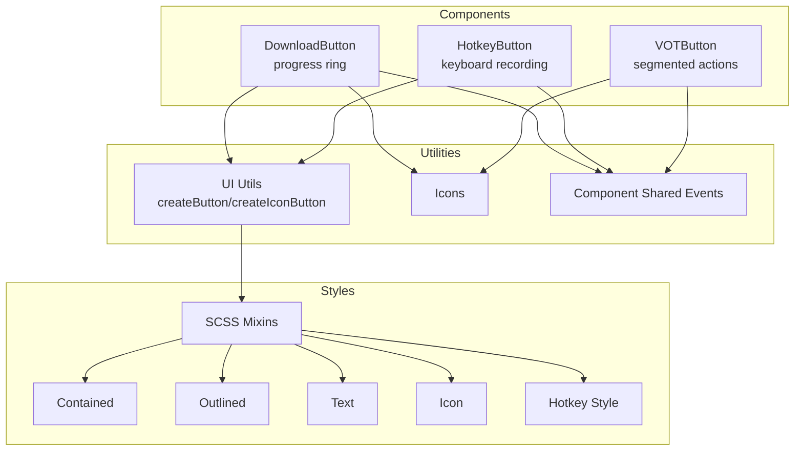
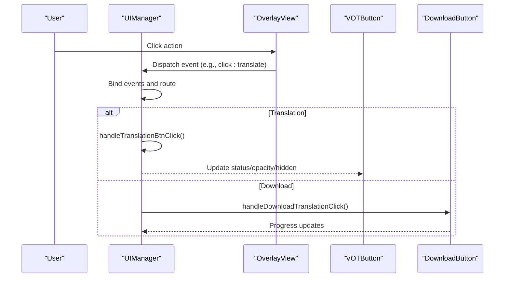
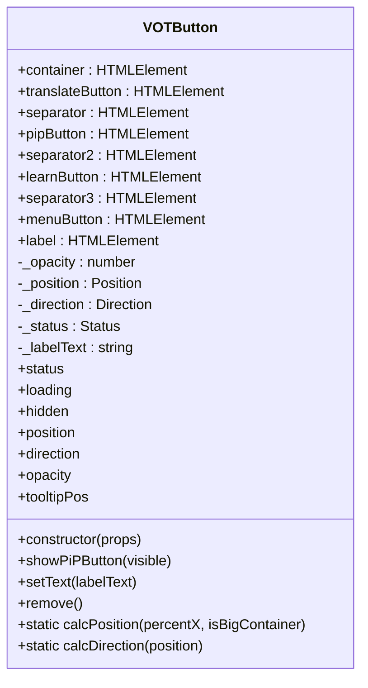
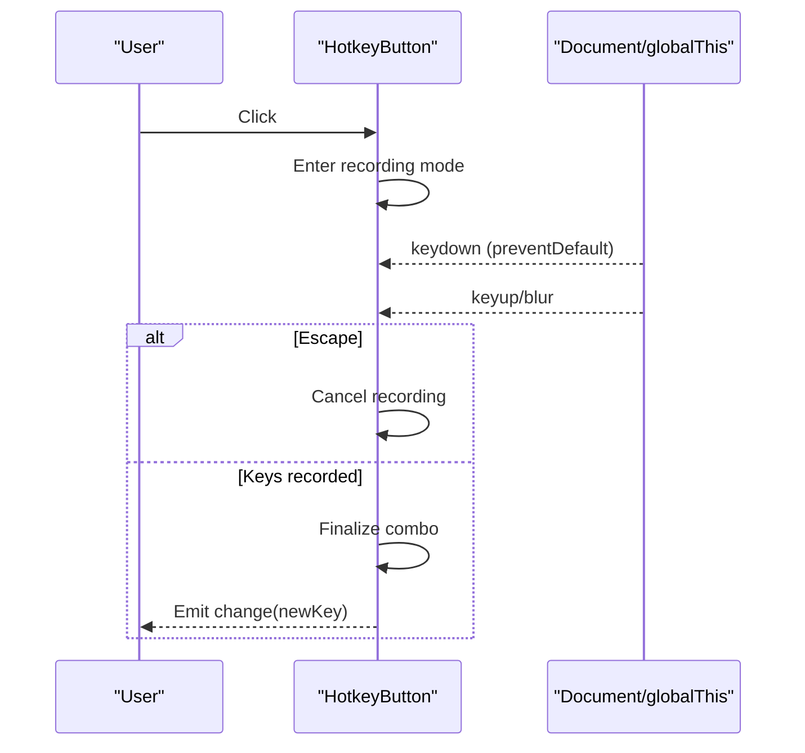
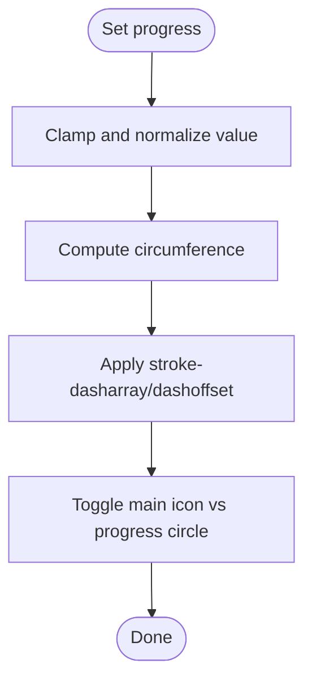
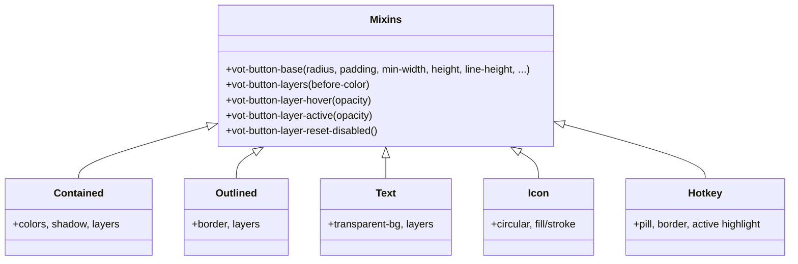
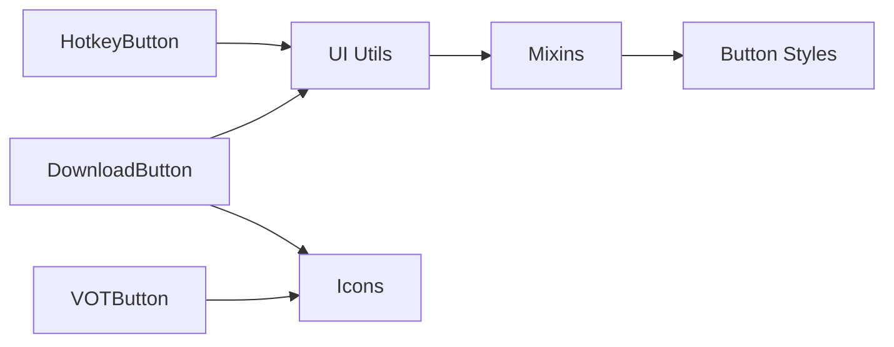

# Button Components

<cite>
**Referenced Files in This Document**
- [votButton.ts](file://src/ui/components/votButton.ts)
- [hotkeyButton.ts](file://src/ui/components/hotkeyButton.ts)
- [downloadButton.ts](file://src/ui/components/downloadButton.ts)
- [votButton.ts (types)](file://src/types/components/votButton.ts)
- [hotkeyButton.ts (types)](file://src/types/components/hotkeyButton.ts)
- [componentShared.ts](file://src/ui/components/componentShared.ts)
- [mixins.scss](file://src/styles/components/buttons/_mixins.scss)
- [contained.scss](file://src/styles/components/buttons/contained.scss)
- [outlined.scss](file://src/styles/components/buttons/outlined.scss)
- [text.scss](file://src/styles/components/buttons/text.scss)
- [icon.scss](file://src/styles/components/buttons/icon.scss)
- [hotkey.scss](file://src/styles/components/buttons/hotkey.scss)
- [icons.ts](file://src/ui/icons.ts)
- [ui.ts](file://src/ui.ts)
- [manager.ts](file://src/ui/manager.ts)
</cite>

## Table of Contents
1. [Introduction](#introduction)
2. [Project Structure](#project-structure)
3. [Core Components](#core-components)
4. [Architecture Overview](#architecture-overview)
5. [Detailed Component Analysis](#detailed-component-analysis)
6. [Dependency Analysis](#dependency-analysis)
7. [Performance Considerations](#performance-considerations)
8. [Troubleshooting Guide](#troubleshooting-guide)
9. [Conclusion](#conclusion)

## Introduction
This document describes the button component variants and the underlying styling system used across the UI. It covers:
- VOTButton: a segmented button group with multiple actions
- HotkeyButton: a button that records and displays keyboard shortcuts
- DownloadButton: an icon button with a progress ring for downloads
It also documents button styles (contained, outlined, text, icon, hotkey), accessibility attributes, keyboard navigation, focus management, screen reader compatibility, theming, responsive behavior, and cross-browser consistency.

## Project Structure
The button system spans TypeScript components, SCSS stylesheets, and shared UI utilities:
- Components: VOTButton, HotkeyButton, DownloadButton
- Styles: mixins and per-style SCSS files
- Types: component prop definitions
- Utilities: shared event and DOM helpers
- Icons: SVG templates used by buttons

**Diagram sources**
- [votButton.ts:18-225](file://src/ui/components/votButton.ts#L18-L225)
- [hotkeyButton.ts:12-255](file://src/ui/components/hotkeyButton.ts#L12-L255)
- [downloadButton.ts:11-102](file://src/ui/components/downloadButton.ts#L11-L102)
- [mixins.scss:1-80](file://src/styles/components/buttons/_mixins.scss#L1-L80)
- [contained.scss:1-44](file://src/styles/components/buttons/contained.scss#L1-L44)
- [outlined.scss:1-30](file://src/styles/components/buttons/outlined.scss#L1-L30)
- [text.scss:1-30](file://src/styles/components/buttons/text.scss#L1-L30)
- [icon.scss:1-36](file://src/styles/components/buttons/icon.scss#L1-L36)
- [hotkey.scss:1-53](file://src/styles/components/buttons/hotkey.scss#L1-L53)
- [icons.ts:1-84](file://src/ui/icons.ts#L1-L84)
- [ui.ts:162-204](file://src/ui.ts#L162-L204)
- [componentShared.ts:1-39](file://src/ui/components/componentShared.ts#L1-L39)

**Section sources**
- [votButton.ts:1-225](file://src/ui/components/votButton.ts#L1-L225)
- [hotkeyButton.ts:1-255](file://src/ui/components/hotkeyButton.ts#L1-L255)
- [downloadButton.ts:1-102](file://src/ui/components/downloadButton.ts#L1-L102)
- [mixins.scss:1-80](file://src/styles/components/buttons/_mixins.scss#L1-L80)
- [contained.scss:1-44](file://src/styles/components/buttons/contained.scss#L1-L44)
- [outlined.scss:1-30](file://src/styles/components/buttons/outlined.scss#L1-L30)
- [text.scss:1-30](file://src/styles/components/buttons/text.scss#L1-L30)
- [icon.scss:1-36](file://src/styles/components/buttons/icon.scss#L1-L36)
- [hotkey.scss:1-53](file://src/styles/components/buttons/hotkey.scss#L1-L53)
- [icons.ts:1-84](file://src/ui/icons.ts#L1-L84)
- [ui.ts:162-204](file://src/ui.ts#L162-L204)
- [componentShared.ts:1-39](file://src/ui/components/componentShared.ts#L1-L39)

## Core Components
- VOTButton: renders a segmented button row/column with translate, PiP, learn, and menu actions. Supports status, position, direction, opacity, and hidden state. Accessibility: role="button", tabIndex=0, aria-labels.
- HotkeyButton: records keyboard combinations, supports change events, and exposes key and keyText. Accessibility: role-like behavior via UI.makeButtonLike.
- DownloadButton: icon button with a circular progress indicator. Exposes click events and progress property with normalization.

**Section sources**
- [votButton.ts:18-225](file://src/ui/components/votButton.ts#L18-L225)
- [hotkeyButton.ts:12-255](file://src/ui/components/hotkeyButton.ts#L12-L255)
- [downloadButton.ts:11-102](file://src/ui/components/downloadButton.ts#L11-L102)

## Architecture Overview
The button components integrate with the UI manager and overlay system. The manager binds button clicks to video handler actions and settings updates. Styles are theme-aware and use SCSS mixins for consistent behavior.

**Diagram sources**
- [manager.ts:159-238](file://src/ui/manager.ts#L159-L238)
- [manager.ts:451-492](file://src/ui/manager.ts#L451-L492)
- [votButton.ts:173-223](file://src/ui/components/votButton.ts#L173-L223)
- [downloadButton.ts:45-78](file://src/ui/components/downloadButton.ts#L45-L78)

## Detailed Component Analysis

### VOTButton
- Purpose: A segmented button group containing translate, PiP, learn, and menu actions.
- Props and state:
  - position: default/top/left/right
  - direction: default/row/column
  - status: none/error/success/loading
  - labelHtml: text next to translate button
- Accessibility:
  - Each segment is a custom element with role="button" and tabIndex=0
  - aria-labels for each action; menu button includes aria-haspopup and aria-expanded
- Visibility and opacity:
  - Hidden state managed via a shared helper; opacity toggles a hidden class
- Methods:
  - showPiPButton(visible)
  - setText(labelText)
  - remove()
  - Accessors: status, loading, hidden, position, direction, opacity
- Rendering:
  - Uses UI.createEl and lit-html render for icons

**Diagram sources**
- [votButton.ts:18-225](file://src/ui/components/votButton.ts#L18-L225)
- [votButton.ts (types):1-15](file://src/types/components/votButton.ts#L1-L15)

**Section sources**
- [votButton.ts:18-225](file://src/ui/components/votButton.ts#L18-L225)
- [votButton.ts (types):1-15](file://src/types/components/votButton.ts#L1-L15)

### HotkeyButton
- Purpose: Allows users to record and display keyboard shortcuts.
- Props and state:
  - labelHtml: label text
  - key: current key combination or null
- Recording flow:
  - Click to enter recording mode
  - Listens to keydown/keyup and blur
  - Escape cancels recording
  - Emits change event when finalized
- Accessibility:
  - Uses UI.makeButtonLike for keyboard-accessible behavior
- Events:
  - change: emits new key or null
- Helpers:
  - formatKeysCombo and formatKeysComboDisplay for canonical and human-friendly formatting

**Diagram sources**
- [hotkeyButton.ts:30-92](file://src/ui/components/hotkeyButton.ts#L30-L92)
- [hotkeyButton.ts:103-123](file://src/ui/components/hotkeyButton.ts#L103-L123)
- [hotkeyButton.ts:169-178](file://src/ui/components/hotkeyButton.ts#L169-L178)

**Section sources**
- [hotkeyButton.ts:12-255](file://src/ui/components/hotkeyButton.ts#L12-L255)
- [hotkeyButton.ts (types):1-5](file://src/types/components/hotkeyButton.ts#L1-L5)

### DownloadButton
- Purpose: An icon button with a circular progress ring indicating download progress.
- Props and state:
  - progress: accepts 0..1 (fraction) or 0..100 (percent); normalized to 0..100
- Rendering:
  - Uses UI.createIconButton with DOWNLOAD_ICON
  - Queries loader elements by class selectors
- Events:
  - click: emitted when the button is clicked
- Behavior:
  - Progress updates stroke-dasharray and dashoffset
  - Shows/hides main icon based on progress

**Diagram sources**
- [downloadButton.ts:63-83](file://src/ui/components/downloadButton.ts#L63-L83)
- [downloadButton.ts:94-101](file://src/ui/components/downloadButton.ts#L94-L101)

**Section sources**
- [downloadButton.ts:11-102](file://src/ui/components/downloadButton.ts#L11-L102)

### Button Styles and Theming
- Mixins:
  - Base sizing, typography, outline, cursor
  - Layer effects for hover and active states
  - Disabled reset for layers
- Variants:
  - Contained: colored background, shadow, ontheme text
  - Outlined: bordered, transparent background
  - Text: transparent background, theme-colored text
  - Icon: circular, fill/stroke based on onsurface
  - Hotkey: pill-shaped, border, active state highlighting
- Theming:
  - Uses CSS variables for theme RGB and ontheme RGB
  - Responsive sizing via spacing and radius variables
- Accessibility:
  - Focus visible via outline
  - Hover/active states provide clear feedback

**Diagram sources**
- [mixins.scss:1-80](file://src/styles/components/buttons/_mixins.scss#L1-L80)
- [contained.scss:1-44](file://src/styles/components/buttons/contained.scss#L1-L44)
- [outlined.scss:1-30](file://src/styles/components/buttons/outlined.scss#L1-L30)
- [text.scss:1-30](file://src/styles/components/buttons/text.scss#L1-L30)
- [icon.scss:1-36](file://src/styles/components/buttons/icon.scss#L1-L36)
- [hotkey.scss:1-53](file://src/styles/components/buttons/hotkey.scss#L1-L53)

**Section sources**
- [mixins.scss:1-80](file://src/styles/components/buttons/_mixins.scss#L1-L80)
- [contained.scss:1-44](file://src/styles/components/buttons/contained.scss#L1-L44)
- [outlined.scss:1-30](file://src/styles/components/buttons/outlined.scss#L1-L30)
- [text.scss:1-30](file://src/styles/components/buttons/text.scss#L1-L30)
- [icon.scss:1-36](file://src/styles/components/buttons/icon.scss#L1-L36)
- [hotkey.scss:1-53](file://src/styles/components/buttons/hotkey.scss#L1-L53)

### Accessibility and Keyboard Navigation
- VOTButton segments:
  - role="button", tabIndex=0, aria-label per segment
  - Menu segment includes aria-haspopup and aria-expanded
- HotkeyButton:
  - UI.makeButtonLike ensures keyboard-accessible behavior
  - Active state indicated by dataset and visual layer
- DownloadButton:
  - Uses UI.createIconButton which applies button-like behavior
- Focus management:
  - Components expose hidden state and opacity controls
  - Shared helpers manage hidden state consistently

**Section sources**
- [votButton.ts:89-121](file://src/ui/components/votButton.ts#L89-L121)
- [hotkeyButton.ts:94-127](file://src/ui/components/hotkeyButton.ts#L94-L127)
- [downloadButton.ts:30-49](file://src/ui/components/downloadButton.ts#L30-L49)
- [componentShared.ts:27-38](file://src/ui/components/componentShared.ts#L27-L38)

### Integration with the UI System
- UIManager binds overlay and settings events, including button actions and downloads.
- VOTButton integrates with overlay view and settings to update layout, visibility, and status.
- DownloadButton integrates with download pipeline and progress reporting.

**Section sources**
- [manager.ts:159-238](file://src/ui/manager.ts#L159-L238)
- [manager.ts:451-492](file://src/ui/manager.ts#L451-L492)

## Dependency Analysis
- Components depend on:
  - UI utilities for element creation and button-like behavior
  - Icons for rendering
  - Shared event helpers for component event wiring
- Styles depend on:
  - Mixins for consistent base and layer behavior
  - CSS variables for theming

**Diagram sources**
- [hotkeyButton.ts:1-10](file://src/ui/components/hotkeyButton.ts#L1-L10)
- [downloadButton.ts:1-9](file://src/ui/components/downloadButton.ts#L1-L9)
- [votButton.ts:10-15](file://src/ui/components/votButton.ts#L10-L15)
- [ui.ts:162-204](file://src/ui.ts#L162-L204)
- [mixins.scss:1-80](file://src/styles/components/buttons/_mixins.scss#L1-L80)
- [icons.ts:1-84](file://src/ui/icons.ts#L1-L84)

**Section sources**
- [hotkeyButton.ts:1-10](file://src/ui/components/hotkeyButton.ts#L1-L10)
- [downloadButton.ts:1-9](file://src/ui/components/downloadButton.ts#L1-L9)
- [votButton.ts:10-15](file://src/ui/components/votButton.ts#L10-L15)
- [ui.ts:162-204](file://src/ui.ts#L162-L204)
- [mixins.scss:1-80](file://src/styles/components/buttons/_mixins.scss#L1-L80)
- [icons.ts:1-84](file://src/ui/icons.ts#L1-L84)

## Performance Considerations
- Event listeners for HotkeyButton are attached and detached during recording to minimize overhead outside recording sessions.
- DownloadButton normalizes progress values and computes circumference once per update to reduce layout thrashing.
- VOTButton uses dataset attributes for status and layout, avoiding heavy DOM mutations.

[No sources needed since this section provides general guidance]

## Troubleshooting Guide
- DownloadButton loader elements not found:
  - The component throws if required loader elements are missing. Verify the icon template and class names match expectations.
- HotkeyButton recording not stopping:
  - Ensure blur and keyup handlers are invoked; check that escape cancels and that combo keys are cleared on finalize.
- VOTButton hidden state not updating:
  - Confirm hidden state is applied via the shared helper and that opacity toggles the hidden class appropriately.

**Section sources**
- [downloadButton.ts:34-44](file://src/ui/components/downloadButton.ts#L34-L44)
- [hotkeyButton.ts:41-50](file://src/ui/components/hotkeyButton.ts#L41-L50)
- [votButton.ts:189-195](file://src/ui/components/votButton.ts#L189-L195)

## Conclusion
The button system provides a cohesive, accessible, and themeable interface for core actions. VOTButton offers a flexible segmented layout, HotkeyButton enables intuitive keyboard shortcut capture, and DownloadButton communicates progress clearly. The SCSS mixins and variant styles ensure consistent behavior across themes and devices, while shared utilities and event patterns keep integration straightforward.