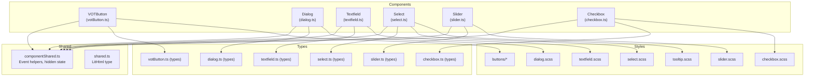
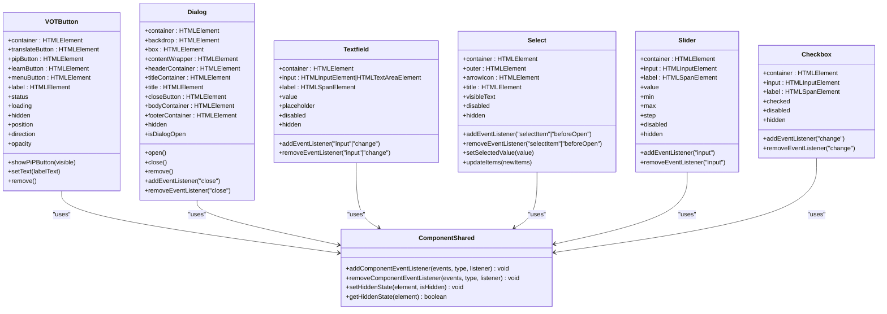
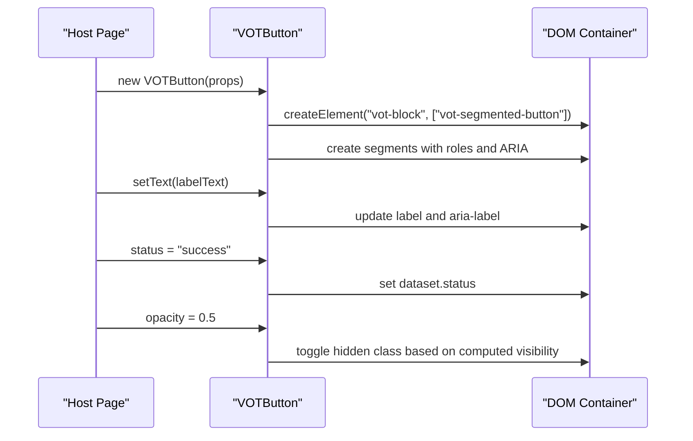
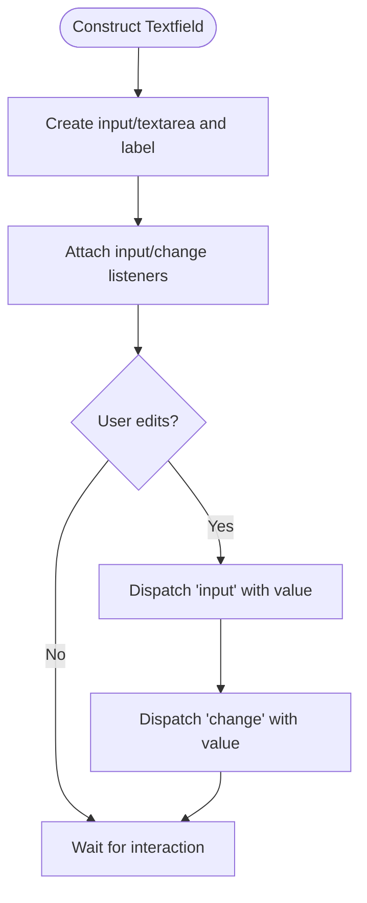
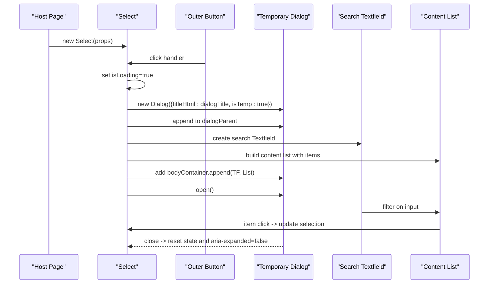
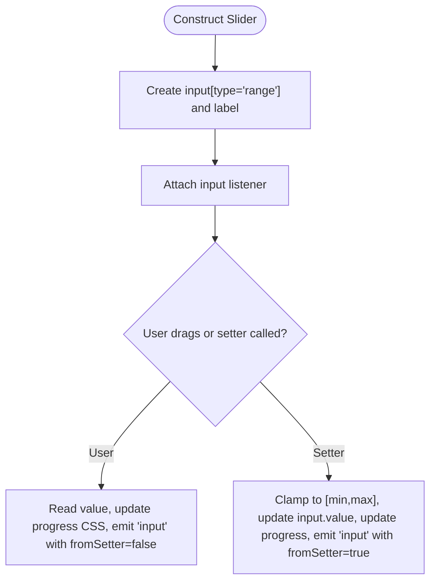
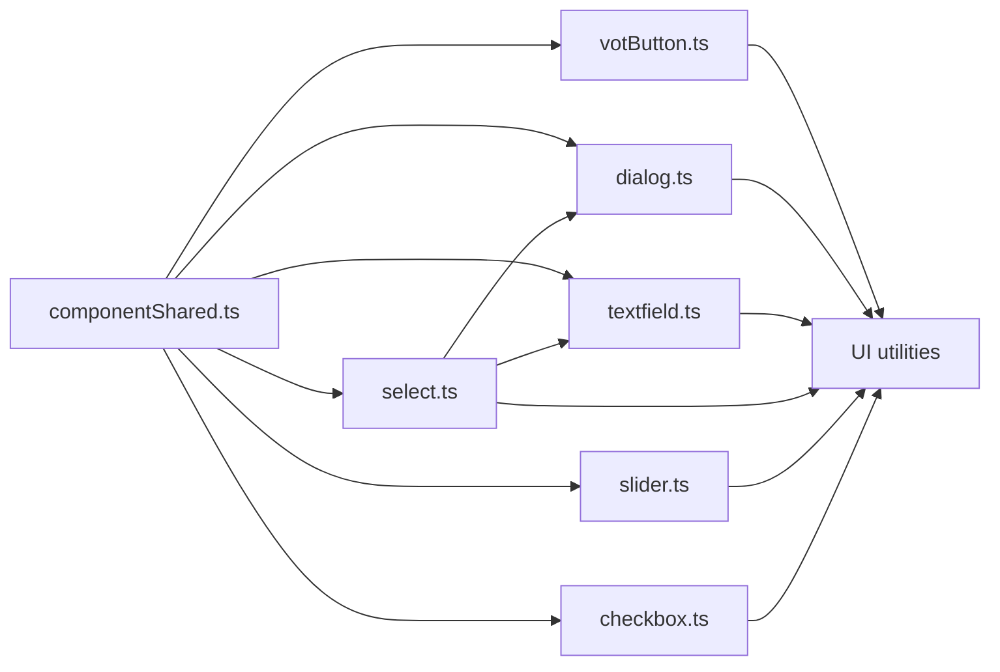

# Component Library

<cite>
**Referenced Files in This Document**
- [componentShared.ts](file://src/ui/components/componentShared.ts)
- [shared.ts](file://src/types/components/shared.ts)
- [votButton.ts](file://src/ui/components/votButton.ts)
- [votButton.ts (types)](file://src/types/components/votButton.ts)
- [dialog.ts](file://src/ui/components/dialog.ts)
- [dialog.ts (types)](file://src/types/components/dialog.ts)
- [textfield.ts](file://src/ui/components/textfield.ts)
- [textfield.ts (types)](file://src/types/components/textfield.ts)
- [select.ts](file://src/ui/components/select.ts)
- [select.ts (types)](file://src/types/components/select.ts)
- [slider.ts](file://src/ui/components/slider.ts)
- [slider.ts (types)](file://src/types/components/slider.ts)
- [checkbox.ts](file://src/ui/components/checkbox.ts)
- [checkbox.ts (types)](file://src/types/components/checkbox.ts)
- [buttons mixins](file://src/styles/components/buttons/_mixins.scss)
- [contained button](file://src/styles/components/buttons/contained.scss)
- [outlined button](file://src/styles/components/buttons/outlined.scss)
- [text button](file://src/styles/components/buttons/text.scss)
- [icon button](file://src/styles/components/buttons/icon.scss)
- [hotkey button](file://src/styles/components/buttons/hotkey.scss)
- [checkbox styles](file://src/styles/components/checkbox.scss)
- [dialog styles](file://src/styles/components/dialog.scss)
- [select styles](file://src/styles/components/select.scss)
- [slider styles](file://src/styles/components/slider.scss)
- [textfield styles](file://src/styles/components/textfield.scss)
- [tooltip styles](file://src/styles/components/tooltip.scss)
</cite>

## Table of Contents
1. [Introduction](#introduction)
2. [Project Structure](#project-structure)
3. [Core Components](#core-components)
4. [Architecture Overview](#architecture-overview)
5. [Detailed Component Analysis](#detailed-component-analysis)
6. [Dependency Analysis](#dependency-analysis)
7. [Performance Considerations](#performance-considerations)
8. [Accessibility and Keyboard Navigation](#accessibility-and-keyboard-navigation)
9. [Styling and Theming](#styling-and-theming)
10. [Responsive Design](#responsive-design)
11. [Cross-Browser Compatibility](#cross-browser-compatibility)
12. [Testing and Debugging](#testing-and-debugging)
13. [Practical Examples and Composition Patterns](#practical-examples-and-composition-patterns)
14. [Conclusion](#conclusion)

## Introduction
This document describes the reusable UI component library used across the application. It covers the component architecture, shared utilities, base classes, and common patterns. It documents each component type (VOTButton, Dialog, Textfield, Select, Slider, Checkbox, and related form controls), their props, events, styling options, lifecycle, state management, and accessibility features. It also provides guidance on theming, responsive design, cross-browser compatibility, testing, and debugging.

## Project Structure
The component library is organized under src/ui/components with TypeScript source files and corresponding SCSS styles under src/styles/components. Shared utilities and event handling are centralized in componentShared.ts. Type definitions for component props live under src/types/components.



**Diagram sources**
- [votButton.ts:1-225](file://src/ui/components/votButton.ts#L1-L225)
- [dialog.ts:1-382](file://src/ui/components/dialog.ts#L1-L382)
- [textfield.ts:1-134](file://src/ui/components/textfield.ts#L1-L134)
- [select.ts:1-403](file://src/ui/components/select.ts#L1-L403)
- [slider.ts:1-171](file://src/ui/components/slider.ts#L1-L171)
- [checkbox.ts:1-114](file://src/ui/components/checkbox.ts#L1-L114)
- [componentShared.ts:1-39](file://src/ui/components/componentShared.ts#L1-L39)
- [shared.ts:1-4](file://src/types/components/shared.ts#L1-L4)
- [votButton.ts (types):1-15](file://src/types/components/votButton.ts#L1-L15)
- [dialog.ts (types):1-8](file://src/types/components/dialog.ts#L1-L8)
- [textfield.ts (types):1-7](file://src/types/components/textfield.ts#L1-L7)
- [select.ts (types):1-32](file://src/types/components/select.ts#L1-L32)
- [slider.ts (types):1-10](file://src/types/components/slider.ts#L1-L10)
- [checkbox.ts (types):1-8](file://src/types/components/checkbox.ts#L1-L8)

**Section sources**
- [votButton.ts:1-225](file://src/ui/components/votButton.ts#L1-L225)
- [dialog.ts:1-382](file://src/ui/components/dialog.ts#L1-L382)
- [textfield.ts:1-134](file://src/ui/components/textfield.ts#L1-L134)
- [select.ts:1-403](file://src/ui/components/select.ts#L1-L403)
- [slider.ts:1-171](file://src/ui/components/slider.ts#L1-L171)
- [checkbox.ts:1-114](file://src/ui/components/checkbox.ts#L1-L114)
- [componentShared.ts:1-39](file://src/ui/components/componentShared.ts#L1-L39)
- [shared.ts:1-4](file://src/types/components/shared.ts#L1-L4)

## Core Components
This section introduces the shared foundation used by all components:
- Event helpers: addComponentEventListener and removeComponentEventListener wrap a central event system for consistent event handling across components.
- Hidden state helpers: setHiddenState and getHiddenState manage element hidden state consistently, toggling the hidden property and applying a CSS class to prevent host page overrides.

These utilities ensure uniform event subscription/unsubscription and visibility behavior across all components.

**Section sources**
- [componentShared.ts:1-39](file://src/ui/components/componentShared.ts#L1-L39)

## Architecture Overview
The component architecture follows a consistent pattern:
- Each component encapsulates its DOM structure and state.
- Props are provided via constructor options typed by dedicated interfaces.
- Events are emitted using a central EventImpl system, with convenience add/remove methods.
- Accessibility attributes and roles are set during element creation.
- Visibility is controlled via a shared helper that toggles both the hidden property and a CSS class.



**Diagram sources**
- [componentShared.ts:1-39](file://src/ui/components/componentShared.ts#L1-L39)
- [votButton.ts:1-225](file://src/ui/components/votButton.ts#L1-L225)
- [dialog.ts:1-382](file://src/ui/components/dialog.ts#L1-L382)
- [textfield.ts:1-134](file://src/ui/components/textfield.ts#L1-L134)
- [select.ts:1-403](file://src/ui/components/select.ts#L1-L403)
- [slider.ts:1-171](file://src/ui/components/slider.ts#L1-L171)
- [checkbox.ts:1-114](file://src/ui/components/checkbox.ts#L1-L114)

## Detailed Component Analysis

### VOTButton
- Purpose: Composite button group with multiple segments (translate, picture-in-picture, learn, menu).
- Props: position, direction, status, labelHtml.
- Events: None exposed; interacts with host via dataset attributes and DOM structure.
- Lifecycle: Constructed, elements created, appended to container. Exposes setters for status, loading, hidden, position, direction, opacity.
- State management: Maintains internal state for position, direction, status, label text, and opacity. Uses dataset attributes for CSS-driven styling and behavior.
- Accessibility: Segments are role="button" with tabIndex and aria-label. Supports dynamic label updates.
- Styling: Uses CSS classes for layout and theme variants; opacity toggled via a hidden class to prevent host overrides.



**Diagram sources**
- [votButton.ts:1-225](file://src/ui/components/votButton.ts#L1-L225)
- [votButton.ts (types):1-15](file://src/types/components/votButton.ts#L1-L15)

**Section sources**
- [votButton.ts:1-225](file://src/ui/components/votButton.ts#L1-L225)
- [votButton.ts (types):1-15](file://src/types/components/votButton.ts#L1-L15)

### Dialog
- Purpose: Modal dialog with header, body, and optional footer; supports temporary dialogs.
- Props: titleHtml, isTemp.
- Events: "close" dispatched on close/remove.
- Lifecycle: open() focuses first focusable element, attaches keydown trap and adaptive vertical align observers; close() hides and restores focus; remove() detaches observers and cleans up.
- State management: Tracks previously focused element, keydown listener, ResizeObserver/visualViewport observers, and vertical alignment state.
- Accessibility: Implements ARIA dialog pattern with role="dialog", aria-modal, aria-labelledby, inert when hidden, Escape handling, and focus trapping.

```mermaid
sequenceDiagram
participant Host as "Host Page"
participant Dlg as "Dialog"
participant Box as "Dialog Box"
participant Focus as "Focus Management"
Host->>Dlg : new Dialog({titleHtml, isTemp})
Host->>Dlg : open()
Dlg->>Box : set aria-modal=true, tabindex=-1
Dlg->>Focus : attach keydown trap and focusFirst()
Note over Dlg,Box : Adaptive vertical align attached
Host->>Dlg : close()
Dlg->>Focus : detach traps and restore focus
Dlg-->>Host : dispatch "close"
Host->>Dlg : remove()
Dlg->>Box : set aria-hidden=true, inert=true
```

**Diagram sources**
- [dialog.ts:1-382](file://src/ui/components/dialog.ts#L1-L382)
- [dialog.ts (types):1-8](file://src/types/components/dialog.ts#L1-L8)

**Section sources**
- [dialog.ts:1-382](file://src/ui/components/dialog.ts#L1-L382)
- [dialog.ts (types):1-8](file://src/types/components/dialog.ts#L1-L8)

### Textfield
- Purpose: Single-line or multi-line text input with label and placeholder.
- Props: labelHtml, placeholder, value, multiline.
- Events: "input" and "change" emit current value.
- Lifecycle: Creates input element (input or textarea), wires input/change listeners, exposes getters/setters for value, placeholder, disabled, and hidden.
- State management: Tracks internal value and synchronizes with the input element. Emits events on user interaction or programmatic changes.
- Accessibility: Standard input semantics; label is associated visually.



**Diagram sources**
- [textfield.ts:1-134](file://src/ui/components/textfield.ts#L1-L134)
- [textfield.ts (types):1-7](file://src/types/components/textfield.ts#L1-L7)

**Section sources**
- [textfield.ts:1-134](file://src/ui/components/textfield.ts#L1-L134)
- [textfield.ts (types):1-7](file://src/types/components/textfield.ts#L1-L7)

### Select
- Purpose: Dropdown-like selection using a dialog; supports single and multi-select modes.
- Props: selectTitle, dialogTitle, items, labelElement, dialogParent, multiSelect.
- Events: "selectItem" emits selected value(s); "beforeOpen" emits the temporary dialog instance for customization.
- Lifecycle: On click, creates a temporary Dialog, adds a search Textfield, builds a content list, wires item click handlers, and manages selection state.
- State management: Maintains selectedValues as a Set, syncs item selection states, updates visible text, and handles item updates.
- Accessibility: Uses ARIA button-like semantics with aria-haspopup and aria-expanded; integrates Dialog focus management.



**Diagram sources**
- [select.ts:1-403](file://src/ui/components/select.ts#L1-L403)
- [select.ts (types):1-32](file://src/types/components/select.ts#L1-L32)
- [dialog.ts:1-382](file://src/ui/components/dialog.ts#L1-L382)
- [textfield.ts:1-134](file://src/ui/components/textfield.ts#L1-L134)

**Section sources**
- [select.ts:1-403](file://src/ui/components/select.ts#L1-L403)
- [select.ts (types):1-32](file://src/types/components/select.ts#L1-L32)

### Slider
- Purpose: Range input with label and progress visualization.
- Props: labelHtml (accepts string/HTMLElement/Lit TemplateResult), value, min, max, step.
- Events: "input" emits [value, fromSetter] where fromSetter indicates programmatic vs user interaction.
- Lifecycle: Creates input[type="range"], wires input listener, computes CSS variable for progress fill.
- State management: Clamps values to min/max, updates CSS variable for progress, and emits events.



**Diagram sources**
- [slider.ts:1-171](file://src/ui/components/slider.ts#L1-L171)
- [slider.ts (types):1-10](file://src/types/components/slider.ts#L1-L10)

**Section sources**
- [slider.ts:1-171](file://src/ui/components/slider.ts#L1-L171)
- [slider.ts (types):1-10](file://src/types/components/slider.ts#L1-L10)

### Checkbox
- Purpose: Toggle input with label and optional sub-checkbox variant.
- Props: labelHtml, checked, isSubCheckbox.
- Events: "change" emits boolean checked state.
- Lifecycle: Creates input[type="checkbox"] and label, wires change listener.
- State management: Tracks checked state and emits change events on user interaction or programmatic updates.

**Section sources**
- [checkbox.ts:1-114](file://src/ui/components/checkbox.ts#L1-L114)
- [checkbox.ts (types):1-8](file://src/types/components/checkbox.ts#L1-L8)

## Dependency Analysis
- ComponentShared is a shared utility used by all components for event handling and hidden state.
- Select depends on Dialog and Textfield to implement its dropdown behavior.
- VOTButton uses UI utilities for element creation and icon rendering.
- All components rely on CSS classes defined under src/styles/components for styling and theming.



**Diagram sources**
- [componentShared.ts:1-39](file://src/ui/components/componentShared.ts#L1-L39)
- [votButton.ts:1-225](file://src/ui/components/votButton.ts#L1-L225)
- [dialog.ts:1-382](file://src/ui/components/dialog.ts#L1-L382)
- [textfield.ts:1-134](file://src/ui/components/textfield.ts#L1-L134)
- [select.ts:1-403](file://src/ui/components/select.ts#L1-L403)
- [slider.ts:1-171](file://src/ui/components/slider.ts#L1-L171)
- [checkbox.ts:1-114](file://src/ui/components/checkbox.ts#L1-L114)

**Section sources**
- [componentShared.ts:1-39](file://src/ui/components/componentShared.ts#L1-L39)
- [select.ts:1-403](file://src/ui/components/select.ts#L1-L403)

## Performance Considerations
- Event handling: Use addComponentEventListener/removeComponentEventListener to minimize memory leaks and ensure cleanup.
- Dialog adaptive alignment: Uses requestAnimationFrame and ResizeObserver to avoid layout thrashing; disconnect observers on removal.
- Slider progress: Updates a single CSS variable on input to drive visual progress without heavy recalculations.
- Hidden state: Toggle a CSS class alongside the hidden property to prevent host page overrides and reduce style recalculation.

[No sources needed since this section provides general guidance]

## Accessibility and Keyboard Navigation
- Dialog:
  - Role "dialog", aria-modal, aria-labelledby, inert when hidden.
  - Focus trapped with Tab/Shift+Tab handling; Escape closes.
  - Adaptive vertical alignment for long content.
- VOTButton:
  - Segments have role="button", tabIndex=0, and aria-label.
- Select:
  - Outer element behaves like a button with aria-haspopup and aria-expanded.
- Textfield/Slider/Checkbox:
  - Native input semantics; labels associated visually.

**Section sources**
- [dialog.ts:1-382](file://src/ui/components/dialog.ts#L1-L382)
- [votButton.ts:1-225](file://src/ui/components/votButton.ts#L1-L225)
- [select.ts:1-403](file://src/ui/components/select.ts#L1-L403)
- [textfield.ts:1-134](file://src/ui/components/textfield.ts#L1-L134)
- [slider.ts:1-171](file://src/ui/components/slider.ts#L1-L171)
- [checkbox.ts:1-114](file://src/ui/components/checkbox.ts#L1-L114)

## Styling and Theming
- Buttons:
  - Mixins and variants: contained, outlined, text, icon, hotkey.
- Form controls:
  - Checkbox, dialog, select, slider, textfield, tooltip styles.
- Theming approach:
  - Components apply CSS classes and use CSS custom properties for dynamic values (e.g., slider progress).
  - Hidden state toggles a class to prevent host overrides.

**Section sources**
- [buttons mixins](file://src/styles/components/buttons/_mixins.scss)
- [contained button](file://src/styles/components/buttons/contained.scss)
- [outlined button](file://src/styles/components/buttons/outlined.scss)
- [text button](file://src/styles/components/buttons/text.scss)
- [icon button](file://src/styles/components/buttons/icon.scss)
- [hotkey button](file://src/styles/components/buttons/hotkey.scss)
- [checkbox styles](file://src/styles/components/checkbox.scss)
- [dialog styles](file://src/styles/components/dialog.scss)
- [select styles](file://src/styles/components/select.scss)
- [slider styles](file://src/styles/components/slider.scss)
- [textfield styles](file://src/styles/components/textfield.scss)
- [tooltip styles](file://src/styles/components/tooltip.scss)

## Responsive Design
- Dialog:
  - Adaptive vertical alignment switches between center and top modes based on content height and viewport constraints.
  - Uses CSS custom properties for max-height thresholds.
- Slider:
  - Progress fill is computed via CSS variable; layout remains responsive.
- Select:
  - Dialog-based list with search; content area adapts to viewport.

**Section sources**
- [dialog.ts:191-290](file://src/ui/components/dialog.ts#L191-L290)
- [slider.ts:42-56](file://src/ui/components/slider.ts#L42-L56)

## Cross-Browser Compatibility
- Uses modern APIs where available (ResizeObserver, visualViewport, crypto.randomUUID). Includes fallbacks and guards for environments where these are absent.
- Event handling leverages standard DOM events and bubbling to ensure broad compatibility.

**Section sources**
- [dialog.ts:198-245](file://src/ui/components/dialog.ts#L198-L245)
- [dialog.ts:40-44](file://src/ui/components/dialog.ts#L40-L44)

## Testing and Debugging
- Event testing:
  - Subscribe to component events using addEventListener/removeEventListener and assert emission in tests.
- Visibility testing:
  - Verify hidden state via getHiddenState and CSS class toggling.
- Dialog-specific:
  - Test focus trapping, Escape handling, and adaptive alignment by measuring DOM attributes and CSS variables.
- Debugging tips:
  - Inspect dataset attributes (e.g., status, loading, vertical-align) to verify component state.
  - Use browser devtools to observe CSS custom properties and classes applied by components.

**Section sources**
- [componentShared.ts:27-39](file://src/ui/components/componentShared.ts#L27-L39)
- [dialog.ts:145-155](file://src/ui/components/dialog.ts#L145-L155)
- [dialog.ts:368-376](file://src/ui/components/dialog.ts#L368-L376)

## Practical Examples and Composition Patterns
- Composing VOTButton with Dialog:
  - Use VOTButton to trigger actions; open a Dialog for detailed configuration and close it to restore focus.
- Select with Search:
  - Use Select to present a large list; leverage the integrated search Textfield to filter items dynamically.
- Slider with Label:
  - Bind Slider to a label that reflects current value; use the fromSetter flag to differentiate programmatic updates.
- Checkbox Groups:
  - Use multiple Checkbox components to represent grouped options; manage selection state externally and reflect via component props.

[No sources needed since this section doesn't analyze specific files]

## Conclusion
The component library provides a cohesive, accessible, and extensible foundation for building UIs. Components share common patterns for events, visibility, and accessibility while offering flexible styling and theming. By following the documented props, events, and lifecycle patterns, developers can compose robust interfaces that are responsive, accessible, and maintainable.