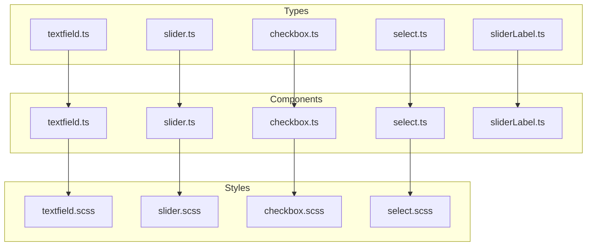
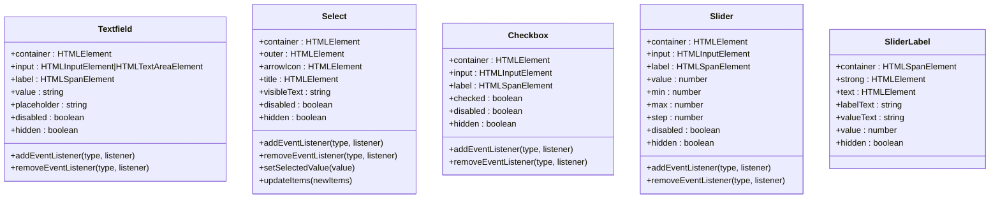
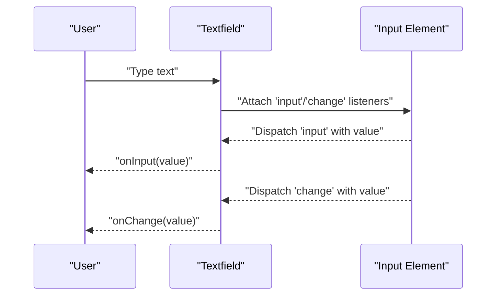
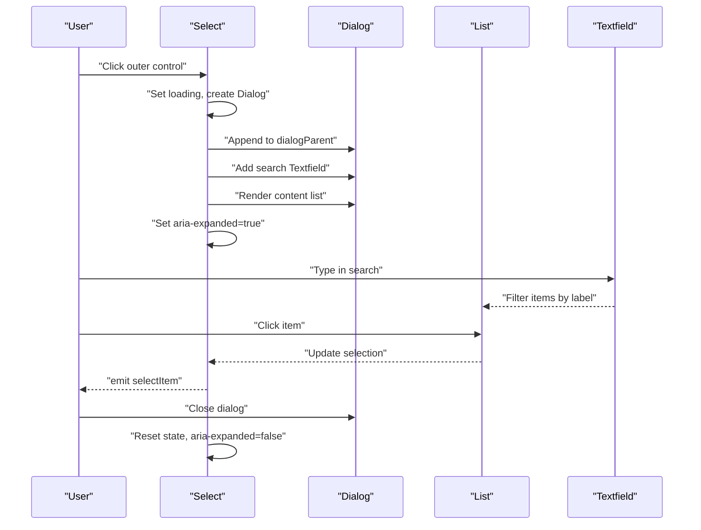
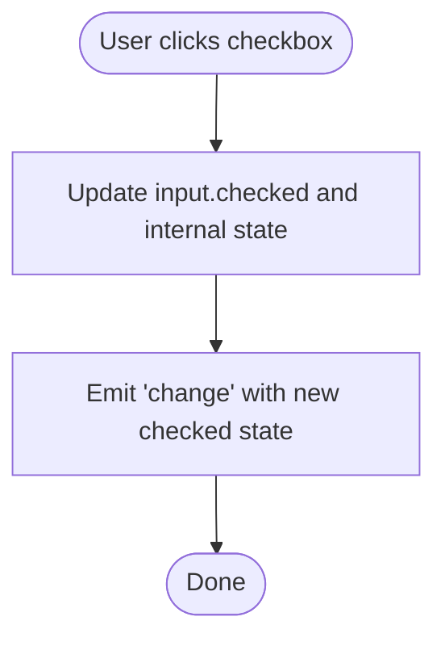
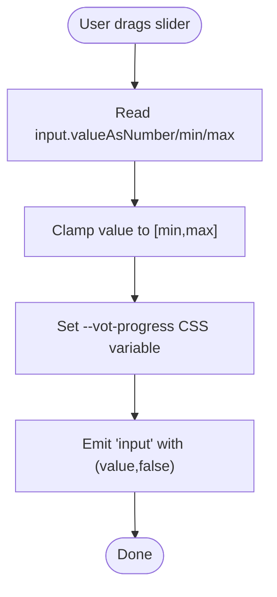
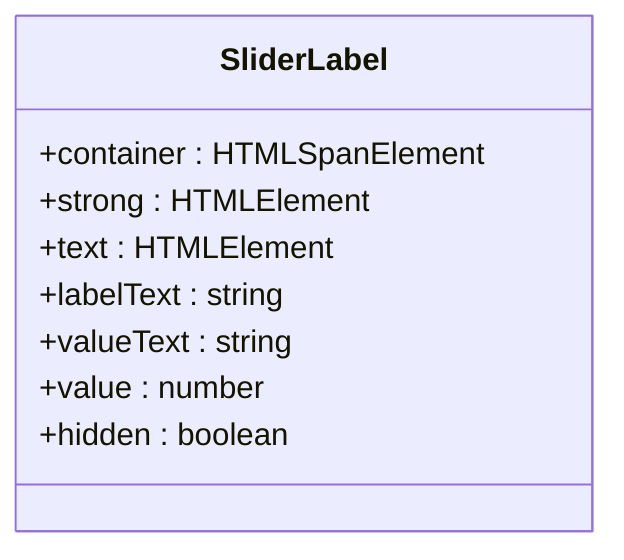
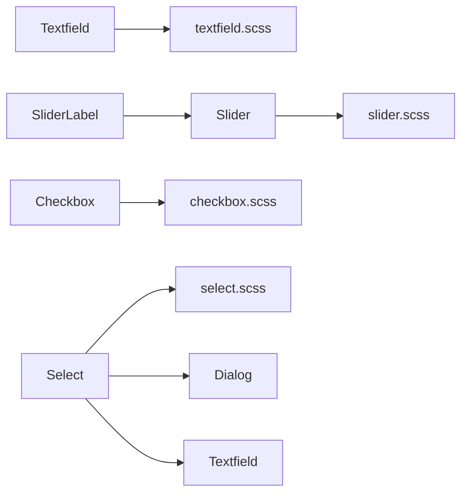
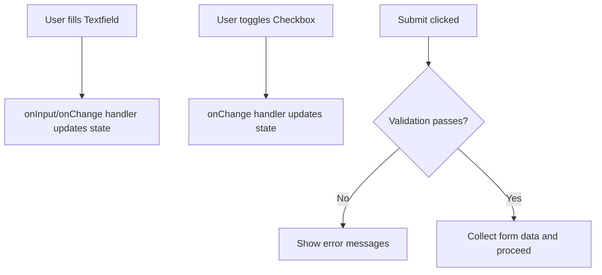
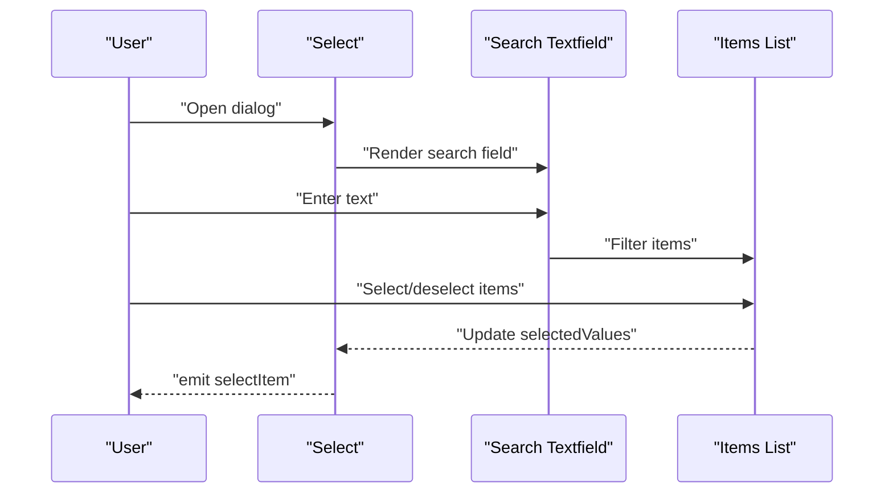

# Form Components

<cite>
**Referenced Files in This Document**
- [src/types/components/textfield.ts](file://src/types/components/textfield.ts)
- [src/types/components/select.ts](file://src/types/components/select.ts)
- [src/types/components/checkbox.ts](file://src/types/components/checkbox.ts)
- [src/types/components/slider.ts](file://src/types/components/slider.ts)
- [src/types/components/sliderLabel.ts](file://src/types/components/sliderLabel.ts)
- [src/ui/components/textfield.ts](file://src/ui/components/textfield.ts)
- [src/ui/components/select.ts](file://src/ui/components/select.ts)
- [src/ui/components/checkbox.ts](file://src/ui/components/checkbox.ts)
- [src/ui/components/slider.ts](file://src/ui/components/slider.ts)
- [src/ui/components/sliderLabel.ts](file://src/ui/components/sliderLabel.ts)
- [src/styles/components/textfield.scss](file://src/styles/components/textfield.scss)
- [src/styles/components/select.scss](file://src/styles/components/select.scss)
- [src/styles/components/checkbox.scss](file://src/styles/components/checkbox.scss)
- [src/styles/components/slider.scss](file://src/styles/components/slider.scss)
</cite>

## Table of Contents
1. [Introduction](#introduction)
2. [Project Structure](#project-structure)
3. [Core Components](#core-components)
4. [Architecture Overview](#architecture-overview)
5. [Detailed Component Analysis](#detailed-component-analysis)
6. [Dependency Analysis](#dependency-analysis)
7. [Performance Considerations](#performance-considerations)
8. [Troubleshooting Guide](#troubleshooting-guide)
9. [Conclusion](#conclusion)
10. [Appendices](#appendices)

## Introduction
This document describes the form input components Textfield, Select, Checkbox, Slider, and SliderLabel. It covers component props, value binding, validation states, placeholder text, change handlers, form integration patterns, data binding approaches, validation mechanisms, styling with SCSS, accessibility features (ARIA attributes, keyboard navigation, screen reader support), component states (enabled/disabled, focused, error), custom styling options, and responsive behavior. It also provides examples of composing forms, validation workflows, and integration with the broader UI system.

## Project Structure
The form components are implemented as TypeScript classes with associated SCSS styles. Each component exposes a consistent API for value binding, event handling, and visibility control. The styles define theme-aware, accessible, and responsive layouts.

**Diagram sources**
- [src/types/components/textfield.ts:1-7](file://src/types/components/textfield.ts#L1-L7)
- [src/types/components/slider.ts:1-10](file://src/types/components/slider.ts#L1-L10)
- [src/types/components/checkbox.ts:1-8](file://src/types/components/checkbox.ts#L1-L8)
- [src/types/components/select.ts:1-32](file://src/types/components/select.ts#L1-L32)
- [src/types/components/sliderLabel.ts:1-7](file://src/types/components/sliderLabel.ts#L1-L7)
- [src/ui/components/textfield.ts:1-134](file://src/ui/components/textfield.ts#L1-L134)
- [src/ui/components/slider.ts:1-171](file://src/ui/components/slider.ts#L1-L171)
- [src/ui/components/checkbox.ts:1-114](file://src/ui/components/checkbox.ts#L1-L114)
- [src/ui/components/select.ts:1-403](file://src/ui/components/select.ts#L1-L403)
- [src/ui/components/sliderLabel.ts:1-80](file://src/ui/components/sliderLabel.ts#L1-L80)
- [src/styles/components/textfield.scss:1-224](file://src/styles/components/textfield.scss#L1-L224)
- [src/styles/components/slider.scss:1-184](file://src/styles/components/slider.scss#L1-L184)
- [src/styles/components/checkbox.scss:1-190](file://src/styles/components/checkbox.scss#L1-L190)
- [src/styles/components/select.scss:1-103](file://src/styles/components/select.scss#L1-L103)

**Section sources**
- [src/types/components/textfield.ts:1-7](file://src/types/components/textfield.ts#L1-L7)
- [src/types/components/slider.ts:1-10](file://src/types/components/slider.ts#L1-L10)
- [src/types/components/checkbox.ts:1-8](file://src/types/components/checkbox.ts#L1-L8)
- [src/types/components/select.ts:1-32](file://src/types/components/select.ts#L1-L32)
- [src/types/components/sliderLabel.ts:1-7](file://src/types/components/sliderLabel.ts#L1-L7)
- [src/ui/components/textfield.ts:1-134](file://src/ui/components/textfield.ts#L1-L134)
- [src/ui/components/slider.ts:1-171](file://src/ui/components/slider.ts#L1-L171)
- [src/ui/components/checkbox.ts:1-114](file://src/ui/components/checkbox.ts#L1-L114)
- [src/ui/components/select.ts:1-403](file://src/ui/components/select.ts#L1-L403)
- [src/ui/components/sliderLabel.ts:1-80](file://src/ui/components/sliderLabel.ts#L1-L80)
- [src/styles/components/textfield.scss:1-224](file://src/styles/components/textfield.scss#L1-L224)
- [src/styles/components/slider.scss:1-184](file://src/styles/components/slider.scss#L1-L184)
- [src/styles/components/checkbox.scss:1-190](file://src/styles/components/checkbox.scss#L1-L190)
- [src/styles/components/select.scss:1-103](file://src/styles/components/select.scss#L1-L103)

## Core Components
This section summarizes the primary form components and their responsibilities.

- Textfield: Single-line or multi-line text input with label, placeholder, value binding, and input/change events.
- Select: Dropdown-like control backed by a dialog; supports single or multi-select modes, search filtering, and selection synchronization.
- Checkbox: Two-state toggle with optional nested sub-checkboxes and change events.
- Slider: Range input with live updates and a visual progress indicator; integrates with SliderLabel for contextual labeling.
- SliderLabel: Lightweight label/value pair for sliders, supporting custom symbol and end-of-line text.

**Section sources**
- [src/ui/components/textfield.ts:1-134](file://src/ui/components/textfield.ts#L1-L134)
- [src/ui/components/select.ts:1-403](file://src/ui/components/select.ts#L1-L403)
- [src/ui/components/checkbox.ts:1-114](file://src/ui/components/checkbox.ts#L1-L114)
- [src/ui/components/slider.ts:1-171](file://src/ui/components/slider.ts#L1-L171)
- [src/ui/components/sliderLabel.ts:1-80](file://src/ui/components/sliderLabel.ts#L1-L80)

## Architecture Overview
The components follow a consistent pattern:
- Props are passed via strongly typed interfaces.
- DOM elements are created and managed internally.
- Events are exposed via an internal event bus and re-exposed to consumers.
- Visibility is controlled via a shared helper that toggles a hidden state class.
- Styles are theme-aware and scoped to component classes.

**Diagram sources**
- [src/ui/components/textfield.ts:1-134](file://src/ui/components/textfield.ts#L1-L134)
- [src/ui/components/select.ts:1-403](file://src/ui/components/select.ts#L1-L403)
- [src/ui/components/checkbox.ts:1-114](file://src/ui/components/checkbox.ts#L1-L114)
- [src/ui/components/slider.ts:1-171](file://src/ui/components/slider.ts#L1-L171)
- [src/ui/components/sliderLabel.ts:1-80](file://src/ui/components/sliderLabel.ts#L1-L80)

## Detailed Component Analysis

### Textfield
- Purpose: Single-line or multi-line text input with label and placeholder.
- Props:
  - labelHtml: HTMLElement or string for the label content.
  - placeholder?: string for placeholder text.
  - value?: string for initial value.
  - multiline?: boolean to switch to a textarea.
- Events:
  - input: emitted on user input with the current string value.
  - change: emitted on value change with the current string value.
- Binding:
  - value getter/setter updates the underlying input and triggers change when changed.
  - placeholder getter/setter updates the input placeholder.
- States:
  - disabled: mirrors the input disabled state.
  - hidden: toggles a hidden class via a shared helper.
- Accessibility:
  - Uses a span label positioned absolutely for floating label behavior.
  - Placeholder visibility is controlled via classes to avoid visual regressions.
- Styling:
  - SCSS defines theme-aware borders, transitions, hover/focus states, and disabled styles.
  - Special handling for placeholder visibility and Safari-specific text-fill color.

**Diagram sources**
- [src/ui/components/textfield.ts:16-108](file://src/ui/components/textfield.ts#L16-L108)
- [src/styles/components/textfield.scss:28-87](file://src/styles/components/textfield.scss#L28-L87)

**Section sources**
- [src/types/components/textfield.ts:1-7](file://src/types/components/textfield.ts#L1-L7)
- [src/ui/components/textfield.ts:1-134](file://src/ui/components/textfield.ts#L1-L134)
- [src/styles/components/textfield.scss:1-224](file://src/styles/components/textfield.scss#L1-L224)

### Select
- Purpose: Dropdown control backed by a dialog; supports single or multi-select modes.
- Props:
  - selectTitle: displayed title when nothing is selected.
  - dialogTitle: title shown in the dialog.
  - items: array of selectable items with label, value, selected, disabled flags.
  - labelElement?: optional external label element.
  - dialogParent?: DOM parent for the dialog.
  - multiSelect?: boolean to enable multi-select mode.
- Events:
  - selectItem: emitted with the selected value(s); payload differs for single vs multi-select.
  - beforeOpen: emitted with the temporary dialog instance prior to opening.
- Behavior:
  - Clicking the outer control opens a Dialog containing a search Textfield and a list of items.
  - Search filters items by lowercased label text.
  - Selection updates selectedValues and synchronizes item states.
- Binding:
  - setSelectedValue sets selection; supports arrays for multi-select.
  - updateItems replaces the items and rebuilds the dialog list.
  - visibleText computes the display text based on selections.
- States:
  - disabled: reflected via aria attributes and a disabled attribute.
  - hidden: toggles a hidden class via a shared helper.
- Accessibility:
  - Outer element is made button-like with aria-haspopup and aria-expanded.
  - Items use inert to mark disabled entries.
- Styling:
  - SCSS defines layout, hover states, selection indicators, and disabled visuals.

**Diagram sources**
- [src/ui/components/select.ts:180-255](file://src/ui/components/select.ts#L180-L255)
- [src/ui/components/select.ts:153-178](file://src/ui/components/select.ts#L153-L178)
- [src/ui/components/select.ts:222-233](file://src/ui/components/select.ts#L222-L233)
- [src/styles/components/select.scss:26-101](file://src/styles/components/select.scss#L26-L101)

**Section sources**
- [src/types/components/select.ts:1-32](file://src/types/components/select.ts#L1-L32)
- [src/ui/components/select.ts:1-403](file://src/ui/components/select.ts#L1-L403)
- [src/styles/components/select.scss:1-103](file://src/styles/components/select.scss#L1-L103)

### Checkbox
- Purpose: Two-state toggle with optional nested sub-checkboxes.
- Props:
  - labelHtml: LitHtml content for the label.
  - checked?: boolean initial state.
  - isSubCheckbox?: boolean to indent and style as a nested checkbox.
- Events:
  - change: emitted with the new checked state.
- Binding:
  - checked getter/setter updates the input and emits change when changed.
- States:
  - disabled: mirrors the input disabled state.
  - hidden: toggles a hidden class via a shared helper.
- Accessibility:
  - Uses a label wrapper and a styled input with custom pseudo-elements for the checkmark.
  - Focus ring is visible under keyboard navigation mode.

**Diagram sources**
- [src/ui/components/checkbox.ts:43-62](file://src/ui/components/checkbox.ts#L43-L62)
- [src/ui/components/checkbox.ts:105-112](file://src/ui/components/checkbox.ts#L105-L112)
- [src/styles/components/checkbox.scss:178-189](file://src/styles/components/checkbox.scss#L178-L189)

**Section sources**
- [src/types/components/checkbox.ts:1-8](file://src/types/components/checkbox.ts#L1-L8)
- [src/ui/components/checkbox.ts:1-114](file://src/ui/components/checkbox.ts#L1-L114)
- [src/styles/components/checkbox.scss:1-190](file://src/styles/components/checkbox.scss#L1-L190)

### Slider
- Purpose: Range input with live updates and visual progress indicator.
- Props:
  - labelHtml: LitHtml content for the label.
  - value?: number initial value.
  - min?: number minimum value.
  - max?: number maximum value.
  - step?: number step size.
- Events:
  - input: emitted with (value, fromSetter) where fromSetter indicates programmatic updates.
- Binding:
  - value setter clamps the value to [min, max], updates the input, recalculates progress, and emits input with fromSetter=true.
  - min/max/step setters update the input attributes and recalculate progress.
- States:
  - disabled: mirrors the input disabled state.
  - hidden: toggles a hidden class via a shared helper.
- Styling:
  - SCSS defines track fill, thumb styling, disabled visuals, and keyboard focus indicators.
  - Progress is driven by a CSS custom property.

**Diagram sources**
- [src/ui/components/slider.ts:50-56](file://src/ui/components/slider.ts#L50-L56)
- [src/ui/components/slider.ts:108-114](file://src/ui/components/slider.ts#L108-L114)
- [src/styles/components/slider.scss:72-81](file://src/styles/components/slider.scss#L72-L81)

**Section sources**
- [src/types/components/slider.ts:1-10](file://src/types/components/slider.ts#L1-L10)
- [src/ui/components/slider.ts:1-171](file://src/ui/components/slider.ts#L1-L171)
- [src/styles/components/slider.scss:1-184](file://src/styles/components/slider.scss#L1-L184)

### SliderLabel
- Purpose: Lightweight label/value pair for sliders, often used alongside Slider.
- Props:
  - labelText: string for the label text.
  - labelEOL?: string appended to the label text.
  - value?: number current value.
  - symbol?: string suffix for the value (e.g., %).
- Binding:
  - value setter updates the value span’s text content.
- States:
  - hidden: toggles a hidden class via a shared helper.
- Styling:
  - SCSS defines inline-flex layout, spacing, and typography for the label/value pair.

**Diagram sources**
- [src/ui/components/sliderLabel.ts:1-80](file://src/ui/components/sliderLabel.ts#L1-L80)
- [src/types/components/sliderLabel.ts:1-7](file://src/types/components/sliderLabel.ts#L1-L7)

**Section sources**
- [src/types/components/sliderLabel.ts:1-7](file://src/types/components/sliderLabel.ts#L1-L7)
- [src/ui/components/sliderLabel.ts:1-80](file://src/ui/components/sliderLabel.ts#L1-L80)

## Dependency Analysis
- Component-to-type dependencies:
  - Each component consumes its corresponding props type interface.
- Component-to-component dependencies:
  - Select composes Dialog and Textfield for its dropdown UI.
  - SliderLabel is commonly used with Slider.
- Styling dependencies:
  - Each component’s styles are defined in dedicated SCSS files and rely on theme variables.

**Diagram sources**
- [src/ui/components/select.ts:19-20](file://src/ui/components/select.ts#L19-L20)
- [src/styles/components/textfield.scss:1-224](file://src/styles/components/textfield.scss#L1-L224)
- [src/styles/components/slider.scss:1-184](file://src/styles/components/slider.scss#L1-L184)
- [src/styles/components/checkbox.scss:1-190](file://src/styles/components/checkbox.scss#L1-L190)
- [src/styles/components/select.scss:1-103](file://src/styles/components/select.scss#L1-L103)

**Section sources**
- [src/ui/components/select.ts:1-403](file://src/ui/components/select.ts#L1-L403)

## Performance Considerations
- Event handling:
  - Textfield and Slider emit events on user interaction; avoid heavy work in listeners to keep UI responsive.
  - Select filters items on each keystroke; keep item counts reasonable or consider debouncing.
- Styling:
  - CSS custom properties drive progress and theme colors; minimal JS updates reduce layout thrash.
- Rendering:
  - Checkbox and Slider use lit-html for label rendering; reuse label content to minimize DOM churn.

## Troubleshooting Guide
- Placeholder not visible:
  - Ensure the input is not focused and not showing a placeholder; the component adds helper classes to manage placeholder visibility.
- Slider value out of range:
  - Setting value outside [min,max] is clamped; verify min/max values and ensure numeric inputs.
- Select disabled state:
  - Disabled state is reflected via attributes; confirm the outer element’s disabled attribute and aria attributes.
- Checkbox focus ring:
  - Focus ring appears only under keyboard navigation mode; ensure the global keyboard navigation class is toggled appropriately.

**Section sources**
- [src/ui/components/textfield.ts:118-124](file://src/ui/components/textfield.ts#L118-L124)
- [src/ui/components/slider.ts:108-114](file://src/ui/components/slider.ts#L108-L114)
- [src/ui/components/select.ts:387-401](file://src/ui/components/select.ts#L387-L401)
- [src/styles/components/checkbox.scss:178-189](file://src/styles/components/checkbox.scss#L178-L189)

## Conclusion
The form components provide a cohesive, accessible, and theme-aware input system. They expose clear APIs for value binding, event handling, and state management while leveraging SCSS for consistent styling and responsive behavior. Integration with the broader UI system is straightforward, especially for Select’s dialog composition and SliderLabel’s pairing with Slider.

## Appendices

### Props Reference
- Textfield
  - labelHtml: HTMLElement | string
  - placeholder?: string
  - value?: string
  - multiline?: boolean
- Select
  - selectTitle: string
  - dialogTitle: string
  - items: array of items with label, value, selected?, disabled?
  - labelElement?: HTMLElement | string
  - dialogParent?: HTMLElement
  - multiSelect?: boolean
- Checkbox
  - labelHtml: LitHtml
  - checked?: boolean
  - isSubCheckbox?: boolean
- Slider
  - labelHtml: LitHtml
  - value?: number
  - min?: number
  - max?: number
  - step?: number
- SliderLabel
  - labelText: string
  - labelEOL?: string
  - value?: number
  - symbol?: string

**Section sources**
- [src/types/components/textfield.ts:1-7](file://src/types/components/textfield.ts#L1-L7)
- [src/types/components/select.ts:1-32](file://src/types/components/select.ts#L1-L32)
- [src/types/components/checkbox.ts:1-8](file://src/types/components/checkbox.ts#L1-L8)
- [src/types/components/slider.ts:1-10](file://src/types/components/slider.ts#L1-L10)
- [src/types/components/sliderLabel.ts:1-7](file://src/types/components/sliderLabel.ts#L1-L7)

### Accessibility Features
- ARIA:
  - Select outer element has aria-haspopup and aria-expanded attributes updated on open/close.
- Keyboard:
  - Checkbox shows focus ring under keyboard navigation mode.
  - Slider shows explicit focus indicators for keyboard users.
- Screen reader:
  - Floating label semantics are preserved via span placement and placeholder classes.

**Section sources**
- [src/ui/components/select.ts:190-194](file://src/ui/components/select.ts#L190-L194)
- [src/styles/components/checkbox.scss:178-189](file://src/styles/components/checkbox.scss#L178-L189)
- [src/styles/components/slider.scss:169-182](file://src/styles/components/slider.scss#L169-L182)

### Validation Mechanisms
- Built-in validation:
  - Slider clamps values to [min,max]; setting invalid values will adjust to nearest boundary.
  - Textfield does not enforce length or format; apply custom validation in event handlers.
  - Select items can be marked disabled to prevent selection.
- Recommended patterns:
  - Use change/input events to validate and update UI state.
  - For complex forms, maintain a validation state object keyed by field names and reflect error states via CSS classes or messages.

**Section sources**
- [src/ui/components/slider.ts:166-170](file://src/ui/components/slider.ts#L166-L170)
- [src/ui/components/select.ts:165-167](file://src/ui/components/select.ts#L165-L167)

### Styling System and Customization
- Theme variables:
  - Components rely on theme variables for colors and typography; override them globally to customize appearance.
- SCSS structure:
  - Each component has a dedicated SCSS file defining layout, states, and transitions.
- Customization tips:
  - Adjust component classes to target specific variants.
  - Use CSS custom properties for dynamic values (e.g., Slider progress).

**Section sources**
- [src/styles/components/textfield.scss:1-224](file://src/styles/components/textfield.scss#L1-L224)
- [src/styles/components/select.scss:1-103](file://src/styles/components/select.scss#L1-L103)
- [src/styles/components/checkbox.scss:1-190](file://src/styles/components/checkbox.scss#L1-L190)
- [src/styles/components/slider.scss:1-184](file://src/styles/components/slider.scss#L1-L184)

### Example Workflows

#### Composing a Form with Textfield and Checkbox
- Bind value and change handlers to Textfield and Checkbox.
- On submit, collect values and run validation; update UI feedback accordingly.

#### Select with Search and Multi-Select
- Initialize Select with items and multiSelect enabled.
- Use the search Textfield to filter items; handle selectItem to update selections.

**Diagram sources**
- [src/ui/components/select.ts:222-233](file://src/ui/components/select.ts#L222-L233)
- [src/ui/components/select.ts:113-145](file://src/ui/components/select.ts#L113-L145)