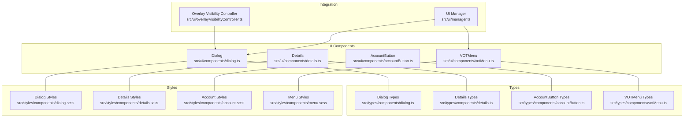
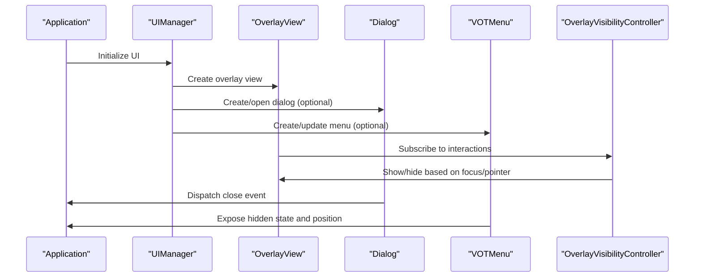
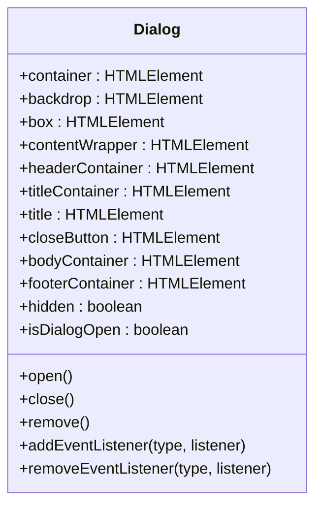
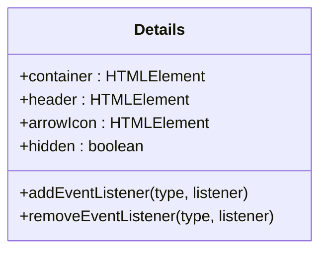
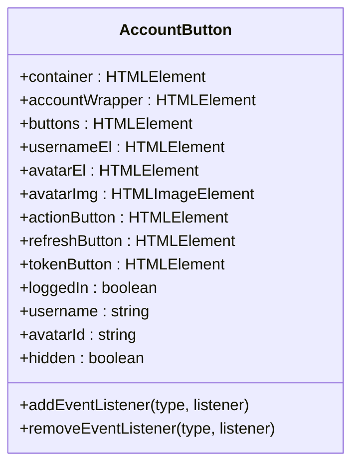
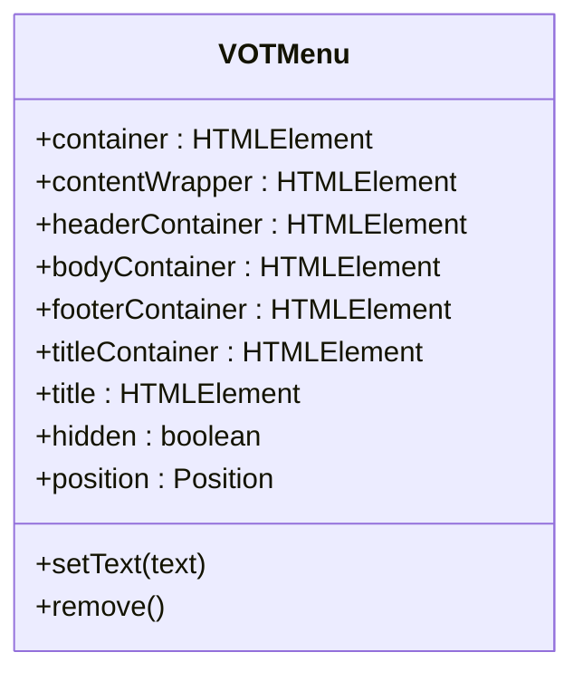
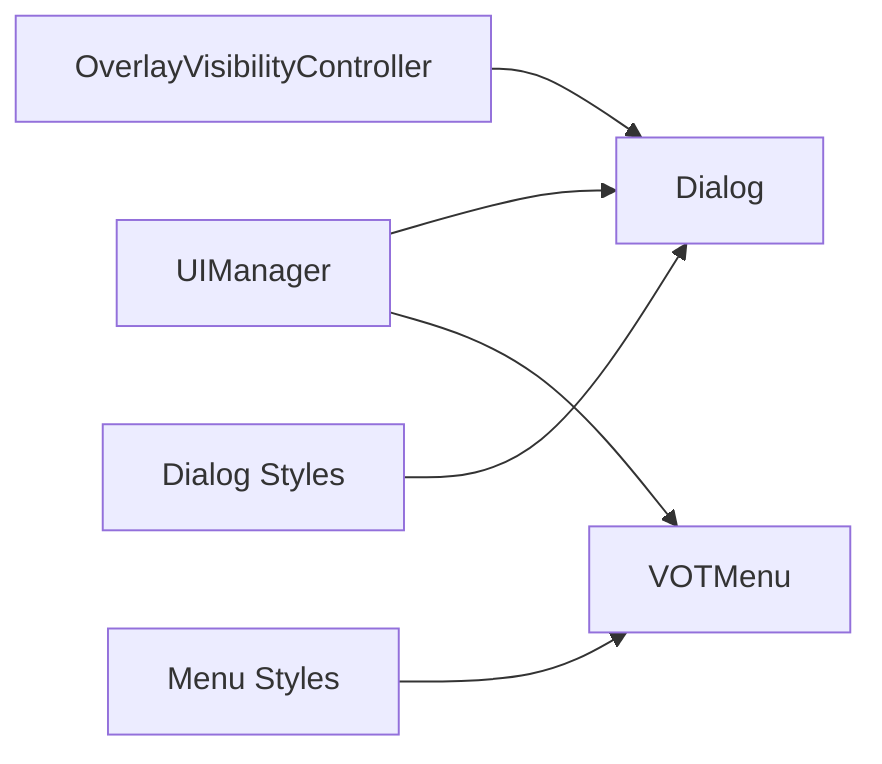

# Layout & Dialog Components

<cite>
**Referenced Files in This Document**
- [dialog.ts](file://src/ui/components/dialog.ts)
- [dialog.scss](file://src/styles/components/dialog.scss)
- [details.ts](file://src/ui/components/details.ts)
- [details.scss](file://src/styles/components/details.scss)
- [accountButton.ts](file://src/ui/components/accountButton.ts)
- [account.scss](file://src/styles/components/account.scss)
- [votMenu.ts](file://src/ui/components/votMenu.ts)
- [menu.scss](file://src/styles/components/menu.scss)
- [componentShared.ts](file://src/ui/components/componentShared.ts)
- [manager.ts](file://src/ui/manager.ts)
- [overlayVisibilityController.ts](file://src/ui/overlayVisibilityController.ts)
- [dialog.ts (types)](file://src/types/components/dialog.ts)
- [details.ts (types)](file://src/types/components/details.ts)
- [accountButton.ts (types)](file://src/types/components/accountButton.ts)
- [votMenu.ts (types)](file://src/types/components/votMenu.ts)
</cite>

## Table of Contents
1. [Introduction](#introduction)
2. [Project Structure](#project-structure)
3. [Core Components](#core-components)
4. [Architecture Overview](#architecture-overview)
5. [Detailed Component Analysis](#detailed-component-analysis)
6. [Dependency Analysis](#dependency-analysis)
7. [Performance Considerations](#performance-considerations)
8. [Troubleshooting Guide](#troubleshooting-guide)
9. [Conclusion](#conclusion)
10. [Appendices](#appendices)

## Introduction
This document explains the layout and dialog components used in the application’s UI: Dialog, Details, AccountButton, and VOTMenu. It covers modal dialog behavior, backdrop handling, focus management, collapsible content sections, user profile interactions, menu systems, component props, accessibility features, responsive design, z-index management, overlay positioning, and integration with the application layout system.

## Project Structure
The relevant components and styles are organized under:
- UI components: src/ui/components
- Styles: src/styles/components
- Types: src/types/components
- Application integration: src/ui/manager.ts and src/ui/overlayVisibilityController.ts

**Diagram sources**
- [dialog.ts:1-382](file://src/ui/components/dialog.ts#L1-L382)
- [dialog.scss:1-184](file://src/styles/components/dialog.scss#L1-L184)
- [details.ts:1-78](file://src/ui/components/details.ts#L1-L78)
- [details.scss:1-36](file://src/styles/components/details.scss#L1-L36)
- [accountButton.ts:1-174](file://src/ui/components/accountButton.ts#L1-L174)
- [account.scss:1-29](file://src/styles/components/account.scss#L1-L29)
- [votMenu.ts:1-123](file://src/ui/components/votMenu.ts#L1-L123)
- [menu.scss:1-138](file://src/styles/components/menu.scss#L1-L138)
- [dialog.ts (types):1-8](file://src/types/components/dialog.ts#L1-L8)
- [details.ts (types):1-4](file://src/types/components/details.ts#L1-L4)
- [accountButton.ts (types):1-6](file://src/types/components/accountButton.ts#L1-L6)
- [votMenu.ts (types):1-7](file://src/types/components/votMenu.ts#L1-L7)
- [manager.ts:1-987](file://src/ui/manager.ts#L1-L987)
- [overlayVisibilityController.ts:1-199](file://src/ui/overlayVisibilityController.ts#L1-L199)

**Section sources**
- [dialog.ts:1-382](file://src/ui/components/dialog.ts#L1-L382)
- [dialog.scss:1-184](file://src/styles/components/dialog.scss#L1-L184)
- [details.ts:1-78](file://src/ui/components/details.ts#L1-L78)
- [details.scss:1-36](file://src/styles/components/details.scss#L1-L36)
- [accountButton.ts:1-174](file://src/ui/components/accountButton.ts#L1-L174)
- [account.scss:1-29](file://src/styles/components/account.scss#L1-L29)
- [votMenu.ts:1-123](file://src/ui/components/votMenu.ts#L1-L123)
- [menu.scss:1-138](file://src/styles/components/menu.scss#L1-L138)
- [dialog.ts (types):1-8](file://src/types/components/dialog.ts#L1-L8)
- [details.ts (types):1-4](file://src/types/components/details.ts#L1-L4)
- [accountButton.ts (types):1-6](file://src/types/components/accountButton.ts#L1-L6)
- [votMenu.ts (types):1-7](file://src/types/components/votMenu.ts#L1-L7)
- [manager.ts:1-987](file://src/ui/manager.ts#L1-L987)
- [overlayVisibilityController.ts:1-199](file://src/ui/overlayVisibilityController.ts#L1-L199)

## Core Components
- Dialog: Modal overlay with backdrop, header, body, and footer areas; supports adaptive vertical alignment, focus trapping, and inert attributes for accessibility.
- Details: Collapsible section header with chevron icon; keyboard-accessible custom element.
- AccountButton: User profile control with avatar, username, and action buttons; toggles logged-in state and exposes events for interactions.
- VOTMenu: Non-modal popover-like menu with optional title and positioned variants; uses inert and aria attributes for accessibility.

**Section sources**
- [dialog.ts:12-382](file://src/ui/components/dialog.ts#L12-L382)
- [details.ts:14-78](file://src/ui/components/details.ts#L14-L78)
- [accountButton.ts:14-174](file://src/ui/components/accountButton.ts#L14-L174)
- [votMenu.ts:6-123](file://src/ui/components/votMenu.ts#L6-L123)

## Architecture Overview
The components integrate with the application via the UIManager and OverlayVisibilityController. The UIManager creates global portals and initializes overlay and settings views. The OverlayVisibilityController manages auto-hide behavior and focus-related visibility transitions.

**Diagram sources**
- [manager.ts:109-138](file://src/ui/manager.ts#L109-L138)
- [dialog.ts:157-189](file://src/ui/components/dialog.ts#L157-L189)
- [votMenu.ts:29-122](file://src/ui/components/votMenu.ts#L29-L122)
- [overlayVisibilityController.ts:18-199](file://src/ui/overlayVisibilityController.ts#L18-L199)

## Detailed Component Analysis

### Dialog Component
- Purpose: Modal dialog with backdrop, header, body, and footer; supports temporary visibility and adaptive vertical alignment for long content.
- Accessibility:
  - Uses role="dialog" and aria-modal="true".
  - Sets aria-labelledby to the title element.
  - Maintains inert and aria-hidden attributes when hidden.
  - Focus trapping with Tab/Shift+Tab handling and Escape to close.
  - Restores focus to the previously focused element on close/remove.
- Backdrop and positioning:
  - Fixed-position backdrop with fade transitions.
  - Container uses a very high z-index for overlay stacking.
  - Content wrapper adapts max-height and vertical alignment based on viewport and content size.
- Responsive behavior:
  - Footer actions stack vertically on narrow screens.
- Composition:
  - Title area, close button, body, and footer are separate containers for flexible layouts.
- Events:
  - Emits a close event when closed or removed.

**Diagram sources**
- [dialog.ts:12-64](file://src/ui/components/dialog.ts#L12-L64)

**Section sources**
- [dialog.ts:12-382](file://src/ui/components/dialog.ts#L12-L382)
- [dialog.scss:1-184](file://src/styles/components/dialog.scss#L1-L184)
- [dialog.ts (types):1-8](file://src/types/components/dialog.ts#L1-L8)

### Details Component
- Purpose: Collapsible section header with a chevron icon; keyboard-accessible custom element.
- Behavior:
  - Dispatches a click event when activated.
  - Hidden state managed via shared helper.
- Styling:
  - Hover effects and arrow rotation for visual feedback.

**Diagram sources**
- [details.ts:14-33](file://src/ui/components/details.ts#L14-L33)

**Section sources**
- [details.ts:14-78](file://src/ui/components/details.ts#L14-L78)
- [details.scss:1-36](file://src/styles/components/details.scss#L1-L36)
- [details.ts (types):1-4](file://src/types/components/details.ts#L1-L4)

### AccountButton Component
- Purpose: User profile control with avatar, username, and action buttons.
- State:
  - loggedIn toggles visibility of the account wrapper and text of the primary action button.
  - username and avatarId setters update UI text and image source.
- Events:
  - Emits click, click:secret, and refresh events.
- Accessibility:
  - Avatar image includes alt text.
  - Buttons use appropriate labels from localization provider.

**Diagram sources**
- [accountButton.ts:14-56](file://src/ui/components/accountButton.ts#L14-L56)

**Section sources**
- [accountButton.ts:14-174](file://src/ui/components/accountButton.ts#L14-L174)
- [account.scss:1-29](file://src/styles/components/account.scss#L1-L29)
- [accountButton.ts (types):1-6](file://src/types/components/accountButton.ts#L1-L6)

### VOTMenu Component
- Purpose: Non-modal popover-like menu with optional title and configurable position.
- Accessibility:
  - Uses role="dialog" with aria-modal="false" and aria-hidden/inert when hidden.
  - Stable ids for aria-labelledby.
- Positioning:
  - data-position controls left/right alignment.
  - z-index ensures proper stacking order.
- Composition:
  - Header, body, and footer containers mirror the dialog structure for consistent layouts.

**Diagram sources**
- [votMenu.ts:6-41](file://src/ui/components/votMenu.ts#L6-L41)

**Section sources**
- [votMenu.ts:6-123](file://src/ui/components/votMenu.ts#L6-L123)
- [menu.scss:1-138](file://src/styles/components/menu.scss#L1-L138)
- [votMenu.ts (types):1-7](file://src/types/components/votMenu.ts#L1-L7)

### Component Shared Utilities
- Provides standardized event registration/removal and hidden state helpers used across components.

**Section sources**
- [componentShared.ts:1-39](file://src/ui/components/componentShared.ts#L1-L39)

## Dependency Analysis
- UIManager integrates Dialog and VOTMenu into the overlay and settings views, ensuring proper initialization and event binding.
- OverlayVisibilityController coordinates visibility behavior for overlay elements and interacts with Dialog focus management.
- Styles define z-index and overlay positioning; Dialog uses a very high z-index for modal stacking; VOTMenu uses a slightly lower z-index for layered menus.

**Diagram sources**
- [manager.ts:109-138](file://src/ui/manager.ts#L109-L138)
- [overlayVisibilityController.ts:18-199](file://src/ui/overlayVisibilityController.ts#L18-L199)
- [dialog.scss:61-75](file://src/styles/components/dialog.scss#L61-L75)
- [menu.scss:27-47](file://src/styles/components/menu.scss#L27-L47)

**Section sources**
- [manager.ts:109-138](file://src/ui/manager.ts#L109-L138)
- [overlayVisibilityController.ts:18-199](file://src/ui/overlayVisibilityController.ts#L18-L199)
- [dialog.scss:61-75](file://src/styles/components/dialog.scss#L61-L75)
- [menu.scss:27-47](file://src/styles/components/menu.scss#L27-L47)

## Performance Considerations
- Dialog uses requestAnimationFrame to batch adaptive vertical alignment calculations and ResizeObserver to observe content changes, minimizing layout thrash.
- CSS transitions and transforms are used for animations; avoid heavy JavaScript animations during scroll or resize.
- VOTMenu and Dialog rely on inert and hidden attributes to disable interaction when off-screen, reducing event overhead.

[No sources needed since this section provides general guidance]

## Troubleshooting Guide
- Dialog does not close on Escape:
  - Verify keydown trap is attached and not detached prematurely.
  - Ensure the dialog container is not inert when visible.
- Focus trapped inside dialog:
  - Confirm focusable elements are present; otherwise, focus moves to the dialog itself.
- Backdrop click does nothing:
  - Ensure the backdrop click handler is attached and content box stops propagation.
- VOTMenu not visible:
  - Check hidden state and inert attribute; confirm z-index is sufficient.
- AccountButton state not updating:
  - Ensure setters for username and avatarId are called and DOM nodes are updated.

**Section sources**
- [dialog.ts:157-189](file://src/ui/components/dialog.ts#L157-L189)
- [dialog.ts:321-366](file://src/ui/components/dialog.ts#L321-L366)
- [votMenu.ts:99-113](file://src/ui/components/votMenu.ts#L99-L113)
- [accountButton.ts:141-164](file://src/ui/components/accountButton.ts#L141-L164)

## Conclusion
The Dialog, Details, AccountButton, and VOTMenu components form a cohesive UI system with strong accessibility, responsive behavior, and robust integration points. Dialog provides modal overlays with focus management and adaptive alignment; Details offers collapsible sections; AccountButton handles user profile interactions; VOTMenu delivers non-modal menus with precise positioning. Together with styles and shared utilities, they enable consistent, accessible, and performant layouts across the application.

[No sources needed since this section summarizes without analyzing specific files]

## Appendices

### Props Reference
- DialogProps
  - titleHtml: HTMLElement | string
  - isTemp?: boolean (temporary dialog that removes itself on close)
- DetailsProps
  - titleHtml: HTMLElement | string
- AccountButtonProps
  - loggedIn?: boolean
  - username?: string
  - avatarId?: string
- VOTMenuProps
  - position?: Position
  - titleHtml?: string

**Section sources**
- [dialog.ts (types):1-8](file://src/types/components/dialog.ts#L1-L8)
- [details.ts (types):1-4](file://src/types/components/details.ts#L1-L4)
- [accountButton.ts (types):1-6](file://src/types/components/accountButton.ts#L1-L6)
- [votMenu.ts (types):1-7](file://src/types/components/votMenu.ts#L1-L7)

### Accessibility Checklist
- Dialog
  - role="dialog", aria-modal="true", aria-labelledby set to title id
  - aria-hidden/inert on hidden state
  - Escape to close, Tab trapping, focus restoration
- Details
  - Keyboard-accessible custom element behavior
- AccountButton
  - Alt text on avatar image
  - Localized button labels
- VOTMenu
  - role="dialog", aria-modal="false", aria-hidden/inert on hidden state
  - Stable ids for aria-labelledby

**Section sources**
- [dialog.ts:82-100](file://src/ui/components/dialog.ts#L82-L100)
- [dialog.ts:292-298](file://src/ui/components/dialog.ts#L292-L298)
- [details.ts:38-49](file://src/ui/components/details.ts#L38-L49)
- [accountButton.ts:63-96](file://src/ui/components/accountButton.ts#L63-L96)
- [votMenu.ts:49-54](file://src/ui/components/votMenu.ts#L49-L54)