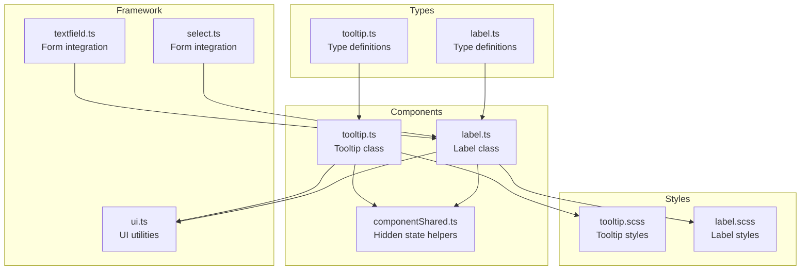
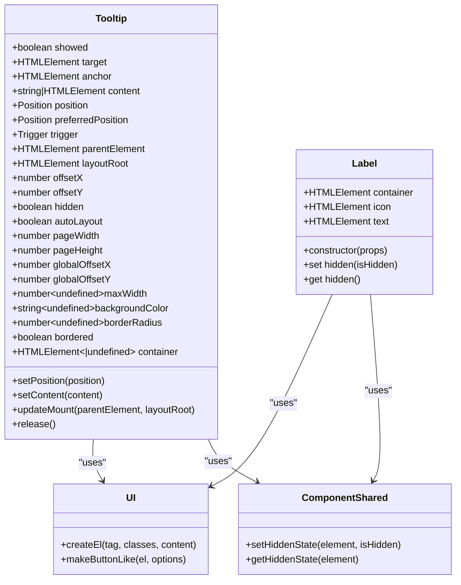
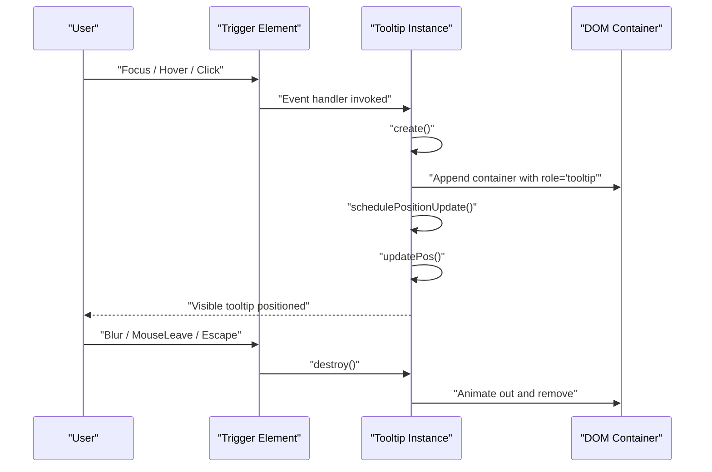
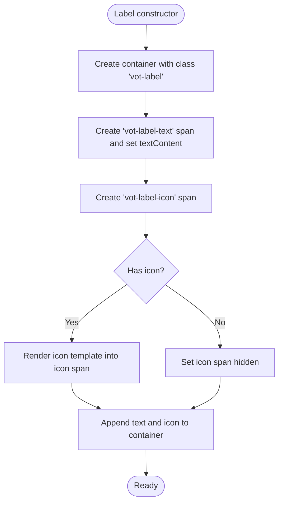
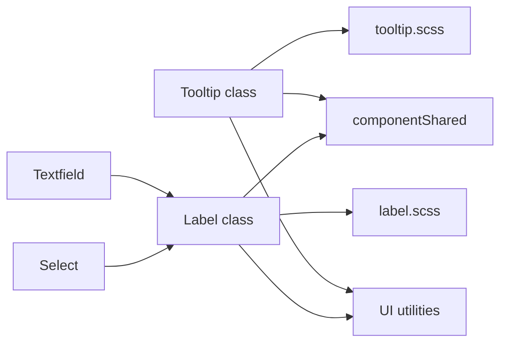

# Tooltip & Label Components

<cite>
**Referenced Files in This Document**
- [tooltip.ts](file://src/ui/components/tooltip.ts)
- [tooltip.ts](file://src/types/components/tooltip.ts)
- [label.ts](file://src/ui/components/label.ts)
- [label.ts](file://src/types/components/label.ts)
- [tooltip.scss](file://src/styles/components/tooltip.scss)
- [label.scss](file://src/styles/components/label.scss)
- [componentShared.ts](file://src/ui/components/componentShared.ts)
- [ui.ts](file://src/ui.ts)
- [textfield.ts](file://src/ui/components/textfield.ts)
- [select.ts](file://src/ui/components/select.ts)
</cite>

## Table of Contents
1. [Introduction](#introduction)
2. [Project Structure](#project-structure)
3. [Core Components](#core-components)
4. [Architecture Overview](#architecture-overview)
5. [Detailed Component Analysis](#detailed-component-analysis)
6. [Dependency Analysis](#dependency-analysis)
7. [Performance Considerations](#performance-considerations)
8. [Troubleshooting Guide](#troubleshooting-guide)
9. [Conclusion](#conclusion)
10. [Appendices](#appendices)

## Introduction
This document explains the tooltip and label components used to display contextual information and text labels. It covers tooltip positioning, trigger events, and content rendering; label component styling, text formatting, and semantic markup; component props for content, placement, visibility states, and interaction modes; accessibility features like ARIA descriptions, keyboard triggers, and screen reader announcements; responsive behavior, collision detection, and z-index management; and practical usage patterns with form components and interactive elements.

## Project Structure
The tooltip and label components are implemented as modular UI classes with associated SCSS styles and TypeScript type definitions. They integrate with the broader UI framework and support accessibility and responsive behavior.

**Diagram sources**
- [tooltip.ts:1-602](file://src/ui/components/tooltip.ts#L1-L602)
- [tooltip.ts:1-44](file://src/types/components/tooltip.ts#L1-L44)
- [label.ts:1-61](file://src/ui/components/label.ts#L1-L61)
- [label.ts:1-7](file://src/types/components/label.ts#L1-L7)
- [tooltip.scss:1-44](file://src/styles/components/tooltip.scss#L1-L44)
- [label.scss:1-28](file://src/styles/components/label.scss#L1-L28)
- [componentShared.ts:1-39](file://src/ui/components/componentShared.ts#L1-L39)
- [ui.ts:1-243](file://src/ui.ts#L1-L243)
- [textfield.ts:1-134](file://src/ui/components/textfield.ts#L1-L134)
- [select.ts:1-200](file://src/ui/components/select.ts#L1-L200)

**Section sources**
- [tooltip.ts:1-602](file://src/ui/components/tooltip.ts#L1-L602)
- [tooltip.ts:1-44](file://src/types/components/tooltip.ts#L1-L44)
- [label.ts:1-61](file://src/ui/components/label.ts#L1-L61)
- [label.ts:1-7](file://src/types/components/label.ts#L1-L7)
- [tooltip.scss:1-44](file://src/styles/components/tooltip.scss#L1-L44)
- [label.scss:1-28](file://src/styles/components/label.scss#L1-L28)
- [componentShared.ts:1-39](file://src/ui/components/componentShared.ts#L1-L39)
- [ui.ts:1-243](file://src/ui.ts#L1-L243)
- [textfield.ts:1-134](file://src/ui/components/textfield.ts#L1-L134)
- [select.ts:1-200](file://src/ui/components/select.ts#L1-L200)

## Core Components
- Tooltip: A floating contextual panel that appears near a trigger element on hover or click, with automatic collision-aware positioning and accessibility support.
- Label: A compound UI element combining text and an optional icon, designed for use with form controls and interactive elements.

**Section sources**
- [tooltip.ts:12-96](file://src/ui/components/tooltip.ts#L12-L96)
- [label.ts:7-23](file://src/ui/components/label.ts#L7-L23)

## Architecture Overview
The tooltip and label components share a consistent pattern:
- Types define props and enums for positions, triggers, offsets, and page coordinates.
- Components encapsulate DOM creation, event handling, positioning, and lifecycle.
- Styles define theme-aware visuals, transitions, z-index, and responsive constraints.
- Utilities provide shared helpers for hidden state and DOM creation.
- Integration points exist with form components and the UI framework.

**Diagram sources**
- [tooltip.ts:12-602](file://src/ui/components/tooltip.ts#L12-L602)
- [label.ts:7-61](file://src/ui/components/label.ts#L7-L61)
- [ui.ts:65-200](file://src/ui.ts#L65-L200)
- [componentShared.ts:27-39](file://src/ui/components/componentShared.ts#L27-L39)

## Detailed Component Analysis

### Tooltip Component
The Tooltip class manages a floating panel that displays contextual information near a trigger element. It supports hover and click triggers, collision-aware positioning, accessibility via ARIA, and responsive behavior.

- Props and configuration
  - Target and anchor: The trigger element and optional anchor for positioning calculations.
  - Content: Either a string or a DOM node.
  - Position and preferred position: One of top, right, bottom, left; autoLayout resolves collisions.
  - Trigger: hover or click.
  - Offsets: numeric or structured x/y offsets.
  - Visibility: hidden flag and bordered toggle.
  - Layout roots: parentElement for mounting and layoutRoot for viewport calculations.
  - Styling: maxWidth, backgroundColor, borderRadius.

- Trigger events and keyboard support
  - Hover: mouseenter/mouseleave; focusin/focusout; pointerdown/pointerup for hybrid touch/mouse.
  - Click: pointerdown toggles show/hide.
  - Escape key closes the tooltip when shown.
  - Keyboard navigation: show on focus, hide on blur.

- Positioning and collision detection
  - Calculates anchor and tooltip bounding boxes.
  - Computes candidate positions and resolves collisions against viewport edges with configurable offsets.
  - Uses requestAnimationFrame to batch position updates and reduce layout thrash.
  - Observes layoutRoot and anchor for resize and intersection changes.

- Lifecycle and cleanup
  - Mounts container with role="tooltip" and unique ID.
  - Schedules position updates on scroll and resize.
  - Unmounts with transition animation and fallback timer to ensure cleanup.

- Accessibility
  - Generates a unique tooltip ID and links it to the trigger via aria-describedby.
  - Preserves previous aria-describedby values during show/hide cycles.
  - Sets dataset attributes for trigger and position to aid styling and testing.

- Styling and z-index
  - Uses a high z-index suitable for overlays.
  - Applies theme-aware colors and typography.
  - Supports bordered and click-trigger user-select behavior.

- Integration patterns
  - Works with any HTMLElement as target.
  - Can be mounted under a portal-like parentElement.
  - Honors layoutRoot for correct viewport-relative calculations.

**Diagram sources**
- [tooltip.ts:161-211](file://src/ui/components/tooltip.ts#L161-L211)
- [tooltip.ts:321-361](file://src/ui/components/tooltip.ts#L321-L361)
- [tooltip.ts:363-376](file://src/ui/components/tooltip.ts#L363-L376)
- [tooltip.ts:492-536](file://src/ui/components/tooltip.ts#L492-L536)

**Section sources**
- [tooltip.ts:12-96](file://src/ui/components/tooltip.ts#L12-L96)
- [tooltip.ts:98-104](file://src/ui/components/tooltip.ts#L98-L104)
- [tooltip.ts:106-128](file://src/ui/components/tooltip.ts#L106-L128)
- [tooltip.ts:134-155](file://src/ui/components/tooltip.ts#L134-L155)
- [tooltip.ts:157-176](file://src/ui/components/tooltip.ts#L157-L176)
- [tooltip.ts:193-211](file://src/ui/components/tooltip.ts#L193-L211)
- [tooltip.ts:223-238](file://src/ui/components/tooltip.ts#L223-L238)
- [tooltip.ts:240-244](file://src/ui/components/tooltip.ts#L240-L244)
- [tooltip.ts:246-265](file://src/ui/components/tooltip.ts#L246-L265)
- [tooltip.ts:267-285](file://src/ui/components/tooltip.ts#L267-L285)
- [tooltip.ts:287-301](file://src/ui/components/tooltip.ts#L287-L301)
- [tooltip.ts:321-361](file://src/ui/components/tooltip.ts#L321-L361)
- [tooltip.ts:363-376](file://src/ui/components/tooltip.ts#L363-L376)
- [tooltip.ts:378-490](file://src/ui/components/tooltip.ts#L378-L490)
- [tooltip.ts:492-536](file://src/ui/components/tooltip.ts#L492-L536)
- [tooltip.ts:538-557](file://src/ui/components/tooltip.ts#L538-L557)
- [tooltip.ts:559-583](file://src/ui/components/tooltip.ts#L559-L583)
- [tooltip.ts:585-600](file://src/ui/components/tooltip.ts#L585-L600)
- [tooltip.ts:17-43](file://src/types/components/tooltip.ts#L17-L43)
- [tooltip.scss:1-44](file://src/styles/components/tooltip.scss#L1-L44)

### Label Component
The Label component renders a text label with an optional icon, designed for use with form controls and interactive elements. It ensures predictable layout and avoids “detached help icon” bugs by wrapping text in a dedicated element.

- Props and configuration
  - labelText: Required string for the label text.
  - icon: Optional lit-html template for the icon.

- Rendering and layout
  - Creates a container with class vot-label and child elements for text and icon.
  - Wraps text in a span with class vot-label-text to prevent layout anomalies.
  - Renders the icon into a span with class vot-label-icon; hides the icon container when no icon is provided.

- Hidden state
  - Uses shared helpers to manage the hidden attribute consistently.

- Styling and semantics
  - Provides baseline typography and spacing.
  - Icon area is styled as an inline-flex with centered alignment and cursor: help.

**Diagram sources**
- [label.ts:25-51](file://src/ui/components/label.ts#L25-L51)

**Section sources**
- [label.ts:7-23](file://src/ui/components/label.ts#L7-L23)
- [label.ts:25-51](file://src/ui/components/label.ts#L25-L51)
- [label.ts:53-59](file://src/ui/components/label.ts#L53-L59)
- [label.ts:3-6](file://src/types/components/label.ts#L3-L6)
- [label.scss:1-28](file://src/styles/components/label.scss#L1-L28)

### Type Definitions
- Tooltip options include target, anchor, content, position, trigger, offsets, visibility, autoLayout, maxWidth, backgroundColor, borderRadius, bordered, parentElement, and layoutRoot.
- Position and trigger enums restrict accepted values.
- Label props include labelText and optional icon.

**Section sources**
- [tooltip.ts:1-44](file://src/types/components/tooltip.ts#L1-L44)
- [label.ts:1-7](file://src/types/components/label.ts#L1-L7)

### Styling and Responsive Behavior
- Tooltip styles define theme-aware colors, typography, shadows, and a high z-index. It supports bordered variants and click-trigger user-select behavior. Max-width is constrained to viewport with a small margin.
- Label styles provide baseline font sizing, line heights, and icon alignment. The icon area is sized and aligned for consistent spacing.

**Section sources**
- [tooltip.scss:1-44](file://src/styles/components/tooltip.scss#L1-L44)
- [label.scss:1-28](file://src/styles/components/label.scss#L1-L28)

### Accessibility Features
- Tooltip:
  - Role="tooltip" and unique ID.
  - aria-describedby linkage to the trigger element.
  - Keyboard support: show on focus, hide on blur; Escape key closes.
  - Pointer events for non-hover devices handled via pointerdown/pointerup.
- Label:
  - No explicit ARIA attributes; relies on semantic HTML and icon cursor style.

**Section sources**
- [tooltip.ts:48-51](file://src/ui/components/tooltip.ts#L48-L51)
- [tooltip.ts:329-333](file://src/ui/components/tooltip.ts#L329-L333)
- [tooltip.ts:538-557](file://src/ui/components/tooltip.ts#L538-L557)
- [tooltip.ts:258-262](file://src/ui/components/tooltip.ts#L258-L262)
- [tooltip.ts:165-171](file://src/ui/components/tooltip.ts#L165-L171)

### Integration with Form Components and Interactive Elements
- Textfield integrates a label element alongside the input/textarea.
- Select uses labelElement to associate labels with dropdown controls.
- Both components leverage the Label component’s hidden state helpers for consistent behavior.

**Section sources**
- [textfield.ts:45-74](file://src/ui/components/textfield.ts#L45-L74)
- [select.ts:180-200](file://src/ui/components/select.ts#L180-L200)
- [componentShared.ts:27-39](file://src/ui/components/componentShared.ts#L27-L39)

## Dependency Analysis
The tooltip and label components depend on:
- UI utilities for DOM creation and button-like semantics.
- Shared helpers for hidden state management.
- SCSS styles for visual presentation and responsive constraints.

**Diagram sources**
- [tooltip.ts:1-11](file://src/ui/components/tooltip.ts#L1-L11)
- [label.ts:1-5](file://src/ui/components/label.ts#L1-L5)
- [componentShared.ts:1-39](file://src/ui/components/componentShared.ts#L1-L39)
- [textfield.ts:1-10](file://src/ui/components/textfield.ts#L1-L10)
- [select.ts:1-20](file://src/ui/components/select.ts#L1-L20)

**Section sources**
- [tooltip.ts:1-11](file://src/ui/components/tooltip.ts#L1-L11)
- [label.ts:1-5](file://src/ui/components/label.ts#L1-L5)
- [componentShared.ts:1-39](file://src/ui/components/componentShared.ts#L1-L39)
- [textfield.ts:1-10](file://src/ui/components/textfield.ts#L1-L10)
- [select.ts:1-20](file://src/ui/components/select.ts#L1-L20)

## Performance Considerations
- Position updates are scheduled with requestAnimationFrame to batch layout computations.
- Scroll listeners are attached only when needed and detached on release.
- Transition animations with fallback timers ensure cleanup even if transitions fail.
- ResizeObserver and IntersectionObserver minimize polling overhead.
- Hidden state and bordered toggles update the DOM efficiently without remounting.

[No sources needed since this section provides general guidance]

## Troubleshooting Guide
- Tooltip does not appear
  - Verify target is a valid HTMLElement and trigger is set correctly.
  - Ensure parentElement is appended to the DOM and layoutRoot is set appropriately.
- Tooltip overlaps content
  - Adjust offset values or use autoLayout to resolve collisions.
  - Consider maxWidth to constrain long content.
- Tooltip not accessible to screen readers
  - Confirm aria-describedby linkage and that the tooltip has role="tooltip".
- Label icon appears detached
  - Ensure the icon is provided via the icon prop; otherwise the icon container is hidden.
- Hidden state not respected
  - Use the hidden getter/setter on Label and rely on shared helpers.

**Section sources**
- [tooltip.ts:70-72](file://src/ui/components/tooltip.ts#L70-L72)
- [tooltip.ts:538-557](file://src/ui/components/tooltip.ts#L538-L557)
- [label.ts:53-59](file://src/ui/components/label.ts#L53-L59)
- [componentShared.ts:27-39](file://src/ui/components/componentShared.ts#L27-L39)

## Conclusion
The tooltip and label components provide robust, accessible, and responsive UI primitives for contextual information and labeling. Their modular design, strong typing, and integration with the UI framework make them easy to configure and maintain across diverse components and layouts.

[No sources needed since this section summarizes without analyzing specific files]

## Appendices

### Usage Patterns and Examples
- Tooltip usage patterns
  - Hover tooltips near interactive controls with autoLayout enabled.
  - Click tooltips for longer-form content or when user-select is desired.
  - Portal mounting with parentElement for overlay scenarios.
  - Dynamic content updates via setContent without flicker.
- Label styling approaches
  - Combine with form controls to improve readability and affordance.
  - Use icons sparingly to avoid visual clutter.
  - Leverage hidden state for conditional rendering.

[No sources needed since this section provides general guidance]