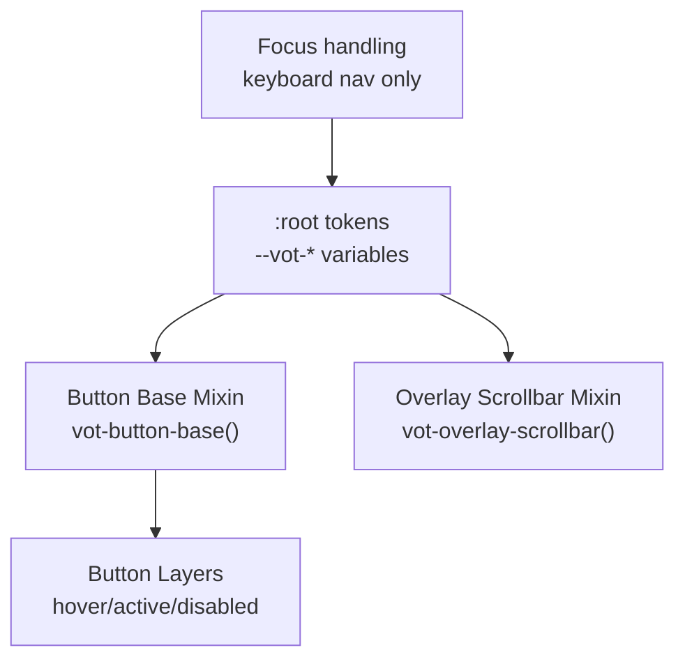
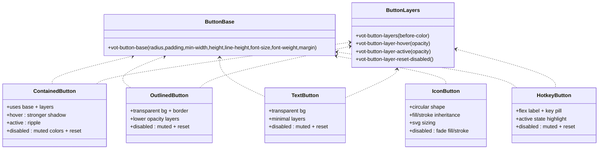
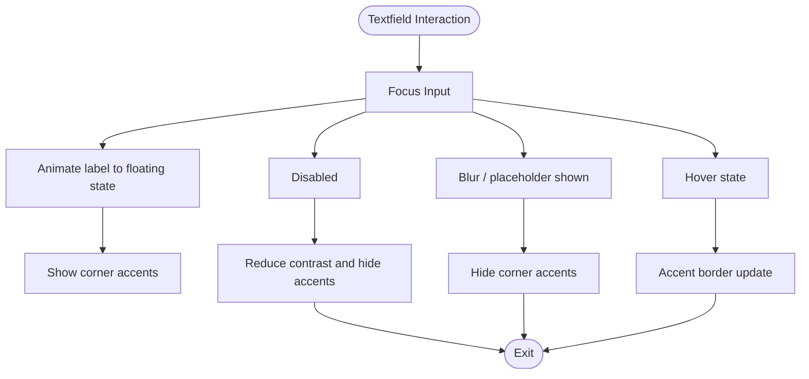
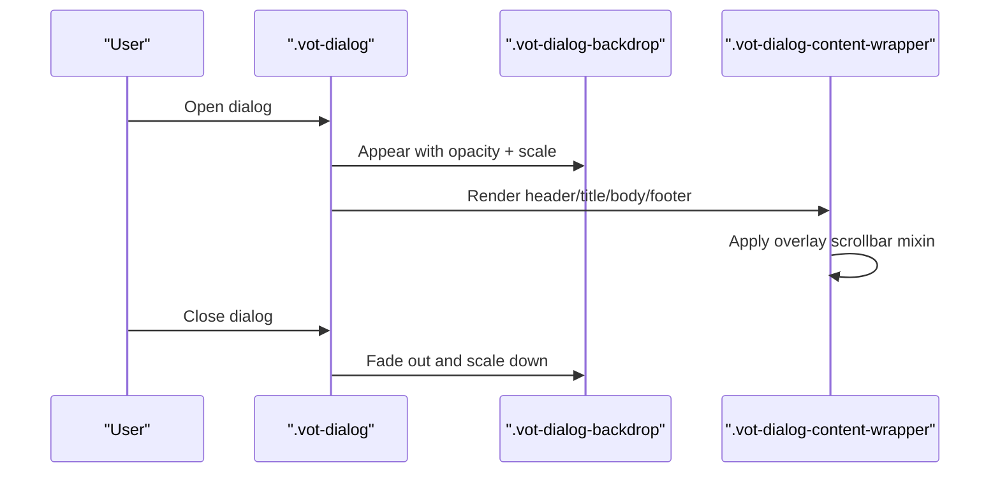
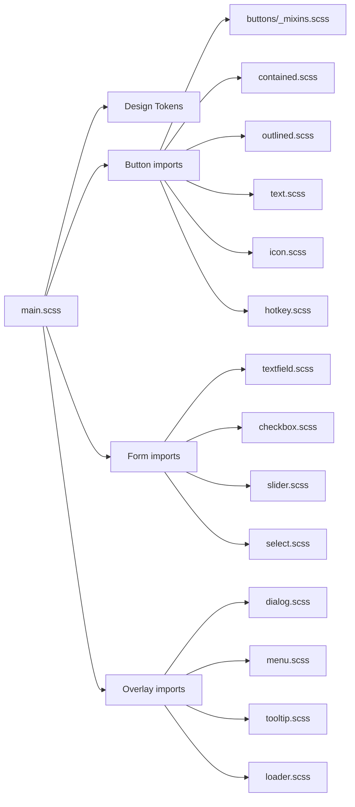

# Component-Specific Styles

<cite>
**Referenced Files in This Document**
- [main.scss](file://src/styles/main.scss)
- [_mixins.scss](file://src/styles/_mixins.scss)
- [buttons/_mixins.scss](file://src/styles/components/buttons/_mixins.scss)
- [buttons/contained.scss](file://src/styles/components/buttons/contained.scss)
- [buttons/outlined.scss](file://src/styles/components/buttons/outlined.scss)
- [buttons/text.scss](file://src/styles/components/buttons/text.scss)
- [buttons/icon.scss](file://src/styles/components/buttons/icon.scss)
- [buttons/hotkey.scss](file://src/styles/components/buttons/hotkey.scss)
- [textfield.scss](file://src/styles/components/textfield.scss)
- [checkbox.scss](file://src/styles/components/checkbox.scss)
- [slider.scss](file://src/styles/components/slider.scss)
- [select.scss](file://src/styles/components/select.scss)
- [dialog.scss](file://src/styles/components/dialog.scss)
- [menu.scss](file://src/styles/components/menu.scss)
- [tooltip.scss](file://src/styles/components/tooltip.scss)
- [loader.scss](file://src/styles/components/loader.scss)
- [label.scss](file://src/styles/components/label.scss)
- [account.scss](file://src/styles/components/account.scss)
- [settings.scss](file://src/styles/components/settings.scss)
- [lang-select.scss](file://src/styles/components/lang-select.scss)
- [segmented-button.scss](file://src/styles/components/segmented-button.scss)
</cite>

## Table of Contents
1. [Introduction](#introduction)
2. [Project Structure](#project-structure)
3. [Core Components](#core-components)
4. [Architecture Overview](#architecture-overview)
5. [Detailed Component Analysis](#detailed-component-analysis)
6. [Dependency Analysis](#dependency-analysis)
7. [Performance Considerations](#performance-considerations)
8. [Troubleshooting Guide](#troubleshooting-guide)
9. [Conclusion](#conclusion)
10. [Appendices](#appendices)

## Introduction
This document describes the component-specific styling system used across the Voice Over Translation (VOT) project. It focuses on the SCSS architecture that defines UI components such as buttons, form controls, dialogs, menus, tooltips, loaders, labels, and specialized components like segmented buttons and language selection. It explains how variants are structured, how hover and focus states are handled, how validation and accessibility are integrated, and how to customize or extend the system consistently.

## Project Structure
The global stylesheet imports component-specific SCSS modules and defines core design tokens (colors, spacing, radii, shadows, transitions). Component SCSS files live under src/styles/components and are grouped by type (buttons, forms, overlays, etc.). Shared mixins and utilities are provided in src/styles/_mixins.scss and component-specific button mixins in src/styles/components/buttons/_mixins.scss.

```mermaid
graph TB
main["src/styles/main.scss"]
mixins["_mixins.scss"]
btn_mixins["components/buttons/_mixins.scss"]
subgraph "Buttons"
contained["buttons/contained.scss"]
outlined["buttons/outlined.scss"]
text["buttons/text.scss"]
icon["buttons/icon.scss"]
hotkey["buttons/hotkey.scss"]
end
subgraph "Forms"
textfield["textfield.scss"]
checkbox["checkbox.scss"]
slider["slider.scss"]
select["select.scss"]
end
subgraph "Overlays"
dialog["dialog.scss"]
menu["menu.scss"]
tooltip["tooltip.scss"]
loader["loader.scss"]
end
subgraph "Other"
label["label.scss"]
account["account.scss"]
settings["settings.scss"]
lang_select["lang-select.scss"]
seg_btn["segmented-button.scss"]
end
main --> contained
main --> outlined
main --> text
main --> icon
main --> hotkey
main --> textfield
main --> checkbox
main --> slider
main --> select
main --> dialog
main --> menu
main --> tooltip
main --> loader
main --> label
main --> account
main --> settings
main --> lang_select
main --> seg_btn
main --> mixins
contained --> btn_mixins
outlined --> btn_mixins
text --> btn_mixins
icon --> btn_mixins
hotkey --> btn_mixins
```

**Diagram sources**
- [main.scss:1-26](file://src/styles/main.scss#L1-L26)
- [buttons/_mixins.scss:1-80](file://src/styles/components/buttons/_mixins.scss#L1-L80)
- [buttons/contained.scss:1-44](file://src/styles/components/buttons/contained.scss#L1-L44)
- [buttons/outlined.scss:1-30](file://src/styles/components/buttons/outlined.scss#L1-L30)
- [buttons/text.scss:1-30](file://src/styles/components/buttons/text.scss#L1-L30)
- [buttons/icon.scss:1-36](file://src/styles/components/buttons/icon.scss#L1-L36)
- [buttons/hotkey.scss:1-53](file://src/styles/components/buttons/hotkey.scss#L1-L53)
- [textfield.scss:1-224](file://src/styles/components/textfield.scss#L1-L224)
- [checkbox.scss:1-190](file://src/styles/components/checkbox.scss#L1-L190)
- [slider.scss:1-184](file://src/styles/components/slider.scss#L1-L184)
- [select.scss](file://src/styles/components/select.scss)
- [dialog.scss:1-184](file://src/styles/components/dialog.scss#L1-L184)
- [menu.scss:1-138](file://src/styles/components/menu.scss#L1-L138)
- [tooltip.scss:1-44](file://src/styles/components/tooltip.scss#L1-L44)
- [loader.scss](file://src/styles/components/loader.scss)
- [label.scss](file://src/styles/components/label.scss)
- [account.scss](file://src/styles/components/account.scss)
- [settings.scss:1-152](file://src/styles/components/settings.scss#L1-L152)
- [lang-select.scss](file://src/styles/components/lang-select.scss)
- [segmented-button.scss](file://src/styles/components/segmented-button.scss)

**Section sources**
- [main.scss:1-180](file://src/styles/main.scss#L1-L180)

## Core Components
This section summarizes the primary component families and their roles in the styling system.

- Buttons: Contained, Outlined, Text, Icon, Hotkey variants share a common base mixin and layered interaction states (hover, active, disabled).
- Form Controls: Textfields, checkboxes, sliders, and selects define label, placeholder, focus, and disabled states with cross-browser compatibility.
- Overlays: Dialogs, menus, tooltips, and loaders provide consistent spacing, typography, and motion using shared design tokens.
- Specialized: Labels, account controls, settings sections, language selection dropdowns, and segmented buttons.

Key design tokens and global behaviors are defined in the main stylesheet, including focus handling for keyboard navigation and reduced-motion support.

**Section sources**
- [main.scss:27-180](file://src/styles/main.scss#L27-L180)
- [_mixins.scss:1-44](file://src/styles/_mixins.scss#L1-L44)
- [buttons/_mixins.scss:1-80](file://src/styles/components/buttons/_mixins.scss#L1-L80)

## Architecture Overview
The styling architecture follows a modular SCSS approach:
- Global tokens and base styles are centralized in main.scss.
- Component SCSS files encapsulate styles per UI element.
- Button variants reuse a shared base mixin and interaction layers.
- Overlay components use consistent containers, backdrops, and scrollbars.
- Accessibility is addressed via focus-visible handling and keyboard navigation indicators.

**Diagram sources**
- [main.scss:27-180](file://src/styles/main.scss#L27-L180)
- [_mixins.scss:17-43](file://src/styles/_mixins.scss#L17-L43)
- [buttons/_mixins.scss:3-80](file://src/styles/components/buttons/_mixins.scss#L3-L80)

## Detailed Component Analysis

### Buttons: Contained, Outlined, Text, Icon, Hotkey
Each variant uses a shared base mixin to define shape, typography, and layout, then augments color and interaction layers.

- Contained button
  - Uses theme color for background and on-state color.
  - Hover increases shadow; active uses ripple-like layer.
  - Disabled state removes interactive layers and sets muted colors.
  - Reference: [buttons/contained.scss:1-44](file://src/styles/components/buttons/contained.scss#L1-L44)

- Outlined button
  - Transparent background with themed border and on-state color.
  - Hover and active layers use lower opacity than contained.
  - Disabled state reduces contrast and removes layers.
  - Reference: [buttons/outlined.scss:1-30](file://src/styles/components/buttons/outlined.scss#L1-L30)

- Text button
  - Transparent background with themed text color.
  - Minimal hover/active layers for subtle feedback.
  - Disabled state mirrors outlined disabled behavior.
  - Reference: [buttons/text.scss:1-30](file://src/styles/components/buttons/text.scss#L1-L30)

- Icon button
  - Circular shape with fill-based coloring.
  - SVG sizing and fill inheritance for icons.
  - Disabled state fades both fill and stroke.
  - Reference: [buttons/icon.scss:1-36](file://src/styles/components/buttons/icon.scss#L1-L36)

- Hotkey button
  - Flexible layout for label + key pill.
  - Active state highlights the key pill with a subtle layer.
  - Disabled state mirrors outlined disabled behavior.
  - Reference: [buttons/hotkey.scss:1-53](file://src/styles/components/buttons/hotkey.scss#L1-L53)

Common base and interaction layers:
- Base mixin defines dimensions, typography, and layout.
- Layer mixin creates pseudo-element backgrounds for hover/active.
- Hover and active mixins set opacity and timing.
- Disabled reset clears interactive layers.
- References:
  - [buttons/_mixins.scss:1-80](file://src/styles/components/buttons/_mixins.scss#L1-L80)
  - [buttons/contained.scss:12-42](file://src/styles/components/buttons/contained.scss#L12-L42)
  - [buttons/outlined.scss:8-28](file://src/styles/components/buttons/outlined.scss#L8-L28)
  - [buttons/text.scss:8-28](file://src/styles/components/buttons/text.scss#L8-L28)
  - [buttons/icon.scss:5-27](file://src/styles/components/buttons/icon.scss#L5-L27)
  - [buttons/hotkey.scss:17-51](file://src/styles/components/buttons/hotkey.scss#L17-L51)

**Diagram sources**
- [buttons/_mixins.scss:3-80](file://src/styles/components/buttons/_mixins.scss#L3-L80)
- [buttons/contained.scss:12-42](file://src/styles/components/buttons/contained.scss#L12-L42)
- [buttons/outlined.scss:8-28](file://src/styles/components/buttons/outlined.scss#L8-L28)
- [buttons/text.scss:8-28](file://src/styles/components/buttons/text.scss#L8-L28)
- [buttons/icon.scss:5-27](file://src/styles/components/buttons/icon.scss#L5-L27)
- [buttons/hotkey.scss:17-51](file://src/styles/components/buttons/hotkey.scss#L17-L51)

**Section sources**
- [buttons/_mixins.scss:1-80](file://src/styles/components/buttons/_mixins.scss#L1-L80)
- [buttons/contained.scss:1-44](file://src/styles/components/buttons/contained.scss#L1-L44)
- [buttons/outlined.scss:1-30](file://src/styles/components/buttons/outlined.scss#L1-L30)
- [buttons/text.scss:1-30](file://src/styles/components/buttons/text.scss#L1-L30)
- [buttons/icon.scss:1-36](file://src/styles/components/buttons/icon.scss#L1-L36)
- [buttons/hotkey.scss:1-53](file://src/styles/components/buttons/hotkey.scss#L1-L53)

### Forms: Textfields, Checkboxes, Sliders, Selects
Form components emphasize clarity, focus states, and cross-browser compatibility.

- Textfields
  - Floating label with animated placeholder-to-label transition.
  - Corner accents appear during focus and hover.
  - Placeholder handling differs for Safari to avoid visual artifacts.
  - Focus state updates border, inset shadows, and label color.
  - Disabled state reduces contrast and hides corner accents.
  - Reference: [textfield.scss:1-224](file://src/styles/components/textfield.scss#L1-L224)

- Checkboxes
  - Custom indeterminate and checked states with animated ripple.
  - Hover adds a subtle background circle; active state scales the ripple.
  - Disabled state fades border/background and label.
  - Keyboard focus handled via global focus-visible rules.
  - Reference: [checkbox.scss:1-190](file://src/styles/components/checkbox.scss#L1-L190)

- Sliders
  - Custom track and thumb visuals with progress fill.
  - Focus-visible indicator only for keyboard navigation.
  - Disabled state reduces opacity and adjusts thumb/appearance.
  - Reference: [slider.scss:1-184](file://src/styles/components/slider.scss#L1-L184)

- Selects
  - Select component styles are defined in select.scss.
  - Reference: [select.scss](file://src/styles/components/select.scss)

**Diagram sources**
- [textfield.scss:54-206](file://src/styles/components/textfield.scss#L54-L206)

**Section sources**
- [textfield.scss:1-224](file://src/styles/components/textfield.scss#L1-L224)
- [checkbox.scss:1-190](file://src/styles/components/checkbox.scss#L1-L190)
- [slider.scss:1-184](file://src/styles/components/slider.scss#L1-L184)
- [select.scss](file://src/styles/components/select.scss)

### Dialogs and Settings Panels
Dialogs and settings panels provide consistent spacing, typography, and responsive behavior.

- Dialog
  - Container with backdrop, content wrapper, header/title/body/footer areas.
  - Vertical alignment modes and mobile-friendly footer stacking.
  - Scrollbar styling via shared mixin for overlay content.
  - Reference: [dialog.scss:1-184](file://src/styles/components/dialog.scss#L1-L184)

- Settings Panels
  - Sections with borders, rounded corners, and internal spacing.
  - Grid-like layout variables for consistent control widths.
  - Overrides for textfields to use a stacked label + input pattern.
  - Reference: [settings.scss:1-152](file://src/styles/components/settings.scss#L1-L152)

**Diagram sources**
- [dialog.scss:61-99](file://src/styles/components/dialog.scss#L61-L99)
- [_mixins.scss:17-43](file://src/styles/_mixins.scss#L17-L43)

**Section sources**
- [dialog.scss:1-184](file://src/styles/components/dialog.scss#L1-L184)
- [settings.scss:1-152](file://src/styles/components/settings.scss#L1-L152)

### Menus, Tooltips, and Loading Indicators
- Menus
  - Absolute positioning with transform-scale entrance/exit.
  - Header/title/body/footer containers; optional left/right alignment.
  - Scrollable content area with overlay scrollbar mixin.
  - Reference: [menu.scss:1-138](file://src/styles/components/menu.scss#L1-L138)

- Tooltips
  - Lightweight overlay with optional border and click-trigger behavior.
  - Positioned absolutely with max-width constrained to viewport.
  - Reference: [tooltip.scss:1-44](file://src/styles/components/tooltip.scss#L1-L44)

- Loaders
  - Loader component styles are defined in loader.scss.
  - Reference: [loader.scss](file://src/styles/components/loader.scss)

**Section sources**
- [menu.scss:1-138](file://src/styles/components/menu.scss#L1-L138)
- [tooltip.scss:1-44](file://src/styles/components/tooltip.scss#L1-L44)
- [loader.scss](file://src/styles/components/loader.scss)

### Specialized Components
- Labels
  - Label component styles are defined in label.scss.
  - Reference: [label.scss](file://src/styles/components/label.scss)

- Account Controls
  - Account component styles are defined in account.scss.
  - Reference: [account.scss](file://src/styles/components/account.scss)

- Language Selection Dropdowns
  - Language select styles are defined in lang-select.scss.
  - Reference: [lang-select.scss](file://src/styles/components/lang-select.scss)

- Segmented Buttons
  - Segmented button styles are defined in segmented-button.scss.
  - Reference: [segmented-button.scss](file://src/styles/components/segmented-button.scss)

**Section sources**
- [label.scss](file://src/styles/components/label.scss)
- [account.scss](file://src/styles/components/account.scss)
- [lang-select.scss](file://src/styles/components/lang-select.scss)
- [segmented-button.scss](file://src/styles/components/segmented-button.scss)

## Dependency Analysis
The styling system exhibits low coupling and high cohesion:
- Global tokens in main.scss are consumed by all components.
- Button variants depend on shared button mixins.
- Overlay components depend on shared mixins for typography and scrollbars.
- Form components encapsulate their own state logic (focus, hover, disabled).

**Diagram sources**
- [main.scss:1-26](file://src/styles/main.scss#L1-L26)
- [buttons/_mixins.scss:1-80](file://src/styles/components/buttons/_mixins.scss#L1-L80)
- [buttons/contained.scss:1-44](file://src/styles/components/buttons/contained.scss#L1-L44)
- [buttons/outlined.scss:1-30](file://src/styles/components/buttons/outlined.scss#L1-L30)
- [buttons/text.scss:1-30](file://src/styles/components/buttons/text.scss#L1-L30)
- [buttons/icon.scss:1-36](file://src/styles/components/buttons/icon.scss#L1-L36)
- [buttons/hotkey.scss:1-53](file://src/styles/components/buttons/hotkey.scss#L1-L53)
- [textfield.scss:1-224](file://src/styles/components/textfield.scss#L1-L224)
- [checkbox.scss:1-190](file://src/styles/components/checkbox.scss#L1-L190)
- [slider.scss:1-184](file://src/styles/components/slider.scss#L1-L184)
- [select.scss](file://src/styles/components/select.scss)
- [dialog.scss:1-184](file://src/styles/components/dialog.scss#L1-L184)
- [menu.scss:1-138](file://src/styles/components/menu.scss#L1-L138)
- [tooltip.scss:1-44](file://src/styles/components/tooltip.scss#L1-L44)
- [loader.scss](file://src/styles/components/loader.scss)

**Section sources**
- [main.scss:1-26](file://src/styles/main.scss#L1-L26)

## Performance Considerations
- Motion preferences: Reduced-motion media query shortens transitions and animations for accessibility and performance.
- Scrollbar customization: WebKit and standard scrollbar rules minimize repaints and improve perceived smoothness.
- Transition durations and easing: Consistent durations and easing curves across components reduce jank.
- Overlay isolation: Stacking boundaries prevent compositing overhead in complex DOMs.

[No sources needed since this section provides general guidance]

## Troubleshooting Guide
- Focus rings not visible
  - Ensure the global keyboard navigation class is toggled by JavaScript so focus-visible styles apply.
  - References:
    - [main.scss:128-156](file://src/styles/main.scss#L128-L156)
    - [checkbox.scss:179-189](file://src/styles/components/checkbox.scss#L179-L189)
    - [slider.scss:169-181](file://src/styles/components/slider.scss#L169-L181)

- Safari-specific textfield placeholder issues
  - Placeholder visibility is adjusted to avoid “ASCII corners” and fractional font-size transitions are optimized.
  - Reference: [textfield.scss:210-223](file://src/styles/components/textfield.scss#L210-L223)

- Disabled states feel unresponsive
  - Verify disabled mixins are applied and layer resets are active.
  - References:
    - [buttons/_mixins.scss:74-79](file://src/styles/components/buttons/_mixins.scss#L74-L79)
    - [buttons/contained.scss:36-42](file://src/styles/components/buttons/contained.scss#L36-L42)
    - [buttons/outlined.scss:23-28](file://src/styles/components/buttons/outlined.scss#L23-L28)
    - [buttons/text.scss:23-28](file://src/styles/components/buttons/text.scss#L23-L28)
    - [buttons/icon.scss:21-27](file://src/styles/components/buttons/icon.scss#L21-L27)
    - [buttons/hotkey.scss:46-51](file://src/styles/components/buttons/hotkey.scss#L46-L51)

- Menu/dialog scrollbars inconsistent
  - Use the overlay scrollbar mixin to normalize appearance and behavior.
  - Reference: [_mixins.scss:17-43](file://src/styles/_mixins.scss#L17-L43)

**Section sources**
- [main.scss:128-156](file://src/styles/main.scss#L128-L156)
- [textfield.scss:210-223](file://src/styles/components/textfield.scss#L210-L223)
- [buttons/_mixins.scss:74-79](file://src/styles/components/buttons/_mixins.scss#L74-L79)
- [buttons/contained.scss:36-42](file://src/styles/components/buttons/contained.scss#L36-L42)
- [buttons/outlined.scss:23-28](file://src/styles/components/buttons/outlined.scss#L23-L28)
- [buttons/text.scss:23-28](file://src/styles/components/buttons/text.scss#L23-L28)
- [buttons/icon.scss:21-27](file://src/styles/components/buttons/icon.scss#L21-L27)
- [buttons/hotkey.scss:46-51](file://src/styles/components/buttons/hotkey.scss#L46-L51)
- [_mixins.scss:17-43](file://src/styles/_mixins.scss#L17-L43)

## Conclusion
The VOT component styling system is modular, consistent, and accessible. By centralizing design tokens, reusing shared mixins, and structuring variants around a common base, the system enables predictable customization and easy maintenance. Form controls and overlays integrate robust focus and disabled states, while global motion and accessibility policies ensure a high-quality user experience across devices and preferences.

[No sources needed since this section summarizes without analyzing specific files]

## Appendices

### Practical Examples

- Customizing a button variant
  - Extend the base mixin with new dimensions and colors.
  - Add hover/active layers with appropriate opacities.
  - Define disabled behavior and ensure layer reset.
  - References:
    - [buttons/_mixins.scss:3-80](file://src/styles/components/buttons/_mixins.scss#L3-L80)
    - [buttons/contained.scss:12-42](file://src/styles/components/buttons/contained.scss#L12-L42)

- Creating a new component variant
  - Define a new class with a consistent naming scheme.
  - Import shared mixins and design tokens from main.scss.
  - Use overlay scrollbar mixin for scrollable content.
  - Reference: [_mixins.scss:17-43](file://src/styles/_mixins.scss#L17-L43)

- Maintaining consistent styling patterns
  - Use global design tokens for colors, spacing, radii, and shadows.
  - Apply focus-visible rules uniformly for keyboard navigation.
  - Keep transitions and easing consistent across components.
  - Reference: [main.scss:27-180](file://src/styles/main.scss#L27-L180)

**Section sources**
- [buttons/_mixins.scss:3-80](file://src/styles/components/buttons/_mixins.scss#L3-L80)
- [buttons/contained.scss:12-42](file://src/styles/components/buttons/contained.scss#L12-L42)
- [_mixins.scss:17-43](file://src/styles/_mixins.scss#L17-L43)
- [main.scss:27-180](file://src/styles/main.scss#L27-L180)