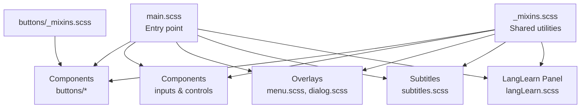
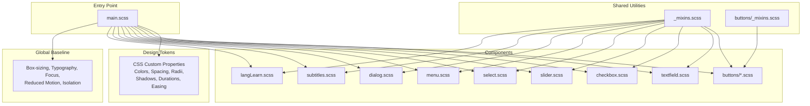
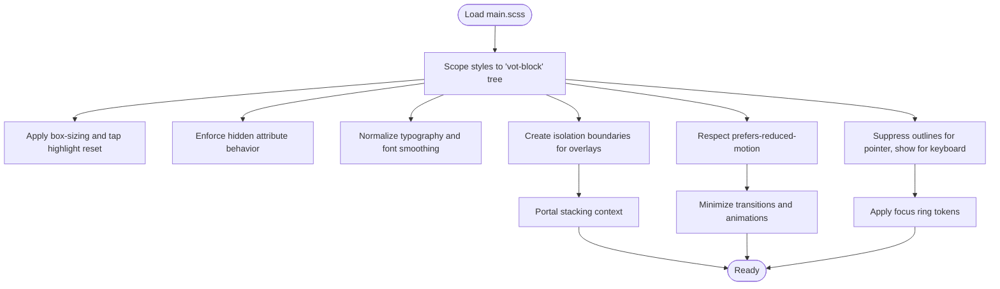
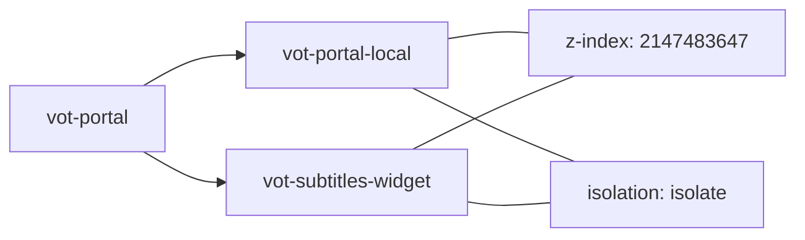
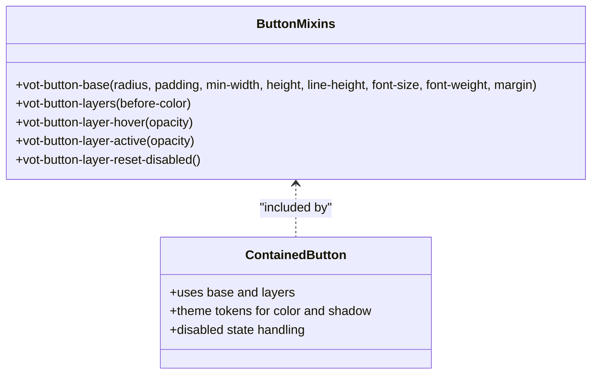
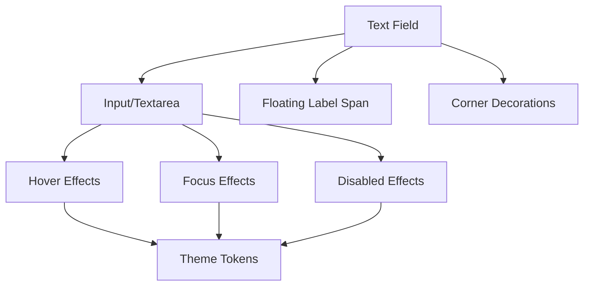
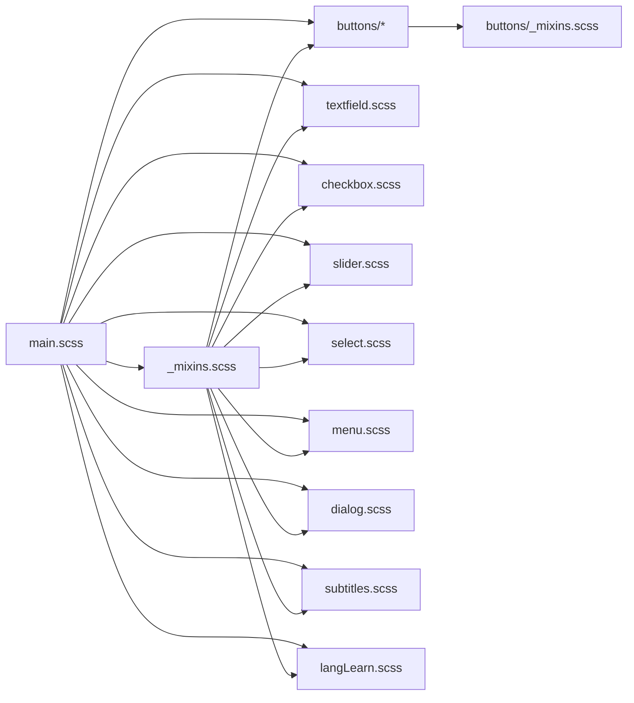

# Main Stylesheet Architecture

<cite>
**Referenced Files in This Document**
- [main.scss](file://src/styles/main.scss)
- [_mixins.scss](file://src/styles/_mixins.scss)
- [buttons/_mixins.scss](file://src/styles/components/buttons/_mixins.scss)
- [buttons/contained.scss](file://src/styles/components/buttons/contained.scss)
- [textfield.scss](file://src/styles/components/textfield.scss)
- [checkbox.scss](file://src/styles/components/checkbox.scss)
- [slider.scss](file://src/styles/components/slider.scss)
- [select.scss](file://src/styles/components/select.scss)
- [menu.scss](file://src/styles/components/menu.scss)
- [dialog.scss](file://src/styles/components/dialog.scss)
- [subtitles.scss](file://src/styles/subtitles.scss)
- [langLearn.scss](file://src/styles/langLearn.scss)
- [manager.ts](file://src/ui/manager.ts)
- [overlayVisibilityController.ts](file://src/ui/overlayVisibilityController.ts)
</cite>

## Table of Contents
1. [Introduction](#introduction)
2. [Project Structure](#project-structure)
3. [Core Components](#core-components)
4. [Architecture Overview](#architecture-overview)
5. [Detailed Component Analysis](#detailed-component-analysis)
6. [Dependency Analysis](#dependency-analysis)
7. [Performance Considerations](#performance-considerations)
8. [Troubleshooting Guide](#troubleshooting-guide)
9. [Conclusion](#conclusion)
10. [Appendices](#appendices)

## Introduction
This document describes the main SCSS stylesheet architecture and entry point for the injected UI. It explains the modular organization of component styles, the design token system (colors, spacing, radii, shadows, animation timing), global baseline styles, portal positioning and stacking contexts, accessibility features (keyboard focus rings and reduced motion support), and practical guidance for extending the design system consistently.

## Project Structure
The stylesheet architecture centers around a single entry point that imports modular component styles and defines a comprehensive set of CSS custom properties acting as design tokens. A shared mixins library provides reusable utilities for typography, overlays, and scrollbars. Component-specific styles encapsulate behavior and variants, while global baseline rules ensure consistent presentation within the injected UI tree.

**Diagram sources**
- [main.scss:1-25](file://src/styles/main.scss#L1-L25)
- [_mixins.scss:1-44](file://src/styles/_mixins.scss#L1-L44)
- [buttons/_mixins.scss:1-80](file://src/styles/components/buttons/_mixins.scss#L1-L80)

**Section sources**
- [main.scss:1-25](file://src/styles/main.scss#L1-L25)

## Core Components
- Design tokens: CSS custom properties define theme colors, typography, spacing, border radii, shadows, and animation durations/easing. They are declared under :root and consumed throughout components.
- Global baseline: Scoped resets and normalization for the injected UI tree (vot-block) ensure consistent box-sizing, typography, and focus handling.
- Portal and stacking: Dedicated portal classes establish fixed positioning and high z-index for overlays and subtitles widgets.
- Accessibility: Keyboard navigation focus rings and reduced motion support are implemented with global selectors and media queries.
- Overlays: Menu and dialog components define consistent containers, backdrops, and responsive behavior.
- Inputs and controls: Text fields, checkboxes, sliders, and selects provide unified interaction patterns with cross-browser compatibility.

**Section sources**
- [main.scss:27-180](file://src/styles/main.scss#L27-L180)
- [_mixins.scss:1-44](file://src/styles/_mixins.scss#L1-L44)
- [menu.scss:1-138](file://src/styles/components/menu.scss#L1-L138)
- [dialog.scss:1-184](file://src/styles/components/dialog.scss#L1-L184)
- [textfield.scss:1-224](file://src/styles/components/textfield.scss#L1-L224)
- [checkbox.scss:1-190](file://src/styles/components/checkbox.scss#L1-L190)
- [slider.scss:1-184](file://src/styles/components/slider.scss#L1-L184)
- [select.scss:1-103](file://src/styles/components/select.scss#L1-L103)

## Architecture Overview
The stylesheet architecture follows a layered approach:
- Entry point imports modular components and defines design tokens.
- Shared mixins provide consistent utilities for fonts, overlays, and scrollbars.
- Component styles encapsulate variants and states, leveraging design tokens.
- Global baseline ensures isolation boundaries and accessibility compliance.
- Portal classes manage stacking contexts for overlays and subtitles.

**Diagram sources**
- [main.scss:1-25](file://src/styles/main.scss#L1-L25)
- [main.scss:27-180](file://src/styles/main.scss#L27-L180)
- [_mixins.scss:1-44](file://src/styles/_mixins.scss#L1-L44)
- [buttons/_mixins.scss:1-80](file://src/styles/components/buttons/_mixins.scss#L1-L80)

## Detailed Component Analysis

### Design Token System
The design token system is defined as CSS custom properties under :root. It includes:
- Color palette: primary, surface, on-primary, on-surface, and subtitle-specific colors.
- Typography: font family variable for consistent type scale.
- Spacing scale: discrete units mapped to variables for margins, paddings, and gaps.
- Border radii: xs, s, m, l sizes for consistent corner rounding.
- Borders: color tokens for hover and default states.
- Shadows: elevation tokens for depth cues.
- Animation: durations (fast, medium, slow), easing curve, and focus ring visuals.

These tokens are consumed by components to maintain visual consistency and enable easy theme customization.

**Section sources**
- [main.scss:27-74](file://src/styles/main.scss#L27-L74)

### Global Baseline Styles
The global baseline establishes:
- Box-sizing reset scoped to the injected UI tree to prevent host-page interference.
- Hidden attribute behavior enforcement for overlay elements.
- Typography normalization with font smoothing and anti-aliasing.
- Stacking and isolation boundaries for portals and subtitles widgets.
- Focus handling: suppression of native outlines/halos except for keyboard navigation.
- Reduced motion support: minimizing transitions/animations for users who prefer it.

**Diagram sources**
- [main.scss:76-180](file://src/styles/main.scss#L76-L180)

**Section sources**
- [main.scss:76-180](file://src/styles/main.scss#L76-L180)

### Portal Positioning and Stacking Contexts
Portals are positioned with fixed coordinates and a very high z-index to ensure they appear above host content. Local portals are used for isolated overlay content. Subtitles widgets are similarly positioned with a high z-index and isolation to guarantee readability and correct layering.

**Diagram sources**
- [main.scss:118-180](file://src/styles/main.scss#L118-L180)

**Section sources**
- [main.scss:118-180](file://src/styles/main.scss#L118-L180)

### Buttons Module
The buttons module defines a base mixin for consistent sizing, typography, and states, plus layered pseudo-element effects for hover and active feedback. Variants (contained, outlined, text, icon, hotkey) consume the base and apply theme tokens.

**Diagram sources**
- [buttons/_mixins.scss:1-80](file://src/styles/components/buttons/_mixins.scss#L1-L80)
- [buttons/contained.scss:1-44](file://src/styles/components/buttons/contained.scss#L1-L44)

**Section sources**
- [buttons/_mixins.scss:1-80](file://src/styles/components/buttons/_mixins.scss#L1-L80)
- [buttons/contained.scss:1-44](file://src/styles/components/buttons/contained.scss#L1-L44)

### Text Field Component
The text field component provides a modern, accessible input with floating label behavior, themed borders and corners, and careful handling of placeholder and focus states. It includes a Safari-specific optimization for smoother transitions.

**Diagram sources**
- [textfield.scss:1-224](file://src/styles/components/textfield.scss#L1-L224)

**Section sources**
- [textfield.scss:1-224](file://src/styles/components/textfield.scss#L1-L224)

### Checkbox Component
The checkbox component implements precise visual states for checked, indeterminate, and disabled conditions, with ripple-like interaction feedback and subtle focus indicators for keyboard navigation.

**Section sources**
- [checkbox.scss:1-190](file://src/styles/components/checkbox.scss#L1-L190)

### Slider Component
The slider component offers a consistent range input with custom track and thumb visuals, progress indication, and keyboard-focused styling. It suppresses pointer-driven focus halos while enabling explicit focus rings for keyboard users.

**Section sources**
- [slider.scss:1-184](file://src/styles/components/slider.scss#L1-L184)

### Select Component
The select component provides a compact dropdown with title, arrow icon, and a content list supporting selection states and inert items for disabled options.

**Section sources**
- [select.scss:1-103](file://src/styles/components/select.scss#L1-L103)

### Menu Component
The menu component defines a flexible overlay container with backdrop behavior, content wrappers, and responsive layout. It supports multiple positions and integrates with the portal stacking context.

**Section sources**
- [menu.scss:1-138](file://src/styles/components/menu.scss#L1-L138)

### Dialog Component
The dialog component provides a robust overlay with backdrop, content wrappers, header/footer areas, and transitions. It respects viewport constraints and supports top-alignment for long content.

**Section sources**
- [dialog.scss:1-184](file://src/styles/components/dialog.scss#L1-L184)

### Subtitles Widget
The subtitles widget enforces a dedicated typography stack, background and text shadows, and isolation boundaries. It calculates a stable fallback position and supports fullscreen adjustments.

**Section sources**
- [subtitles.scss:1-215](file://src/styles/subtitles.scss#L1-L215)

### LangLearn Panel
The LangLearn panel defines a floating overlay with backdrop filter, borders, and a set of interactive controls and logs. It demonstrates consistent spacing and typography tokens.

**Section sources**
- [langLearn.scss:1-359](file://src/styles/langLearn.scss#L1-L359)

## Dependency Analysis
The stylesheet architecture exhibits low coupling and high cohesion:
- Entry point depends on component modules and mixins.
- Component styles depend on shared mixins and design tokens.
- Overlays rely on portal classes and isolation for correct stacking.
- Accessibility features are centralized in the global baseline.

**Diagram sources**
- [main.scss:1-25](file://src/styles/main.scss#L1-L25)
- [_mixins.scss:1-44](file://src/styles/_mixins.scss#L1-L44)
- [buttons/_mixins.scss:1-80](file://src/styles/components/buttons/_mixins.scss#L1-L80)

**Section sources**
- [main.scss:1-25](file://src/styles/main.scss#L1-L25)
- [_mixins.scss:1-44](file://src/styles/_mixins.scss#L1-L44)
- [buttons/_mixins.scss:1-80](file://src/styles/components/buttons/_mixins.scss#L1-L80)

## Performance Considerations
- Use CSS custom properties for tokens to minimize repaint costs and enable runtime theme switching.
- Prefer transform and opacity for animations to leverage GPU acceleration.
- Limit heavy shadows and gradients to essential components; reuse tokens to avoid duplication.
- Apply isolation and contain where appropriate to reduce forced layout and paint.
- Respect reduced motion to improve perceived performance for sensitive users.

## Troubleshooting Guide
Common issues and resolutions:
- Host page styles overriding injected UI:
  - Ensure selectors are scoped under the injected UI tree and use higher specificity where necessary.
  - Verify hidden attribute behavior and isolation boundaries are applied.
- Focus rings not appearing:
  - Confirm the global keyboard navigation class is toggled by JavaScript and that :focus-visible fallback is included.
- Overlays not appearing above host content:
  - Check portal z-index and stacking context; confirm isolation is set on overlay containers.
- Excessive motion causing discomfort:
  - Validate reduced motion media query is applied to overlay and subtitle elements.

**Section sources**
- [main.scss:124-180](file://src/styles/main.scss#L124-L180)
- [manager.ts:109-138](file://src/ui/manager.ts#L109-L138)
- [overlayVisibilityController.ts:152-176](file://src/ui/overlayVisibilityController.ts#L152-L176)

## Conclusion
The stylesheet architecture provides a scalable, accessible, and consistent foundation for the injected UI. By centralizing design tokens, enforcing global baselines, and organizing components into focused modules, the system supports easy extension and maintenance. Following the guidelines in the appendices will help preserve visual consistency and accessibility across new components.

## Appendices

### Practical Examples

- Extending the design system with a new component variant:
  - Define or reuse a mixin from the shared utilities.
  - Consume design tokens for colors, spacing, radii, and shadows.
  - Apply global baseline rules (box-sizing, typography) where applicable.
  - Example reference paths:
    - [buttons/_mixins.scss:1-80](file://src/styles/components/buttons/_mixins.scss#L1-L80)
    - [main.scss:27-74](file://src/styles/main.scss#L27-L74)

- Adding a new design token:
  - Add a new CSS custom property under :root in the entry point.
  - Reference the token in component styles and mixins.
  - Example reference paths:
    - [main.scss:27-74](file://src/styles/main.scss#L27-L74)
    - [_mixins.scss:7-15](file://src/styles/_mixins.scss#L7-L15)

- Maintaining visual consistency across components:
  - Use shared mixins for typography and overlay scrollbars.
  - Leverage the spacing scale and radius tokens uniformly.
  - Example reference paths:
    - [_mixins.scss:17-43](file://src/styles/_mixins.scss#L17-L43)
    - [main.scss:44-56](file://src/styles/main.scss#L44-L56)

- Ensuring accessibility:
  - Keep keyboard focus indicators and suppress pointer-driven halos.
  - Respect reduced motion preferences globally.
  - Example reference paths:
    - [main.scss:124-169](file://src/styles/main.scss#L124-L169)