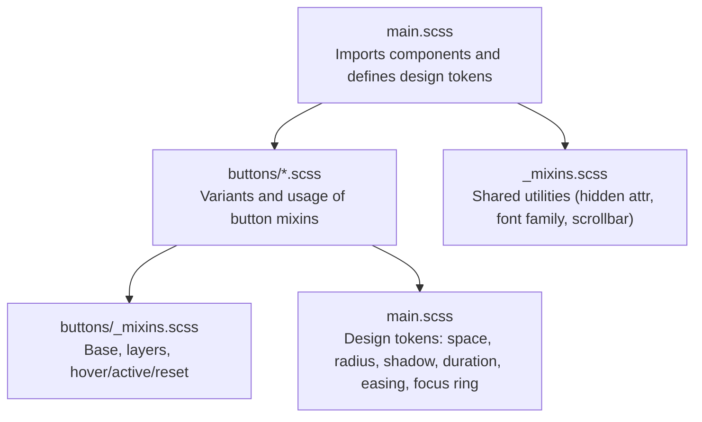
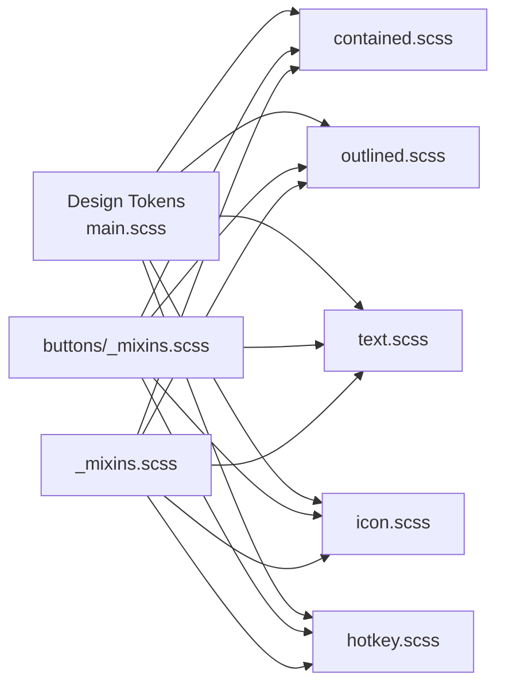
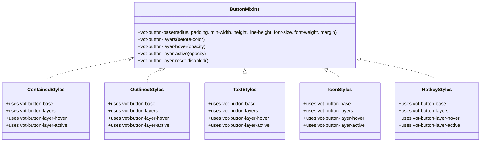
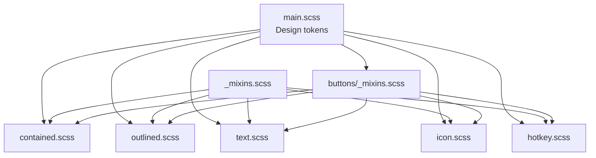

# Mixin System & Utilities

<cite>
**Referenced Files in This Document**
- [_mixins.scss](file://src/styles/_mixins.scss)
- [buttons/_mixins.scss](file://src/styles/components/buttons/_mixins.scss)
- [main.scss](file://src/styles/main.scss)
- [buttons/contained.scss](file://src/styles/components/buttons/contained.scss)
- [buttons/outlined.scss](file://src/styles/components/buttons/outlined.scss)
- [buttons/text.scss](file://src/styles/components/buttons/text.scss)
- [buttons/icon.scss](file://src/styles/components/buttons/icon.scss)
- [buttons/hotkey.scss](file://src/styles/components/buttons/hotkey.scss)
</cite>

## Table of Contents
1. [Introduction](#introduction)
2. [Project Structure](#project-structure)
3. [Core Components](#core-components)
4. [Architecture Overview](#architecture-overview)
5. [Detailed Component Analysis](#detailed-component-analysis)
6. [Dependency Analysis](#dependency-analysis)
7. [Performance Considerations](#performance-considerations)
8. [Troubleshooting Guide](#troubleshooting-guide)
9. [Conclusion](#conclusion)

## Introduction
This document explains the SCSS mixin system and utility functions used to build consistent, accessible, and animated UI components. It covers:
- Reusable styling patterns and mixin composition
- Design token-driven architecture (typography, spacing, radius, shadows, transitions, focus rings)
- Button family mixins and layered interaction effects
- Focus ring utilities and reduced-motion handling
- Practical guidance for creating custom mixins and extending the system

## Project Structure
The SCSS system centers around a shared mixins file and component-specific SCSS modules that import and compose mixins to produce consistent variants (contained, outlined, text, icon, hotkey buttons).

**Diagram sources**
- [main.scss](file://src/styles/main.scss)
- [buttons/_mixins.scss](file://src/styles/components/buttons/_mixins.scss)
- [_mixins.scss](file://src/styles/_mixins.scss)
- [buttons/contained.scss](file://src/styles/components/buttons/contained.scss)
- [buttons/outlined.scss](file://src/styles/components/buttons/outlined.scss)
- [buttons/text.scss](file://src/styles/components/buttons/text.scss)
- [buttons/icon.scss](file://src/styles/components/buttons/icon.scss)
- [buttons/hotkey.scss](file://src/styles/components/buttons/hotkey.scss)

**Section sources**
- [main.scss](file://src/styles/main.scss)
- [_mixins.scss](file://src/styles/_mixins.scss)
- [buttons/_mixins.scss](file://src/styles/components/buttons/_mixins.scss)

## Core Components
- Shared utilities: Hidden attribute enforcement, font family, and overlay scrollbar customization.
- Button mixins: Base layout and sizing, layered interaction effects, hover/active states, and disabled reset.
- Design tokens: Spacing scale, corner radii, borders, shadows, motion durations and easing, and focus ring definitions.

Key responsibilities:
- Maintain consistent component sizes and interactions across variants.
- Encapsulate motion and visual feedback in mixins for reuse.
- Centralize theme and accessibility settings in design tokens.

**Section sources**
- [_mixins.scss](file://src/styles/_mixins.scss)
- [buttons/_mixins.scss](file://src/styles/components/buttons/_mixins.scss)
- [main.scss](file://src/styles/main.scss)

## Architecture Overview
The system uses SCSS modules to share mixins and tokens across components. Each button variant imports the shared button mixins and applies them with variant-specific parameters. Design tokens are defined in the global stylesheet and consumed via CSS variables.

**Diagram sources**
- [main.scss](file://src/styles/main.scss)
- [buttons/_mixins.scss](file://src/styles/components/buttons/_mixins.scss)
- [buttons/contained.scss](file://src/styles/components/buttons/contained.scss)
- [buttons/outlined.scss](file://src/styles/components/buttons/outlined.scss)
- [buttons/text.scss](file://src/styles/components/buttons/text.scss)
- [buttons/icon.scss](file://src/styles/components/buttons/icon.scss)
- [buttons/hotkey.scss](file://src/styles/components/buttons/hotkey.scss)
- [_mixins.scss](file://src/styles/_mixins.scss)

## Detailed Component Analysis

### Shared Utilities
- Hidden attribute enforcement: Ensures elements marked with the hidden attribute remain visually hidden consistently.
- Font family: Applies a system-safe font stack via a CSS variable for stable typography.
- Overlay scrollbar: Defines a consistent scrollbar appearance and behavior for overlay containers using CSS variables and pseudo-elements.

Practical usage:
- Import the shared utilities module and include the relevant mixins in components that require consistent hidden behavior, typography baseline, or overlay scrolling.

**Section sources**
- [_mixins.scss](file://src/styles/_mixins.scss)

### Button Mixins and Layered Effects
The button family uses a small set of mixins to define:
- Base layout and typographic defaults
- Layered interaction effects (pseudo-elements for hover and ripple-like active states)
- Hover and active opacity states
- Disabled state reset

**Diagram sources**
- [buttons/_mixins.scss](file://src/styles/components/buttons/_mixins.scss)
- [buttons/contained.scss](file://src/styles/components/buttons/contained.scss)
- [buttons/outlined.scss](file://src/styles/components/buttons/outlined.scss)
- [buttons/text.scss](file://src/styles/components/buttons/text.scss)
- [buttons/icon.scss](file://src/styles/components/buttons/icon.scss)
- [buttons/hotkey.scss](file://src/styles/components/buttons/hotkey.scss)

**Section sources**
- [buttons/_mixins.scss](file://src/styles/components/buttons/_mixins.scss)
- [buttons/contained.scss](file://src/styles/components/buttons/contained.scss)
- [buttons/outlined.scss](file://src/styles/components/buttons/outlined.scss)
- [buttons/text.scss](file://src/styles/components/buttons/text.scss)
- [buttons/icon.scss](file://src/styles/components/buttons/icon.scss)
- [buttons/hotkey.scss](file://src/styles/components/buttons/hotkey.scss)

### Typography Mixins
- Font family mixin: Applies a CSS-variable-backed font stack to ensure consistent typography across components.
- Global baseline: The main stylesheet sets a stable font family and smoothing flags for all injected UI.

Usage:
- Include the font family mixin in components requiring a consistent type ramp.
- Rely on global variables for font family to avoid duplication.

**Section sources**
- [_mixins.scss](file://src/styles/_mixins.scss)
- [main.scss](file://src/styles/main.scss)

### Spacing Utilities
- Space scale tokens: Predefined spacing units (space-1 through space-6) enable consistent gutters, paddings, and margins across components.
- Radius tokens: Corner radii (xs, s, m, l) standardize rounded corners for surfaces and controls.

Usage:
- Reference the space and radius tokens in component mixins and selectors to keep spacing uniform.

**Section sources**
- [main.scss](file://src/styles/main.scss)

### Color Variant Generators
- Theme variables: Components derive colors from theme variables (e.g., primary and on-primary) and surface variables, enabling consistent color application across variants.
- Disabled states: Consistent disabled color and shadow behavior is enforced via mixin resets.

Usage:
- Define theme variables in the global stylesheet and reference them in component selectors and mixins.

**Section sources**
- [main.scss](file://src/styles/main.scss)
- [buttons/contained.scss](file://src/styles/components/buttons/contained.scss)
- [buttons/outlined.scss](file://src/styles/components/buttons/outlined.scss)
- [buttons/text.scss](file://src/styles/components/buttons/text.scss)
- [buttons/icon.scss](file://src/styles/components/buttons/icon.scss)
- [buttons/hotkey.scss](file://src/styles/components/buttons/hotkey.scss)

### Focus Ring Mixins and Accessibility
- Focus ring tokens: Dedicated CSS variables define the color, inner ring, and outer offset for focus rings.
- Conditional focus behavior: Focus outlines are suppressed for pointer interactions and restored for keyboard navigation using a global class toggled by JavaScript.
- Fallback support: A media-query and feature-detection fallback ensures focus rings appear when :focus-visible is not supported.

Usage:
- Apply the focus ring variables in focused states and rely on the global keyboard navigation class to toggle visibility.

**Section sources**
- [main.scss](file://src/styles/main.scss)

### Shadow Utilities and Transition Helpers
- Shadow tokens: Predefined elevation shadows (shadow-1, shadow-2) provide consistent depth cues.
- Transition tokens: Duration and easing variables standardize motion timing across components.
- Motion preferences: Reduced-motion media query reduces transition and animation durations for accessibility.

Usage:
- Use shadow and transition tokens in component mixins and selectors to maintain consistent motion behavior.

**Section sources**
- [main.scss](file://src/styles/main.scss)

### Animation Utilities
- Ripple-like interaction: The button mixins include layered pseudo-elements to create subtle hover and active effects, with transitions driven by duration and easing tokens.
- Disabled interaction: A dedicated reset mixin clears interaction layers when a component is disabled.

Usage:
- Include the layer mixins and hover/active mixins in variants to achieve consistent interaction feedback.

**Section sources**
- [buttons/_mixins.scss](file://src/styles/components/buttons/_mixins.scss)

### Layout Helpers
- Overlay scrollbar: A utility mixin customizes scrollbar appearance and behavior for overlay contexts using CSS variables and pseudo-elements.
- Portal stacking: Global rules establish stacking boundaries for overlays and subtitles widgets.

Usage:
- Apply the overlay scrollbar mixin to containers that require custom scrollbars.

**Section sources**
- [_mixins.scss](file://src/styles/_mixins.scss)
- [main.scss](file://src/styles/main.scss)

### Creating Custom Mixins and Extending the System
Steps to add a new component variant or utility:
1. Define or reuse design tokens in the global stylesheet.
2. Create a mixin in a shared location (e.g., a new component-specific mixins file) that encapsulates shared logic.
3. Import the mixin into the component’s SCSS file and apply it with variant-specific parameters.
4. Use transition and shadow tokens to keep motion and depth consistent.
5. Test focus behavior and reduced-motion preferences.

Example references:
- Base button mixin and layered effects: [buttons/_mixins.scss](file://src/styles/components/buttons/_mixins.scss)
- Variant usage with mixins: [buttons/contained.scss](file://src/styles/components/buttons/contained.scss), [buttons/outlined.scss](file://src/styles/components/buttons/outlined.scss), [buttons/text.scss](file://src/styles/components/buttons/text.scss), [buttons/icon.scss](file://src/styles/components/buttons/icon.scss), [buttons/hotkey.scss](file://src/styles/components/buttons/hotkey.scss)
- Global tokens and focus ring: [main.scss](file://src/styles/main.scss)
- Shared utilities: [_mixins.scss](file://src/styles/_mixins.scss)

**Section sources**
- [buttons/_mixins.scss](file://src/styles/components/buttons/_mixins.scss)
- [buttons/contained.scss](file://src/styles/components/buttons/contained.scss)
- [buttons/outlined.scss](file://src/styles/components/buttons/outlined.scss)
- [buttons/text.scss](file://src/styles/components/buttons/text.scss)
- [buttons/icon.scss](file://src/styles/components/buttons/icon.scss)
- [buttons/hotkey.scss](file://src/styles/components/buttons/hotkey.scss)
- [main.scss](file://src/styles/main.scss)
- [_mixins.scss](file://src/styles/_mixins.scss)

## Dependency Analysis
The button mixins are consumed by each variant module, while the global stylesheet supplies design tokens and global accessibility rules. Shared utilities are available to any module that imports the shared mixins file.

**Diagram sources**
- [main.scss](file://src/styles/main.scss)
- [buttons/_mixins.scss](file://src/styles/components/buttons/_mixins.scss)
- [buttons/contained.scss](file://src/styles/components/buttons/contained.scss)
- [buttons/outlined.scss](file://src/styles/components/buttons/outlined.scss)
- [buttons/text.scss](file://src/styles/components/buttons/text.scss)
- [buttons/icon.scss](file://src/styles/components/buttons/icon.scss)
- [buttons/hotkey.scss](file://src/styles/components/buttons/hotkey.scss)
- [_mixins.scss](file://src/styles/_mixins.scss)

**Section sources**
- [main.scss](file://src/styles/main.scss)
- [buttons/_mixins.scss](file://src/styles/components/buttons/_mixins.scss)
- [buttons/contained.scss](file://src/styles/components/buttons/contained.scss)
- [buttons/outlined.scss](file://src/styles/components/buttons/outlined.scss)
- [buttons/text.scss](file://src/styles/components/buttons/text.scss)
- [buttons/icon.scss](file://src/styles/components/buttons/icon.scss)
- [buttons/hotkey.scss](file://src/styles/components/buttons/hotkey.scss)
- [_mixins.scss](file://src/styles/_mixins.scss)

## Performance Considerations
- Prefer CSS variables for tokens to minimize recompilation and enable runtime adjustments.
- Use reduced-motion media queries to cap transition durations and iteration counts for accessibility.
- Keep mixins declarative and avoid heavy nesting to improve maintainability and compilation speed.

## Troubleshooting Guide
Common issues and resolutions:
- Hidden attribute not respected: Ensure the hidden attribute mixin is included in the component’s stylesheet.
- Inconsistent focus rings: Verify the global focus ring variables and the keyboard navigation class toggle.
- Overlapping transitions: Confirm that transition tokens are applied uniformly across hover and active states.
- Disabled state visuals: Use the disabled reset mixin to clear interaction layers.

**Section sources**
- [_mixins.scss](file://src/styles/_mixins.scss)
- [main.scss](file://src/styles/main.scss)
- [buttons/_mixins.scss](file://src/styles/components/buttons/_mixins.scss)

## Conclusion
The SCSS mixin system provides a cohesive foundation for building accessible, consistent UI components. By centralizing design tokens and reusable mixins, teams can efficiently create variants, animate interactions, and maintain design continuity across the application.