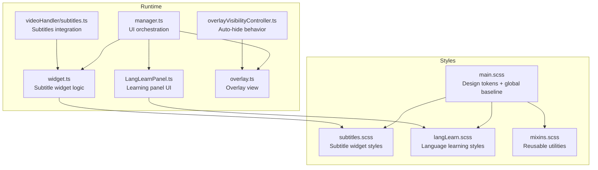
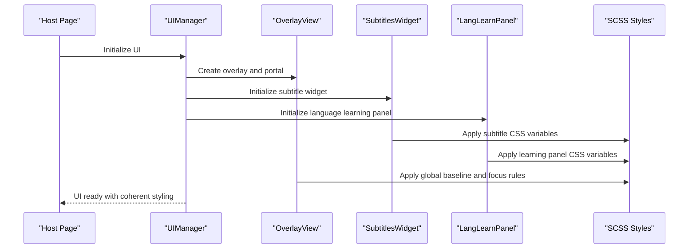
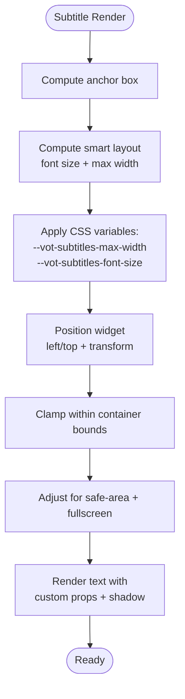
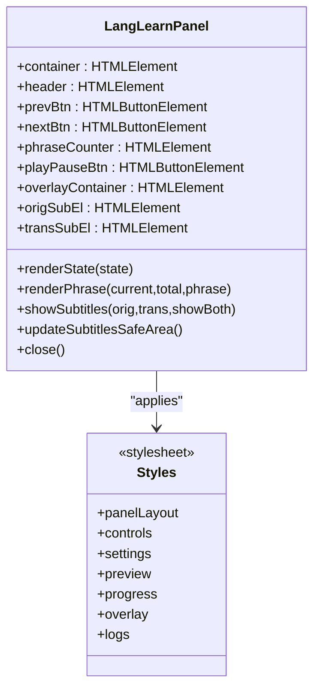
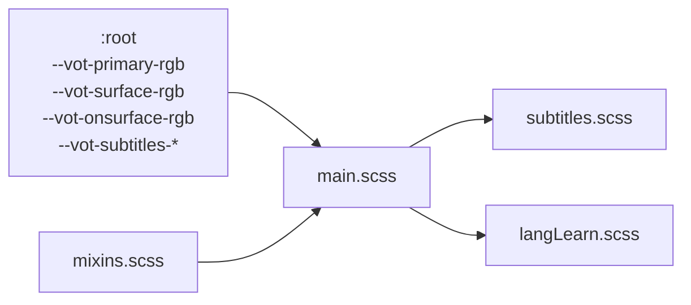
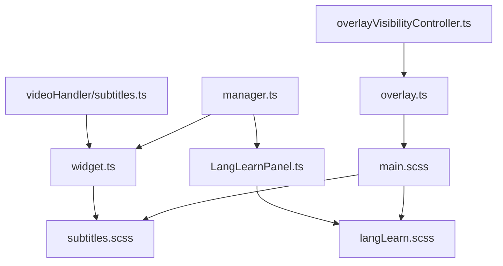

# Specialized Styling Areas

<cite>
**Referenced Files in This Document**
- [subtitles.scss](file://src/styles/subtitles.scss)
- [langLearn.scss](file://src/styles/langLearn.scss)
- [main.scss](file://src/styles/main.scss)
- [_mixins.scss](file://src/styles/_mixins.scss)
- [widget.ts](file://src/subtitles/widget.ts)
- [LangLearnPanel.ts](file://src/langLearn/LangLearnPanel.ts)
- [manager.ts](file://src/ui/manager.ts)
- [overlay.ts](file://src/ui/views/overlay.ts)
- [overlayVisibilityController.ts](file://src/ui/overlayVisibilityController.ts)
- [subtitles.ts](file://src/videoHandler/modules/subtitles.ts)
</cite>

## Table of Contents
1. [Introduction](#introduction)
2. [Project Structure](#project-structure)
3. [Core Components](#core-components)
4. [Architecture Overview](#architecture-overview)
5. [Detailed Component Analysis](#detailed-component-analysis)
6. [Dependency Analysis](#dependency-analysis)
7. [Performance Considerations](#performance-considerations)
8. [Troubleshooting Guide](#troubleshooting-guide)
9. [Conclusion](#conclusion)

## Introduction
This document focuses on the specialized styling systems for two distinct UI domains: subtitles and language learning. It explains how the subtitle widget achieves robust color theming, precise positioning controls, and optimized text rendering, and how the language learning panel delivers interactive elements, progress indicators, and educational overlays. It also details the integration with the main design system, including color variable usage and responsive behavior, and provides practical customization examples for maintaining visual coherence across contexts.

## Project Structure
The styling system is organized around modular SCSS files that define design tokens, component-level styles, and specialized areas:
- Design tokens and global baseline are defined in the main stylesheet.
- Subtitle-specific styles live in a dedicated stylesheet and are driven by a TypeScript widget that computes layout and positioning.
- Language learning styles are encapsulated in a separate stylesheet and integrated via a panel controller.
- Mixins provide reusable utilities for consistent UI behavior.

**Diagram sources**
- [main.scss:1-26](file://src/styles/main.scss#L1-L26)
- [subtitles.scss:1-215](file://src/styles/subtitles.scss#L1-L215)
- [langLearn.scss:1-359](file://src/styles/langLearn.scss#L1-L359)
- [_mixins.scss:1-44](file://src/styles/_mixins.scss#L1-L44)
- [widget.ts:110-800](file://src/subtitles/widget.ts#L110-L800)
- [LangLearnPanel.ts:1-559](file://src/langLearn/LangLearnPanel.ts#L1-L559)
- [manager.ts:56-138](file://src/ui/manager.ts#L56-L138)
- [overlay.ts:29-402](file://src/ui/views/overlay.ts#L29-L402)
- [overlayVisibilityController.ts:18-199](file://src/ui/overlayVisibilityController.ts#L18-L199)
- [subtitles.ts:293-374](file://src/videoHandler/modules/subtitles.ts#L293-L374)

**Section sources**
- [main.scss:1-180](file://src/styles/main.scss#L1-L180)
- [subtitles.scss:1-215](file://src/styles/subtitles.scss#L1-L215)
- [langLearn.scss:1-359](file://src/styles/langLearn.scss#L1-L359)
- [_mixins.scss:1-44](file://src/styles/_mixins.scss#L1-L44)

## Core Components
- Subtitle widget styling system:
  - Uses CSS custom properties for color theming, background opacity, and typography.
  - Implements responsive sizing with viewport-relative units and compensates for CSS transforms.
  - Provides interactive states for hover and selection with layered pseudo-elements.
  - Supports drag positioning with clamping and safe-area insets.
- Language learning panel styling system:
  - Defines a floating panel with backdrop blur, borders, and shadows.
  - Includes interactive controls, counters, settings, previews, logs, and progress indicators.
  - Provides an overlay for simultaneous subtitle presentation during learning mode.
- Integration with the main design system:
  - Centralized color tokens in the root scope.
  - Consistent typography baseline and focus ring behavior.
  - Portal-based stacking boundaries for overlays.

**Section sources**
- [subtitles.scss:1-215](file://src/styles/subtitles.scss#L1-L215)
- [langLearn.scss:1-359](file://src/styles/langLearn.scss#L1-L359)
- [main.scss:27-180](file://src/styles/main.scss#L27-L180)

## Architecture Overview
The styling architecture connects design tokens to runtime-driven layout and interaction:

**Diagram sources**
- [manager.ts:109-138](file://src/ui/manager.ts#L109-L138)
- [overlay.ts:252-402](file://src/ui/views/overlay.ts#L252-L402)
- [widget.ts:343-361](file://src/subtitles/widget.ts#L343-L361)
- [LangLearnPanel.ts:63-390](file://src/langLearn/LangLearnPanel.ts#L63-L390)
- [main.scss:76-180](file://src/styles/main.scss#L76-L180)

## Detailed Component Analysis

### Subtitle Widget Styling System
The subtitle widget combines CSS custom properties, responsive sizing, and runtime-driven layout to deliver a robust overlay:

- Color theming:
  - Typography color and background color are controlled via CSS variables.
  - Background uses a composite variable that blends surface RGB with opacity.
  - Hover and selection states use layered pseudo-elements for consistent hit-testing and visual feedback.
- Positioning controls:
  - Absolute-positioned container with z-index suitable for overlays.
  - Centered alignment with transform-based adjustments.
  - Runtime computation of left/top and clamping within anchor bounds.
  - Safe-area and fullscreen-aware bottom inset calculations.
- Text rendering optimizations:
  - Hard-locked typography via custom properties to resist host overrides.
  - Font smoothing and synthesis controls for legibility.
  - Containment and isolation to prevent layout/paint leakage.
  - Viewport-relative sizing with transform compensation to avoid unintentional scaling.

**Diagram sources**
- [widget.ts:296-335](file://src/subtitles/widget.ts#L296-L335)
- [widget.ts:718-793](file://src/subtitles/widget.ts#L718-L793)
- [widget.ts:519-554](file://src/subtitles/widget.ts#L519-L554)
- [subtitles.scss:1-215](file://src/styles/subtitles.scss#L1-L215)

**Section sources**
- [subtitles.scss:1-215](file://src/styles/subtitles.scss#L1-L215)
- [widget.ts:110-800](file://src/subtitles/widget.ts#L110-L800)

### Language Learning Panel Styles
The language learning panel defines a cohesive educational interface:

- Interactive elements:
  - Control bar with navigation buttons and counters.
  - Settings section with labeled inputs and toggles.
  - Preview area for original and translated phrases.
- Progress indicators:
  - Animated status card with pulse border animation.
  - Progress bar container with animated fill.
- Educational overlays:
  - Dedicated overlay container for simultaneous subtitle presentation.
  - Responsive max-width and safe-area-aware layout adjustments.
- Logs and metadata:
  - Scrollable textarea with monospace font for logs.
  - Metadata footer indicating line counts.

**Diagram sources**
- [LangLearnPanel.ts:1-559](file://src/langLearn/LangLearnPanel.ts#L1-L559)
- [langLearn.scss:1-359](file://src/styles/langLearn.scss#L1-L359)

**Section sources**
- [langLearn.scss:1-359](file://src/styles/langLearn.scss#L1-L359)
- [LangLearnPanel.ts:1-559](file://src/langLearn/LangLearnPanel.ts#L1-L559)

### Integration with the Main Design System
The main stylesheet centralizes design tokens and establishes global baselines:

- Design tokens:
  - Primary, surface, and on-surface color roles are defined as RGB variables.
  - Subtitle-specific variables for color and passed-state color are declared.
- Global baseline:
  - Typography baseline enforced for injected UI.
  - Focus ring behavior controlled via a keyboard-navigation class.
  - Reduced-motion compatibility for accessibility.
- Portal stacking:
  - Explicit stacking boundaries for overlays and subtitle widgets.

**Diagram sources**
- [main.scss:27-180](file://src/styles/main.scss#L27-L180)
- [_mixins.scss:1-44](file://src/styles/_mixins.scss#L1-L44)

**Section sources**
- [main.scss:27-180](file://src/styles/main.scss#L27-L180)
- [_mixins.scss:1-44](file://src/styles/_mixins.scss#L1-L44)

### Practical Customization Examples
Below are practical examples for customizing appearance without altering core logic:

- Customize subtitle color theme:
  - Override subtitle color and passed-state color via CSS variables in the root scope.
  - Adjust background opacity to balance readability and contrast.
  - Example reference: [subtitles.scss:12-15](file://src/styles/subtitles.scss#L12-L15), [main.scss:34-36](file://src/styles/main.scss#L34-L36)

- Modify subtitle font sizing and responsiveness:
  - Tune the clamp-based font-size calculation and transform compensation.
  - Example reference: [subtitles.scss:47-50](file://src/styles/subtitles.scss#L47-L50), [widget.ts:734-745](file://src/subtitles/widget.ts#L734-L745)

- Adjust language learning panel layout and contrast:
  - Change backdrop-filter blur, border, and radius for visual prominence.
  - Example reference: [langLearn.scss:8-11](file://src/styles/langLearn.scss#L8-L11)

- Control interactive states and transitions:
  - Modify hover and active states for buttons and inputs.
  - Example reference: [langLearn.scss:68-86](file://src/styles/langLearn.scss#L68-L86), [langLearn.scss:107-121](file://src/styles/langLearn.scss#L107-L121)

- Maintain visual coherence across contexts:
  - Use the centralized design tokens to ensure consistent colors across panels and widgets.
  - Example reference: [main.scss:27-74](file://src/styles/main.scss#L27-L74)

**Section sources**
- [subtitles.scss:1-215](file://src/styles/subtitles.scss#L1-L215)
- [langLearn.scss:1-359](file://src/styles/langLearn.scss#L1-L359)
- [main.scss:27-74](file://src/styles/main.scss#L27-L74)
- [widget.ts:734-745](file://src/subtitles/widget.ts#L734-L745)

## Dependency Analysis
The styling system depends on runtime logic for positioning and responsive behavior:

**Diagram sources**
- [main.scss:1-26](file://src/styles/main.scss#L1-L26)
- [subtitles.scss:1-215](file://src/styles/subtitles.scss#L1-L215)
- [langLearn.scss:1-359](file://src/styles/langLearn.scss#L1-L359)
- [widget.ts:110-800](file://src/subtitles/widget.ts#L110-L800)
- [LangLearnPanel.ts:1-559](file://src/langLearn/LangLearnPanel.ts#L1-L559)
- [manager.ts:56-138](file://src/ui/manager.ts#L56-L138)
- [overlay.ts:29-402](file://src/ui/views/overlay.ts#L29-L402)
- [overlayVisibilityController.ts:18-199](file://src/ui/overlayVisibilityController.ts#L18-L199)
- [subtitles.ts:293-374](file://src/videoHandler/modules/subtitles.ts#L293-L374)

**Section sources**
- [manager.ts:56-138](file://src/ui/manager.ts#L56-L138)
- [overlay.ts:29-402](file://src/ui/views/overlay.ts#L29-L402)
- [overlayVisibilityController.ts:18-199](file://src/ui/overlayVisibilityController.ts#L18-L199)
- [subtitles.ts:293-374](file://src/videoHandler/modules/subtitles.ts#L293-L374)

## Performance Considerations
- Minimize layout thrashing by batching position updates and using transform-based positioning.
- Use containment and isolation to limit layout and paint recalculation.
- Prefer CSS variables for theming to avoid costly JavaScript-driven style recomputation.
- Leverage reduced-motion preferences to disable animations for accessibility.

[No sources needed since this section provides general guidance]

## Troubleshooting Guide
Common styling issues and resolutions:
- Subtitles not readable or clipped:
  - Verify background opacity and text shadow variables.
  - Confirm max-width and clamp guards are applied.
  - Reference: [subtitles.scss:12-15](file://src/styles/subtitles.scss#L12-L15), [subtitles.scss:25-29](file://src/styles/subtitles.scss#L25-L29)
- Dragged subtitle misaligned:
  - Ensure anchor box and bottom inset computations are updated on resize.
  - Reference: [widget.ts:500-510](file://src/subtitles/widget.ts#L500-L510), [widget.ts:718-793](file://src/subtitles/widget.ts#L718-L793)
- Learning panel overlaps content:
  - Adjust overlay container margins and max-width based on portal and panel geometry.
  - Reference: [LangLearnPanel.ts:466-488](file://src/langLearn/LangLearnPanel.ts#L466-L488)
- Focus rings inconsistent:
  - Ensure keyboard navigation class is toggled and focus ring variables are defined.
  - Reference: [main.scss:135-156](file://src/styles/main.scss#L135-L156)

**Section sources**
- [subtitles.scss:12-29](file://src/styles/subtitles.scss#L12-L29)
- [widget.ts:500-510](file://src/subtitles/widget.ts#L500-L510)
- [widget.ts:718-793](file://src/subtitles/widget.ts#L718-L793)
- [LangLearnPanel.ts:466-488](file://src/langLearn/LangLearnPanel.ts#L466-L488)
- [main.scss:135-156](file://src/styles/main.scss#L135-L156)

## Conclusion
The specialized styling areas for subtitles and language learning are built on a robust foundation of design tokens, responsive CSS, and runtime-driven positioning. The subtitle system emphasizes readability and adaptability through custom properties and smart layout, while the language learning panel provides a focused educational interface with clear progress and interactive controls. Together with the main design system, these components maintain visual coherence and accessibility across diverse contexts.