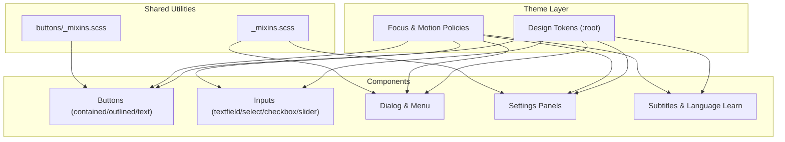
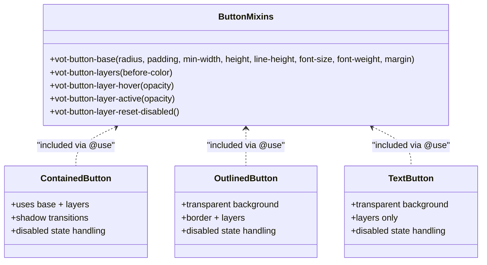
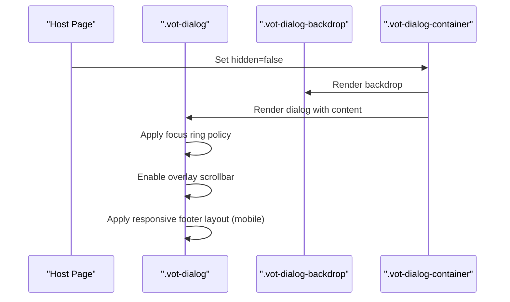
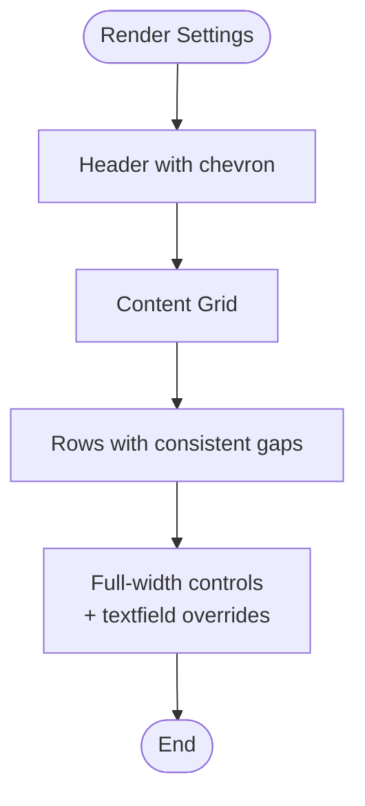
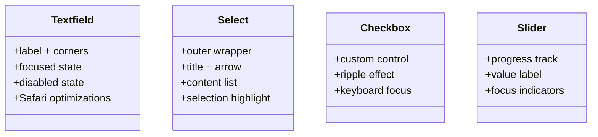
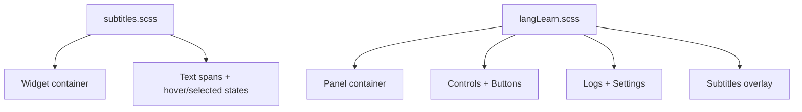
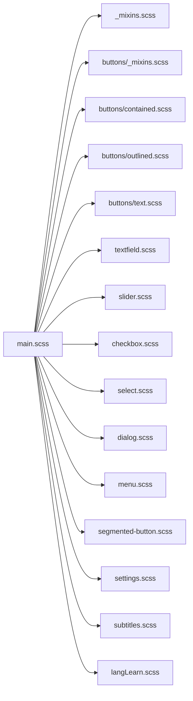

# Styling System

<cite>
**Referenced Files in This Document**
- [main.scss](file://src/styles/main.scss)
- [_mixins.scss](file://src/styles/_mixins.scss)
- [buttons/_mixins.scss](file://src/styles/components/buttons/_mixins.scss)
- [buttons/contained.scss](file://src/styles/components/buttons/contained.scss)
- [buttons/outlined.scss](file://src/styles/components/buttons/outlined.scss)
- [buttons/text.scss](file://src/styles/components/buttons/text.scss)
- [textfield.scss](file://src/styles/components/textfield.scss)
- [select.scss](file://src/styles/components/select.scss)
- [checkbox.scss](file://src/styles/components/checkbox.scss)
- [slider.scss](file://src/styles/components/slider.scss)
- [dialog.scss](file://src/styles/components/dialog.scss)
- [menu.scss](file://src/styles/components/menu.scss)
- [segmented-button.scss](file://src/styles/components/segmented-button.scss)
- [settings.scss](file://src/styles/components/settings.scss)
- [subtitles.scss](file://src/styles/subtitles.scss)
- [langLearn.scss](file://src/styles/langLearn.scss)
</cite>

## Table of Contents
1. [Introduction](#introduction)
2. [Project Structure](#project-structure)
3. [Core Components](#core-components)
4. [Architecture Overview](#architecture-overview)
5. [Detailed Component Analysis](#detailed-component-analysis)
6. [Dependency Analysis](#dependency-analysis)
7. [Performance Considerations](#performance-considerations)
8. [Troubleshooting Guide](#troubleshooting-guide)
9. [Conclusion](#conclusion)
10. [Appendices](#appendices)

## Introduction
This document describes the SCSS-based styling system used by the application. It explains the main stylesheet architecture, import structure, and organization principles. It documents component-specific styles, mixins, and theme support, including the button system (contained, outlined, text), dialog styling, settings panel layouts, and specialized visual treatments. Practical guidance is provided for customizing component appearance, creating new themes, and maintaining visual consistency, along with best practices for CSS architecture, performance, and browser compatibility.

## Project Structure
The styling system is organized around a central entry point that imports component-specific styles and defines global design tokens. Component styles are grouped by feature under a components directory, with dedicated files for each UI element. Shared mixins and utilities live alongside the main stylesheet.

```mermaid
graph TB
A["src/styles/main.scss"] --> B["src/styles/components/buttons/contained.scss"]
A --> C["src/styles/components/buttons/outlined.scss"]
A --> D["src/styles/components/buttons/text.scss"]
A --> E["src/styles/components/textfield.scss"]
A --> F["src/styles/components/select.scss"]
A --> G["src/styles/components/checkbox.scss"]
A --> H["src/styles/components/slider.scss"]
A --> I["src/styles/components/dialog.scss"]
A --> J["src/styles/components/menu.scss"]
A --> K["src/styles/components/segmented-button.scss"]
A --> L["src/styles/components/settings.scss"]
A --> M["src/styles/subtitles.scss"]
A --> N["src/styles/langLearn.scss"]
A --> O["src/styles/_mixins.scss"]
B --> P["src/styles/components/buttons/_mixins.scss"]
```

**Diagram sources**
- [main.scss](file://src/styles/main.scss)
- [buttons/contained.scss](file://src/styles/components/buttons/contained.scss)
- [buttons/outlined.scss](file://src/styles/components/buttons/outlined.scss)
- [buttons/text.scss](file://src/styles/components/buttons/text.scss)
- [textfield.scss](file://src/styles/components/textfield.scss)
- [select.scss](file://src/styles/components/select.scss)
- [checkbox.scss](file://src/styles/components/checkbox.scss)
- [slider.scss](file://src/styles/components/slider.scss)
- [dialog.scss](file://src/styles/components/dialog.scss)
- [menu.scss](file://src/styles/components/menu.scss)
- [segmented-button.scss](file://src/styles/components/segmented-button.scss)
- [settings.scss](file://src/styles/components/settings.scss)
- [subtitles.scss](file://src/styles/subtitles.scss)
- [langLearn.scss](file://src/styles/langLearn.scss)
- [_mixins.scss](file://src/styles/_mixins.scss)
- [buttons/_mixins.scss](file://src/styles/components/buttons/_mixins.scss)

**Section sources**
- [main.scss](file://src/styles/main.scss)
- [_mixins.scss](file://src/styles/_mixins.scss)

## Core Components
- Theme tokens and global baseline: Centralized design tokens (colors, spacing, radii, shadows, transitions, focus rings) are defined in the main stylesheet. These variables power component visuals and ensure consistent theming across the UI.
- Component imports: The main stylesheet imports all component styles, establishing a single entry point for styling.
- Shared mixins: Global mixins encapsulate cross-cutting concerns like font family, hidden attribute behavior, and overlay scrollbar styling. Button mixins define reusable base shapes, layers, and interaction states.

Key responsibilities:
- main.scss: Defines theme variables, global typography and focus behavior, portal stacking, and imports all component styles.
- _mixins.scss: Provides shared utilities for font families, hidden attributes, and overlay scrollbars.
- buttons/_mixins.scss: Encapsulates button base layout, ripple-like interaction layers, and disabled state resets.

**Section sources**
- [main.scss](file://src/styles/main.scss)
- [_mixins.scss](file://src/styles/_mixins.scss)
- [buttons/_mixins.scss](file://src/styles/components/buttons/_mixins.scss)

## Architecture Overview
The styling architecture follows a modular, component-centric approach:
- Centralized theme tokens in :root variables.
- Feature-based SCSS files per component.
- Shared mixins for common patterns.
- Explicit import ordering in the main stylesheet to ensure proper cascade and specificity.

**Diagram sources**
- [main.scss](file://src/styles/main.scss)
- [_mixins.scss](file://src/styles/_mixins.scss)
- [buttons/_mixins.scss](file://src/styles/components/buttons/_mixins.scss)
- [buttons/contained.scss](file://src/styles/components/buttons/contained.scss)
- [buttons/outlined.scss](file://src/styles/components/buttons/outlined.scss)
- [buttons/text.scss](file://src/styles/components/buttons/text.scss)
- [textfield.scss](file://src/styles/components/textfield.scss)
- [select.scss](file://src/styles/components/select.scss)
- [checkbox.scss](file://src/styles/components/checkbox.scss)
- [slider.scss](file://src/styles/components/slider.scss)
- [dialog.scss](file://src/styles/components/dialog.scss)
- [menu.scss](file://src/styles/components/menu.scss)
- [settings.scss](file://src/styles/components/settings.scss)
- [subtitles.scss](file://src/styles/subtitles.scss)
- [langLearn.scss](file://src/styles/langLearn.scss)

## Detailed Component Analysis

### Button System (Contained, Outlined, Text)
The button system is built on a shared mixin library that defines:
- Base shape and layout: radius, padding, min-width, height, line-height, font settings.
- Interaction layers: pseudo-elements for hover and active feedback with configurable opacity and timing.
- Disabled state reset: ensures no residual layer effects when disabled.

**Diagram sources**
- [buttons/_mixins.scss](file://src/styles/components/buttons/_mixins.scss)
- [buttons/contained.scss](file://src/styles/components/buttons/contained.scss)
- [buttons/outlined.scss](file://src/styles/components/buttons/outlined.scss)
- [buttons/text.scss](file://src/styles/components/buttons/text.scss)

Practical customization tips:
- Adjust theme colors via CSS variables (e.g., primary/onsurface) to change button color scheme.
- Modify spacing and typography tokens to adapt sizes and density.
- Override transition durations or easing for motion preferences.

**Section sources**
- [buttons/_mixins.scss](file://src/styles/components/buttons/_mixins.scss)
- [buttons/contained.scss](file://src/styles/components/buttons/contained.scss)
- [buttons/outlined.scss](file://src/styles/components/buttons/outlined.scss)
- [buttons/text.scss](file://src/styles/components/buttons/text.scss)

### Dialog and Menu Layouts
Dialogs and menus share a consistent layout model:
- Container and backdrop management with visibility and opacity transitions.
- Content areas for header, title, body, and footer with consistent spacing and alignment.
- Scrollbar styling for overlay content using shared mixins.
- Responsive adjustments for mobile footers and action button sizing.

**Diagram sources**
- [dialog.scss](file://src/styles/components/dialog.scss)
- [_mixins.scss](file://src/styles/_mixins.scss)

**Section sources**
- [dialog.scss](file://src/styles/components/dialog.scss)
- [menu.scss](file://src/styles/components/menu.scss)
- [_mixins.scss](file://src/styles/_mixins.scss)

### Settings Panel Layouts
Settings panels define a repeatable section structure with:
- Section headers with chevron rotation for open/closed states.
- A content grid with consistent row gaps and control widths.
- Specialized overrides for textfields to avoid legacy “notched” styles and ensure readability.

**Diagram sources**
- [settings.scss](file://src/styles/components/settings.scss)

**Section sources**
- [settings.scss](file://src/styles/components/settings.scss)

### Inputs and Controls
- Textfield: Implements a modern label-with-corner-decoration style with focused and disabled states, plus Safari-specific optimizations.
- Select: Provides a compact outer wrapper with arrow icon and a content list for items, including selection highlighting and disabled states.
- Checkbox: Custom-styled control with ripple-like interaction, nested indentation support, and keyboard focus indicators.
- Slider: Range input with progress track, value label, and distinct focus indicators for keyboard navigation.

**Diagram sources**
- [textfield.scss](file://src/styles/components/textfield.scss)
- [select.scss](file://src/styles/components/select.scss)
- [checkbox.scss](file://src/styles/components/checkbox.scss)
- [slider.scss](file://src/styles/components/slider.scss)

**Section sources**
- [textfield.scss](file://src/styles/components/textfield.scss)
- [select.scss](file://src/styles/components/select.scss)
- [checkbox.scss](file://src/styles/components/checkbox.scss)
- [slider.scss](file://src/styles/components/slider.scss)

### Subtitles and Language Learning Panels
- Subtitles: Fixed positioning with robust typography, background, and shadow styling. Supports fullscreen scaling and safe-area adjustments.
- Language learn panel: Floating panel with backdrop blur, controls, counters, logs, and LLM settings sections.

**Diagram sources**
- [subtitles.scss](file://src/styles/subtitles.scss)
- [langLearn.scss](file://src/styles/langLearn.scss)

**Section sources**
- [subtitles.scss](file://src/styles/subtitles.scss)
- [langLearn.scss](file://src/styles/langLearn.scss)

## Dependency Analysis
The main stylesheet orchestrates imports and establishes the theme layer. Component files depend on:
- Shared mixins for typography and overlay scrollbars.
- Button mixins for consistent button behavior.
- Theme variables for colors, spacing, radii, and motion.

**Diagram sources**
- [main.scss](file://src/styles/main.scss)
- [_mixins.scss](file://src/styles/_mixins.scss)
- [buttons/_mixins.scss](file://src/styles/components/buttons/_mixins.scss)
- [buttons/contained.scss](file://src/styles/components/buttons/contained.scss)
- [buttons/outlined.scss](file://src/styles/components/buttons/outlined.scss)
- [buttons/text.scss](file://src/styles/components/buttons/text.scss)
- [textfield.scss](file://src/styles/components/textfield.scss)
- [slider.scss](file://src/styles/components/slider.scss)
- [checkbox.scss](file://src/styles/components/checkbox.scss)
- [select.scss](file://src/styles/components/select.scss)
- [dialog.scss](file://src/styles/components/dialog.scss)
- [menu.scss](file://src/styles/components/menu.scss)
- [segmented-button.scss](file://src/styles/components/segmented-button.scss)
- [settings.scss](file://src/styles/components/settings.scss)
- [subtitles.scss](file://src/styles/subtitles.scss)
- [langLearn.scss](file://src/styles/langLearn.scss)

**Section sources**
- [main.scss](file://src/styles/main.scss)

## Performance Considerations
- Minimize repaints and reflows by leveraging transform and opacity for animations.
- Use contain and isolation to limit style and layout recalculation for overlays and subtitles.
- Prefer CSS variables for theme tokens to enable efficient runtime switching without heavy DOM churn.
- Avoid excessive specificity and deep nesting to keep selectors lightweight.
- Use prefers-reduced-motion to disable or shorten transitions for sensitive users.

## Troubleshooting Guide
Common issues and resolutions:
- Host page style leaks: The global baseline sets explicit font families and resets, and uses isolation for overlays to prevent host overrides. Confirm that injected elements are wrapped under the expected selectors.
- Focus rings not visible: The keyboard navigation policy adds explicit focus rings only for keyboard users. Verify that the global HTML class toggling is functioning as intended.
- Scrollbars inconsistent: Use the shared overlay scrollbar mixin to normalize appearance across platforms.
- Disabled button visuals: Ensure disabled states are applied consistently using the provided mixins and attributes.
- Mobile dialog/footer overflow: The dialog stylesheet includes responsive adjustments for footer actions on small screens.

**Section sources**
- [main.scss](file://src/styles/main.scss)
- [_mixins.scss](file://src/styles/_mixins.scss)
- [dialog.scss](file://src/styles/components/dialog.scss)

## Conclusion
The styling system is structured around centralized theme tokens, modular component SCSS files, and shared mixins. The button system demonstrates reusable patterns for contained, outlined, and text variants. Dialogs, menus, settings panels, inputs, and specialized widgets follow consistent layout and interaction models. By leveraging CSS variables and mixins, teams can customize appearance, maintain visual consistency, and ensure robust performance and accessibility.

## Appendices

### Theme Variables Reference
- Font family and baseline
- Primary and surface palette with on-color variants
- Spacing tokens (1–6 increments)
- Border color variants
- Radius tokens (xs–l)
- Shadow tokens (1–2)
- Duration and easing tokens
- Focus ring colors and offsets

These variables are defined in the main stylesheet and consumed by components to achieve consistent theming.

**Section sources**
- [main.scss](file://src/styles/main.scss)

### Creating a New Theme
Steps:
- Define new CSS variables for the desired palette in the theme layer.
- Update component styles to read from the new variables instead of hardcoded values.
- Test focus behavior, motion policies, and overlay scrollbars.
- Validate mobile responsiveness and host page isolation.

**Section sources**
- [main.scss](file://src/styles/main.scss)
- [_mixins.scss](file://src/styles/_mixins.scss)