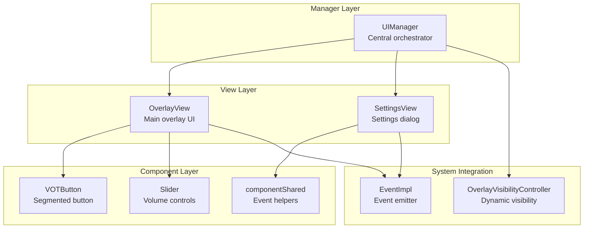
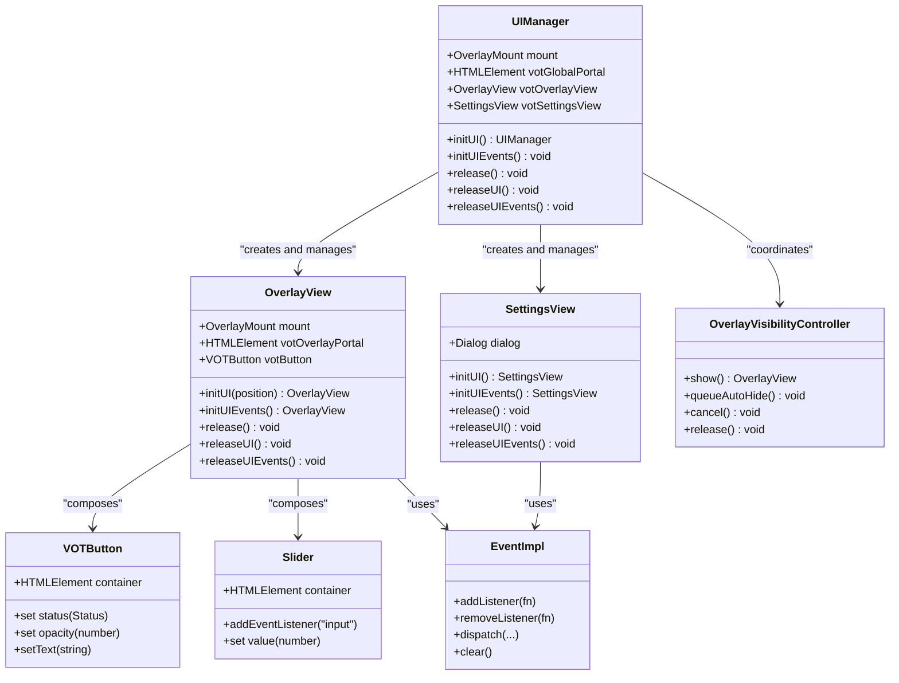
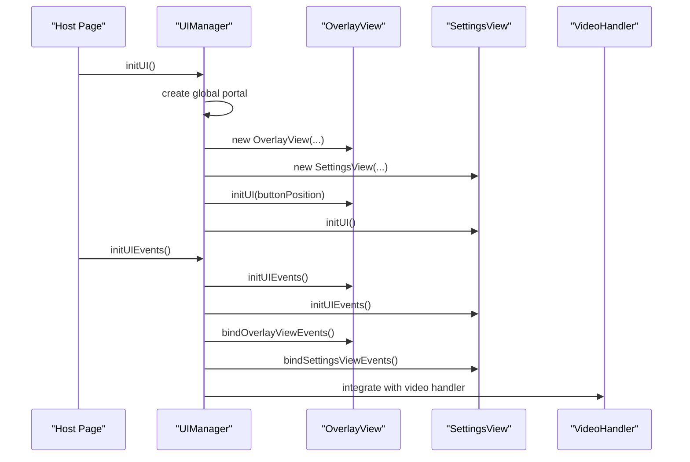
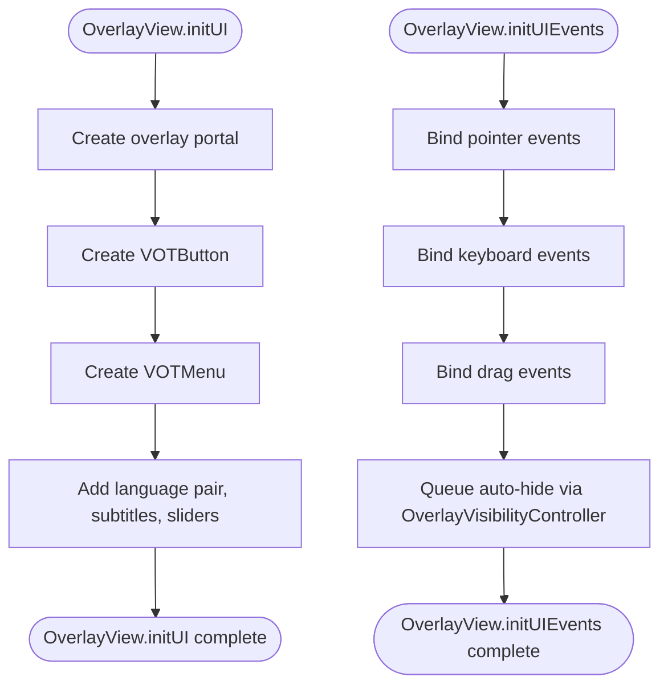
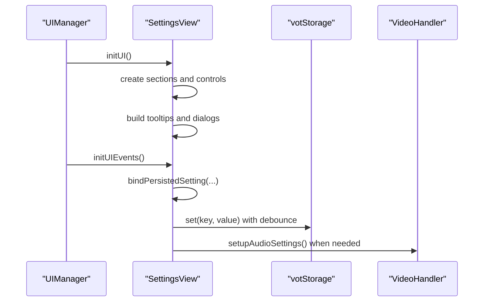
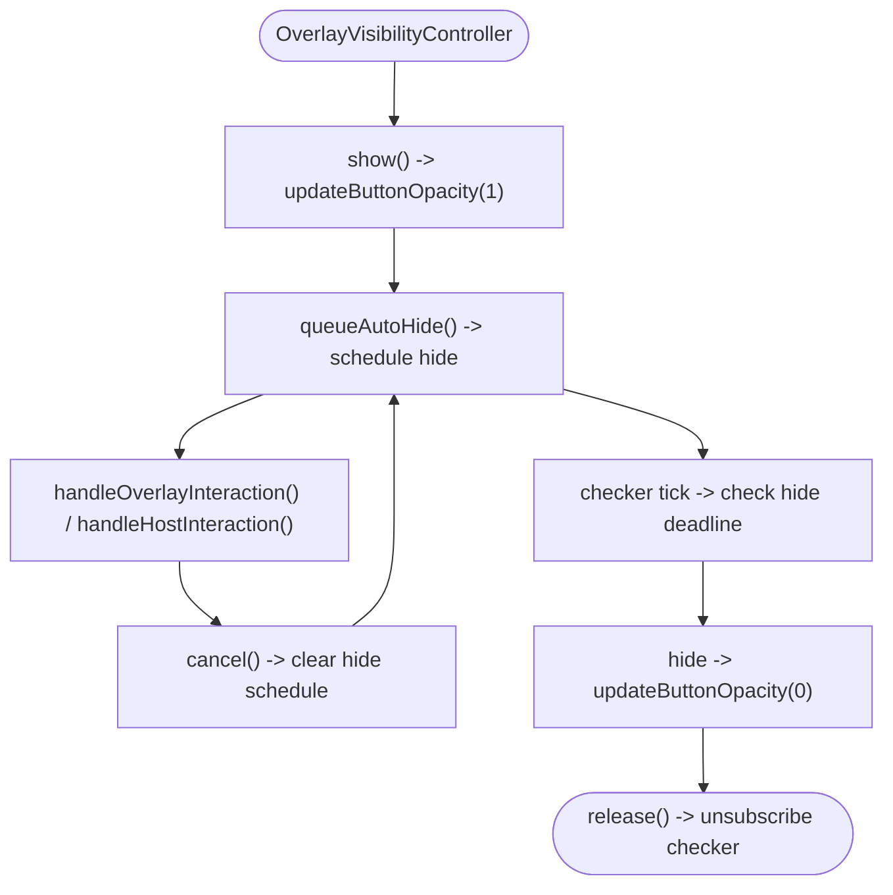
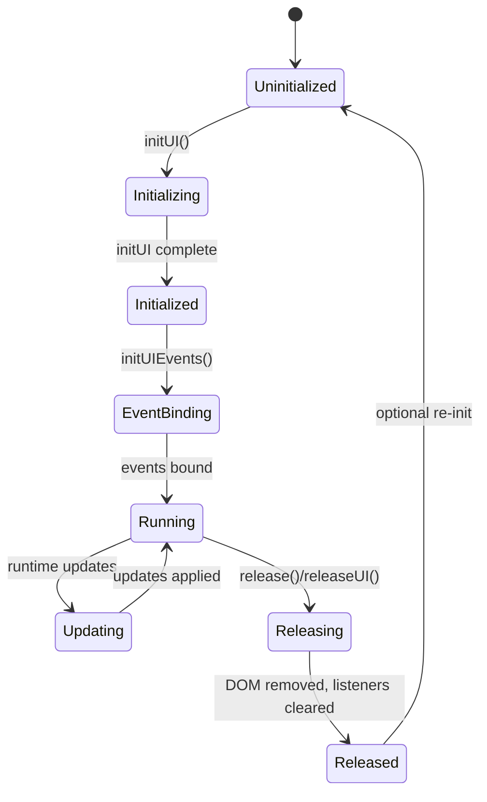
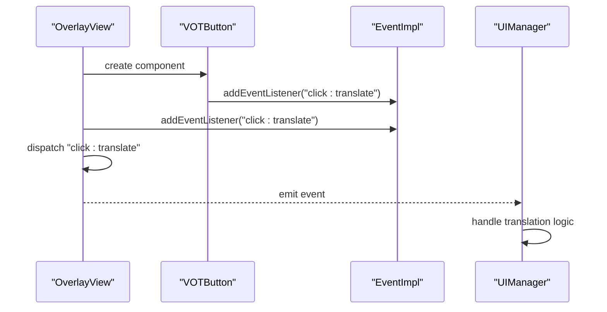
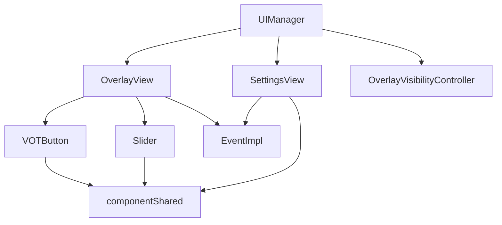

# UI Manager Architecture

<cite>
**Referenced Files in This Document**
- [src/ui/manager.ts](file://src/ui/manager.ts)
- [src/ui/overlayVisibilityController.ts](file://src/ui/overlayVisibilityController.ts)
- [src/types/uiManager.ts](file://src/types/uiManager.ts)
- [src/ui/views/overlay.ts](file://src/ui/views/overlay.ts)
- [src/ui/views/settings.ts](file://src/ui/views/settings.ts)
- [src/ui/components/votButton.ts](file://src/ui/components/votButton.ts)
- [src/ui/components/slider.ts](file://src/ui/components/slider.ts)
- [src/ui/components/componentShared.ts](file://src/ui/components/componentShared.ts)
- [src/core/eventImpl.ts](file://src/core/eventImpl.ts)
</cite>

## Table of Contents
1. [Introduction](#introduction)
2. [Project Structure](#project-structure)
3. [Core Components](#core-components)
4. [Architecture Overview](#architecture-overview)
5. [Detailed Component Analysis](#detailed-component-analysis)
6. [Dependency Analysis](#dependency-analysis)
7. [Performance Considerations](#performance-considerations)
8. [Troubleshooting Guide](#troubleshooting-guide)
9. [Conclusion](#conclusion)

## Introduction
This document explains the UI Manager architecture and component lifecycle management for the Voice Over Translation (VOT) project. It focuses on the UIManager class as the central orchestrator for UI components, covering initialization sequences, component mounting, event binding, state management, overlay visibility control, portal-based architecture, lifecycle management, event delegation, and integration with the video handler. Practical examples and performance considerations are included to help developers implement, debug, and extend the UI system effectively.

## Project Structure
The UI system is organized around three main layers:
- Manager Layer: Orchestrates UI initialization, event binding, and lifecycle management.
- View Layer: Encapsulates overlay and settings UIs with their own initialization and event systems.
- Component Layer: Reusable UI widgets (buttons, sliders, tooltips) with shared event utilities.

**Diagram sources**
- [src/ui/manager.ts:56-138](file://src/ui/manager.ts#L56-L138)
- [src/ui/views/overlay.ts:29-116](file://src/ui/views/overlay.ts#L29-L116)
- [src/ui/views/settings.ts:99-181](file://src/ui/views/settings.ts#L99-L181)
- [src/ui/components/votButton.ts:18-60](file://src/ui/components/votButton.ts#L18-L60)
- [src/ui/components/slider.ts:9-40](file://src/ui/components/slider.ts#L9-L40)
- [src/ui/components/componentShared.ts:5-25](file://src/ui/components/componentShared.ts#L5-L25)
- [src/core/eventImpl.ts:11-67](file://src/core/eventImpl.ts#L11-L67)
- [src/ui/overlayVisibilityController.ts:18-29](file://src/ui/overlayVisibilityController.ts#L18-L29)

**Section sources**
- [src/ui/manager.ts:56-138](file://src/ui/manager.ts#L56-L138)
- [src/ui/views/overlay.ts:29-116](file://src/ui/views/overlay.ts#L29-L116)
- [src/ui/views/settings.ts:99-181](file://src/ui/views/settings.ts#L99-L181)
- [src/ui/components/votButton.ts:18-60](file://src/ui/components/votButton.ts#L18-L60)
- [src/ui/components/slider.ts:9-40](file://src/ui/components/slider.ts#L9-L40)
- [src/ui/components/componentShared.ts:5-25](file://src/ui/components/componentShared.ts#L5-L25)
- [src/core/eventImpl.ts:11-67](file://src/core/eventImpl.ts#L11-L67)
- [src/ui/overlayVisibilityController.ts:18-29](file://src/ui/overlayVisibilityController.ts#L18-L29)

## Core Components
This section introduces the primary building blocks of the UI system and their roles.

- UIManager: Central orchestrator responsible for initializing portals, overlay, settings, binding events, coordinating downloads, and managing lifecycle.
- OverlayView: Main overlay UI containing the VOT button, menu, and controls. Manages drag-and-drop positioning, auto-hide behavior, and component mounting.
- SettingsView: Settings dialog with persisted preferences, account integration, and advanced options.
- VOTButton: Segmented button with translate, PiP, learn, and menu actions.
- Slider: Volume control with label and progress visualization.
- EventImpl: Lightweight event emitter used by components and views.
- OverlayVisibilityController: Centralizes overlay visibility behavior including show/hide, auto-hide scheduling, and interaction handling.

**Section sources**
- [src/ui/manager.ts:56-138](file://src/ui/manager.ts#L56-L138)
- [src/ui/views/overlay.ts:29-116](file://src/ui/views/overlay.ts#L29-L116)
- [src/ui/views/settings.ts:99-181](file://src/ui/views/settings.ts#L99-L181)
- [src/ui/components/votButton.ts:18-60](file://src/ui/components/votButton.ts#L18-L60)
- [src/ui/components/slider.ts:9-40](file://src/ui/components/slider.ts#L9-L40)
- [src/core/eventImpl.ts:11-67](file://src/core/eventImpl.ts#L11-L67)
- [src/ui/overlayVisibilityController.ts:18-29](file://src/ui/overlayVisibilityController.ts#L18-L29)

## Architecture Overview
The UI Manager architecture follows a layered design:
- UIManager creates a global portal and initializes OverlayView and SettingsView.
- Views manage their own component composition and event wiring.
- EventImpl provides a robust event system with error isolation.
- OverlayVisibilityController manages overlay visibility during video playback.
- Portal-based architecture isolates UI from host page styles and improves cross-browser compatibility.

**Diagram sources**
- [src/ui/manager.ts:56-138](file://src/ui/manager.ts#L56-L138)
- [src/ui/views/overlay.ts:29-116](file://src/ui/views/overlay.ts#L29-L116)
- [src/ui/views/settings.ts:99-181](file://src/ui/views/settings.ts#L99-L181)
- [src/ui/components/votButton.ts:18-60](file://src/ui/components/votButton.ts#L18-L60)
- [src/ui/components/slider.ts:9-40](file://src/ui/components/slider.ts#L9-L40)
- [src/core/eventImpl.ts:11-67](file://src/core/eventImpl.ts#L11-L67)
- [src/ui/overlayVisibilityController.ts:18-29](file://src/ui/overlayVisibilityController.ts#L18-L29)

## Detailed Component Analysis

### UIManager: Central Orchestrator
The UIManager coordinates UI initialization, event binding, and lifecycle management. It creates a global portal and composes OverlayView and SettingsView. It binds overlay and settings events, handles downloads, and integrates with the video handler for translation and subtitles.

Key responsibilities:
- Initialization: Creates global portal, initializes overlay and settings views, preserves user preferences.
- Event Binding: Delegates overlay and settings event bindings to respective views.
- Downloads: Implements translation and subtitles download flows with progress reporting and fallbacks.
- Lifecycle Management: Supports partial and full releases, preserving initialized state when needed.
- Integration: Coordinates with video handler for translation, subtitles, PiP, and audio settings.

**Diagram sources**
- [src/ui/manager.ts:109-157](file://src/ui/manager.ts#L109-L157)
- [src/ui/views/overlay.ts:404-401](file://src/ui/views/overlay.ts#L404-L401)
- [src/ui/views/settings.ts:311-358](file://src/ui/views/settings.ts#L311-L358)

**Section sources**
- [src/ui/manager.ts:56-138](file://src/ui/manager.ts#L56-L138)
- [src/ui/manager.ts:147-157](file://src/ui/manager.ts#L147-L157)
- [src/ui/manager.ts:451-508](file://src/ui/manager.ts#L451-L508)
- [src/ui/manager.ts:510-539](file://src/ui/manager.ts#L510-L539)
- [src/ui/manager.ts:860-897](file://src/ui/manager.ts#L860-L897)

### OverlayView: Dynamic Overlay UI
OverlayView manages the main overlay UI, including the VOT button, menu, and controls. It supports drag-and-drop positioning, auto-hide behavior, and portal-based mounting for isolation.

Key capabilities:
- Initialization: Creates overlay portal, VOT button, menu, and controls.
- Event Wiring: Binds pointer, keyboard, and drag events; manages menu open/close and focus.
- Auto-hide: Integrates with OverlayVisibilityController for visibility management.
- Mount Updates: Moves components when the video container changes.

**Diagram sources**
- [src/ui/views/overlay.ts:252-402](file://src/ui/views/overlay.ts#L252-L402)
- [src/ui/views/overlay.ts:404-799](file://src/ui/views/overlay.ts#L404-L799)
- [src/ui/views/overlay.ts:800-1081](file://src/ui/views/overlay.ts#L800-L1081)

**Section sources**
- [src/ui/views/overlay.ts:29-116](file://src/ui/views/overlay.ts#L29-L116)
- [src/ui/views/overlay.ts:252-402](file://src/ui/views/overlay.ts#L252-L402)
- [src/ui/views/overlay.ts:404-799](file://src/ui/views/overlay.ts#L404-L799)
- [src/ui/views/overlay.ts:800-1081](file://src/ui/views/overlay.ts#L800-L1081)

### SettingsView: Settings Dialog
SettingsView encapsulates the settings dialog with persisted preferences, account integration, and advanced options. It uses a robust event system and delayed persistence for performance.

Key features:
- Initialization: Builds accordion sections, form controls, and tooltips.
- Event Binding: Persists settings with debounced storage writes.
- Account Integration: Token-based login and refresh flows.
- Advanced Options: Proxy settings, audio player options, and localization.

**Diagram sources**
- [src/ui/views/settings.ts:311-358](file://src/ui/views/settings.ts#L311-L358)
- [src/ui/views/settings.ts:861-860](file://src/ui/views/settings.ts#L861-L860)
- [src/ui/views/settings.ts:904-914](file://src/ui/views/settings.ts#L904-L914)

**Section sources**
- [src/ui/views/settings.ts:99-181](file://src/ui/views/settings.ts#L99-L181)
- [src/ui/views/settings.ts:311-358](file://src/ui/views/settings.ts#L311-L358)
- [src/ui/views/settings.ts:861-860](file://src/ui/views/settings.ts#L861-L860)
- [src/ui/views/settings.ts:904-914](file://src/ui/views/settings.ts#L904-L914)

### OverlayVisibilityController: Dynamic Visibility Management
OverlayVisibilityController centralizes overlay visibility behavior, including immediate show, scheduled auto-hide, and interaction handling. It integrates with an interval-based idle checker to optimize performance.

Responsibilities:
- Immediate Show: Ensures overlay is visible when triggered.
- Auto-Hide Scheduling: Schedules hide after a configurable delay.
- Interaction Handling: Handles overlay and host interactions to adjust visibility.
- Cleanup: Releases subscriptions and cancels timers.

**Diagram sources**
- [src/ui/overlayVisibilityController.ts:18-29](file://src/ui/overlayVisibilityController.ts#L18-L29)
- [src/ui/overlayVisibilityController.ts:34-41](file://src/ui/overlayVisibilityController.ts#L34-L41)
- [src/ui/overlayVisibilityController.ts:59-70](file://src/ui/overlayVisibilityController.ts#L59-L70)
- [src/ui/overlayVisibilityController.ts:75-93](file://src/ui/overlayVisibilityController.ts#L75-L93)
- [src/ui/overlayVisibilityController.ts:152-176](file://src/ui/overlayVisibilityController.ts#L152-L176)
- [src/ui/overlayVisibilityController.ts:51-54](file://src/ui/overlayVisibilityController.ts#L51-L54)

**Section sources**
- [src/ui/overlayVisibilityController.ts:18-29](file://src/ui/overlayVisibilityController.ts#L18-L29)
- [src/ui/overlayVisibilityController.ts:34-41](file://src/ui/overlayVisibilityController.ts#L34-L41)
- [src/ui/overlayVisibilityController.ts:59-70](file://src/ui/overlayVisibilityController.ts#L59-L70)
- [src/ui/overlayVisibilityController.ts:75-93](file://src/ui/overlayVisibilityController.ts#L75-L93)
- [src/ui/overlayVisibilityController.ts:152-176](file://src/ui/overlayVisibilityController.ts#L152-L176)
- [src/ui/overlayVisibilityController.ts:51-54](file://src/ui/overlayVisibilityController.ts#L51-L54)

### Portal-Based Architecture and Cross-Browser Compatibility
The UI system uses portals to isolate components from host page styles and improve cross-browser compatibility:
- Global Portal: UIManager creates a global portal appended to documentElement for overlays and dialogs.
- Overlay Portal: OverlayView creates a dedicated overlay portal within the overlay container for tooltips and menus.
- Isolation: Portals prevent host page CSS from interfering with component rendering and behavior.
- Compatibility: Portals enable consistent behavior across different hosts and environments.

**Section sources**
- [src/ui/manager.ts:116-117](file://src/ui/manager.ts#L116-L117)
- [src/ui/views/overlay.ts:262-263](file://src/ui/views/overlay.ts#L262-L263)

### Component Lifecycle Management
The lifecycle spans initialization, event binding, runtime updates, and cleanup:
- Initialization: Components are constructed and mounted into portals.
- Event Binding: Views bind DOM and component events; components register listeners.
- Runtime Updates: Settings are persisted with debounced writes; UI state updates dynamically.
- Cleanup: Views and components release DOM nodes, cancel timers, and clear event listeners.

**Diagram sources**
- [src/ui/views/overlay.ts:252-402](file://src/ui/views/overlay.ts#L252-L402)
- [src/ui/views/overlay.ts:1019-1052](file://src/ui/views/overlay.ts#L1019-L1052)
- [src/ui/views/settings.ts:311-358](file://src/ui/views/settings.ts#L311-L358)
- [src/ui/views/settings.ts:1324-1344](file://src/ui/views/settings.ts#L1324-L1344)

**Section sources**
- [src/ui/views/overlay.ts:1019-1052](file://src/ui/views/overlay.ts#L1019-L1052)
- [src/ui/views/settings.ts:1324-1344](file://src/ui/views/settings.ts#L1324-L1344)

### Event Delegation and Component Communication
Event delegation is implemented through EventImpl, providing strong typing and error isolation:
- Component Events: Components expose add/remove listeners for internal events.
- View Events: Views define event maps and dispatch events to subscribers.
- UIManager Integration: UIManager listens to view events and coordinates with the video handler.

**Diagram sources**
- [src/ui/views/overlay.ts:468-483](file://src/ui/views/overlay.ts#L468-L483)
- [src/ui/components/votButton.ts:18-60](file://src/ui/components/votButton.ts#L18-L60)
- [src/core/eventImpl.ts:11-67](file://src/core/eventImpl.ts#L11-L67)

**Section sources**
- [src/ui/views/overlay.ts:468-483](file://src/ui/views/overlay.ts#L468-L483)
- [src/ui/components/votButton.ts:18-60](file://src/ui/components/votButton.ts#L18-L60)
- [src/core/eventImpl.ts:11-67](file://src/core/eventImpl.ts#L11-L67)

### Practical Examples

- UI Initialization
  - Create UIManager with mount points, data, video handler, and interval idle checker.
  - Call initUI() to create global portal and initialize overlay and settings.
  - Call initUIEvents() to bind all component and view events.

- Component Registration
  - OverlayView registers VOTButton, menu, and controls during initUI().
  - SettingsView registers form controls and dialogs during initUI().
  - EventImpl listeners are registered per component and view.

- Event Handling Patterns
  - OverlayView emits "click:translate", "input:videoVolume", "select:subtitles".
  - SettingsView emits "change:syncVolume", "select:buttonPosition", "click:resetSettings".
  - UIManager subscribes to these events and coordinates with the video handler.

**Section sources**
- [src/ui/manager.ts:109-157](file://src/ui/manager.ts#L109-L157)
- [src/ui/views/overlay.ts:404-799](file://src/ui/views/overlay.ts#L404-L799)
- [src/ui/views/settings.ts:861-860](file://src/ui/views/settings.ts#L861-L860)

## Dependency Analysis
The UI system exhibits low coupling and high cohesion:
- UIManager depends on OverlayView, SettingsView, and OverlayVisibilityController.
- OverlayView and SettingsView depend on shared components and EventImpl.
- Components depend on componentShared utilities for event helpers.
- EventImpl is a shared dependency across components and views.

**Diagram sources**
- [src/ui/manager.ts:56-138](file://src/ui/manager.ts#L56-L138)
- [src/ui/views/overlay.ts:29-116](file://src/ui/views/overlay.ts#L29-L116)
- [src/ui/views/settings.ts:99-181](file://src/ui/views/settings.ts#L99-L181)
- [src/ui/components/votButton.ts:18-60](file://src/ui/components/votButton.ts#L18-L60)
- [src/ui/components/slider.ts:9-40](file://src/ui/components/slider.ts#L9-L40)
- [src/ui/components/componentShared.ts:5-25](file://src/ui/components/componentShared.ts#L5-L25)
- [src/core/eventImpl.ts:11-67](file://src/core/eventImpl.ts#L11-L67)
- [src/ui/overlayVisibilityController.ts:18-29](file://src/ui/overlayVisibilityController.ts#L18-L29)

**Section sources**
- [src/ui/manager.ts:56-138](file://src/ui/manager.ts#L56-L138)
- [src/ui/views/overlay.ts:29-116](file://src/ui/views/overlay.ts#L29-L116)
- [src/ui/views/settings.ts:99-181](file://src/ui/views/settings.ts#L99-L181)
- [src/ui/components/votButton.ts:18-60](file://src/ui/components/votButton.ts#L18-L60)
- [src/ui/components/slider.ts:9-40](file://src/ui/components/slider.ts#L9-L40)
- [src/ui/components/componentShared.ts:5-25](file://src/ui/components/componentShared.ts#L5-L25)
- [src/core/eventImpl.ts:11-67](file://src/core/eventImpl.ts#L11-L67)
- [src/ui/overlayVisibilityController.ts:18-29](file://src/ui/overlayVisibilityController.ts#L18-L29)

## Performance Considerations
- Debounced Persistence: SettingsView uses a debounced persistence mechanism to reduce storage writes and improve responsiveness.
- Interval-Based Idle Checker: OverlayView uses an interval-based checker to batch drag updates and visibility checks.
- Minimal DOM Writes: OverlayView avoids redundant style writes by checking opacity deltas before updating.
- Event Isolation: EventImpl isolates listener errors to prevent cascading failures.
- Portal Isolation: Portals minimize style conflicts and reduce reflows caused by host page styles.

[No sources needed since this section provides general guidance]

## Troubleshooting Guide
Common issues and resolutions:
- UI Already Initialized: UIManager throws an error if initUI() is called when already initialized. Ensure release() is called before re-initializing.
- UI Not Initialized: Many methods require isInitialized() to be true. Check initialization order and error messages.
- Event Binding Failures: Verify that initUIEvents() is called after initUI(). Ensure event listeners are registered before interactions occur.
- Download Failures: UIManager implements fallbacks for downloads. Check network connectivity and fallback mechanisms.
- Memory Leaks: Use release(), releaseUI(), and releaseUIEvents() to clean up DOM nodes, timers, and event listeners.

**Section sources**
- [src/ui/manager.ts:110-112](file://src/ui/manager.ts#L110-L112)
- [src/ui/manager.ts:860-897](file://src/ui/manager.ts#L860-L897)
- [src/ui/views/overlay.ts:1019-1052](file://src/ui/views/overlay.ts#L1019-L1052)
- [src/ui/views/settings.ts:1324-1344](file://src/ui/views/settings.ts#L1324-L1344)

## Conclusion
The UI Manager architecture provides a robust, modular, and maintainable foundation for the VOT UI system. Through portal-based isolation, event delegation, and lifecycle management, it ensures reliable behavior across diverse hosts and environments. The OverlayVisibilityController enhances user experience by dynamically managing overlay visibility during video playback. By following the documented patterns and best practices, developers can extend and debug the UI system effectively.