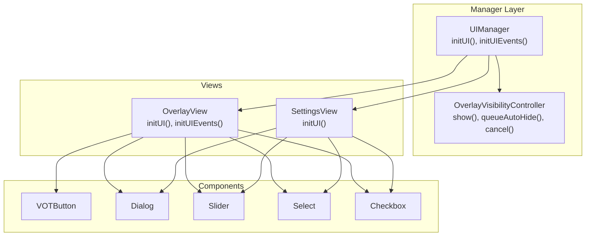
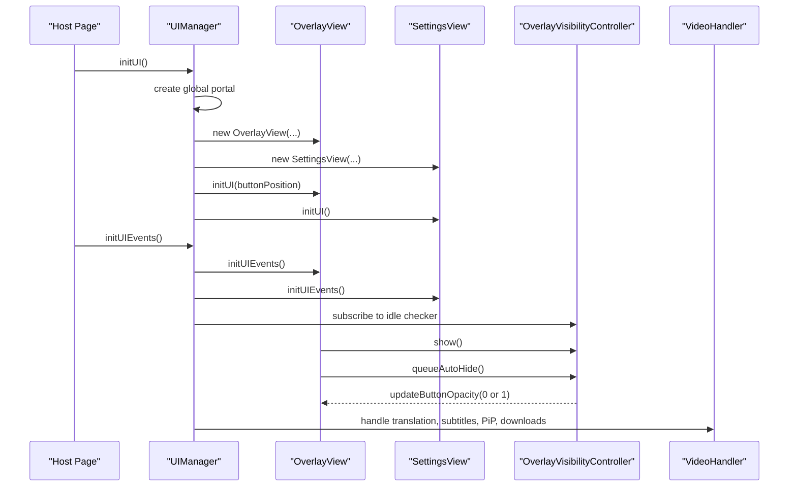
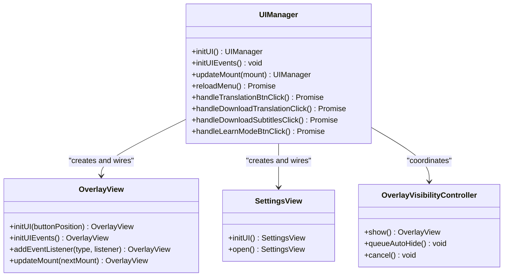
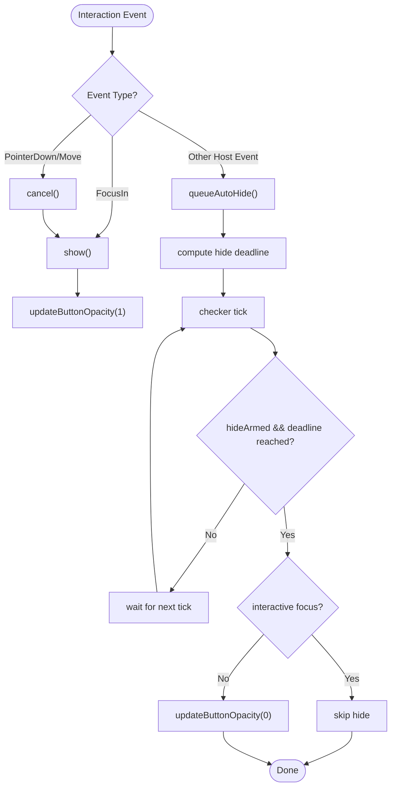
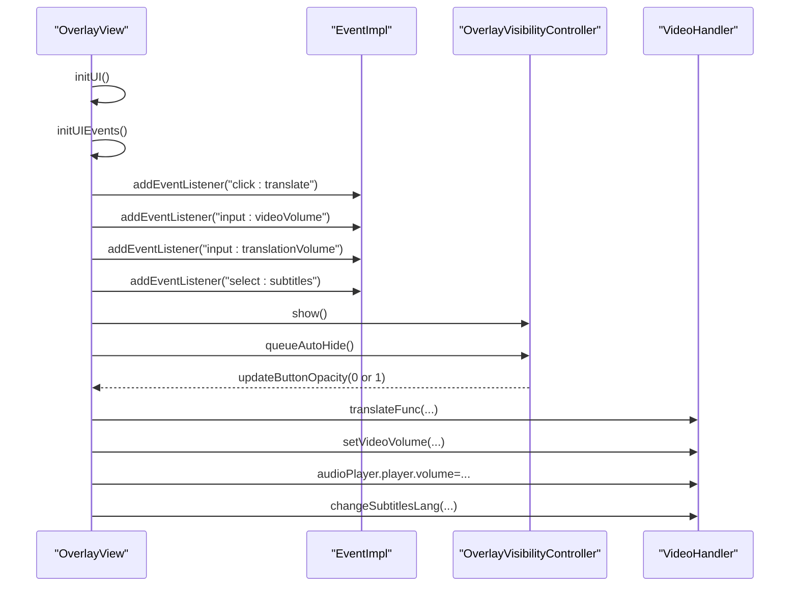
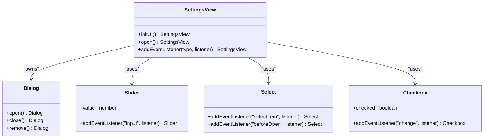
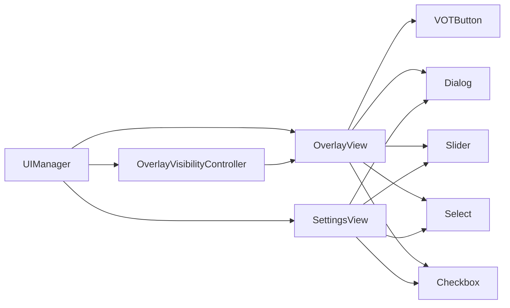

# User Interface Components

<cite>
**Referenced Files in This Document**
- [manager.ts](file://src/ui/manager.ts)
- [overlayVisibilityController.ts](file://src/ui/overlayVisibilityController.ts)
- [uiManager.ts](file://src/types/uiManager.ts)
- [overlay.ts](file://src/ui/views/overlay.ts)
- [settings.ts](file://src/ui/views/settings.ts)
- [componentShared.ts](file://src/ui/components/componentShared.ts)
- [votButton.ts](file://src/ui/components/votButton.ts)
- [dialog.ts](file://src/ui/components/dialog.ts)
- [slider.ts](file://src/ui/components/slider.ts)
- [select.ts](file://src/ui/components/select.ts)
- [checkbox.ts](file://src/ui/components/checkbox.ts)
- [icons.ts](file://src/ui/icons.ts)
- [main.scss](file://src/styles/main.scss)
- [votButton.ts](file://src/types/components/votButton.ts)
- [overlay.ts](file://src/types/views/overlay.ts)
</cite>

## Table of Contents
1. [Introduction](#introduction)
2. [Project Structure](#project-structure)
3. [Core Components](#core-components)
4. [Architecture Overview](#architecture-overview)
5. [Detailed Component Analysis](#detailed-component-analysis)
6. [Dependency Analysis](#dependency-analysis)
7. [Performance Considerations](#performance-considerations)
8. [Troubleshooting Guide](#troubleshooting-guide)
9. [Conclusion](#conclusion)
10. [Appendices](#appendices)

## Introduction
This document describes the user interface component system used by the application. It covers the UI manager architecture, component lifecycle, state management, event handling, overlay visibility controller for dynamic UI during video playback, the component library (buttons, dialogs, sliders, form controls), the view system (overlay controls and settings panel), styling architecture with SCSS, and practical guidance for customization, accessibility, keyboard navigation, and responsive design.

## Project Structure
The UI system is organized into three primary layers:
- Manager: orchestrates initialization, wiring, and coordination between views and handlers.
- Views: overlay and settings panels that render and manage UI surfaces.
- Components: reusable UI primitives (buttons, dialogs, sliders, selects, checkboxes) with consistent accessibility and styling.

**Diagram sources**
- [manager.ts:56-138](file://src/ui/manager.ts#L56-L138)
- [overlayVisibilityController.ts:18-70](file://src/ui/overlayVisibilityController.ts#L18-L70)
- [overlay.ts:29-116](file://src/ui/views/overlay.ts#L29-L116)
- [settings.ts:99-181](file://src/ui/views/settings.ts#L99-L181)
- [votButton.ts:18-60](file://src/ui/components/votButton.ts#L18-L60)
- [dialog.ts:12-64](file://src/ui/components/dialog.ts#L12-L64)
- [slider.ts:9-40](file://src/ui/components/slider.ts#L9-L40)
- [select.ts:22-75](file://src/ui/components/select.ts#L22-L75)
- [checkbox.ts:14-41](file://src/ui/components/checkbox.ts#L14-L41)

**Section sources**
- [manager.ts:56-138](file://src/ui/manager.ts#L56-L138)
- [overlay.ts:29-116](file://src/ui/views/overlay.ts#L29-L116)
- [settings.ts:99-181](file://src/ui/views/settings.ts#L99-L181)

## Core Components
This section documents the foundational UI manager and overlay visibility controller that coordinate lifecycle, state, and events.

- UIManager
  - Responsibilities: initialize portals, overlay, and settings views; bind events; orchestrate downloads and translation actions; manage persistence and UI reloads.
  - Lifecycle: initUI() creates global and overlay portals, initializes overlay and settings views, and preserves button position across reloads. initUIEvents() binds overlay and settings event handlers.
  - State: stores overlay mount points, global portal, overlay and settings views, and persistent data.
  - Event wiring: bridges overlay and settings events to video handler actions (volume, subtitles, PiP, translation, downloads).
  - Persistence: uses storage utilities to persist default volumes and other settings.

- OverlayVisibilityController
  - Responsibilities: centralizes overlay visibility behavior including immediate show, scheduled auto-hide, cancellation, and focus/pointer interaction handling.
  - State: tracks hide deadline, armed flag, and subscription to an idle checker.
  - Interaction model: handles overlay and host interactions; cancels hide on overlay pointer/focus; schedules hide on host pointer/focus; defers hide when interactive nodes are focused.

**Section sources**
- [manager.ts:56-138](file://src/ui/manager.ts#L56-L138)
- [overlayVisibilityController.ts:18-70](file://src/ui/overlayVisibilityController.ts#L18-L70)

## Architecture Overview
The UI architecture follows a layered design:
- UIManager coordinates initialization and event binding.
- OverlayView renders the primary overlay with VOTButton, menu, and controls.
- SettingsView renders a modal dialog with grouped settings sections.
- OverlayVisibilityController manages overlay visibility during playback.
- Components encapsulate state, events, and accessibility.

**Diagram sources**
- [manager.ts:109-157](file://src/ui/manager.ts#L109-L157)
- [overlay.ts:404-800](file://src/ui/views/overlay.ts#L404-L800)
- [settings.ts:311-357](file://src/ui/views/settings.ts#L311-L357)
- [overlayVisibilityController.ts:34-70](file://src/ui/overlayVisibilityController.ts#L34-L70)

## Detailed Component Analysis

### UIManager
- Initialization
  - Creates a global portal appended to document element.
  - Initializes OverlayView with preserved button position and SettingsView.
- Event Binding
  - OverlayView events: translation toggle, PiP, settings open, download actions, volume sliders, language selection.
  - SettingsView events: account updates, auto-translate/auto-subtitles, volume sync, audio booster, subtitles settings, proxy settings, PiP visibility, button position, menu language, bug report, reset settings.
- Downloads and Translation
  - Handles translation and subtitles downloads with progress reporting and fallbacks.
  - Coordinates with video handler for translation lifecycle and audio volume management.

**Diagram sources**
- [manager.ts:56-138](file://src/ui/manager.ts#L56-L138)
- [overlay.ts:29-116](file://src/ui/views/overlay.ts#L29-L116)
- [settings.ts:99-181](file://src/ui/views/settings.ts#L99-L181)
- [overlayVisibilityController.ts:18-70](file://src/ui/overlayVisibilityController.ts#L18-L70)

**Section sources**
- [manager.ts:109-157](file://src/ui/manager.ts#L109-L157)
- [manager.ts:159-449](file://src/ui/manager.ts#L159-L449)
- [manager.ts:451-539](file://src/ui/manager.ts#L451-L539)
- [manager.ts:541-671](file://src/ui/manager.ts#L541-L671)
- [manager.ts:673-733](file://src/ui/manager.ts#L673-L733)
- [manager.ts:735-800](file://src/ui/manager.ts#L735-L800)

### OverlayVisibilityController
- Behavior
  - show(): immediately sets overlay visible.
  - queueAutoHide(): computes hide deadline and arms the timer.
  - cancel(): clears scheduled hide.
  - handleOverlayInteraction(): reacts to overlay focus/pointer by showing and marking activity.
  - handleHostInteraction(): reacts to host focus/pointer by scheduling hide or cancelling depending on whether target is interactive.
  - scheduleHide(): schedules hide unless focus remains within overlay or interactive nodes.
- State and Timing
  - Uses an idle checker to tick and evaluate hide conditions.
  - Uses a performance.now()-like time source when available.

**Diagram sources**
- [overlayVisibilityController.ts:34-197](file://src/ui/overlayVisibilityController.ts#L34-L197)

**Section sources**
- [overlayVisibilityController.ts:18-70](file://src/ui/overlayVisibilityController.ts#L18-L70)
- [overlayVisibilityController.ts:75-150](file://src/ui/overlayVisibilityController.ts#L75-L150)
- [overlayVisibilityController.ts:152-197](file://src/ui/overlayVisibilityController.ts#L152-L197)

### OverlayView
- Responsibilities
  - Renders the overlay with VOTButton, menu, language pair selector, subtitles selector, and volume sliders.
  - Manages drag-and-drop positioning, keyboard navigation, and focus management.
  - Emits typed events for translation, PiP, settings, downloads, volume changes, and language/subtitles selection.
- Lifecycle
  - initUI(): creates portal, button, tooltip, menu, and controls; applies initial visibility and slider limits.
  - initUIEvents(): binds pointer and keyboard events; manages menu open/close; handles drag gestures; integrates with overlay visibility controller.
- Mount Updates
  - updateMount(): relocates nodes when player container changes; updates tooltip layout root.

**Diagram sources**
- [overlay.ts:252-402](file://src/ui/views/overlay.ts#L252-L402)
- [overlay.ts:404-800](file://src/ui/views/overlay.ts#L404-L800)
- [overlay.ts:134-171](file://src/ui/views/overlay.ts#L134-L171)
- [overlay.ts:198-210](file://src/ui/views/overlay.ts#L198-L210)

**Section sources**
- [overlay.ts:252-402](file://src/ui/views/overlay.ts#L252-L402)
- [overlay.ts:404-800](file://src/ui/views/overlay.ts#L404-L800)
- [overlay.ts:134-171](file://src/ui/views/overlay.ts#L134-L171)
- [overlay.ts:198-210](file://src/ui/views/overlay.ts#L198-L210)
- [overlay.ts:173-196](file://src/ui/views/overlay.ts#L173-L196)

### SettingsView
- Responsibilities
  - Renders a modal dialog with grouped sections (account, translation, subtitles, hotkeys, proxy, misc, appearance, about).
  - Binds persisted settings with debounced storage writes and immediate UI updates.
  - Emits events for account changes, auto-translate/auto-subtitles, volume synchronization, audio booster, subtitles settings, proxy changes, PiP visibility, button position, menu language, bug report, and reset settings.
- Persistence
  - Debounces storage writes for subtitle and UI settings; flushes pending writes on unload.

**Diagram sources**
- [settings.ts:311-357](file://src/ui/views/settings.ts#L311-L357)
- [settings.ts:99-181](file://src/ui/views/settings.ts#L99-L181)
- [dialog.ts:12-64](file://src/ui/components/dialog.ts#L12-L64)
- [slider.ts:9-40](file://src/ui/components/slider.ts#L9-L40)
- [select.ts:22-75](file://src/ui/components/select.ts#L22-L75)
- [checkbox.ts:14-41](file://src/ui/components/checkbox.ts#L14-L41)

**Section sources**
- [settings.ts:311-357](file://src/ui/views/settings.ts#L311-L357)
- [settings.ts:185-275](file://src/ui/views/settings.ts#L185-L275)
- [settings.ts:276-310](file://src/ui/views/settings.ts#L276-L310)

### Component Library

#### VOTButton
- Purpose: primary segmented button with translate, PiP, learn, and menu segments.
- State: position, direction, status ("none" | "error" | "success" | "loading"), opacity, label text.
- Accessibility: role="button", tabIndex=0, aria-label, aria-haspopup for menu.
- Dragging: supports pointer and touch events for cross-platform drag.

**Section sources**
- [votButton.ts:18-60](file://src/ui/components/votButton.ts#L18-L60)
- [votButton.ts:145-148](file://src/ui/components/votButton.ts#L145-L148)
- [votButton.ts:173-224](file://src/ui/components/votButton.ts#L173-L224)

#### Dialog
- Purpose: modal dialog with header, body, footer, and adaptive vertical alignment.
- Accessibility: ARIA dialog, modal behavior, focus trap, inert when hidden, Escape to close.
- Behavior: adaptive top/center alignment based on viewport and content height; manages focus restoration.

**Section sources**
- [dialog.ts:12-64](file://src/ui/components/dialog.ts#L12-L64)
- [dialog.ts:157-189](file://src/ui/components/dialog.ts#L157-L189)
- [dialog.ts:258-290](file://src/ui/components/dialog.ts#L258-L290)
- [dialog.ts:316-366](file://src/ui/components/dialog.ts#L316-L366)

#### Slider
- Purpose: configurable range input with label and progress visualization.
- State: value, min, max, step; emits input events with origin flag (setter vs user).
- Styling: CSS variable for progress percentage.

**Section sources**
- [slider.ts:9-40](file://src/ui/components/slider.ts#L9-L40)
- [slider.ts:101-114](file://src/ui/components/slider.ts#L101-L114)
- [slider.ts:128-138](file://src/ui/components/slider.ts#L128-L138)

#### Select
- Purpose: dropdown-like control with optional multi-select and search filtering.
- Behavior: opens a temporary dialog with search field and list; supports beforeOpen hook for async population.
- Accessibility: ARIA popup attributes, inert state for disabled items.

**Section sources**
- [select.ts:22-75](file://src/ui/components/select.ts#L22-L75)
- [select.ts:153-178](file://src/ui/components/select.ts#L153-L178)
- [select.ts:200-255](file://src/ui/components/select.ts#L200-L255)

#### Checkbox
- Purpose: labeled checkbox with change events.
- State: checked, disabled; supports sub-checkbox styling.

**Section sources**
- [checkbox.ts:14-41](file://src/ui/components/checkbox.ts#L14-L41)
- [checkbox.ts:98-112](file://src/ui/components/checkbox.ts#L98-L112)

#### Shared Utilities
- Component event registration helpers and hidden state management for consistent behavior across components.

**Section sources**
- [componentShared.ts:5-25](file://src/ui/components/componentShared.ts#L5-L25)
- [componentShared.ts:27-38](file://src/ui/components/componentShared.ts#L27-L38)

### View System: Overlay Controls and Settings Panel
- OverlayView
  - Hosts VOTButton, menu, language pair selector, subtitles selector, and volume controls.
  - Integrates with overlay visibility controller for auto-hide behavior.
  - Supports drag positioning and keyboard navigation.
- SettingsView
  - Modal dialog with grouped sections for all user preferences.
  - Binds component events to storage and video handler updates.

**Section sources**
- [overlay.ts:29-116](file://src/ui/views/overlay.ts#L29-L116)
- [overlay.ts:404-800](file://src/ui/views/overlay.ts#L404-L800)
- [settings.ts:311-357](file://src/ui/views/settings.ts#L311-L357)

### Styling Architecture with SCSS
- Design Tokens
  - Root variables define fonts, colors, spacing, radii, shadows, and focus rings.
- Component Modules
  - Stylesheets for buttons, textfields, checkboxes, sliders, selects, dialogs, tooltips, menus, loaders, labels, and settings.
- Global Baseline
  - Ensures consistent box-sizing, typography, and visibility for injected UI.
  - Focus handling: suppresses native outlines except for keyboard navigation; respects reduced-motion preferences.
  - Stacking boundaries for overlays and subtitles widgets.
- Theming Support
  - CSS variables enable theme overrides at root level; component styles consume these variables.

**Section sources**
- [main.scss:27-74](file://src/styles/main.scss#L27-L74)
- [main.scss:80-111](file://src/styles/main.scss#L80-L111)
- [main.scss:124-170](file://src/styles/main.scss#L124-L170)

### Practical Usage Examples and Customization
- Creating and positioning the overlay
  - Initialize UIManager with OverlayMount and data; call initUI() and initUIEvents().
  - Use OverlayView.updateMount() when player container changes.
- Managing overlay visibility
  - Call OverlayVisibilityController.show() to reveal immediately.
  - Call queueAutoHide() after user interaction; cancel() to prevent hide.
- Using VOTButton
  - Set status, opacity, position, and direction; listen for pointerdown/keydown events.
- Building a settings panel
  - Instantiate SettingsView, append to global portal, and open the dialog.
  - Bind component events to persist settings and update video handler.
- Customizing styles
  - Override CSS variables in :root for theme tokens.
  - Extend component SCSS modules for additional variants.

**Section sources**
- [manager.ts:109-157](file://src/ui/manager.ts#L109-L157)
- [overlay.ts:134-171](file://src/ui/views/overlay.ts#L134-L171)
- [overlayVisibilityController.ts:34-70](file://src/ui/overlayVisibilityController.ts#L34-L70)
- [votButton.ts:173-224](file://src/ui/components/votButton.ts#L173-L224)
- [settings.ts:311-357](file://src/ui/views/settings.ts#L311-L357)
- [main.scss:27-74](file://src/styles/main.scss#L27-L74)

### Accessibility and Cross-Browser Consistency
- Keyboard Navigation
  - VOTButton segments are role="button" with tabIndex=0 and Enter/Space activation.
  - Dialog traps focus and supports Escape to close; uses inert when hidden.
  - Global focus ring applied only for keyboard navigation via html.vot-keyboard-nav.
- Reduced Motion
  - Reduces transitions/animations when prefers-reduced-motion is enabled.
- Cross-Browser Compatibility
  - Uses lit-html for SVG icons; relies on standard DOM APIs and ARIA attributes.
  - Ensures consistent focus behavior and pointer/touch handling across platforms.

**Section sources**
- [votButton.ts:89-121](file://src/ui/components/votButton.ts#L89-L121)
- [dialog.ts:321-366](file://src/ui/components/dialog.ts#L321-L366)
- [main.scss:135-156](file://src/styles/main.scss#L135-L156)
- [icons.ts:3-17](file://src/ui/icons.ts#L3-L17)

## Dependency Analysis
- UIManager depends on OverlayView, SettingsView, OverlayVisibilityController, and VideoHandler.
- OverlayView composes VOTButton, Dialog, Slider, Select, and Checkbox.
- SettingsView composes Dialog, Slider, Select, and Checkbox.
- OverlayVisibilityController depends on IntervalIdleChecker and OverlayView.

**Diagram sources**
- [manager.ts:56-138](file://src/ui/manager.ts#L56-L138)
- [overlay.ts:29-116](file://src/ui/views/overlay.ts#L29-L116)
- [settings.ts:99-181](file://src/ui/views/settings.ts#L99-L181)
- [overlayVisibilityController.ts:18-70](file://src/ui/overlayVisibilityController.ts#L18-L70)

**Section sources**
- [manager.ts:56-138](file://src/ui/manager.ts#L56-L138)
- [overlay.ts:29-116](file://src/ui/views/overlay.ts#L29-L116)
- [settings.ts:99-181](file://src/ui/views/settings.ts#L99-L181)
- [overlayVisibilityController.ts:18-70](file://src/ui/overlayVisibilityController.ts#L18-L70)

## Performance Considerations
- Debounced Persistence
  - SettingsView uses timers to batch storage writes for subtitle and UI settings.
- Minimal Reflows
  - Slider updates CSS variables for progress; avoid frequent DOM mutations.
- Conditional Rendering
  - Hidden components use inert and hidden attributes to minimize layout impact.
- Idle-Based Auto-Hide
  - OverlayVisibilityController leverages an idle checker to avoid unnecessary ticks.

[No sources needed since this section provides general guidance]

## Troubleshooting Guide
- Overlay Not Showing
  - Ensure OverlayVisibilityController.show() is called and overlay is initialized.
  - Verify button opacity is updated and tooltip/layout roots are correct.
- Auto-Hide Not Triggering
  - Confirm queueAutoHide() is invoked after user interaction and hide deadline is computed.
  - Check that focus remains outside overlay and interactive nodes.
- Volume Controls Not Syncing
  - Verify syncVolume setting and that video handler receives volume updates.
  - Ensure translation volume slider max reflects audio booster state.
- Downloads Fail
  - Check network responses and fallback to URL download or external browser tab.
- Settings Reset
  - On reset, storage is cleared and page reloaded; confirm compat version is restored.

**Section sources**
- [overlayVisibilityController.ts:34-70](file://src/ui/overlayVisibilityController.ts#L34-L70)
- [overlay.ts:768-795](file://src/ui/views/overlay.ts#L768-L795)
- [manager.ts:451-492](file://src/ui/manager.ts#L451-L492)
- [manager.ts:510-539](file://src/ui/manager.ts#L510-L539)
- [manager.ts:442-448](file://src/ui/manager.ts#L442-L448)

## Conclusion
The UI component system provides a robust, modular architecture for overlay controls and settings, with strong accessibility, cross-browser compatibility, and responsive design. UIManager orchestrates initialization and events, OverlayView renders the primary overlay with integrated visibility control, and SettingsView offers a comprehensive configuration surface. The component library and SCSS styling ensure consistent behavior and easy customization.

[No sources needed since this section summarizes without analyzing specific files]

## Appendices

### Types and Interfaces
- UIManagerProps and OverlayMount define initialization contracts.
- OverlayViewEventMap enumerates overlay events.
- VOTButtonProps defines button configuration.

**Section sources**
- [uiManager.ts:11-22](file://src/types/uiManager.ts#L11-L22)
- [overlay.ts:7-40](file://src/types/views/overlay.ts#L7-L40)
- [votButton.ts:9-14](file://src/types/components/votButton.ts#L9-L14)