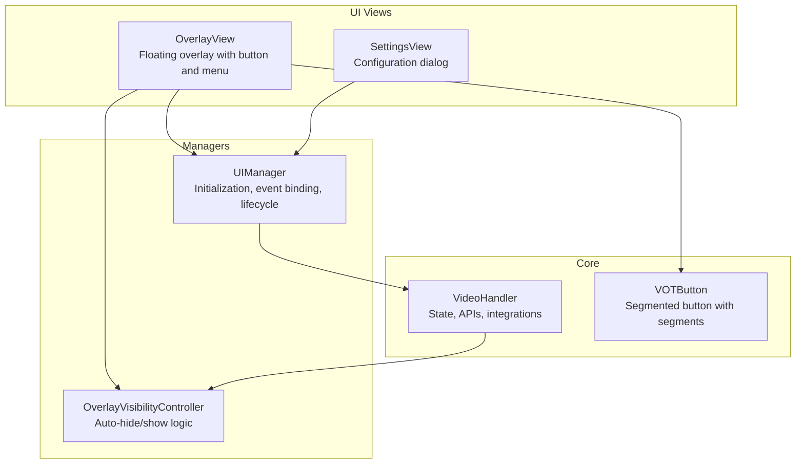
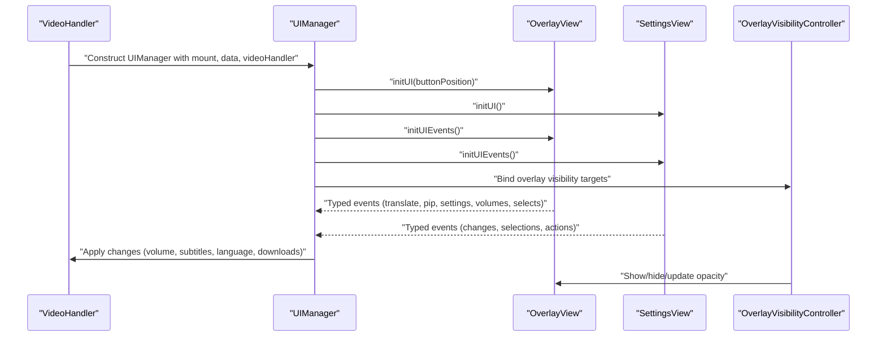
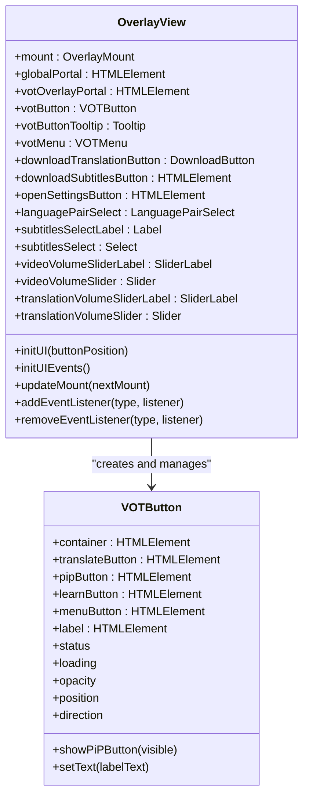
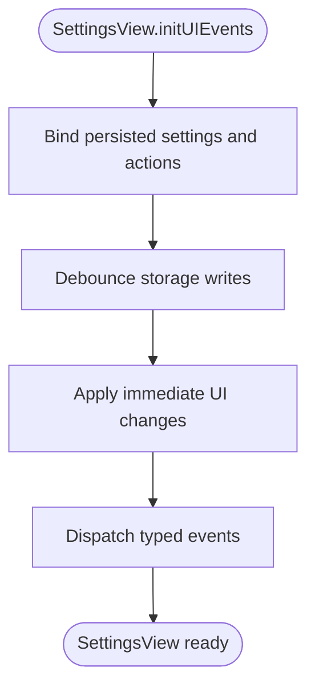
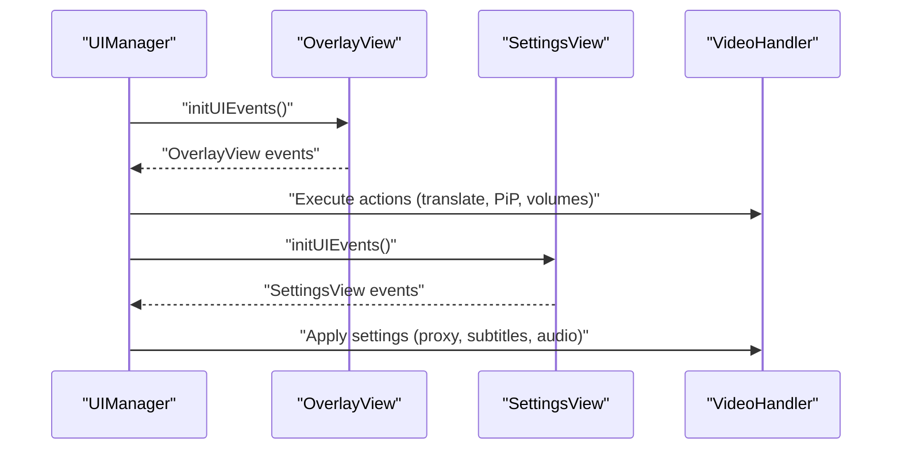
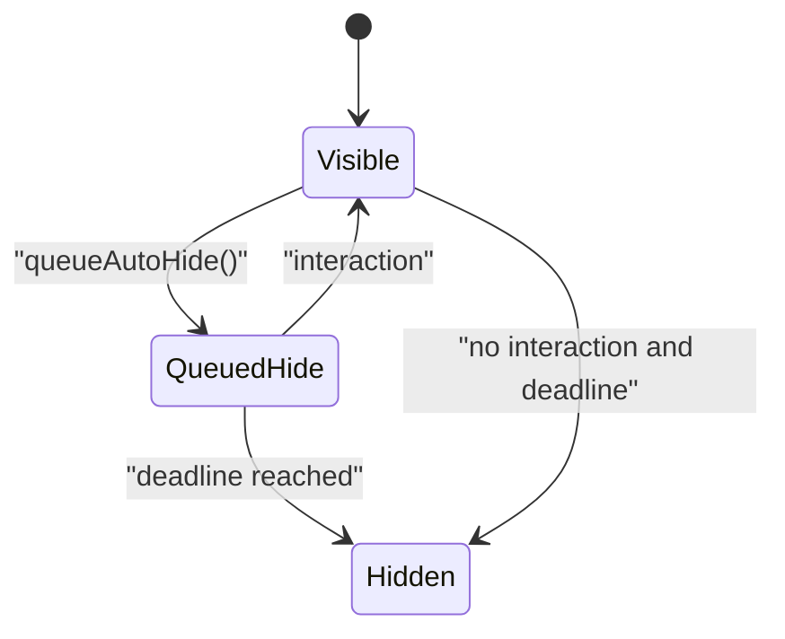
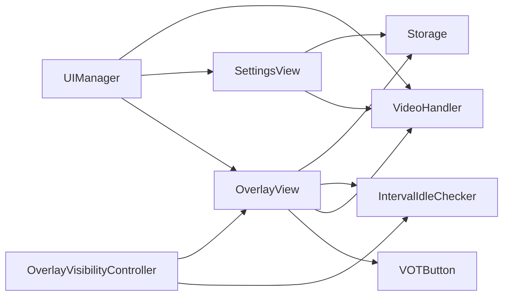

# View System

<cite>
**Referenced Files in This Document**
- [overlay.ts](file://src/ui/views/overlay.ts)
- [settings.ts](file://src/ui/views/settings.ts)
- [manager.ts](file://src/ui/manager.ts)
- [overlay.ts](file://src/types/views/overlay.ts)
- [settings.ts](file://src/types/views/settings.ts)
- [uiManager.ts](file://src/types/uiManager.ts)
- [overlayVisibilityController.ts](file://src/ui/overlayVisibilityController.ts)
- [votButton.ts](file://src/ui/components/votButton.ts)
- [index.ts](file://src/index.ts)
</cite>

## Table of Contents
1. [Introduction](#introduction)
2. [Project Structure](#project-structure)
3. [Core Components](#core-components)
4. [Architecture Overview](#architecture-overview)
5. [Detailed Component Analysis](#detailed-component-analysis)
6. [Dependency Analysis](#dependency-analysis)
7. [Performance Considerations](#performance-considerations)
8. [Troubleshooting Guide](#troubleshooting-guide)
9. [Conclusion](#conclusion)

## Introduction
This document describes the view system architecture with a focus on overlay controls and the settings panel. It explains how the OverlayView integrates with the video player, how interactive controls are positioned and styled, and how the SettingsView manages configuration and user preferences. It also covers lifecycle patterns, event handling, data binding, state synchronization with the underlying VideoHandler, responsive behavior, animations, customization examples, performance optimization, memory management, and debugging approaches.

## Project Structure
The view system is organized around two primary view classes:
- OverlayView: renders the floating overlay with the main action button, quick menu, and interactive controls.
- SettingsView: renders the comprehensive settings dialog with configuration panels and option management.

Both views are orchestrated by UIManager, which manages initialization, event binding, and UI lifecycle. The VideoHandler coordinates state synchronization and integrates the views with the video playback pipeline.

**Diagram sources**
- [overlay.ts:29-120](file://src/ui/views/overlay.ts#L29-L120)
- [settings.ts:99-181](file://src/ui/views/settings.ts#L99-L181)
- [manager.ts:56-138](file://src/ui/manager.ts#L56-L138)
- [overlayVisibilityController.ts:18-41](file://src/ui/overlayVisibilityController.ts#L18-L41)
- [votButton.ts:18-60](file://src/ui/components/votButton.ts#L18-L60)
- [index.ts:388-466](file://src/index.ts#L388-L466)

**Section sources**
- [overlay.ts:29-120](file://src/ui/views/overlay.ts#L29-L120)
- [settings.ts:99-181](file://src/ui/views/settings.ts#L99-L181)
- [manager.ts:56-138](file://src/ui/manager.ts#L56-L138)
- [overlayVisibilityController.ts:18-41](file://src/ui/overlayVisibilityController.ts#L18-L41)
- [votButton.ts:18-60](file://src/ui/components/votButton.ts#L18-L60)
- [index.ts:388-466](file://src/index.ts#L388-L466)

## Core Components
- OverlayView: Creates and manages the overlay portal, VOTButton, quick menu, and interactive controls. Handles drag-and-drop, tooltips, and event propagation. Exposes typed events for translation, PiP, settings, downloads, and volume changes.
- SettingsView: Renders a multi-panel settings dialog with persisted options, tooltips, and validation. Provides typed events for configuration changes and user actions.
- UIManager: Initializes both views, binds overlay and settings events, and mediates between views and VideoHandler.
- OverlayVisibilityController: Centralizes overlay auto-hide/show behavior and integrates with an idle checker.
- VOTButton: Segmented button with translate, PiP, learn, and menu segments, supporting keyboard accessibility and dynamic layout.

**Section sources**
- [overlay.ts:29-120](file://src/ui/views/overlay.ts#L29-L120)
- [settings.ts:99-181](file://src/ui/views/settings.ts#L99-L181)
- [manager.ts:56-138](file://src/ui/manager.ts#L56-L138)
- [overlayVisibilityController.ts:18-41](file://src/ui/overlayVisibilityController.ts#L18-L41)
- [votButton.ts:18-60](file://src/ui/components/votButton.ts#L18-L60)

## Architecture Overview
The overlay and settings views are rendered into a shared global portal and attached to the video player’s container. UIManager constructs OverlayView and SettingsView, wires their events, and delegates actions to VideoHandler. OverlayVisibilityController manages overlay visibility based on user interaction and idle detection.

**Diagram sources**
- [manager.ts:109-157](file://src/ui/manager.ts#L109-L157)
- [overlay.ts:252-402](file://src/ui/views/overlay.ts#L252-L402)
- [settings.ts:311-358](file://src/ui/views/settings.ts#L311-L358)
- [overlayVisibilityController.ts:34-93](file://src/ui/overlayVisibilityController.ts#L34-L93)

**Section sources**
- [manager.ts:109-157](file://src/ui/manager.ts#L109-L157)
- [overlay.ts:252-402](file://src/ui/views/overlay.ts#L252-L402)
- [settings.ts:311-358](file://src/ui/views/settings.ts#L311-L358)
- [overlayVisibilityController.ts:34-93](file://src/ui/overlayVisibilityController.ts#L34-L93)

## Detailed Component Analysis

### OverlayView: Video Player Integration, Controls, and Lifecycle
- Initialization and Mounting
  - Creates a portal container and appends the overlay to the current root.
  - Builds VOTButton and Tooltip with localized labels and layout.
  - Builds VOTMenu with header actions (download translation, download subtitles, open settings) and body controls (language pair, subtitles, volume sliders).
  - Uses OverlayMount to move nodes when the player container changes, preserving listeners and tooltip layout roots.

- Interactive Controls and Events
  - Button click and keyboard activation handlers prevent event propagation and dispatch typed events.
  - Drag-and-drop gestures support pointer/touch with thresholds and cross-platform compatibility.
  - Menu auto-close behavior on clicks outside and Escape key handling with focus management.
  - Volume sliders update labels and persist default translation volume with debounced storage writes.

- Data Binding and State Synchronization
  - Reads/writes to StorageData for default volume, response language, and UI state.
  - Integrates with VideoHandler for detected language, response language, video volume, subtitles loading, and PiP toggling.
  - Updates VOTButton status, loading state, and tooltip content based on translation outcomes.

- Styling, Responsiveness, and Animation
  - Button layout adapts direction and position depending on container size and orientation.
  - Opacity transitions and hidden states are controlled via CSS classes for robustness against host overrides.
  - Tooltips maintain stable direction for side positions to avoid mirrored text.

- Lifecycle and Memory Management
  - Guarded initialization and release patterns to prevent double-initialization.
  - AbortController and timers are cleared on release to avoid leaks.
  - Drag state and thresholds are reset on teardown.

**Diagram sources**
- [overlay.ts:29-120](file://src/ui/views/overlay.ts#L29-L120)
- [votButton.ts:18-60](file://src/ui/components/votButton.ts#L18-L60)

**Section sources**
- [overlay.ts:134-171](file://src/ui/views/overlay.ts#L134-L171)
- [overlay.ts:252-402](file://src/ui/views/overlay.ts#L252-L402)
- [overlay.ts:404-800](file://src/ui/views/overlay.ts#L404-L800)
- [overlay.ts:29-120](file://src/ui/views/overlay.ts#L29-L120)
- [votButton.ts:18-60](file://src/ui/components/votButton.ts#L18-L60)

### SettingsView: Configuration Panels, Option Management, and User Preferences
- Initialization and Panels
  - Creates a Dialog with accordion sections for account, translation, subtitles, hotkeys, proxy, misc, appearance, and about.
  - Populates controls from StorageData and applies platform constraints (e.g., WebAudio availability).
  - Adds tooltips and contextual help for advanced options.

- Event Handling and Persistence
  - Uses a centralized event registry with typed events for each setting change.
  - Debounces and batches storage writes for numeric settings (e.g., subtitle length, font size, opacity, auto-hide delay).
  - Applies changes immediately to UI and persists asynchronously to storage.

- Integration with VideoHandler
  - Updates account token and triggers client reinitialization.
  - Manages proxy settings, audio player restart, and subtitles widget updates.
  - Responds to language changes by reloading UI and restoring overlay state.

- Accessibility and UX
  - Keyboard navigation support and ARIA attributes for collapsible sections.
  - Disabled states for unsupported features (e.g., WebAudio-dependent checkboxes).
  - Reset settings and bug report actions.

**Diagram sources**
- [settings.ts:861-860](file://src/ui/views/settings.ts#L861-L860)
- [settings.ts:904-1287](file://src/ui/views/settings.ts#L904-L1287)

**Section sources**
- [settings.ts:311-800](file://src/ui/views/settings.ts#L311-L800)
- [settings.ts:861-860](file://src/ui/views/settings.ts#L861-L860)
- [settings.ts:904-1287](file://src/ui/views/settings.ts#L904-L1287)

### UIManager: Orchestrator and Event Mediation
- Initialization
  - Creates a global portal and initializes OverlayView with the last known button position, then initializes SettingsView.
  - Preserves user preferences across UI rebuilds (e.g., menu language reload).

- Event Binding
  - Binds OverlayView events to VideoHandler actions: translation start/stop, PiP toggle, settings open, downloads, and volume synchronization.
  - Binds SettingsView events to storage updates, subtitles widget configuration, proxy changes, and audio player restart.

- Lifecycle and State Restoration
  - Supports reloadMenu to preserve overlay visibility and layout after UI rebuild.
  - Rebinds overlay visibility targets after DOM recreation.

**Diagram sources**
- [manager.ts:147-157](file://src/ui/manager.ts#L147-L157)
- [manager.ts:159-238](file://src/ui/manager.ts#L159-L238)
- [manager.ts:240-449](file://src/ui/manager.ts#L240-L449)

**Section sources**
- [manager.ts:109-157](file://src/ui/manager.ts#L109-L157)
- [manager.ts:159-238](file://src/ui/manager.ts#L159-L238)
- [manager.ts:240-449](file://src/ui/manager.ts#L240-L449)

### OverlayVisibilityController: Auto-Hide and Interaction Handling
- Responsibilities
  - Show overlay immediately on interaction.
  - Queue auto-hide after a configurable delay.
  - Cancel hide on overlay or host interactions.
  - Skip hide when focus is inside overlay interactive nodes.

- Integration
  - Subscribes to IntervalIdleChecker ticks.
  - Receives overlay view, auto-hide delay, and interactive node checks from dependencies.

**Diagram sources**
- [overlayVisibilityController.ts:18-41](file://src/ui/overlayVisibilityController.ts#L18-L41)
- [overlayVisibilityController.ts:59-93](file://src/ui/overlayVisibilityController.ts#L59-L93)
- [overlayVisibilityController.ts:174-176](file://src/ui/overlayVisibilityController.ts#L174-L176)

**Section sources**
- [overlayVisibilityController.ts:18-41](file://src/ui/overlayVisibilityController.ts#L18-L41)
- [overlayVisibilityController.ts:59-93](file://src/ui/overlayVisibilityController.ts#L59-L93)
- [overlayVisibilityController.ts:174-176](file://src/ui/overlayVisibilityController.ts#L174-L176)

### VOTButton: Button Positioning and Interactive Controls
- Layout and Positioning
  - Calculates position based on horizontal percentage and container size.
  - Computes direction (row/column) based on position for responsive layouts.
  - Provides tooltip position mapping for side positions.

- Accessibility and Interactions
  - Role-based semantics and keyboard activation (Enter/Space).
  - Segment visibility toggles (PiP, learn, menu) and label updates.
  - Opacity controlled via CSS class to resist host overrides.

**Section sources**
- [votButton.ts:62-78](file://src/ui/components/votButton.ts#L62-L78)
- [votButton.ts:162-171](file://src/ui/components/votButton.ts#L162-L171)
- [votButton.ts:213-223](file://src/ui/components/votButton.ts#L213-L223)

## Dependency Analysis
- OverlayView depends on:
  - VOTButton, VOTMenu, DownloadButton, Select, Slider, SliderLabel, Label, Tooltip.
  - VideoHandler for video data, volume, subtitles, and PiP.
  - IntervalIdleChecker for overlay auto-hide scheduling.
  - Storage for persisted defaults and preferences.

- SettingsView depends on:
  - AccountButton, Checkbox, Details, Dialog, HotkeyButton, Select, Slider, Textfield, Tooltip.
  - VideoHandler for audio context support, proxy settings, and subtitles widget updates.
  - Storage for persisted settings and locale updates.

- UIManager orchestrates:
  - OverlayView and SettingsView initialization and event binding.
  - Delegation to VideoHandler for all media-related actions.

- OverlayVisibilityController depends on:
  - IntervalIdleChecker and OverlayView for visibility decisions.

**Diagram sources**
- [overlay.ts:29-120](file://src/ui/views/overlay.ts#L29-L120)
- [settings.ts:99-181](file://src/ui/views/settings.ts#L99-L181)
- [manager.ts:56-138](file://src/ui/manager.ts#L56-L138)
- [overlayVisibilityController.ts:18-41](file://src/ui/overlayVisibilityController.ts#L18-L41)

**Section sources**
- [overlay.ts:29-120](file://src/ui/views/overlay.ts#L29-L120)
- [settings.ts:99-181](file://src/ui/views/settings.ts#L99-L181)
- [manager.ts:56-138](file://src/ui/manager.ts#L56-L138)
- [overlayVisibilityController.ts:18-41](file://src/ui/overlayVisibilityController.ts#L18-L41)

## Performance Considerations
- Debounced Storage Writes
  - Default translation volume and several numeric settings are debounced to reduce storage churn.
- Minimal DOM Rebuilds
  - OverlayView moves existing nodes when mounting changes rather than recreating them.
- Event Subscription Management
  - AbortController and unsubscribe hooks prevent memory leaks from lingering listeners.
- Conditional UI Updates
  - SettingsView disables controls when unsupported (e.g., WebAudio) to avoid unnecessary computations.
- Idle-Based Auto-Hide
  - OverlayVisibilityController uses periodic ticks to minimize polling overhead.

[No sources needed since this section provides general guidance]

## Troubleshooting Guide
- Overlay Does Not Appear
  - Verify OverlayView initialization and portal creation.
  - Confirm OverlayMount points to a connected root and portal container.
- Drag Gesture Not Working
  - Ensure pointer/touch events are not blocked by host pages and that touch-action is set on all segments.
- Settings Changes Not Persisting
  - Check debounced timers and ensure storage writes occur after persistence delay.
- PiP Toggle Fails
  - Wrap toggle in try/catch and check browser support and active PiP element state.
- Subtitles Not Updating
  - Trigger subtitles reload and confirm cache keys match current language pair.
- Auto-Hide Behavior Unexpected
  - Inspect overlay visibility targets and focus state; ensure interactions are not suppressed.

**Section sources**
- [overlay.ts:134-171](file://src/ui/views/overlay.ts#L134-L171)
- [overlay.ts:537-561](file://src/ui/views/overlay.ts#L537-L561)
- [settings.ts:250-275](file://src/ui/views/settings.ts#L250-L275)
- [manager.ts:169-183](file://src/ui/manager.ts#L169-L183)
- [overlayVisibilityController.ts:75-93](file://src/ui/overlayVisibilityController.ts#L75-L93)

## Conclusion
The view system combines OverlayView and SettingsView with UIManager orchestration and OverlayVisibilityController to deliver a responsive, accessible, and performant UI for video translation and subtitles. OverlayView integrates tightly with VideoHandler for media state synchronization, while SettingsView centralizes configuration persistence and user preference management. Robust event handling, debounced storage writes, and careful lifecycle management ensure reliability across diverse hosting environments.