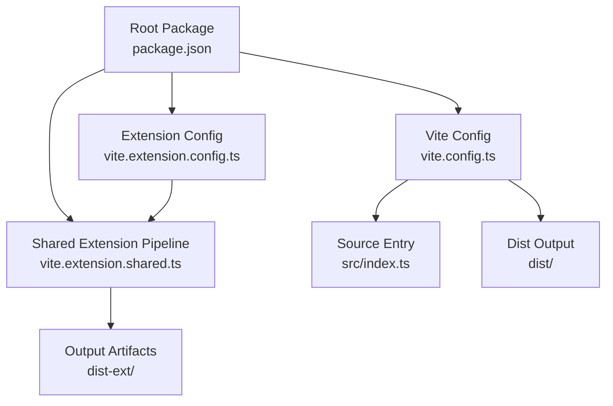
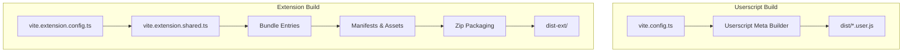
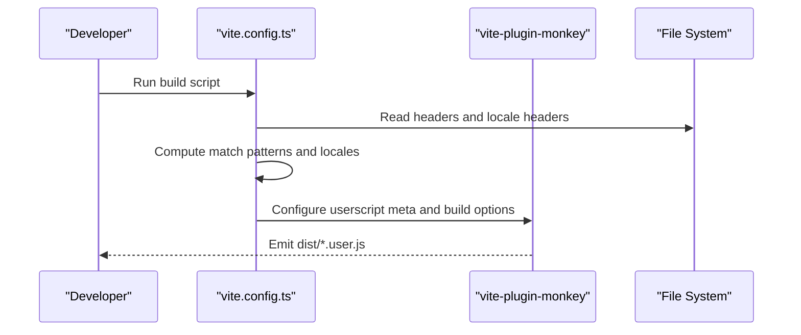
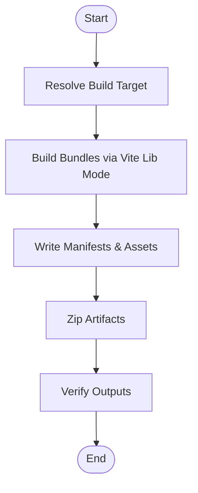
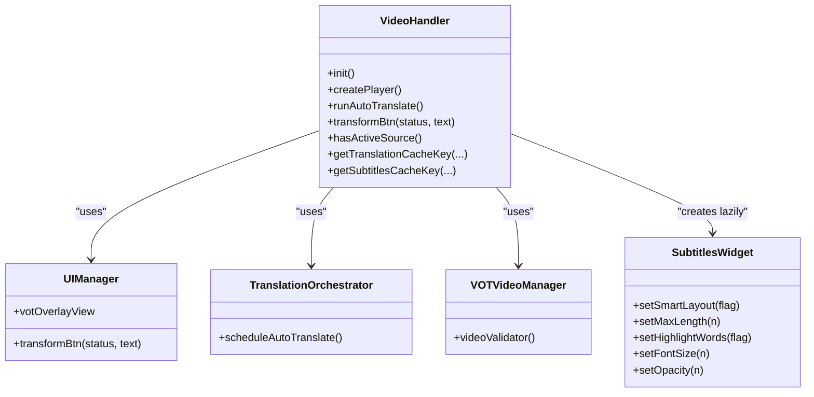
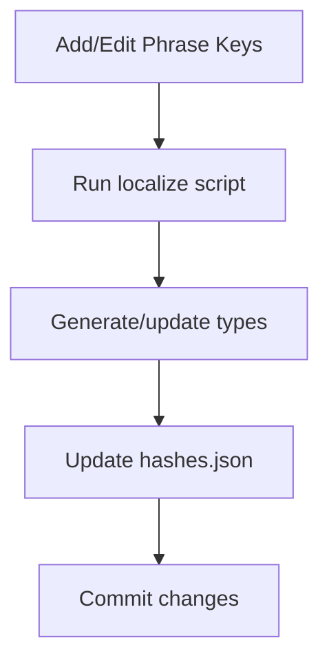
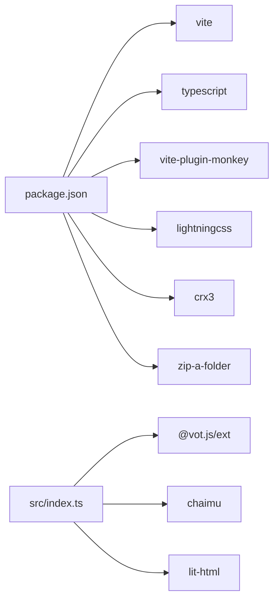

# Development Guide

<cite>
**Referenced Files in This Document**
- [package.json](file://package.json)
- [README.md](file://README.md)
- [CONTRIBUTING.md](file://CONTRIBUTING.md)
- [biome.json](file://biome.json)
- [lefthook.yml](file://lefthook.yml)
- [l10n.config.json](file://l10n.config.json)
- [tsconfig.json](file://tsconfig.json)
- [vite.config.ts](file://vite.config.ts)
- [vite.extension.config.ts](file://vite.extension.config.ts)
- [vite.extension.shared.ts](file://vite.extension.shared.ts)
- [src/config/config.ts](file://src/config/config.ts)
- [src/index.ts](file://src/index.ts)
- [src/types/localization.ts](file://src/types/localization.ts)
</cite>

## Table of Contents
1. [Introduction](#introduction)
2. [Project Structure](#project-structure)
3. [Core Components](#core-components)
4. [Architecture Overview](#architecture-overview)
5. [Detailed Component Analysis](#detailed-component-analysis)
6. [Dependency Analysis](#dependency-analysis)
7. [Performance Considerations](#performance-considerations)
8. [Troubleshooting Guide](#troubleshooting-guide)
9. [Contribution Workflow](#contribution-workflow)
10. [Testing and CI Patterns](#testing-and-ci-patterns)
11. [Release and Distribution](#release-and-distribution)
12. [Debugging and Development Tools](#debugging-and-development-tools)
13. [Extending Functionality](#extending-functionality)
14. [Code Quality and Security](#code-quality-and-security)
15. [Conclusion](#conclusion)

## Introduction
This guide explains how to develop, build, test, and contribute to the English Teacher project. It covers the development environment, build system using Vite, extension packaging, testing, release process, and best practices for maintainability and security.

## Project Structure
The repository is a monorepo-like structure with a primary package at the root and a nested package under voice-over-translation-1.11.2. The most relevant parts for development are:
- Root package for building userscripts and native extensions
- Nested package for historical reference and related assets
- Source code under src/ organized by features (core, ui, subtitles, extension, utils, etc.)
- Tests under tests/ and src/langLearn/phraseSegmenter/ with unit tests

**Diagram sources**
- [package.json:1-58](file://package.json#L1-L58)
- [vite.config.ts:138-194](file://vite.config.ts#L138-L194)
- [vite.extension.config.ts:69-90](file://vite.extension.config.ts#L69-L90)
- [vite.extension.shared.ts:12-14](file://vite.extension.shared.ts#L12-L14)

**Section sources**
- [README.md:170-220](file://README.md#L170-L220)
- [package.json:31-47](file://package.json#L31-L47)

## Core Components
- Userscript build pipeline via Vite and monkey plugin, generating vot.user.js and vot-min.user.js
- Native extension build pipeline producing Chrome and Firefox artifacts with automated verification and packaging
- Runtime entrypoint exports a VideoHandler class and integrates with @vot.js clients and UI managers
- Localization types and provider for multi-language support

Key runtime entrypoint exports and integration points:
- VideoHandler class and public API surface
- Integration with VOT clients and translation orchestration
- UI manager and overlay visibility controller
- Environment and configuration constants

**Section sources**
- [src/index.ts:114-800](file://src/index.ts#L114-L800)
- [src/config/config.ts:1-63](file://src/config/config.ts#L1-L63)

## Architecture Overview
The build system separates concerns between userscript and extension targets. The userscript build injects metadata and match patterns dynamically from headers and locale files. The extension build compiles multiple entry bundles, writes manifests, zips artifacts, and verifies outputs.

**Diagram sources**
- [vite.config.ts:74-136](file://vite.config.ts#L74-L136)
- [vite.extension.config.ts:69-90](file://vite.extension.config.ts#L69-L90)
- [vite.extension.shared.ts:47-78](file://vite.extension.shared.ts#L47-L78)
- [vite.extension.shared.ts:174-199](file://vite.extension.shared.ts#L174-L199)

## Detailed Component Analysis

### Userscript Build Pipeline
The userscript pipeline:
- Reads headers and locale headers to generate localized metadata
- Computes match patterns for supported sites and alternative URLs
- Emits either vot.user.js or vot-min.user.js depending on mode
- Injects compile-time defines for debug, locales, branch, and authors

**Diagram sources**
- [vite.config.ts:138-194](file://vite.config.ts#L138-L194)
- [vite.config.ts:42-136](file://vite.config.ts#L42-L136)

**Section sources**
- [vite.config.ts:138-194](file://vite.config.ts#L138-L194)
- [vite.config.ts:42-136](file://vite.config.ts#L42-L136)

### Extension Build Pipeline
The extension pipeline:
- Defines multiple entry bundles (content, prelude, bridge, background)
- Writes Chrome Manifest V3 and Firefox manifests
- Generates updates manifest for Firefox
- Zips artifacts and verifies structure and permissions
- Supports targeted builds for Chrome, Firefox, or both

**Diagram sources**
- [vite.extension.config.ts:69-90](file://vite.extension.config.ts#L69-L90)
- [vite.extension.shared.ts:174-199](file://vite.extension.shared.ts#L174-L199)
- [vite.extension.shared.ts:473-472](file://vite.extension.shared.ts#L473-L472)
- [vite.extension.shared.ts:779-798](file://vite.extension.shared.ts#L779-L798)

**Section sources**
- [vite.extension.config.ts:69-90](file://vite.extension.config.ts#L69-L90)
- [vite.extension.shared.ts:47-78](file://vite.extension.shared.ts#L47-L78)
- [vite.extension.shared.ts:174-199](file://vite.extension.shared.ts#L174-L199)
- [vite.extension.shared.ts:473-472](file://vite.extension.shared.ts#L473-L472)
- [vite.extension.shared.ts:779-798](file://vite.extension.shared.ts#L779-L798)

### Runtime Entry Point and Public API
The runtime entrypoint exports a VideoHandler class and integrates with:
- VOT clients and translation orchestration
- UI manager and overlay visibility controller
- Environment detection and configuration constants
- Subtitles widget and video lifecycle management

**Diagram sources**
- [src/index.ts:114-800](file://src/index.ts#L114-L800)

**Section sources**
- [src/index.ts:114-800](file://src/index.ts#L114-L800)

### Localization Types and Provider
Localization types are generated and enforced via:
- A comprehensive Phrase and Phrases type definition
- A localization provider and hashes for locale integrity
- Tooling to generate types and update hashes

**Diagram sources**
- [src/types/localization.ts:1-556](file://src/types/localization.ts#L1-L556)
- [CONTRIBUTING.md:8-31](file://CONTRIBUTING.md#L8-L31)

**Section sources**
- [src/types/localization.ts:1-556](file://src/types/localization.ts#L1-L556)
- [CONTRIBUTING.md:8-31](file://CONTRIBUTING.md#L8-L31)

## Dependency Analysis
- Build and toolchain: Vite, vite-plugin-monkey, lightningcss, sass, typescript
- Runtime dependencies: @vot.js packages, @mlc-ai/web-llm, bowser, chaimu, lit-html
- Dev dependencies: lefthook, crx3, zip-a-folder, sass, typescript
- Versioning and scripts are defined in package.json

**Diagram sources**
- [package.json:17-56](file://package.json#L17-L56)
- [src/index.ts:1-50](file://src/index.ts#L1-L50)

**Section sources**
- [package.json:17-56](file://package.json#L17-L56)
- [src/index.ts:1-50](file://src/index.ts#L1-L50)

## Performance Considerations
- Use the minified userscript build for production distribution
- Prefer Lightning CSS transformer for efficient CSS processing
- Minimize dynamic imports and avoid circular dependencies flagged by Rollup warnings
- Keep translation and subtitle cache keys stable to reduce redundant network requests
- Avoid heavy synchronous work in content scripts; leverage async orchestration

[No sources needed since this section provides general guidance]

## Troubleshooting Guide
Common development issues and resolutions:
- Build fails due to missing CRX builder: ensure dependencies are installed and the CRX binary is available
- Manifest validation errors: verify match patterns, permissions, and required files
- Localization hash mismatch: regenerate types and update hashes after editing phrases
- Extension verification failures: confirm presence of bridge.js, prelude.js, content.js, background.js, and icons

**Section sources**
- [vite.extension.shared.ts:564-593](file://vite.extension.shared.ts#L564-L593)
- [vite.extension.shared.ts:631-798](file://vite.extension.shared.ts#L631-L798)
- [CONTRIBUTING.md:26-31](file://CONTRIBUTING.md#L26-L31)

## Contribution Workflow
- Fork and clone the repository
- Install dependencies using Bun or NPM
- Run tests and format with Biome
- Add or edit TypeScript code; avoid committing dist files
- For localization, use the localize script and update hashes
- Submit a pull request with a clear description and references to related issues

**Section sources**
- [README.md:170-220](file://README.md#L170-L220)
- [CONTRIBUTING.md:6-107](file://CONTRIBUTING.md#L6-L107)
- [biome.json:15-41](file://biome.json#L15-L41)

## Testing and CI Patterns
- Unit tests: run with Bun test; watch mode supported
- UI test build: Vite build for test UI
- Lefthook pre-commit hook runs Biome checks and auto-fixes staged files

Recommended practices:
- Add unit tests alongside new features
- Keep tests focused and deterministic
- Use watch mode during development to iterate quickly

**Section sources**
- [package.json:32-35](file://package.json#L32-L35)
- [lefthook.yml:1-5](file://lefthook.yml#L1-L5)

## Release and Distribution
- Userscript artifacts land in dist/ (vot.user.js, vot-min.user.js)
- Native extension artifacts land in dist-ext/ (Chrome and Firefox)
- Versioning is managed by headers and build-time defines; ensure headers.json and locale headers are updated before releases
- Distribution channels include raw GitHub URLs for userscripts and Releases for native extensions

**Section sources**
- [README.md:170-220](file://README.md#L170-L220)
- [vite.config.ts:147-148](file://vite.config.ts#L147-L148)
- [vite.extension.shared.ts:127-129](file://vite.extension.shared.ts#L127-L129)

## Debugging and Development Tools
- Development server: Vite dev server for fast iteration
- Sourcemaps: enabled in development builds
- Debug logging: use the debug utility exported from utils/debug
- Environment detection: getEnvironmentInfo provides runtime environment details
- Browser developer tools: inspect content scripts, service workers, and network requests

**Section sources**
- [package.json:42-43](file://package.json#L42-L43)
- [src/index.ts:31-32](file://src/index.ts#L31-L32)

## Extending Functionality
Guidelines for extending the project:
- Add new features under src/ following existing module patterns (core, ui, subtitles, extension)
- Integrate with the VideoHandler lifecycle and UI manager
- Update localization types and hashes when adding new phrases
- For new site support, update headers and alternative URL lists
- Maintain backward compatibility by avoiding breaking changes to public APIs

**Section sources**
- [src/index.ts:114-800](file://src/index.ts#L114-L800)
- [CONTRIBUTING.md:40-44](file://CONTRIBUTING.md#L40-L44)

## Code Quality and Security
- Formatting and linting: Biome configured for formatter, linter, and import organization
- Pre-commit hooks: Lefthook runs Biome on staged files
- Security considerations for browser extensions:
  - Validate and sanitize match patterns
  - Avoid exposing sensitive data in manifests
  - Ensure CSP compliance and minimal permissions
  - Verify bundle contents and prevent inclusion of unauthorized snippets

**Section sources**
- [biome.json:15-41](file://biome.json#L15-L41)
- [lefthook.yml:1-5](file://lefthook.yml#L1-L5)
- [vite.extension.shared.ts:631-798](file://vite.extension.shared.ts#L631-L798)

## Conclusion
This guide provides a comprehensive overview of the development environment, build system, testing, and contribution workflow for the English Teacher project. By following the documented processes and best practices, contributors can efficiently develop, test, and release new features while maintaining code quality and security.