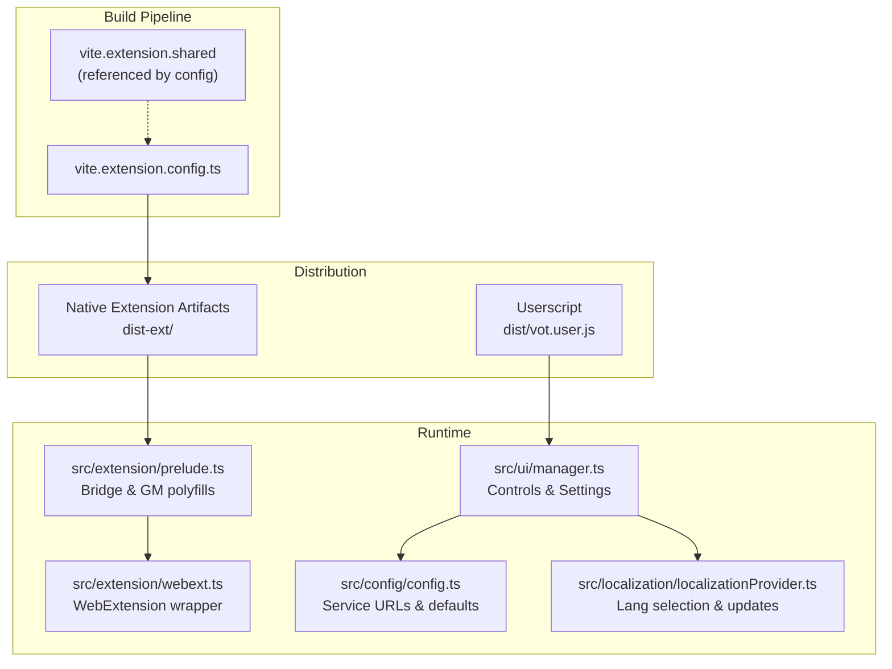
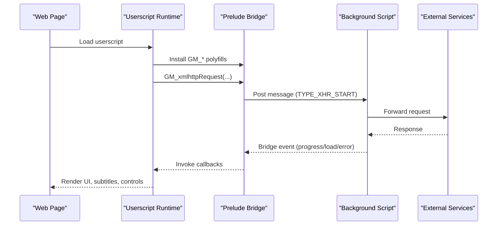

# Getting Started

<cite>
**Referenced Files in This Document**
- [README-EN.md](file://README-EN.md)
- [package.json](file://package.json)
- [vite.extension.config.ts](file://vite.extension.config.ts)
- [src/config/config.ts](file://src/config/config.ts)
- [src/extension/webext.ts](file://src/extension/webext.ts)
- [src/extension/prelude.ts](file://src/extension/prelude.ts)
- [src/ui/manager.ts](file://src/ui/manager.ts)
- [src/types/storage.ts](file://src/types/storage.ts)
- [src/localization/localizationProvider.ts](file://src/localization/localizationProvider.ts)
- [src/utils/browserInfo.ts](file://src/utils/browserInfo.ts)
- [dist/vot.user.js](file://dist/vot.user.js)
- [scripts/wiki-gen/SITES-EN.md](file://scripts/wiki-gen/SITES-EN.md)
</cite>

## Table of Contents
1. [Introduction](#introduction)
2. [Project Structure](#project-structure)
3. [Core Components](#core-components)
4. [Architecture Overview](#architecture-overview)
5. [Installation Guides](#installation-guides)
6. [Initial Setup and Configuration](#initial-setup-and-configuration)
7. [Quick Start Tutorials](#quick-start-tutorials)
8. [Supported Platforms and Compatibility Matrix](#supported-platforms-and-compatibility-matrix)
9. [Troubleshooting Guide](#troubleshooting-guide)
10. [Conclusion](#conclusion)

## Introduction
This guide helps you install and use the English Teacher extension across multiple platforms. It covers:
- Installing as a userscript (Tampermonkey, Violentmonkey, AdGuard, Greasemonkey)
- Installing as a native extension (Chrome/Edge/Brave, Firefox)
- Safari userscripts
- Initial configuration, language preferences, and feature activation
- Quick start tutorials for translating a video, enabling language learning mode, and customizing subtitles
- Supported video platforms and browser compatibility

## Project Structure
At a high level, the project provides:
- A userscript distribution for broad browser support
- A native extension build pipeline for Chromium and Firefox
- A UI manager that wires controls, settings, and language learning features
- Configuration constants for services and defaults
- Localization provider for language selection and updates
- A prelude bridge for cross-world communication in extension builds

**Diagram sources**
- [vite.extension.config.ts:69-89](file://vite.extension.config.ts#L69-L89)
- [src/extension/prelude.ts:46-53](file://src/extension/prelude.ts#L46-L53)
- [src/extension/webext.ts:11-57](file://src/extension/webext.ts#L11-L57)
- [src/ui/manager.ts:56-138](file://src/ui/manager.ts#L56-L138)
- [src/config/config.ts:1-63](file://src/config/config.ts#L1-L63)
- [src/localization/localizationProvider.ts:39-84](file://src/localization/localizationProvider.ts#L39-L84)
- [dist/vot.user.js:1-200](file://dist/vot.user.js#L1-L200)

**Section sources**
- [README-EN.md:69-129](file://README-EN.md#L69-L129)
- [vite.extension.config.ts:19-43](file://vite.extension.config.ts#L19-L43)
- [src/extension/prelude.ts:46-53](file://src/extension/prelude.ts#L46-L53)
- [src/extension/webext.ts:11-57](file://src/extension/webext.ts#L11-L57)
- [src/ui/manager.ts:56-138](file://src/ui/manager.ts#L56-L138)
- [src/config/config.ts:1-63](file://src/config/config.ts#L1-L63)
- [src/localization/localizationProvider.ts:39-84](file://src/localization/localizationProvider.ts#L39-L84)
- [dist/vot.user.js:1-200](file://dist/vot.user.js#L1-L200)

## Core Components
- Userscript distribution: A single-file userscript with match patterns for supported sites and a built-in update mechanism.
- Native extension pipeline: Vite-based build that produces extension bundles for Chrome/Firefox and verifies outputs.
- Bridge and GM polyfills: A prelude script that installs GM_* APIs and bridges XMLHttpRequest and notifications to the extension background.
- WebExtension wrapper: A unified interface for storage, notifications, tabs, and windows across Chromium and Firefox.
- UI manager: Initializes overlays, settings, downloads, and language learning mode; binds events and settings.
- Configuration: Centralized service endpoints, defaults, and compatibility version.
- Localization: Manages language overrides, caches, and updates phrases from the repository.

**Section sources**
- [dist/vot.user.js:1-200](file://dist/vot.user.js#L1-L200)
- [vite.extension.config.ts:69-89](file://vite.extension.config.ts#L69-L89)
- [src/extension/prelude.ts:288-478](file://src/extension/prelude.ts#L288-L478)
- [src/extension/webext.ts:103-187](file://src/extension/webext.ts#L103-L187)
- [src/ui/manager.ts:56-138](file://src/ui/manager.ts#L56-L138)
- [src/config/config.ts:1-63](file://src/config/config.ts#L1-L63)
- [src/localization/localizationProvider.ts:39-84](file://src/localization/localizationProvider.ts#L39-L84)

## Architecture Overview
The extension runs in two modes:
- Userscript mode: Runs inside pages with a userscript manager. It uses GM_* APIs and a bridge to communicate with the extension background when applicable.
- Extension mode: Uses a prelude script installed in MAIN world to polyfill GM_* and bridge requests to the background script.

**Diagram sources**
- [src/extension/prelude.ts:309-379](file://src/extension/prelude.ts#L309-L379)
- [src/extension/prelude.ts:480-611](file://src/extension/prelude.ts#L480-L611)
- [src/extension/webext.ts:103-187](file://src/extension/webext.ts#L103-L187)

## Installation Guides

### Install as a Userscript (Tampermonkey, Violentmonkey, AdGuard, Greasemonkey)
Follow the official guide for installing the userscript distribution. Ensure you allow updates from the configured update URL.

- Install the userscript from the distribution URL.
- After installation, the script will automatically update from the configured update URL.

Notes for MV3 (Chromium-based browsers):
- Enable Developer mode in the Extensions page.
- On Chromium 138+, allow user scripts in extension details.

Opera users:
- Use Violentmonkey instead of Tampermonkey.
- Enable “Allow access to search page results” in the extension settings.

**Section sources**
- [README-EN.md:69-84](file://README-EN.md#L69-L84)
- [README-EN.md:71-80](file://README-EN.md#L71-L80)

### Install as a Native Extension (Chrome/Edge/Brave, Firefox)
- Download the appropriate release package for your platform.
- Open the Extensions page for your browser and enable Developer mode.
- Load the unpacked extension by dragging the downloaded archive into the extensions page.

Firefox:
- Open the releases page and install the .xpi file when prompted.

**Section sources**
- [README-EN.md:84-98](file://README-EN.md#L84-L98)

### Safari Userscripts
- Use the Userscripts app or a compatible userscripts loader for Safari.
- Install the userscript from the distribution URL.

Note: Some loaders require proxy mode and may disable audio download features.

**Section sources**
- [README-EN.md:289-296](file://README-EN.md#L289-L296)

### Building from Source (Optional)
- Install Node.js or Bun.
- Install dependencies.
- Build targets include regular/minified userscripts, both variants, native extension packages, and development userscript with sourcemaps.

Artifacts are generated in dist/ for userscripts and dist-ext/ for native extensions.

**Section sources**
- [README-EN.md:170-219](file://README-EN.md#L170-L219)
- [package.json:31-47](file://package.json#L31-L47)

## Initial Setup and Configuration
After installation:
- Open the extension’s settings panel from the overlay menu.
- Choose your preferred menu language and interface language.
- Select the response language for translations.
- Configure hotkeys for translation and subtitles.
- Adjust audio settings (volume sliders, ducking, linking).
- Enable auto-translate and auto-subtitles if desired.
- Customize subtitle appearance (font size, opacity, smart layout).
- Optionally enable language learning mode to practice words with translated subtitles.

Storage keys include auto-translate, auto-subtitles, response language, hotkeys, proxy hosts, and more.

**Section sources**
- [src/ui/manager.ts:240-449](file://src/ui/manager.ts#L240-L449)
- [src/types/storage.ts:18-62](file://src/types/storage.ts#L18-L62)
- [src/types/storage.ts:74-129](file://src/types/storage.ts#L74-L129)

## Quick Start Tutorials

### Translate a Video
- Open a supported video page.
- Click the translation button in the overlay.
- Wait for the translation to finish; the overlay will show progress and completion.
- Control original and translated audio independently using the volume sliders.

**Section sources**
- [src/ui/manager.ts:735-800](file://src/ui/manager.ts#L735-L800)

### Enable Language Learning Mode
- Ensure translation is active and subtitles are loaded.
- Click the language learning button in the overlay.
- Review the language learning panel to study vocabulary aligned with the video content.

**Section sources**
- [src/ui/manager.ts:541-624](file://src/ui/manager.ts#L541-L624)

### Customize Subtitle Appearance
- Open the settings panel.
- Adjust font size, background opacity, and enable smart layout.
- Toggle word highlighting and subtitle length limits.

**Section sources**
- [src/ui/manager.ts:324-368](file://src/ui/manager.ts#L324-L368)

## Supported Platforms and Compatibility Matrix

### Supported Video Platforms
The userscript includes match patterns for many major platforms. The wiki provides detailed coverage per site, including subdomains, paths, and limitations.

Examples include YouTube, Invidious, Piped, Vimeo, Twitch, TikTok, Douyin, Vimeo, XVideos, XHamster, Pornhub, Twitter/X, Rumble, Facebook, RuTube, Bilibili, Mail.ru, BitChute, EPorner, PeerTube, Dailymotion, Trovo, Yandex Disk, OK.ru, Google Drive, Banned.Video, Weverse, Weibo, Newgrounds, Egghead, Youku, Archive.org, Kodik, Patreon, Reddit, Kick, Apple Developer, Epic Games, Odysee, and more.

Limitations commonly include:
- Not working in video previews
- Live broadcast restrictions
- CSP-related issues requiring “Bypass Media CSP”

**Section sources**
- [dist/vot.user.js:26-200](file://dist/vot.user.js#L26-L200)
- [scripts/wiki-gen/SITES-EN.md:1-800](file://scripts/wiki-gen/SITES-EN.md#L1-L800)

### Browser Compatibility
Tested browsers and loaders include Firefox, Chrome, Edge, Brave, Opera, Vivaldi, Safari, Yandex Browser, Arc, Incognition, and others. Minimum versions are noted where available.

Userscript managers:
- Tampermonkey (MV2/MV3)
- Violentmonkey
- Greasemonkey
- AdGuard Userscripts
- User Javascript and CSS (proxy mode)

**Section sources**
- [README-EN.md:251-296](file://README-EN.md#L251-L296)

## Troubleshooting Guide

Common issues and resolutions:
- Script not activating in MV3 Chromium:
  - Enable Developer mode in the Extensions page.
  - On Chromium 138+, enable “Allow user scripts” in extension details.

- Opera-specific:
  - Use Violentmonkey.
  - Enable “Allow access to search page results.”

- CSP-related playback issues:
  - Enable “Bypass Media CSP” in settings or remove CSP via other means.

- Audio download fails:
  - Use an up-to-date userscript manager (Tampermonkey or Violentmonkey).
  - Try downloading via share dialog or opening the URL directly.

- Subtitles not appearing:
  - Enable auto-subtitles or manually select a subtitle language.
  - Some sites require “Bypass Media CSP.”

- Language not detected or wrong:
  - Change the interface language and menu language in settings.
  - The localization provider can fetch updated phrases and caches them.

- Extension not updating:
  - Verify the update URL is reachable.
  - Clear cache or force refresh if needed.

**Section sources**
- [README-EN.md:71-80](file://README-EN.md#L71-L80)
- [README-EN.md:124-129](file://README-EN.md#L124-L129)
- [src/localization/localizationProvider.ts:136-185](file://src/localization/localizationProvider.ts#L136-L185)
- [src/ui/manager.ts:451-492](file://src/ui/manager.ts#L451-L492)

## Conclusion
You are now ready to install the English Teacher extension, configure it for your needs, and start translating and learning from videos. For persistent issues, consult the FAQ and compatibility notes, and adjust settings like CSP bypass and language preferences as needed.