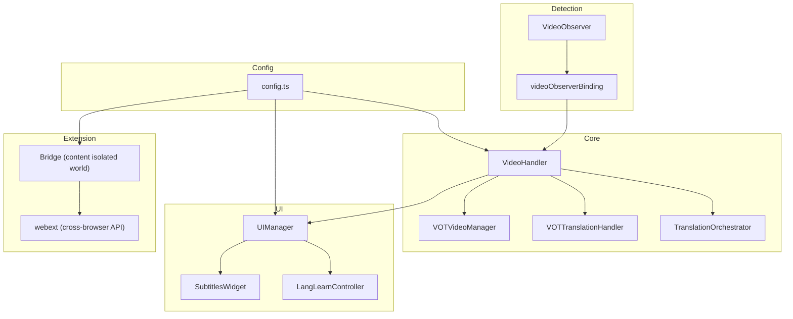
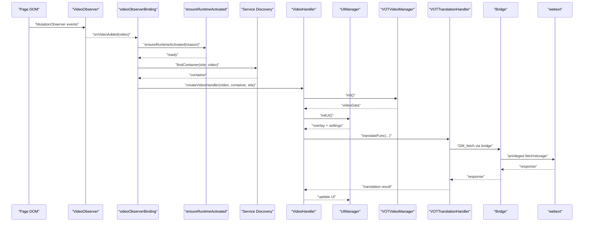
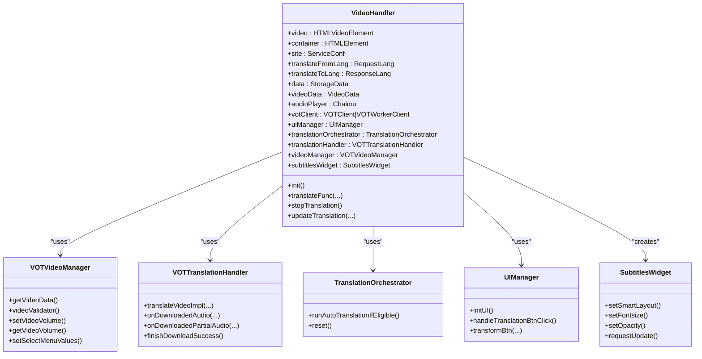
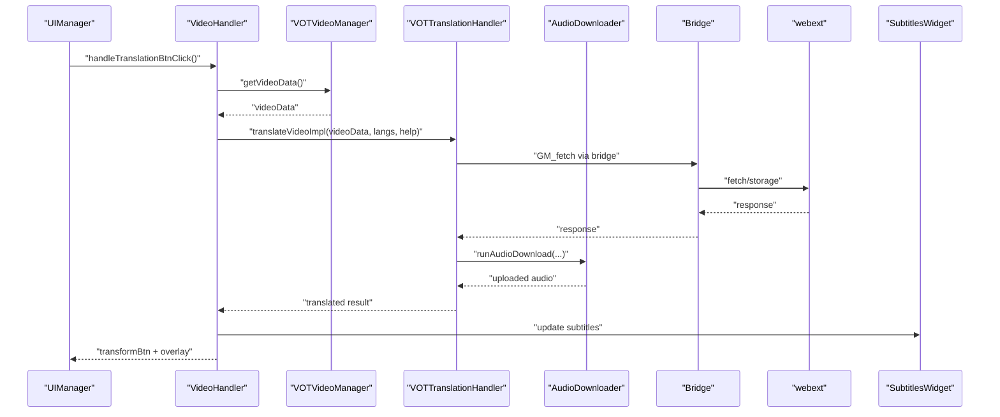
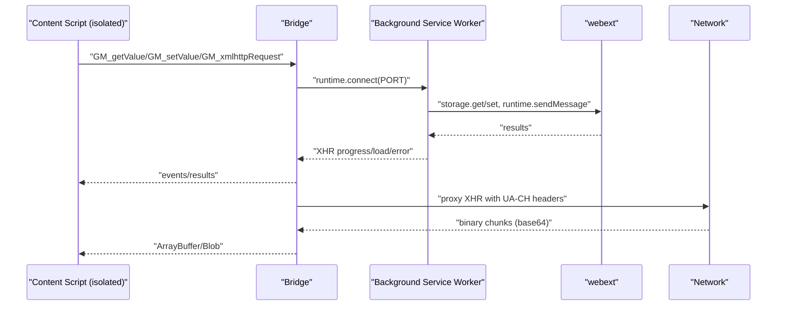
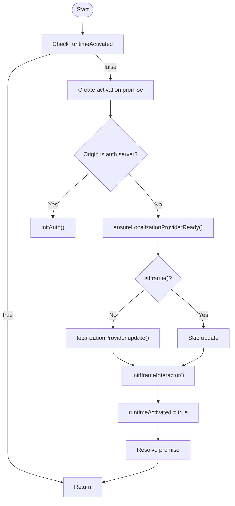
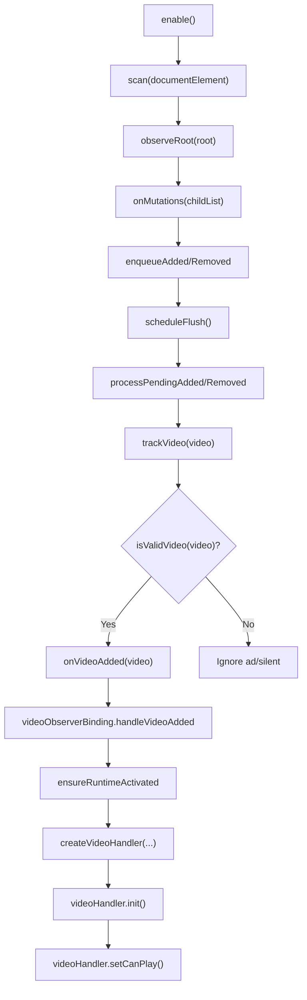
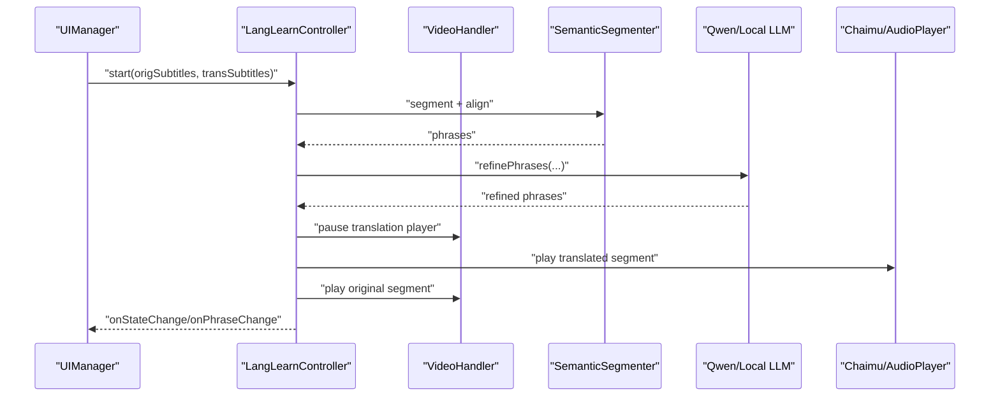
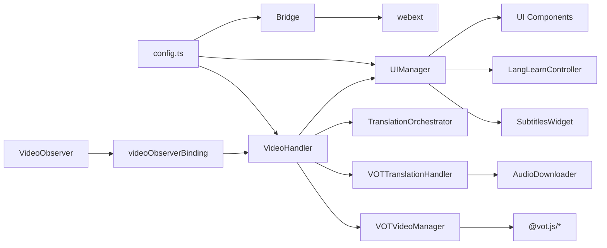

# Architecture Overview

<cite>
**Referenced Files in This Document**
- [src/index.ts](file://src/index.ts)
- [src/extension/bridge.ts](file://src/extension/bridge.ts)
- [src/bootstrap/bootState.ts](file://src/bootstrap/bootState.ts)
- [src/bootstrap/runtimeActivation.ts](file://src/bootstrap/runtimeActivation.ts)
- [src/bootstrap/videoObserverBinding.ts](file://src/bootstrap/videoObserverBinding.ts)
- [src/core/translationOrchestrator.ts](file://src/core/translationOrchestrator.ts)
- [src/core/translationHandler.ts](file://src/core/translationHandler.ts)
- [src/core/videoManager.ts](file://src/core/videoManager.ts)
- [src/videoHandler/shared.ts](file://src/videoHandler/shared.ts)
- [src/ui/manager.ts](file://src/ui/manager.ts)
- [src/subtitles/widget.ts](file://src/subtitles/widget.ts)
- [src/langLearn/LangLearnController.ts](file://src/langLearn/LangLearnController.ts)
- [src/utils/VideoObserver.ts](file://src/utils/VideoObserver.ts)
- [src/extension/webext.ts](file://src/extension/webext.ts)
- [src/config/config.ts](file://src/config/config.ts)
</cite>

## Table of Contents
1. [Introduction](#introduction)
2. [Project Structure](#project-structure)
3. [Core Components](#core-components)
4. [Architecture Overview](#architecture-overview)
5. [Detailed Component Analysis](#detailed-component-analysis)
6. [Dependency Analysis](#dependency-analysis)
7. [Performance Considerations](#performance-considerations)
8. [Troubleshooting Guide](#troubleshooting-guide)
9. [Conclusion](#conclusion)

## Introduction
This document describes the architecture of the English Teacher project, focusing on how the browser extension integrates with video players, translation services, and educational platforms. It explains the modular design separating the core translation engine, UI components, audio processing, and language learning features. Cross-browser compatibility is achieved via an extension bridge pattern, and the bootstrapping process coordinates initialization across environments. Component interaction diagrams illustrate the end-to-end flow from video detection through translation processing to UI updates. The project integrates with the VOT ecosystem and Yandex.Translate, and supports both userscript and native extension deployment modes. Architectural patterns such as mediator, observer, and strategy are used throughout.

## Project Structure
The project is organized into cohesive modules:
- Core orchestration and translation pipeline
- UI and overlays for controls and subtitles
- Audio processing and volume management
- Language learning features
- Extension bridge for cross-browser compatibility
- Bootstrapping and runtime activation
- Video detection and lifecycle management

**Diagram sources**
- [src/utils/VideoObserver.ts:132-645](file://src/utils/VideoObserver.ts#L132-L645)
- [src/bootstrap/videoObserverBinding.ts:30-179](file://src/bootstrap/videoObserverBinding.ts#L30-L179)
- [src/index.ts:114-520](file://src/index.ts#L114-L520)
- [src/core/videoManager.ts:138-436](file://src/core/videoManager.ts#L138-L436)
- [src/core/translationHandler.ts:105-564](file://src/core/translationHandler.ts#L105-L564)
- [src/core/translationOrchestrator.ts:21-85](file://src/core/translationOrchestrator.ts#L21-L85)
- [src/ui/manager.ts:56-138](file://src/ui/manager.ts#L56-L138)
- [src/subtitles/widget.ts:110-800](file://src/subtitles/widget.ts#L110-L800)
- [src/langLearn/LangLearnController.ts:45-851](file://src/langLearn/LangLearnController.ts#L45-L851)
- [src/extension/bridge.ts:26-699](file://src/extension/bridge.ts#L26-L699)
- [src/extension/webext.ts:56-187](file://src/extension/webext.ts#L56-L187)
- [src/config/config.ts:1-63](file://src/config/config.ts#L1-L63)

**Section sources**
- [src/index.ts:1-1594](file://src/index.ts#L1-L1594)
- [src/utils/VideoObserver.ts:132-645](file://src/utils/VideoObserver.ts#L132-L645)
- [src/bootstrap/videoObserverBinding.ts:30-179](file://src/bootstrap/videoObserverBinding.ts#L30-L179)
- [src/config/config.ts:1-63](file://src/config/config.ts#L1-L63)

## Core Components
- VideoHandler: Central orchestrator composing managers, UI, and lifecycle. It holds state for translation, audio, subtitles, and volume synchronization.
- VOTVideoManager: Extracts and validates video metadata, detects language, and manages volume controls.
- VOTTranslationHandler: Implements translation workflow, handles audio downloads, retries, and error mapping.
- TranslationOrchestrator: Mediates auto-translation decisions and state transitions.
- UIManager: Initializes UI overlays, binds events, and coordinates settings and translation actions.
- SubtitlesWidget: Renders and positions subtitles with smart layout and interactivity.
- LangLearnController: Provides language learning mode with phrase segmentation, alignment, and playback.
- Extension Bridge: Bridges isolated content script world to privileged extension APIs for storage and XHR.
- VideoObserver: Detects video elements across DOM and Shadow DOM, filters ads and decorative videos, and emits events.

**Section sources**
- [src/index.ts:114-520](file://src/index.ts#L114-L520)
- [src/core/videoManager.ts:138-436](file://src/core/videoManager.ts#L138-L436)
- [src/core/translationHandler.ts:105-564](file://src/core/translationHandler.ts#L105-L564)
- [src/core/translationOrchestrator.ts:21-85](file://src/core/translationOrchestrator.ts#L21-L85)
- [src/ui/manager.ts:56-138](file://src/ui/manager.ts#L56-L138)
- [src/subtitles/widget.ts:110-800](file://src/subtitles/widget.ts#L110-L800)
- [src/langLearn/LangLearnController.ts:45-851](file://src/langLearn/LangLearnController.ts#L45-L851)
- [src/extension/bridge.ts:26-699](file://src/extension/bridge.ts#L26-L699)
- [src/utils/VideoObserver.ts:132-645](file://src/utils/VideoObserver.ts#L132-L645)

## Architecture Overview
The system follows a modular, layered architecture:
- Detection Layer: VideoObserver scans the DOM and Shadow DOM, emitting events for new or removed videos.
- Binding Layer: videoObserverBinding coordinates runtime activation, service discovery, container resolution, and VideoHandler creation.
- Orchestration Layer: VideoHandler composes managers and UI, delegating translation, video, and UI responsibilities.
- Extension Layer: Bridge mediates between isolated content script world and privileged extension APIs for storage and XHR.
- Configuration Layer: Centralized config defines service endpoints and defaults.

**Diagram sources**
- [src/utils/VideoObserver.ts:132-645](file://src/utils/VideoObserver.ts#L132-L645)
- [src/bootstrap/videoObserverBinding.ts:30-179](file://src/bootstrap/videoObserverBinding.ts#L30-L179)
- [src/bootstrap/runtimeActivation.ts:20-58](file://src/bootstrap/runtimeActivation.ts#L20-L58)
- [src/index.ts:114-520](file://src/index.ts#L114-L520)
- [src/core/videoManager.ts:212-292](file://src/core/videoManager.ts#L212-L292)
- [src/core/translationHandler.ts:311-495](file://src/core/translationHandler.ts#L311-L495)
- [src/extension/bridge.ts:580-699](file://src/extension/bridge.ts#L580-L699)
- [src/extension/webext.ts:103-187](file://src/extension/webext.ts#L103-L187)

## Detailed Component Analysis

### VideoHandler: Orchestrator and State Hub
VideoHandler centralizes translation, UI, audio, and subtitles. It composes:
- Managers: VOTVideoManager, VOTTranslationHandler, TranslationOrchestrator
- UI: UIManager, OverlayVisibilityController, SubtitlesWidget
- Audio: Chaimu player, volume linking, smart ducking
- Lifecycle: Container updates, cache keys, abort controllers

**Diagram sources**
- [src/index.ts:114-520](file://src/index.ts#L114-L520)
- [src/core/videoManager.ts:138-436](file://src/core/videoManager.ts#L138-L436)
- [src/core/translationHandler.ts:105-564](file://src/core/translationHandler.ts#L105-L564)
- [src/core/translationOrchestrator.ts:21-85](file://src/core/translationOrchestrator.ts#L21-L85)
- [src/ui/manager.ts:56-138](file://src/ui/manager.ts#L56-L138)
- [src/subtitles/widget.ts:110-800](file://src/subtitles/widget.ts#L110-L800)

**Section sources**
- [src/index.ts:114-520](file://src/index.ts#L114-L520)

### Translation Pipeline: From Detection to UI Updates
The translation pipeline integrates VOT backend, audio downloader, and UI updates.

**Diagram sources**
- [src/ui/manager.ts:735-800](file://src/ui/manager.ts#L735-L800)
- [src/core/videoManager.ts:212-292](file://src/core/videoManager.ts#L212-L292)
- [src/core/translationHandler.ts:311-495](file://src/core/translationHandler.ts#L311-L495)
- [src/extension/bridge.ts:580-699](file://src/extension/bridge.ts#L580-L699)
- [src/extension/webext.ts:103-187](file://src/extension/webext.ts#L103-L187)
- [src/subtitles/widget.ts:110-800](file://src/subtitles/widget.ts#L110-L800)

**Section sources**
- [src/ui/manager.ts:735-800](file://src/ui/manager.ts#L735-L800)
- [src/core/translationHandler.ts:311-495](file://src/core/translationHandler.ts#L311-L495)

### Extension Bridge Pattern: Cross-Browser Compatibility
The bridge pattern isolates the content script from privileged extension APIs. The bridge runs in an isolated world and relays requests to the background via ports, handling storage, notifications, and XHR with UA-CH normalization and binary response handling.

**Diagram sources**
- [src/extension/bridge.ts:26-699](file://src/extension/bridge.ts#L26-L699)
- [src/extension/webext.ts:56-187](file://src/extension/webext.ts#L56-L187)

**Section sources**
- [src/extension/bridge.ts:26-699](file://src/extension/bridge.ts#L26-L699)
- [src/extension/webext.ts:56-187](file://src/extension/webext.ts#L56-L187)

### Bootstrapping and Runtime Activation
Bootstrapping ensures runtime readiness before video initialization. It activates localization, handles iframe contexts, and binds iframe interactor once.

**Diagram sources**
- [src/bootstrap/runtimeActivation.ts:20-58](file://src/bootstrap/runtimeActivation.ts#L20-L58)
- [src/bootstrap/bootState.ts:26-42](file://src/bootstrap/bootState.ts#L26-L42)

**Section sources**
- [src/bootstrap/runtimeActivation.ts:20-58](file://src/bootstrap/runtimeActivation.ts#L20-L58)
- [src/bootstrap/bootState.ts:26-42](file://src/bootstrap/bootState.ts#L26-L42)

### Video Detection and Lifecycle Management
VideoObserver scans DOM and Shadow DOM, filters ad-related and silent decorative videos, and emits events. videoObserverBinding coordinates runtime activation, service discovery, container resolution, and VideoHandler creation/replacement.

**Diagram sources**
- [src/utils/VideoObserver.ts:580-645](file://src/utils/VideoObserver.ts#L580-L645)
- [src/bootstrap/videoObserverBinding.ts:90-179](file://src/bootstrap/videoObserverBinding.ts#L90-L179)

**Section sources**
- [src/utils/VideoObserver.ts:132-645](file://src/utils/VideoObserver.ts#L132-L645)
- [src/bootstrap/videoObserverBinding.ts:30-179](file://src/bootstrap/videoObserverBinding.ts#L30-L179)

### Language Learning Features
LangLearnController orchestrates phrase segmentation, alignment, refinement (Qwen API or local WebGPU), and synchronized playback of original and translated segments with timing logs and progress callbacks.

**Diagram sources**
- [src/langLearn/LangLearnController.ts:91-203](file://src/langLearn/LangLearnController.ts#L91-L203)
- [src/ui/manager.ts:541-624](file://src/ui/manager.ts#L541-L624)

**Section sources**
- [src/langLearn/LangLearnController.ts:45-851](file://src/langLearn/LangLearnController.ts#L45-L851)
- [src/ui/manager.ts:541-624](file://src/ui/manager.ts#L541-L624)

## Dependency Analysis
The system exhibits clear separation of concerns:
- VideoHandler depends on managers and UI, mediating between them.
- VOTVideoManager depends on VOT helpers/utils and localization provider.
- VOTTranslationHandler depends on AudioDownloader and VOT client.
- UIManager depends on UI components and interacts with VideoHandler.
- SubtitlesWidget depends on layout/position utilities and UI components.
- LangLearnController depends on segmentation and refinement modules and VideoHandler.
- Bridge depends on webext for cross-browser API access.
- Config provides centralized endpoints and defaults.

**Diagram sources**
- [src/config/config.ts:1-63](file://src/config/config.ts#L1-L63)
- [src/utils/VideoObserver.ts:132-645](file://src/utils/VideoObserver.ts#L132-L645)
- [src/bootstrap/videoObserverBinding.ts:30-179](file://src/bootstrap/videoObserverBinding.ts#L30-L179)
- [src/index.ts:114-520](file://src/index.ts#L114-L520)
- [src/extension/bridge.ts:26-699](file://src/extension/bridge.ts#L26-L699)
- [src/extension/webext.ts:56-187](file://src/extension/webext.ts#L56-L187)

**Section sources**
- [src/index.ts:1-1594](file://src/index.ts#L1-L1594)
- [src/config/config.ts:1-63](file://src/config/config.ts#L1-L63)

## Performance Considerations
- Lazy initialization: UIManager and SubtitlesWidget are created on demand to reduce overhead.
- Debouncing and throttling: IntervalIdleChecker drives periodic tasks to minimize CPU usage.
- Single-flight language detection: Shared language state prevents duplicate detection requests.
- Retry and backoff: TranslationHandler schedules retries with exponential-like delays.
- Binary response handling: Bridge aggregates base64 chunks into ArrayBuffers efficiently.
- Smart layout caching: SubtitlesWidget caches layout computations and resets only on changes.

[No sources needed since this section provides general guidance]

## Troubleshooting Guide
Common issues and diagnostics:
- Translation failures: VOTTranslationHandler maps backend errors to localized UI errors and notifies users. Check error translation cache and retry logic.
- Audio download failures: On failure, the handler attempts fallback routes and signals completion to resume translation polling.
- Bridge XHR errors: Bridge logs and summarizes request bodies, strips sensitive headers, and normalizes UA-CH headers for Yandex endpoints.
- Runtime activation failures: ensureRuntimeActivated guards against duplicate activations and handles iframe contexts.
- Video detection misses: Verify VideoObserver filters and Shadow DOM hooks are installed; confirm service configuration and container selectors.

**Section sources**
- [src/core/translationHandler.ts:68-98](file://src/core/translationHandler.ts#L68-L98)
- [src/extension/bridge.ts:580-699](file://src/extension/bridge.ts#L580-L699)
- [src/bootstrap/runtimeActivation.ts:20-58](file://src/bootstrap/runtimeActivation.ts#L20-L58)
- [src/utils/VideoObserver.ts:530-550](file://src/utils/VideoObserver.ts#L530-L550)

## Conclusion
The English Teacher project employs a robust, modular architecture that cleanly separates concerns across translation orchestration, UI, audio processing, and language learning. The extension bridge pattern ensures cross-browser compatibility by isolating privileged operations. The bootstrapping process guarantees runtime readiness, while the video detection subsystem efficiently discovers and manages video lifecycles. The documented component interactions and patterns provide a clear foundation for extending functionality, integrating new services, and maintaining performance and reliability.