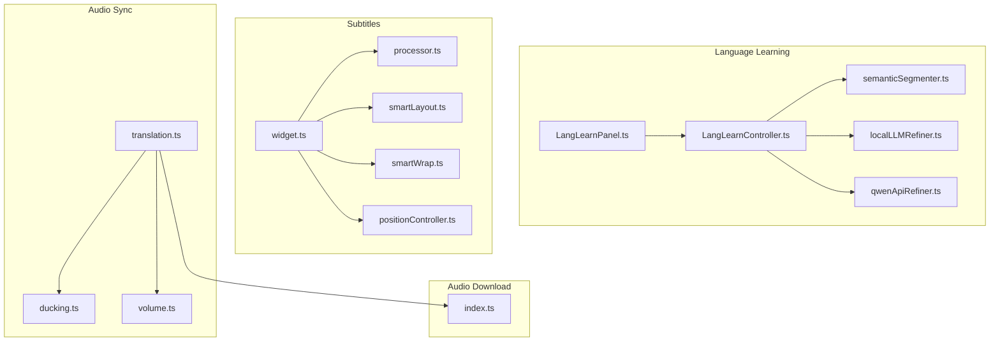
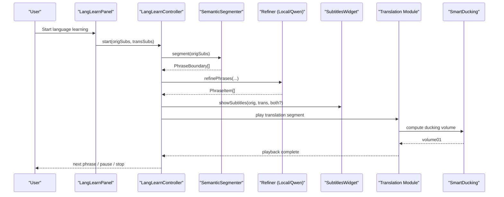
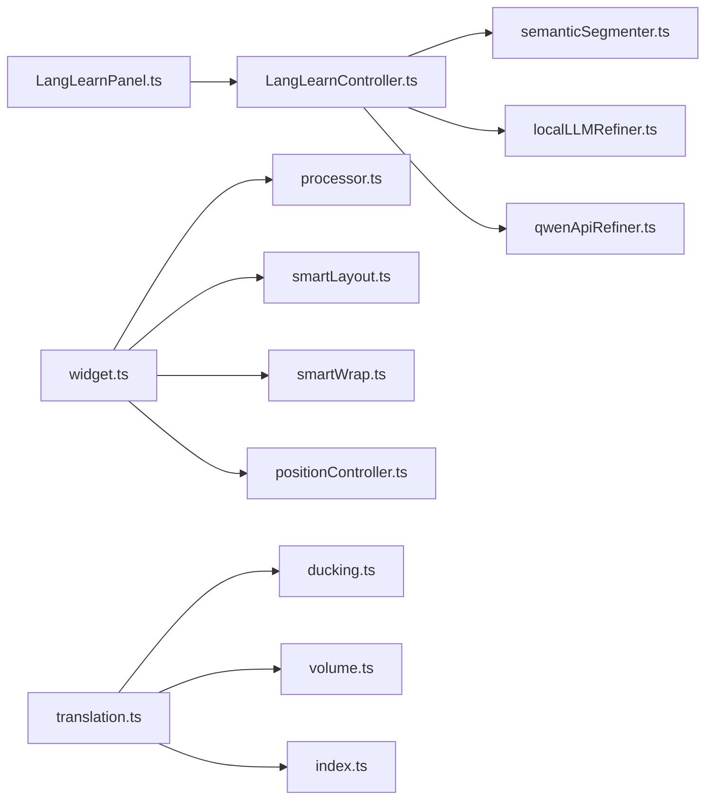

# Core Features

<cite>
**Referenced Files in This Document**
- [README-EN.md](file://README-EN.md)
- [LangLearnController.ts](file://src/langLearn/LangLearnController.ts)
- [LangLearnPanel.ts](file://src/langLearn/LangLearnPanel.ts)
- [semanticSegmenter.ts](file://src/langLearn/phraseSegmenter/semanticSegmenter.ts)
- [localLLMRefiner.ts](file://src/langLearn/phraseSegmenter/localLLMRefiner.ts)
- [qwenApiRefiner.ts](file://src/langLearn/phraseSegmenter/qwenApiRefiner.ts)
- [widget.ts](file://src/subtitles/widget.ts)
- [processor.ts](file://src/subtitles/processor.ts)
- [smartLayout.ts](file://src/subtitles/smartLayout.ts)
- [smartWrap.ts](file://src/subtitles/smartWrap.ts)
- [positionController.ts](file://src/subtitles/positionController.ts)
- [translation.ts](file://src/videoHandler/modules/translation.ts)
- [ducking.ts](file://src/videoHandler/modules/ducking.ts)
- [volume.ts](file://src/utils/volume.ts)
- [index.ts](file://src/audioDownloader/index.ts)
</cite>

## Table of Contents
1. [Introduction](#introduction)
2. [Project Structure](#project-structure)
3. [Core Components](#core-components)
4. [Architecture Overview](#architecture-overview)
5. [Detailed Component Analysis](#detailed-component-analysis)
6. [Dependency Analysis](#dependency-analysis)
7. [Performance Considerations](#performance-considerations)
8. [Troubleshooting Guide](#troubleshooting-guide)
9. [Conclusion](#conclusion)

## Introduction
This document presents the core features of the English Teacher project with a focus on three primary value propositions:
- Real-time video translation synchronized with original audio
- Automated subtitle generation and intelligent layout
- Immersive language learning mode with semantic phrase segmentation powered by local NLP processing

Additional capabilities include:
- Smart subtitle layout adaptation, format conversion, and positioning controls
- Audio synchronization with adaptive volume ducking, separate volume controls, and audio download functionality

Each feature is explained in terms of its implementation, user impact, and practical benefits for English language learning outcomes.

## Project Structure
The English Teacher project is organized around modular subsystems:
- Language learning pipeline: phrase segmentation, refinement, and playback orchestration
- Subtitle processing: fetching, normalization, layout, wrapping, and rendering
- Audio synchronization: translation playback, smart ducking, and volume controls
- Audio download: streaming and partial chunk delivery

**Diagram sources**
- [LangLearnController.ts:45-85](file://src/langLearn/LangLearnController.ts#L45-L85)
- [LangLearnPanel.ts:8-62](file://src/langLearn/LangLearnPanel.ts#L8-L62)
- [semanticSegmenter.ts:730-745](file://src/langLearn/phraseSegmenter/semanticSegmenter.ts#L730-L745)
- [localLLMRefiner.ts:411-561](file://src/langLearn/phraseSegmenter/localLLMRefiner.ts#L411-L561)
- [qwenApiRefiner.ts:385-519](file://src/langLearn/phraseSegmenter/qwenApiRefiner.ts#L385-L519)
- [widget.ts:110-183](file://src/subtitles/widget.ts#L110-L183)
- [processor.ts:632-800](file://src/subtitles/processor.ts#L632-L800)
- [smartLayout.ts:105-137](file://src/subtitles/smartLayout.ts#L105-L137)
- [smartWrap.ts:631-657](file://src/subtitles/smartWrap.ts#L631-L657)
- [positionController.ts:27-57](file://src/subtitles/positionController.ts#L27-L57)
- [translation.ts:1-120](file://src/videoHandler/modules/translation.ts#L1-L120)
- [ducking.ts:111-275](file://src/videoHandler/modules/ducking.ts#L111-L275)
- [volume.ts:1-97](file://src/utils/volume.ts#L1-L97)
- [index.ts:87-188](file://src/audioDownloader/index.ts#L87-L188)

**Section sources**
- [README-EN.md:99-117](file://README-EN.md#L99-L117)

## Core Components
This section outlines the primary features and their implementation touchpoints.

- Real-time video translation
  - Translation module orchestrates fetching, caching, and applying translated audio streams; integrates with smart ducking and volume controls.
  - Supports audio download strategies for offline use.
  - References: [translation.ts:1-120](file://src/videoHandler/modules/translation.ts#L1-L120), [index.ts:87-188](file://src/audioDownloader/index.ts#L87-L188), [ducking.ts:111-275](file://src/videoHandler/modules/ducking.ts#L111-L275), [volume.ts:1-97](file://src/utils/volume.ts#L1-L97)

- Automated subtitle generation and intelligent layout
  - Subtitle processor normalizes and converts formats (.srt, .vtt, .json), merges duplicates, and builds tokenized lines.
  - Subtitles widget renders and positions overlays, computes smart layout and wrapping, and handles drag-to-reposition.
  - References: [processor.ts:632-800](file://src/subtitles/processor.ts#L632-L800), [widget.ts:110-183](file://src/subtitles/widget.ts#L110-L183), [smartLayout.ts:105-137](file://src/subtitles/smartLayout.ts#L105-L137), [smartWrap.ts:631-657](file://src/subtitles/smartWrap.ts#L631-L657), [positionController.ts:27-57](file://src/subtitles/positionController.ts#L27-L57)

- Immersive language learning mode
  - Semantic segmentation splits subtitles into meaningful phrases; refinement improves alignment using either local WebGPU or Qwen API.
  - Playback controller coordinates synchronized translation playback, pause intervals, and fallback modes for low-confidence alignments.
  - References: [semanticSegmenter.ts:730-745](file://src/langLearn/phraseSegmenter/semanticSegmenter.ts#L730-L745), [localLLMRefiner.ts:411-561](file://src/langLearn/phraseSegmenter/localLLMRefiner.ts#L411-L561), [qwenApiRefiner.ts:385-519](file://src/langLearn/phraseSegmenter/qwenApiRefiner.ts#L385-L519), [LangLearnController.ts:91-203](file://src/langLearn/LangLearnController.ts#L91-L203), [LangLearnPanel.ts:8-62](file://src/langLearn/LangLearnPanel.ts#L8-L62)

**Section sources**
- [README-EN.md:99-117](file://README-EN.md#L99-L117)
- [LangLearnController.ts:45-85](file://src/langLearn/LangLearnController.ts#L45-L85)
- [LangLearnPanel.ts:8-62](file://src/langLearn/LangLearnPanel.ts#L8-L62)
- [semanticSegmenter.ts:730-745](file://src/langLearn/phraseSegmenter/semanticSegmenter.ts#L730-L745)
- [localLLMRefiner.ts:411-561](file://src/langLearn/phraseSegmenter/localLLMRefiner.ts#L411-L561)
- [qwenApiRefiner.ts:385-519](file://src/langLearn/phraseSegmenter/qwenApiRefiner.ts#L385-L519)
- [widget.ts:110-183](file://src/subtitles/widget.ts#L110-L183)
- [processor.ts:632-800](file://src/subtitles/processor.ts#L632-L800)
- [smartLayout.ts:105-137](file://src/subtitles/smartLayout.ts#L105-L137)
- [smartWrap.ts:631-657](file://src/subtitles/smartWrap.ts#L631-L657)
- [positionController.ts:27-57](file://src/subtitles/positionController.ts#L27-L57)
- [translation.ts:1-120](file://src/videoHandler/modules/translation.ts#L1-L120)
- [ducking.ts:111-275](file://src/videoHandler/modules/ducking.ts#L111-L275)
- [volume.ts:1-97](file://src/utils/volume.ts#L1-L97)
- [index.ts:87-188](file://src/audioDownloader/index.ts#L87-L188)

## Architecture Overview
The system integrates language learning, subtitle processing, and audio synchronization into a cohesive workflow.

**Diagram sources**
- [LangLearnPanel.ts:8-62](file://src/langLearn/LangLearnPanel.ts#L8-L62)
- [LangLearnController.ts:91-203](file://src/langLearn/LangLearnController.ts#L91-L203)
- [semanticSegmenter.ts:730-745](file://src/langLearn/phraseSegmenter/semanticSegmenter.ts#L730-L745)
- [localLLMRefiner.ts:411-561](file://src/langLearn/phraseSegmenter/localLLMRefiner.ts#L411-L561)
- [qwenApiRefiner.ts:385-519](file://src/langLearn/phraseSegmenter/qwenApiRefiner.ts#L385-L519)
- [widget.ts:430-435](file://src/subtitles/widget.ts#L430-L435)
- [translation.ts:503-565](file://src/videoHandler/modules/translation.ts#L503-L565)
- [ducking.ts:111-275](file://src/videoHandler/modules/ducking.ts#L111-L275)

## Detailed Component Analysis

### Real-time Video Translation
Real-time translation synchronizes translated audio with the original video, ensuring seamless comprehension and pronunciation practice.

- Translation orchestration
  - Fetches and validates translated audio URLs, applies them to the player, caches results, and schedules refreshes.
  - Integrates with proxy settings and handles multi-method S3 detection.
  - References: [translation.ts:667-757](file://src/videoHandler/modules/translation.ts#L667-L757), [translation.ts:759-799](file://src/videoHandler/modules/translation.ts#L759-L799)

- Smart volume ducking
  - Dynamically adjusts video volume while translated audio plays using RMS analysis and configurable thresholds.
  - Provides classic and smart modes, with runtime persistence and restoration.
  - References: [ducking.ts:111-275](file://src/videoHandler/modules/ducking.ts#L111-L275), [translation.ts:503-565](file://src/videoHandler/modules/translation.ts#L503-L565)

- Separate volume controls
  - Normalizes and quantizes volume steps; exposes helpers for UI and runtime adjustments.
  - References: [volume.ts:66-96](file://src/utils/volume.ts#L66-L96)

- Audio download
  - Streams audio in chunks, dispatching partial and final results; robust error handling and event signaling.
  - References: [index.ts:87-188](file://src/audioDownloader/index.ts#L87-L188)

Practical impact:
- Learners can focus on pronunciation and rhythm without missing audio cues.
- Reduced cognitive load by aligning audio with visual context.
- Offline accessibility via audio downloads for repeated practice.

**Section sources**
- [translation.ts:667-757](file://src/videoHandler/modules/translation.ts#L667-L757)
- [translation.ts:759-799](file://src/videoHandler/modules/translation.ts#L759-L799)
- [ducking.ts:111-275](file://src/videoHandler/modules/ducking.ts#L111-L275)
- [volume.ts:66-96](file://src/utils/volume.ts#L66-L96)
- [index.ts:87-188](file://src/audioDownloader/index.ts#L87-L188)

### Automated Subtitle Generation and Intelligent Layout
Automated subtitle processing ensures readable, well-positioned, and format-conversion-ready text.

- Subtitle fetching and normalization
  - Converts .srt/.vtt to internal JSON, cleans VK-style duplicates, and builds tokenized lines with timings.
  - References: [processor.ts:564-592](file://src/subtitles/processor.ts#L564-L592), [processor.ts:632-787](file://src/subtitles/processor.ts#L632-L787)

- Smart layout and wrapping
  - Computes font size, max width, and line length based on anchor box and aspect ratio.
  - Wraps text into two lines with balanced widths and avoids orphan words.
  - References: [smartLayout.ts:105-137](file://src/subtitles/smartLayout.ts#L105-L137), [smartWrap.ts:298-436](file://src/subtitles/smartWrap.ts#L298-L436), [smartWrap.ts:631-657](file://src/subtitles/smartWrap.ts#L631-L657)

- Positioning and drag-to-reposition
  - Clamps overlay within bounds, respects safe areas and bottom insets, and updates layout on resize.
  - References: [positionController.ts:27-57](file://src/subtitles/positionController.ts#L27-L57), [widget.ts:500-593](file://src/subtitles/widget.ts#L500-L593)

- Format conversion
  - Converts between .srt, .vtt, and .json for export and interoperability.
  - References: [processor.ts:564-574](file://src/subtitles/processor.ts#L564-L574)

Practical impact:
- Learners see aligned, readable subtitles that adapt to screen sizes and orientations.
- Consistent timing and spacing reduce eye strain and improve focus.
- Export options support offline study and content sharing.

**Section sources**
- [processor.ts:564-592](file://src/subtitles/processor.ts#L564-L592)
- [processor.ts:632-787](file://src/subtitles/processor.ts#L632-L787)
- [smartLayout.ts:105-137](file://src/subtitles/smartLayout.ts#L105-L137)
- [smartWrap.ts:298-436](file://src/subtitles/smartWrap.ts#L298-L436)
- [smartWrap.ts:631-657](file://src/subtitles/smartWrap.ts#L631-L657)
- [positionController.ts:27-57](file://src/subtitles/positionController.ts#L27-L57)
- [widget.ts:500-593](file://src/subtitles/widget.ts#L500-L593)

### Immersive Language Learning Mode
The language learning mode segments subtitles into meaningful phrases, refines alignment using local or cloud-based AI, and plays them back with synchronized audio.

- Semantic phrase segmentation
  - Splits continuous text into phrases respecting punctuation, logical connectors, and duration constraints.
  - References: [semanticSegmenter.ts:730-745](file://src/langLearn/phraseSegmenter/semanticSegmenter.ts#L730-L745)

- Refinement with local or cloud AI
  - Local WebGPU path uses MLC engine to redistribute translation text and rebalance timings.
  - Cloud path uses Qwen-3.5-Omni API for segmentation and redistribution with confidence scoring.
  - References: [localLLMRefiner.ts:411-561](file://src/langLearn/phraseSegmenter/localLLMRefiner.ts#L411-L561), [qwenApiRefiner.ts:385-519](file://src/langLearn/phraseSegmenter/qwenApiRefiner.ts#L385-L519)

- Playback orchestration
  - Plays translated segments at adjusted rates, pauses between translation and original, and falls back to text-only when confidence is low.
  - Manages playback state, seeks, and timing with drift tracking.
  - References: [LangLearnController.ts:361-500](file://src/langLearn/LangLearnController.ts#L361-L500), [LangLearnController.ts:91-203](file://src/langLearn/LangLearnController.ts#L91-L203)

- UI and controls
  - Provides start/pause, next/prev, pause duration adjustment, and refiner selection with live progress.
  - References: [LangLearnPanel.ts:8-62](file://src/langLearn/LangLearnPanel.ts#L8-L62), [LangLearnPanel.ts:401-442](file://src/langLearn/LangLearnPanel.ts#L401-L442)

Practical impact:
- Learners study complete thoughts rather than fragmented segments, improving comprehension and retention.
- Confidence-aware fallback prevents confusion from misaligned translations.
- Structured playback encourages repetition and spaced practice.

**Section sources**
- [semanticSegmenter.ts:730-745](file://src/langLearn/phraseSegmenter/semanticSegmenter.ts#L730-L745)
- [localLLMRefiner.ts:411-561](file://src/langLearn/phraseSegmenter/localLLMRefiner.ts#L411-L561)
- [qwenApiRefiner.ts:385-519](file://src/langLearn/phraseSegmenter/qwenApiRefiner.ts#L385-L519)
- [LangLearnController.ts:361-500](file://src/langLearn/LangLearnController.ts#L361-L500)
- [LangLearnController.ts:91-203](file://src/langLearn/LangLearnController.ts#L91-L203)
- [LangLearnPanel.ts:8-62](file://src/langLearn/LangLearnPanel.ts#L8-L62)
- [LangLearnPanel.ts:401-442](file://src/langLearn/LangLearnPanel.ts#L401-L442)

## Dependency Analysis
The following diagram highlights key dependencies among core modules.

**Diagram sources**
- [LangLearnController.ts:1-85](file://src/langLearn/LangLearnController.ts#L1-L85)
- [semanticSegmenter.ts:1-20](file://src/langLearn/phraseSegmenter/semanticSegmenter.ts#L1-L20)
- [localLLMRefiner.ts:1-10](file://src/langLearn/phraseSegmenter/localLLMRefiner.ts#L1-L10)
- [qwenApiRefiner.ts:1-10](file://src/langLearn/phraseSegmenter/qwenApiRefiner.ts#L1-L10)
- [LangLearnPanel.ts:1-10](file://src/langLearn/LangLearnPanel.ts#L1-L10)
- [widget.ts:1-20](file://src/subtitles/widget.ts#L1-L20)
- [processor.ts:1-20](file://src/subtitles/processor.ts#L1-L20)
- [smartLayout.ts:1-10](file://src/subtitles/smartLayout.ts#L1-L10)
- [smartWrap.ts:1-10](file://src/subtitles/smartWrap.ts#L1-L10)
- [positionController.ts:1-10](file://src/subtitles/positionController.ts#L1-L10)
- [translation.ts:1-20](file://src/videoHandler/modules/translation.ts#L1-L20)
- [ducking.ts:1-10](file://src/videoHandler/modules/ducking.ts#L1-L10)
- [volume.ts:1-10](file://src/utils/volume.ts#L1-L10)
- [index.ts:1-10](file://src/audioDownloader/index.ts#L1-L10)

**Section sources**
- [LangLearnController.ts:1-85](file://src/langLearn/LangLearnController.ts#L1-L85)
- [LangLearnPanel.ts:1-10](file://src/langLearn/LangLearnPanel.ts#L1-L10)
- [semanticSegmenter.ts:1-20](file://src/langLearn/phraseSegmenter/semanticSegmenter.ts#L1-L20)
- [localLLMRefiner.ts:1-10](file://src/langLearn/phraseSegmenter/localLLMRefiner.ts#L1-L10)
- [qwenApiRefiner.ts:1-10](file://src/langLearn/phraseSegmenter/qwenApiRefiner.ts#L1-L10)
- [widget.ts:1-20](file://src/subtitles/widget.ts#L1-L20)
- [processor.ts:1-20](file://src/subtitles/processor.ts#L1-L20)
- [smartLayout.ts:1-10](file://src/subtitles/smartLayout.ts#L1-L10)
- [smartWrap.ts:1-10](file://src/subtitles/smartWrap.ts#L1-L10)
- [positionController.ts:1-10](file://src/subtitles/positionController.ts#L1-L10)
- [translation.ts:1-20](file://src/videoHandler/modules/translation.ts#L1-L20)
- [ducking.ts:1-10](file://src/videoHandler/modules/ducking.ts#L1-L10)
- [volume.ts:1-10](file://src/utils/volume.ts#L1-L10)
- [index.ts:1-10](file://src/audioDownloader/index.ts#L1-L10)

## Performance Considerations
- Smart ducking runs at fixed intervals with bounded RMS envelope updates to minimize CPU overhead.
- Subtitle layout and wrapping computations leverage prefix sums and binary search-like scans to efficiently compute optimal line breaks.
- Language learning refinement batches work into windows and prioritizes proximity to playback index to reduce latency.
- Audio download streams chunks asynchronously to avoid blocking UI and to support resumable downloads.

[No sources needed since this section provides general guidance]

## Troubleshooting Guide
- Translation playback issues
  - Validate audio URL probing and proxy settings; clear caches on proxy changes; schedule refresh after TTL.
  - References: [translation.ts:623-651](file://src/videoHandler/modules/translation.ts#L623-L651), [translation.ts:774-793](file://src/videoHandler/modules/translation.ts#L774-L793), [translation.ts:653-665](file://src/videoHandler/modules/translation.ts#L653-L665)

- Smart ducking not responding
  - Ensure analyser nodes are connected and audio context is resumed; verify RMS detection and runtime state.
  - References: [ducking.ts:275-333](file://src/videoHandler/modules/ducking.ts#L275-L333), [translation.ts:124-159](file://src/videoHandler/modules/translation.ts#L124-L159)

- Subtitles not visible or misplaced
  - Check anchor box computation, bottom inset, and safe area probes; reposition on resize and viewport changes.
  - References: [widget.ts:500-593](file://src/subtitles/widget.ts#L500-L593), [positionController.ts:27-57](file://src/subtitles/positionController.ts#L27-L57)

- Language learning refinement failures
  - Verify WebGPU availability and model readiness; check API key configuration and retry attempts.
  - References: [localLLMRefiner.ts:19-28](file://src/langLearn/phraseSegmenter/localLLMRefiner.ts#L19-L28), [qwenApiRefiner.ts:564-567](file://src/langLearn/phraseSegmenter/qwenApiRefiner.ts#L564-L567), [qwenApiRefiner.ts:572-603](file://src/langLearn/phraseSegmenter/qwenApiRefiner.ts#L572-L603)

**Section sources**
- [translation.ts:623-651](file://src/videoHandler/modules/translation.ts#L623-L651)
- [translation.ts:774-793](file://src/videoHandler/modules/translation.ts#L774-L793)
- [translation.ts:653-665](file://src/videoHandler/modules/translation.ts#L653-L665)
- [translation.ts:124-159](file://src/videoHandler/modules/translation.ts#L124-L159)
- [ducking.ts:275-333](file://src/videoHandler/modules/ducking.ts#L275-L333)
- [widget.ts:500-593](file://src/subtitles/widget.ts#L500-L593)
- [positionController.ts:27-57](file://src/subtitles/positionController.ts#L27-L57)
- [localLLMRefiner.ts:19-28](file://src/langLearn/phraseSegmenter/localLLMRefiner.ts#L19-L28)
- [qwenApiRefiner.ts:564-567](file://src/langLearn/phraseSegmenter/qwenApiRefiner.ts#L564-L567)
- [qwenApiRefiner.ts:572-603](file://src/langLearn/phraseSegmenter/qwenApiRefiner.ts#L572-L603)

## Conclusion
The English Teacher project delivers a comprehensive, research-backed learning experience:
- Real-time translation with adaptive audio ducking ensures learners stay immersed.
- Intelligent subtitle processing provides readable, well-positioned text across devices.
- Language learning mode segments and refines phrases to promote deep understanding and retention.

Together, these features transform passive viewing into an active, structured learning journey.

[No sources needed since this section summarizes without analyzing specific files]