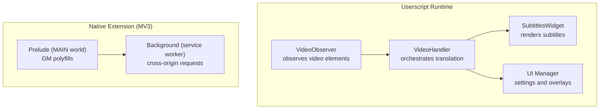
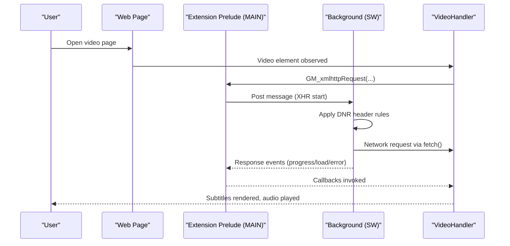
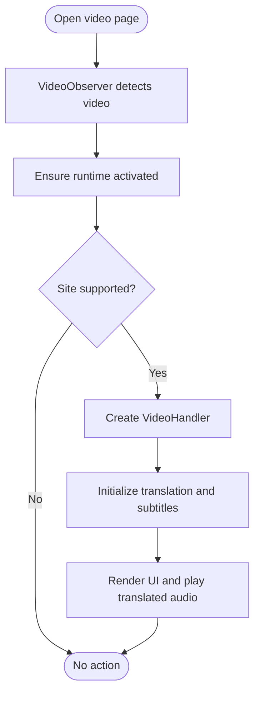
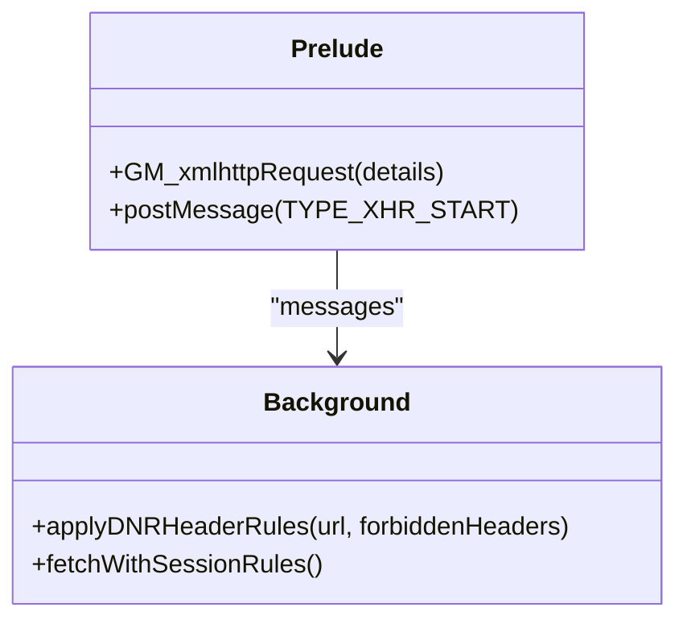

# Getting Started

<cite>
**Referenced Files in This Document**
- [README-EN.md](file://README-EN.md)
- [package.json](file://package.json)
- [vite.extension.config.ts](file://vite.extension.config.ts)
- [src/config/config.ts](file://src/config/config.ts)
- [src/extension/background.ts](file://src/extension/background.ts)
- [src/extension/constants.ts](file://src/extension/constants.ts)
- [src/extension/prelude.ts](file://src/extension/prelude.ts)
- [src/index.ts](file://src/index.ts)
- [src/bootstrap/videoObserverBinding.ts](file://src/bootstrap/videoObserverBinding.ts)
- [src/ui/views/settings.ts](file://src/ui/views/settings.ts)
- [src/types/views/settings.ts](file://src/types/views/settings.ts)
</cite>

## Table of Contents
1. [Introduction](#introduction)
2. [Project Structure](#project-structure)
3. [Core Components](#core-components)
4. [Architecture Overview](#architecture-overview)
5. [Installation Guides](#installation-guides)
6. [Quick Start Tutorials](#quick-start-tutorials)
7. [Browser Compatibility and MV2/MV3 Notes](#browser-compatibility-and-mv2mv3-notes)
8. [Troubleshooting Guide](#troubleshooting-guide)
9. [Conclusion](#conclusion)

## Introduction
This guide helps you install and use the English Teacher project (also known as Voice Over Translation) across multiple deployment modes: as a userscript (Tampermonkey/Violentmonkey), as a native browser extension (Chrome/Edge/Brave/Opera/Firefox), and via alternative script managers. You will learn system requirements, browser compatibility, prerequisites, step-by-step installation, and how to translate your first video, configure basic settings, and use core features like automatic translation and synchronized subtitles.

## Project Structure
At a high level, the project provides:
- A userscript build for broad compatibility with userscript managers
- A native extension build for modern browsers (Chrome/Edge/Brave/Opera/Firefox)
- A runtime that observes video elements, orchestrates translation, and renders subtitles and audio

**Diagram sources**
- [src/bootstrap/videoObserverBinding.ts:30-179](file://src/bootstrap/videoObserverBinding.ts#L30-L179)
- [src/index.ts:114-520](file://src/index.ts#L114-L520)
- [src/extension/prelude.ts:288-478](file://src/extension/prelude.ts#L288-L478)
- [src/extension/background.ts:12-1086](file://src/extension/background.ts#L12-L1086)

**Section sources**
- [README-EN.md:69-129](file://README-EN.md#L69-L129)
- [package.json:31-47](file://package.json#L31-L47)

## Core Components
- VideoHandler: central orchestration class that manages translation, subtitles, audio, and UI for a given video element.
- VideoObserver and binding: watches for new video elements and attaches a VideoHandler when a supported site is detected.
- Settings UI: a configurable settings panel for auto-translate, subtitles, hotkeys, proxy, and appearance.
- Extension bridge: a MAIN-world prelude script and background service worker that implement GM_* polyfills and cross-origin requests for MV3.

Key responsibilities:
- Detect supported sites and containers
- Initialize translation and subtitles
- Manage audio playback and ducking
- Persist and apply user preferences

**Section sources**
- [src/index.ts:114-520](file://src/index.ts#L114-L520)
- [src/bootstrap/videoObserverBinding.ts:30-179](file://src/bootstrap/videoObserverBinding.ts#L30-L179)
- [src/ui/views/settings.ts:99-800](file://src/ui/views/settings.ts#L99-L800)
- [src/extension/prelude.ts:288-478](file://src/extension/prelude.ts#L288-L478)
- [src/extension/background.ts:12-1086](file://src/extension/background.ts#L12-L1086)

## Architecture Overview
The runtime integrates with pages through either a userscript or a native extension. In MV3, the extension uses a MAIN-world prelude to expose GM_* APIs and a background service worker to perform cross-origin requests and header manipulation.

**Diagram sources**
- [src/extension/prelude.ts:310-379](file://src/extension/prelude.ts#L310-L379)
- [src/extension/background.ts:535-800](file://src/extension/background.ts#L535-L800)
- [src/index.ts:632-635](file://src/index.ts#L632-L635)

## Installation Guides

### System Requirements
- Supported browsers and userscript managers are documented in the project’s English README.
- For MV3 users (Tampermonkey 5.2+ on Chromium), enable Developer Mode and allow User Scripts as needed.
- For Opera, use Violentmonkey and enable “Allow access to search page results” if required.

**Section sources**
- [README-EN.md:69-98](file://README-EN.md#L69-L98)
- [README-EN.md:71-79](file://README-EN.md#L71-L79)
- [README-EN.md:251-296](file://README-EN.md#L251-L296)

### Install as a Userscript (Tampermonkey/Violentmonkey/Others)
- Install a userscript manager (e.g., Tampermonkey or Violentmonkey).
- Install the latest userscript artifact from the Releases page.
- On Chromium 138+, ensure “Allow User Scripts” is enabled in the Extensions page.

Tip: If you prefer building locally, see the build commands in the README.

**Section sources**
- [README-EN.md:81-82](file://README-EN.md#L81-L82)
- [README-EN.md:71-79](file://README-EN.md#L71-L79)
- [README-EN.md:170-219](file://README-EN.md#L170-L219)

### Install Native Extension (Chrome/Edge/Brave/Opera)
- Download the appropriate ZIP/XPI from Releases.
- Open your browser’s Extensions page:
  - Chrome/Edge/Brave: chrome://extensions
  - Opera: opera://extensions
- Enable Developer Mode, then drag and drop the archive.

Notes:
- Chrome/Edge/Brave: MV3 service worker handles cross-origin requests and header normalization.
- Firefox: install the XPI from Releases.

**Section sources**
- [README-EN.md:84-98](file://README-EN.md#L84-L98)
- [src/extension/background.ts:12-1086](file://src/extension/background.ts#L12-L1086)

### Alternative Script Managers
- Tested managers include Tampermonkey (MV2/MV3), Violentmonkey, Greasemonkey, and others. See the README for compatibility notes and caveats (e.g., some require proxy mode or restrict audio download).

**Section sources**
- [README-EN.md:282-296](file://README-EN.md#L282-L296)

## Quick Start Tutorials

### Translate Your First Video
- Open a supported video page. The runtime detects the video automatically.
- Click the translation button to start translation and subtitles.
- Toggle auto-translate and auto-subtitles in Settings for convenience.

**Diagram sources**
- [src/bootstrap/videoObserverBinding.ts:90-162](file://src/bootstrap/videoObserverBinding.ts#L90-L162)
- [src/index.ts:748-750](file://src/index.ts#L748-L750)

**Section sources**
- [src/index.ts:632-635](file://src/index.ts#L632-L635)
- [src/ui/views/settings.ts:382-514](file://src/ui/views/settings.ts#L382-L514)

### Configure Basic Settings
- Access Settings from the overlay UI.
- Enable auto-translate and auto-subtitles.
- Adjust subtitle smart layout, font size, opacity, and hotkeys.
- Choose translation/detection services and proxy settings if needed.

**Section sources**
- [src/ui/views/settings.ts:99-800](file://src/ui/views/settings.ts#L99-L800)
- [src/types/views/settings.ts:7-38](file://src/types/views/settings.ts#L7-L38)

### Use Automatic Translation and Subtitles
- Enable auto-translate and auto-subtitles in Settings.
- On first play, the system translates and displays subtitles automatically.

**Section sources**
- [src/index.ts:400-442](file://src/index.ts#L400-L442)
- [src/ui/views/settings.ts:382-411](file://src/ui/views/settings.ts#L382-L411)

### Watch Foreign Language Content With Synchronized Translations
- The system plays translated audio while adjusting original audio volume intelligently.
- Ducking reduces the original track when translated speech is playing.

**Section sources**
- [src/index.ts:178-200](file://src/index.ts#L178-L200)
- [src/index.ts:661-673](file://src/index.ts#L661-L673)

### Download Translated Audio Tracks
- Enable audio download in Settings (requires a compatible userscript manager).
- Use the download button to save translated audio as MP3.

**Section sources**
- [src/ui/views/settings.ts:459-499](file://src/ui/views/settings.ts#L459-L499)
- [src/config/config.ts:36-41](file://src/config/config.ts#L36-L41)

## Browser Compatibility and MV2/MV3 Notes

### Tested Browsers and Managers
- The README lists tested browsers and userscript managers, including MV2/MV3 variants and Opera-specific notes.

**Section sources**
- [README-EN.md:251-296](file://README-EN.md#L251-L296)

### MV3 Cross-Origin Requests and Headers
- The extension background service worker performs cross-origin requests for GM_xmlhttpRequest.
- It applies declarativeNetRequest rules to normalize headers that cannot be set via fetch() (e.g., User-Agent, Sec-*).

**Diagram sources**
- [src/extension/background.ts:193-262](file://src/extension/background.ts#L193-L262)
- [src/extension/prelude.ts:310-379](file://src/extension/prelude.ts#L310-L379)

### MV2 vs MV3 Considerations
- MV3 requires enabling Developer Mode and possibly “Allow User Scripts” for Tampermonkey 5.2+ on Chromium.
- Opera users should use Violentmonkey and enable “Allow access to search page results.”

**Section sources**
- [README-EN.md:71-79](file://README-EN.md#L71-L79)
- [README-EN.md:77-79](file://README-EN.md#L77-L79)

## Troubleshooting Guide

Common issues and resolutions:
- Autoplay blocked: Allow autoplay for audio/video to avoid runtime playback errors.
- Translation limits: Videos longer than 4 hours cannot be translated due to API limitations.
- Userscript manager stability: Use up-to-date managers (e.g., Tampermonkey or Violentmonkey) for reliable audio downloads.
- MV3 header restrictions: The extension background applies DNR rules to inject/normalize headers required by Yandex endpoints.

**Section sources**
- [README-EN.md:126-128](file://README-EN.md#L126-L128)
- [README-EN.md:251-296](file://README-EN.md#L251-L296)
- [src/extension/background.ts:193-262](file://src/extension/background.ts#L193-L262)

## Conclusion
You can deploy the English Teacher project as a userscript or native extension across many browsers. After installation, enable auto-translate and auto-subtitles, and enjoy synchronized translations and downloadable audio. For MV3, ensure your userscript manager is configured properly and review the troubleshooting tips for common issues.