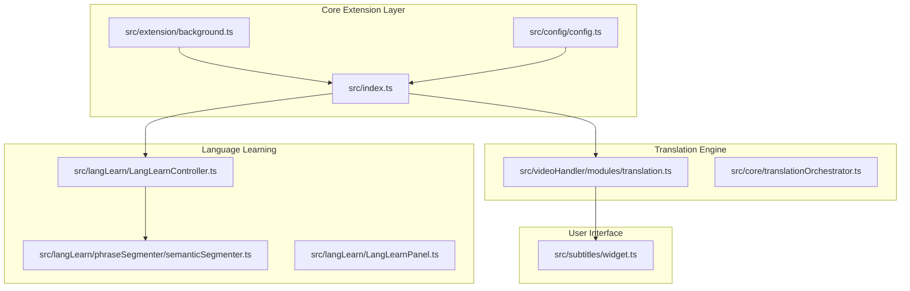
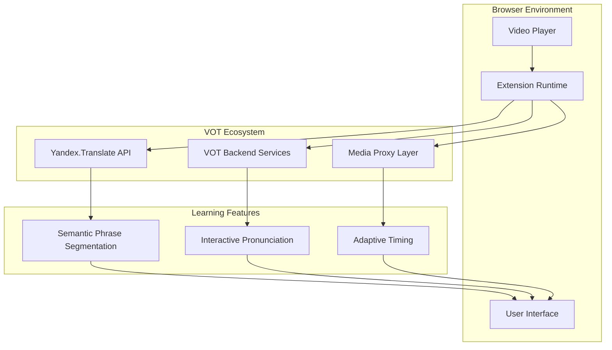
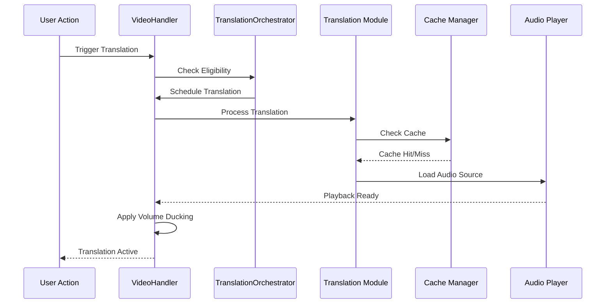
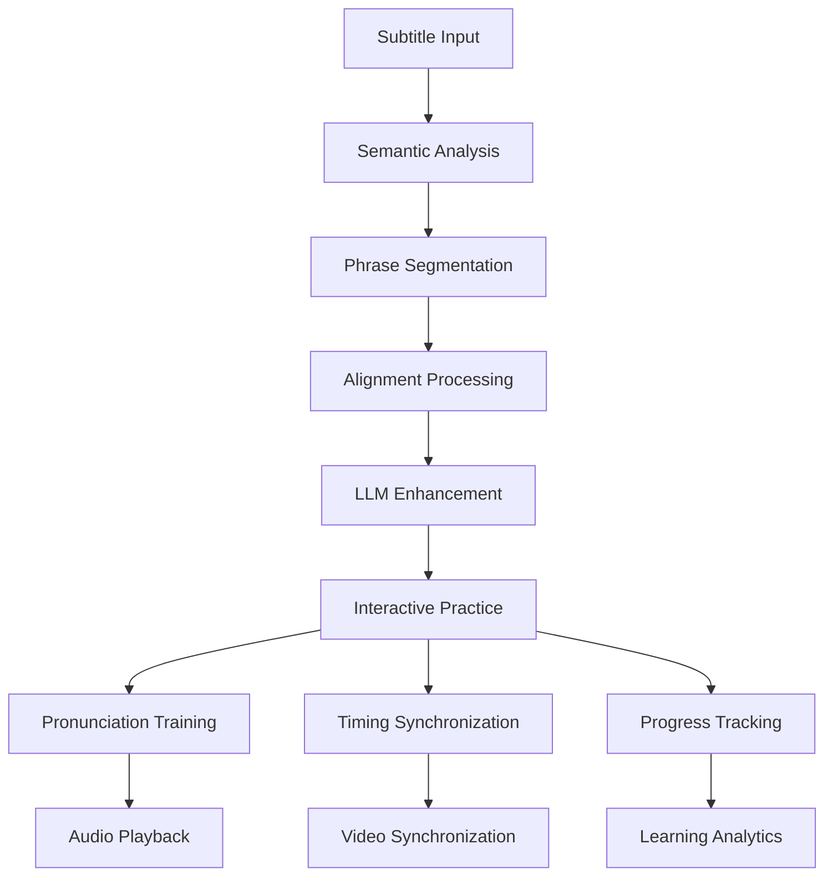
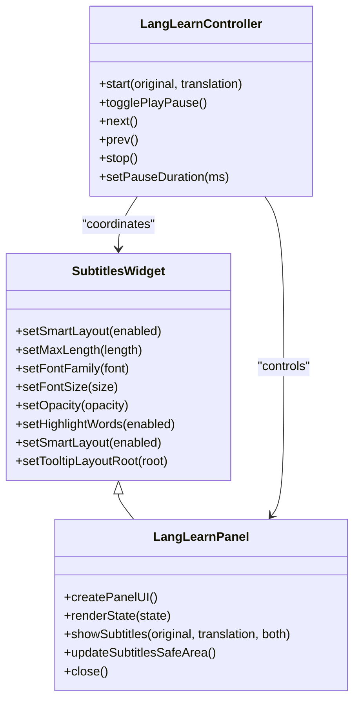

# Project Overview

<cite>
**Referenced Files in This Document**
- [README-EN.md](file://README-EN.md)
- [package.json](file://package.json)
- [src/index.ts](file://src/index.ts)
- [src/config/config.ts](file://src/config/config.ts)
- [src/core/translationOrchestrator.ts](file://src/core/translationOrchestrator.ts)
- [src/videoHandler/modules/translation.ts](file://src/videoHandler/modules/translation.ts)
- [src/subtitles/widget.ts](file://src/subtitles/widget.ts)
- [src/langLearn/LangLearnController.ts](file://src/langLearn/LangLearnController.ts)
- [src/langLearn/phraseSegmenter/semanticSegmenter.ts](file://src/langLearn/phraseSegmenter/semanticSegmenter.ts)
- [src/langLearn/LangLearnPanel.ts](file://src/langLearn/LangLearnPanel.ts)
- [src/extension/background.ts](file://src/extension/background.ts)
</cite>

## Table of Contents
1. [Introduction](#introduction)
2. [Project Structure](#project-structure)
3. [Core Components](#core-components)
4. [Architecture Overview](#architecture-overview)
5. [Detailed Component Analysis](#detailed-component-analysis)
6. [Dependency Analysis](#dependency-analysis)
7. [Performance Considerations](#performance-considerations)
8. [Troubleshooting Guide](#troubleshooting-guide)
9. [Conclusion](#conclusion)

## Introduction

The English Teacher project is a browser extension designed to deliver immersive English language learning through advanced video translation and audio synchronization capabilities. Built upon the Voice Over Translation (VOT) ecosystem, it leverages Yandex.Translate technology to provide real-time voice-over translation, intelligent subtitle rendering, and sophisticated language learning features.

The project's core value proposition lies in combining cutting-edge translation services with educational methodologies to create an engaging, interactive learning environment. Users can watch foreign language videos with synchronized translations, practice pronunciation through interactive features, and utilize semantic phrase segmentation for enhanced comprehension.

This extension serves three primary audiences: English learners seeking authentic content exposure, educators looking for innovative teaching tools, and content creators interested in multilingual accessibility. The system seamlessly integrates with popular video platforms while maintaining strict adherence to educational best practices.

## Project Structure

The English Teacher project follows a modular architecture organized around distinct functional domains:



**Diagram sources**
- [src/index.ts:114-520](file://src/index.ts#L114-L520)
- [src/extension/background.ts:1-100](file://src/extension/background.ts#L1-L100)
- [src/config/config.ts:1-63](file://src/config/config.ts#L1-L63)

The architecture consists of several key layers:

- **Extension Core**: Manages browser integration, video detection, and system orchestration
- **Translation Pipeline**: Handles audio processing, caching, and synchronization
- **Language Learning Engine**: Provides semantic analysis and interactive learning features
- **User Interface**: Delivers customizable subtitle rendering and learning controls
- **Configuration Management**: Centralizes service endpoints and behavioral settings

**Section sources**
- [src/index.ts:114-520](file://src/index.ts#L114-L520)
- [src/extension/background.ts:1-100](file://src/extension/background.ts#L1-L100)
- [src/config/config.ts:1-63](file://src/config/config.ts#L1-L63)

## Core Components

### VideoHandler: Central Orchestration Engine

The VideoHandler class serves as the primary orchestrator, managing video lifecycle, translation coordination, and UI integration. It maintains comprehensive state for translation sessions, audio processing, and subtitle management.

Key responsibilities include:
- Video element binding and lifecycle management
- Translation request orchestration and caching
- Audio player coordination and volume management
- Subtitle widget lifecycle and positioning
- Event handling and user interaction management

The class implements sophisticated state machines for translation workflows, ensuring robust error handling and recovery mechanisms.

**Section sources**
- [src/index.ts:114-520](file://src/index.ts#L114-L520)

### Translation Orchestrator: Intelligent Workflow Management

The TranslationOrchestrator manages the complex workflow of translation requests, handling auto-translate triggers, mobile YouTube compatibility, and error recovery. It implements state-based transitions to ensure reliable translation delivery across diverse video platforms.

**Section sources**
- [src/core/translationOrchestrator.ts:21-85](file://src/core/translationOrchestrator.ts#L21-L85)

### Language Learning Engine: Semantic Analysis and Practice

The language learning system provides advanced features including semantic phrase segmentation, interactive pronunciation practice, and intelligent timing synchronization. The SemanticSegmenter analyzes subtitle content to create meaningful learning segments, while the LangLearnController coordinates interactive practice sessions.

**Section sources**
- [src/langLearn/LangLearnController.ts:26-171](file://src/langLearn/LangLearnController.ts#L26-L171)
- [src/langLearn/phraseSegmenter/semanticSegmenter.ts:730-745](file://src/langLearn/phraseSegmenter/semanticSegmenter.ts#L730-L745)

### Subtitle Rendering System: Adaptive Presentation

The subtitle widget provides intelligent text wrapping, adaptive positioning, and customizable presentation options. It automatically adjusts font sizes, line lengths, and positioning based on video dimensions and viewing conditions.

**Section sources**
- [src/subtitles/widget.ts:110-800](file://src/subtitles/widget.ts#L110-L800)

## Architecture Overview

The English Teacher extension operates within the broader VOT ecosystem, integrating multiple translation services and educational technologies:



**Diagram sources**
- [src/config/config.ts:3-27](file://src/config/config.ts#L3-L27)
- [src/extension/background.ts:193-354](file://src/extension/background.ts#L193-L354)

The architecture ensures seamless integration with:
- **Yandex.Translate Services**: Primary translation engine with voice-over capabilities
- **VOT Backend Infrastructure**: Additional translation processing and caching
- **Media Proxy Systems**: Content delivery optimization for various video formats
- **Educational Enhancement Layer**: Language learning features and interactive tools

**Section sources**
- [src/config/config.ts:3-27](file://src/config/config.ts#L3-L27)
- [src/extension/background.ts:193-354](file://src/extension/background.ts#L193-L354)

## Detailed Component Analysis

### Translation Pipeline Architecture

The translation system implements a sophisticated multi-stage pipeline designed for reliability and performance:



**Diagram sources**
- [src/core/translationOrchestrator.ts:42-83](file://src/core/translationOrchestrator.ts#L42-L83)
- [src/videoHandler/modules/translation.ts:667-716](file://src/videoHandler/modules/translation.ts#L667-L716)

The pipeline incorporates intelligent caching, automatic retry mechanisms, and adaptive volume management to ensure optimal user experience across varying network conditions.

**Section sources**
- [src/core/translationOrchestrator.ts:42-83](file://src/core/translationOrchestrator.ts#L42-L83)
- [src/videoHandler/modules/translation.ts:667-716](file://src/videoHandler/modules/translation.ts#L667-L716)

### Language Learning Feature Integration

The language learning system provides comprehensive educational capabilities through semantic analysis and interactive practice:



**Diagram sources**
- [src/langLearn/LangLearnController.ts:72-171](file://src/langLearn/LangLearnController.ts#L72-L171)
- [src/langLearn/phraseSegmenter/semanticSegmenter.ts:740-744](file://src/langLearn/phraseSegmenter/semanticSegmenter.ts#L740-L744)

The system employs advanced natural language processing to create meaningful learning segments, enabling users to practice pronunciation and comprehension through structured exercises.

**Section sources**
- [src/langLearn/LangLearnController.ts:72-171](file://src/langLearn/LangLearnController.ts#L72-L171)
- [src/langLearn/phraseSegmenter/semanticSegmenter.ts:740-744](file://src/langLearn/phraseSegmenter/semanticSegmenter.ts#L740-L744)

### User Interface Architecture

The extension provides a comprehensive user interface layer with adaptive subtitle rendering and learning controls:



**Diagram sources**
- [src/subtitles/widget.ts:110-240](file://src/subtitles/widget.ts#L110-L240)
- [src/langLearn/LangLearnPanel.ts:32-53](file://src/langLearn/LangLearnPanel.ts#L32-L53)
- [src/langLearn/LangLearnController.ts:64-66](file://src/langLearn/LangLearnController.ts#L64-L66)

**Section sources**
- [src/subtitles/widget.ts:110-240](file://src/subtitles/widget.ts#L110-L240)
- [src/langLearn/LangLearnPanel.ts:32-53](file://src/langLearn/LangLearnPanel.ts#L32-L53)
- [src/langLearn/LangLearnController.ts:64-66](file://src/langLearn/LangLearnController.ts#L64-L66)

## Dependency Analysis

The project maintains a clean dependency structure with clear separation of concerns:

```mermaid
graph LR
subgraph "External Dependencies"
A[@vot.js/ext]
B[chaimu]
C[lit-html]
D[@mlc-ai/web-llm]
end
subgraph "Internal Modules"
E[VideoHandler]
F[Translation Orchestrator]
G[Language Learning Engine]
H[Subtitle System]
end
subgraph "Configuration"
I[Service Config]
J[Host Policies]
K[Cache Management]
end
A --> E
B --> E
C --> H
D --> G
E --> F
E --> H
E --> G
I --> E
J --> E
K --> E
```

**Diagram sources**
- [package.json:48-56](file://package.json#L48-L56)
- [src/index.ts:1-50](file://src/index.ts#L1-L50)

The dependency graph reveals a well-structured system where external libraries provide specialized functionality while internal modules maintain cohesive domain-specific responsibilities.

**Section sources**
- [package.json:48-56](file://package.json#L48-L56)
- [src/index.ts:1-50](file://src/index.ts#L1-L50)

## Performance Considerations

The extension implements several performance optimization strategies:

- **Intelligent Caching**: Translation and subtitle caching reduces redundant network requests
- **Adaptive Audio Processing**: Dynamic volume ducking minimizes CPU overhead
- **Lazy Loading**: Components initialize only when needed
- **Memory Management**: Proper cleanup of audio contexts and event listeners
- **Network Optimization**: Proxy systems reduce latency for international users

Key performance indicators include:
- Translation request caching with TTL management
- Smart ducking algorithms that minimize continuous processing
- Efficient subtitle rendering with adaptive layout computation
- Optimized audio player selection based on platform capabilities

## Troubleshooting Guide

Common issues and solutions:

**Translation Failures**
- Verify Yandex.Translate API connectivity
- Check proxy configuration for blocked regions
- Review cache invalidation procedures
- Monitor network timeouts and retry mechanisms

**Audio Synchronization Problems**
- Ensure proper audio context initialization
- Verify volume ducking settings
- Check for conflicting audio sources
- Validate media format compatibility

**Subtitle Rendering Issues**
- Confirm smart layout calculations
- Verify viewport adaptation
- Check for CSS override conflicts
- Validate DOM positioning calculations

**Language Learning Feature Problems**
- Verify WebGPU availability for LLM features
- Check model loading progress
- Monitor semantic segmentation accuracy
- Validate interactive practice timing

**Section sources**
- [src/videoHandler/modules/translation.ts:623-651](file://src/videoHandler/modules/translation.ts#L623-L651)
- [src/subtitles/widget.ts:336-422](file://src/subtitles/widget.ts#L336-L422)

## Conclusion

The English Teacher project represents a sophisticated integration of translation technology and educational methodology. By combining real-time video translation with intelligent language learning features, it creates an immersive environment for English acquisition.

The project's strength lies in its modular architecture, comprehensive feature set, and commitment to educational excellence. The integration with the VOT ecosystem and Yandex.Translate ensures reliable, high-quality translation services while the language learning components provide structured, effective practice opportunities.

Future enhancements could focus on expanding language support, improving offline capabilities, and developing additional interactive learning features. The solid architectural foundation provides excellent groundwork for continued evolution and improvement.