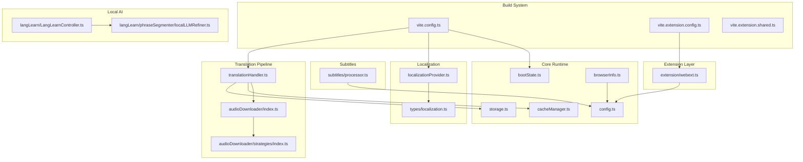
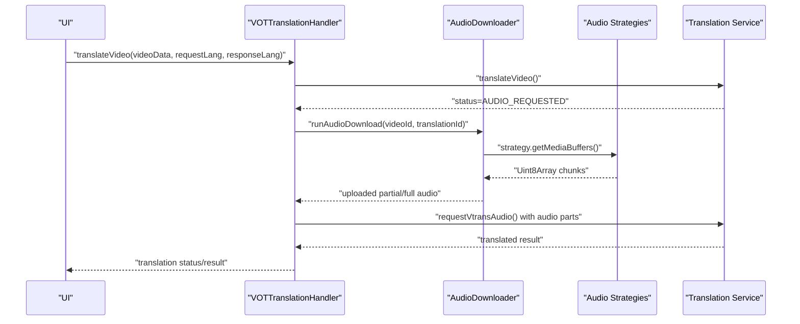
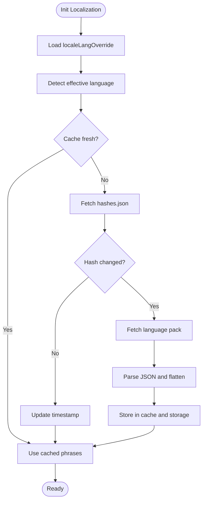
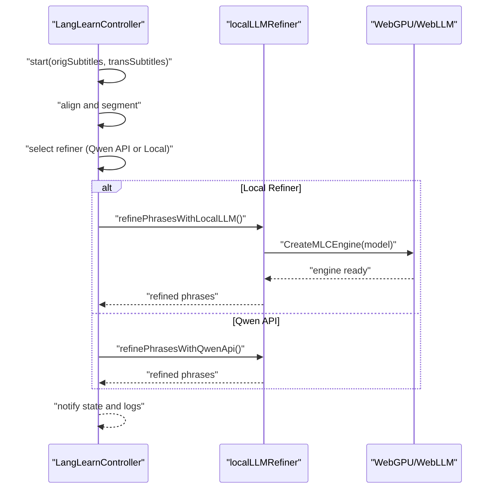
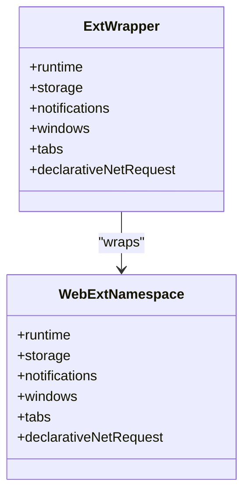
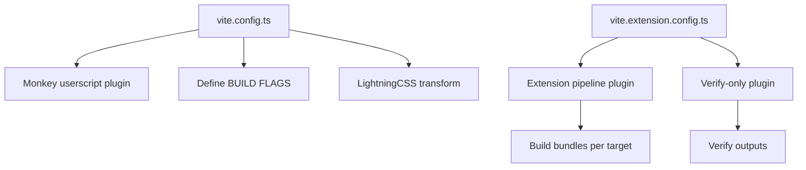
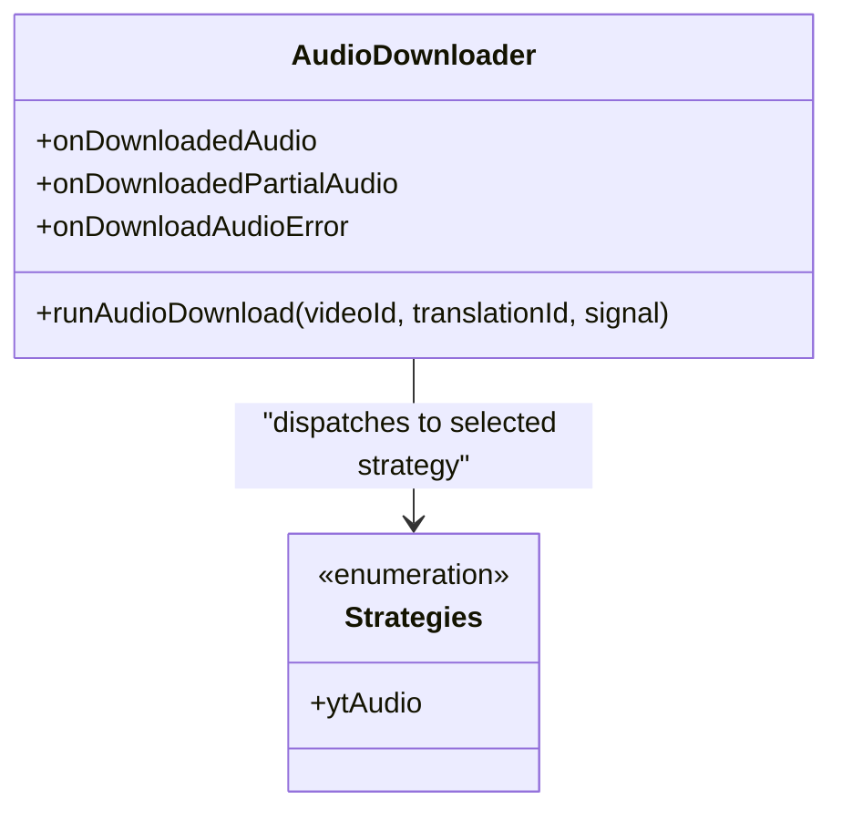
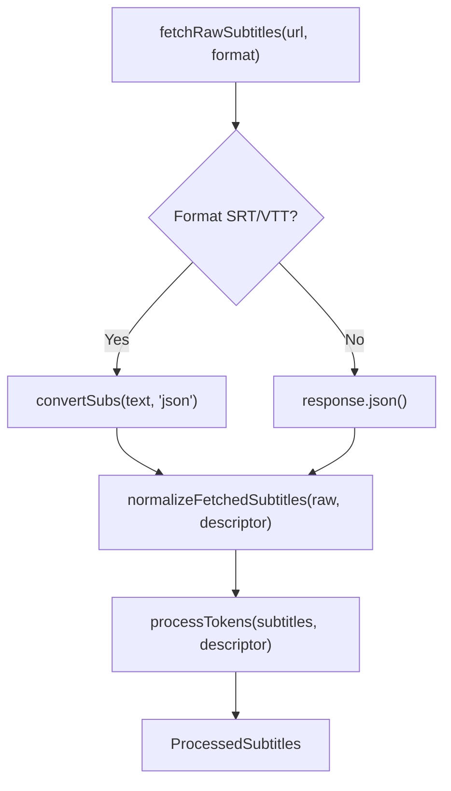
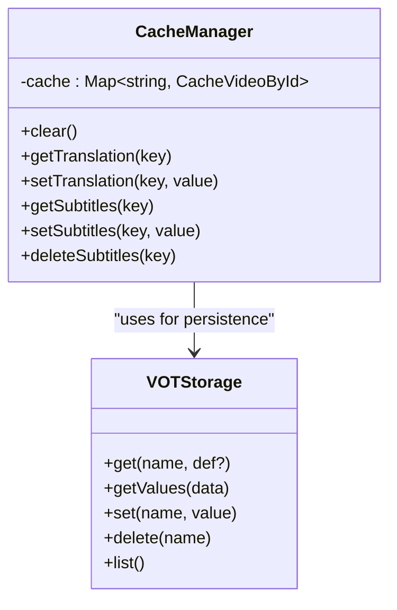
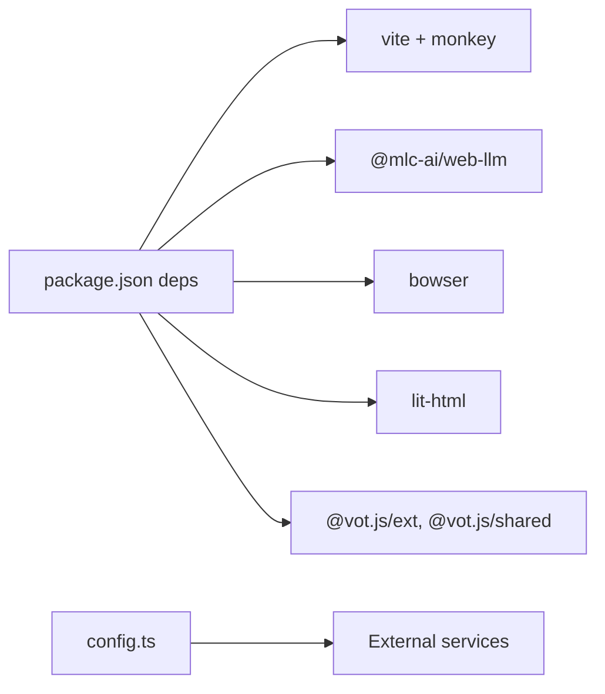

# Technical Capabilities

<cite>
**Referenced Files in This Document**
- [package.json](file://package.json)
- [vite.config.ts](file://vite.config.ts)
- [vite.extension.config.ts](file://vite.extension.config.ts)
- [vite.extension.shared.ts](file://vite.extension.shared.ts)
- [src/config/config.ts](file://src/config/config.ts)
- [src/localization/localizationProvider.ts](file://src/localization/localizationProvider.ts)
- [src/types/localization.ts](file://src/types/localization.ts)
- [src/audioDownloader/index.ts](file://src/audioDownloader/index.ts)
- [src/audioDownloader/strategies/index.ts](file://src/audioDownloader/strategies/index.ts)
- [src/core/translationHandler.ts](file://src/core/translationHandler.ts)
- [src/core/cacheManager.ts](file://src/core/cacheManager.ts)
- [src/utils/storage.ts](file://src/utils/storage.ts)
- [src/utils/browserInfo.ts](file://src/utils/browserInfo.ts)
- [src/extension/webext.ts](file://src/extension/webext.ts)
- [src/subtitles/processor.ts](file://src/subtitles/processor.ts)
- [src/langLearn/LangLearnController.ts](file://src/langLearn/LangLearnController.ts)
- [src/langLearn/phraseSegmenter/localLLMRefiner.ts](file://src/langLearn/phraseSegmenter/localLLMRefiner.ts)
- [src/bootstrap/bootState.ts](file://src/bootstrap/bootState.ts)
</cite>

## Table of Contents
1. [Introduction](#introduction)
2. [Project Structure](#project-structure)
3. [Core Components](#core-components)
4. [Architecture Overview](#architecture-overview)
5. [Detailed Component Analysis](#detailed-component-analysis)
6. [Dependency Analysis](#dependency-analysis)
7. [Performance Considerations](#performance-considerations)
8. [Troubleshooting Guide](#troubleshooting-guide)
9. [Conclusion](#conclusion)

## Introduction
This document describes the technical capabilities of the English Teacher project, focusing on advanced features such as multi-language support with 60+ languages, WebAssembly-powered local AI processing, cross-platform compatibility across modern browsers, a flexible build system with multiple output formats, a robust localization system with dynamic language packs and hash-based invalidation, a plugin-style architecture for audio download strategies and translation adapters, and performance optimizations including lazy loading, caching, and memory-conscious design. It also outlines supported video formats, browser APIs, and integration points with external translation services.

## Project Structure
The project is organized around a modular TypeScript codebase with a Vite-based build pipeline. Key areas include:
- Core orchestration and translation handling
- Audio download strategies and integration
- Localization and dynamic language pack loading
- Subtitle processing and rendering
- Cross-browser extension wrappers
- Local AI processing via WebAssembly
- Build configurations for userscripts and native extensions

**Diagram sources**
- [vite.config.ts:138-193](file://vite.config.ts#L138-L193)
- [vite.extension.config.ts:69-89](file://vite.extension.config.ts#L69-L89)
- [src/bootstrap/bootState.ts:26-41](file://src/bootstrap/bootState.ts#L26-L41)
- [src/config/config.ts:1-63](file://src/config/config.ts#L1-L63)
- [src/core/cacheManager.ts:27-118](file://src/core/cacheManager.ts#L27-L118)
- [src/utils/storage.ts:204-380](file://src/utils/storage.ts#L204-L380)
- [src/utils/browserInfo.ts:1-6](file://src/utils/browserInfo.ts#L1-L6)
- [src/localization/localizationProvider.ts:39-273](file://src/localization/localizationProvider.ts#L39-L273)
- [src/types/localization.ts:1-556](file://src/types/localization.ts#L1-L556)
- [src/core/translationHandler.ts:105-564](file://src/core/translationHandler.ts#L105-L564)
- [src/audioDownloader/index.ts:87-189](file://src/audioDownloader/index.ts#L87-L189)
- [src/audioDownloader/strategies/index.ts:1-10](file://src/audioDownloader/strategies/index.ts#L1-L10)
- [src/subtitles/processor.ts:632-800](file://src/subtitles/processor.ts#L632-L800)
- [src/extension/webext.ts:56-187](file://src/extension/webext.ts#L56-L187)
- [src/langLearn/LangLearnController.ts:45-851](file://src/langLearn/LangLearnController.ts#L45-L851)
- [src/langLearn/phraseSegmenter/localLLMRefiner.ts:152-562](file://src/langLearn/phraseSegmenter/localLLMRefiner.ts#L152-L562)

**Section sources**
- [vite.config.ts:138-193](file://vite.config.ts#L138-L193)
- [vite.extension.config.ts:69-89](file://vite.extension.config.ts#L69-L89)
- [src/bootstrap/bootState.ts:26-41](file://src/bootstrap/bootState.ts#L26-L41)
- [src/config/config.ts:1-63](file://src/config/config.ts#L1-L63)
- [src/core/cacheManager.ts:27-118](file://src/core/cacheManager.ts#L27-L118)
- [src/utils/storage.ts:204-380](file://src/utils/storage.ts#L204-L380)
- [src/utils/browserInfo.ts:1-6](file://src/utils/browserInfo.ts#L1-L6)
- [src/localization/localizationProvider.ts:39-273](file://src/localization/localizationProvider.ts#L39-L273)
- [src/types/localization.ts:1-556](file://src/types/localization.ts#L1-L556)
- [src/core/translationHandler.ts:105-564](file://src/core/translationHandler.ts#L105-L564)
- [src/audioDownloader/index.ts:87-189](file://src/audioDownloader/index.ts#L87-L189)
- [src/audioDownloader/strategies/index.ts:1-10](file://src/audioDownloader/strategies/index.ts#L1-L10)
- [src/subtitles/processor.ts:632-800](file://src/subtitles/processor.ts#L632-L800)
- [src/extension/webext.ts:56-187](file://src/extension/webext.ts#L56-L187)
- [src/langLearn/LangLearnController.ts:45-851](file://src/langLearn/LangLearnController.ts#L45-L851)
- [src/langLearn/phraseSegmenter/localLLMRefiner.ts:152-562](file://src/langLearn/phraseSegmenter/localLLMRefiner.ts#L152-L562)

## Core Components
- Multi-language support with 60+ locales and dynamic language pack loading with hash-based invalidation
- WebAssembly integration for local AI processing via WebLLM and WebGPU
- Cross-browser extension layer abstracting Chrome and Firefox APIs
- Flexible build system supporting userscripts and native extensions
- Plugin-style audio download strategies and translation adapters
- Performance-focused caching and memory-conscious processing

**Section sources**
- [src/types/localization.ts:1-64](file://src/types/localization.ts#L1-L64)
- [src/localization/localizationProvider.ts:39-273](file://src/localization/localizationProvider.ts#L39-L273)
- [src/langLearn/phraseSegmenter/localLLMRefiner.ts:152-211](file://src/langLearn/phraseSegmenter/localLLMRefiner.ts#L152-L211)
- [src/extension/webext.ts:56-187](file://src/extension/webext.ts#L56-L187)
- [vite.config.ts:178-191](file://vite.config.ts#L178-L191)
- [vite.extension.config.ts:69-89](file://vite.extension.config.ts#L69-L89)
- [src/audioDownloader/strategies/index.ts:1-10](file://src/audioDownloader/strategies/index.ts#L1-L10)
- [src/core/cacheManager.ts:27-118](file://src/core/cacheManager.ts#L27-L118)

## Architecture Overview
The system orchestrates translation requests, manages audio downloads, renders subtitles, and integrates with external translation services. It supports dynamic localization and runs in both userscript and extension contexts.

**Diagram sources**
- [src/core/translationHandler.ts:311-495](file://src/core/translationHandler.ts#L311-L495)
- [src/audioDownloader/index.ts:103-125](file://src/audioDownloader/index.ts#L103-L125)
- [src/audioDownloader/strategies/index.ts:1-10](file://src/audioDownloader/strategies/index.ts#L1-L10)

**Section sources**
- [src/core/translationHandler.ts:105-564](file://src/core/translationHandler.ts#L105-L564)
- [src/audioDownloader/index.ts:87-189](file://src/audioDownloader/index.ts#L87-L189)
- [src/audioDownloader/strategies/index.ts:1-10](file://src/audioDownloader/strategies/index.ts#L1-L10)

## Detailed Component Analysis

### Multi-language Support and Dynamic Localization
- Available locales are injected at build-time and include 60+ languages.
- Language packs are fetched dynamically with hash-based invalidation to detect updates.
- The provider caches phrases and labels, with a configurable TTL and fallback to default language.
- Language override supports “auto” detection and manual selection.

**Diagram sources**
- [src/localization/localizationProvider.ts:63-185](file://src/localization/localizationProvider.ts#L63-L185)
- [src/localization/localizationProvider.ts:187-209](file://src/localization/localizationProvider.ts#L187-L209)
- [src/types/localization.ts:1-64](file://src/types/localization.ts#L1-L64)

**Section sources**
- [src/localization/localizationProvider.ts:39-273](file://src/localization/localizationProvider.ts#L39-L273)
- [src/types/localization.ts:1-556](file://src/types/localization.ts#L1-L556)
- [vite.config.ts:49-56](file://vite.config.ts#L49-L56)

### WebAssembly Integration for Local AI Processing
- Local LLM refinement leverages WebLLM and WebGPU for on-device inference.
- The controller coordinates phrase segmentation, alignment, and refinement with optional fallbacks.
- Session initialization includes health checks and resource cleanup.

**Diagram sources**
- [src/langLearn/LangLearnController.ts:91-192](file://src/langLearn/LangLearnController.ts#L91-L192)
- [src/langLearn/phraseSegmenter/localLLMRefiner.ts:411-562](file://src/langLearn/phraseSegmenter/localLLMRefiner.ts#L411-L562)

**Section sources**
- [src/langLearn/LangLearnController.ts:45-851](file://src/langLearn/LangLearnController.ts#L45-L851)
- [src/langLearn/phraseSegmenter/localLLMRefiner.ts:152-211](file://src/langLearn/phraseSegmenter/localLLMRefiner.ts#L152-L211)

### Cross-Browser Extension Compatibility
- A unified wrapper abstracts Chrome and Firefox extension APIs, ensuring consistent behavior across browsers.
- The wrapper normalizes callback/promise differences and handles lastError semantics.

**Diagram sources**
- [src/extension/webext.ts:12-47](file://src/extension/webext.ts#L12-L47)
- [src/extension/webext.ts:56-187](file://src/extension/webext.ts#L56-L187)

**Section sources**
- [src/extension/webext.ts:56-187](file://src/extension/webext.ts#L56-L187)

### Build System: Userscripts and Native Extensions
- Vite userscript build injects headers, metadata, and locale-specific headers for multiple languages.
- Extension build targets Chrome and Firefox via a shared pipeline and verifies outputs.
- LightningCSS is used for CSS transformation; SystemJS is inlined for userscript compatibility.

**Diagram sources**
- [vite.config.ts:178-191](file://vite.config.ts#L178-L191)
- [vite.config.ts:138-193](file://vite.config.ts#L138-L193)
- [vite.extension.config.ts:25-43](file://vite.extension.config.ts#L25-L43)
- [vite.extension.config.ts:69-89](file://vite.extension.config.ts#L69-L89)

**Section sources**
- [vite.config.ts:138-193](file://vite.config.ts#L138-L193)
- [vite.extension.config.ts:69-89](file://vite.extension.config.ts#L69-L89)
- [vite.extension.shared.ts](file://vite.extension.shared.ts)

### Plugin Architecture: Audio Download Strategies and Translation Adapters
- Audio download is strategy-driven; the default strategy retrieves media buffers and streams chunks.
- Events are emitted for partial and full audio downloads, enabling asynchronous upload flows.
- Translation adapters integrate with external services and handle fallbacks and retries.

**Diagram sources**
- [src/audioDownloader/index.ts:87-189](file://src/audioDownloader/index.ts#L87-L189)
- [src/audioDownloader/strategies/index.ts:1-10](file://src/audioDownloader/strategies/index.ts#L1-L10)

**Section sources**
- [src/audioDownloader/index.ts:87-189](file://src/audioDownloader/index.ts#L87-L189)
- [src/audioDownloader/strategies/index.ts:1-10](file://src/audioDownloader/strategies/index.ts#L1-L10)
- [src/core/translationHandler.ts:105-564](file://src/core/translationHandler.ts#L105-L564)

### Subtitle Processing and Rendering
- Subtitles are fetched, normalized, ranked, and tokenized for precise timing alignment.
- Supports YouTube, VK, and generic JSON/SRT/VTT formats with conversion and deduplication.
- Token allocation distributes durations by text length and preserves source timing where available.

**Diagram sources**
- [src/subtitles/processor.ts:564-600](file://src/subtitles/processor.ts#L564-L600)
- [src/subtitles/processor.ts:576-599](file://src/subtitles/processor.ts#L576-L599)
- [src/subtitles/processor.ts:632-800](file://src/subtitles/processor.ts#L632-L800)

**Section sources**
- [src/subtitles/processor.ts:632-800](file://src/subtitles/processor.ts#L632-L800)

### Caching and Memory Management
- In-memory cache with TTL for translations and subtitles keyed by stable identifiers.
- Automatic eviction when entries become empty; clearing cache on runtime setting changes.
- Storage abstraction supports both GM promises and localStorage with compatibility conversions.

**Diagram sources**
- [src/core/cacheManager.ts:27-118](file://src/core/cacheManager.ts#L27-L118)
- [src/utils/storage.ts:204-380](file://src/utils/storage.ts#L204-L380)

**Section sources**
- [src/core/cacheManager.ts:27-118](file://src/core/cacheManager.ts#L27-L118)
- [src/utils/storage.ts:204-380](file://src/utils/storage.ts#L204-L380)

### Bootstrapping and Environment Detection
- Boot state ensures single initialization across contexts and provides a global boot key registry.
- Browser info parsing enables environment-aware behavior.

**Section sources**
- [src/bootstrap/bootState.ts:26-41](file://src/bootstrap/bootState.ts#L26-L41)
- [src/utils/browserInfo.ts:1-6](file://src/utils/browserInfo.ts#L1-L6)

## Dependency Analysis
- Build-time dependencies include Vite, vite-plugin-monkey, LightningCSS, and TypeScript.
- Runtime dependencies include WebLLM for local AI, Bowser for browser detection, and extension wrappers for cross-browser compatibility.
- External integration points include Yandex Browser translation services, proxy hosts, and translation backends.

**Diagram sources**
- [package.json:17-56](file://package.json#L17-L56)
- [src/config/config.ts:1-63](file://src/config/config.ts#L1-L63)

**Section sources**
- [package.json:17-56](file://package.json#L17-L56)
- [src/config/config.ts:1-63](file://src/config/config.ts#L1-L63)

## Performance Considerations
- Lazy initialization of localization provider avoids blocking startup.
- Hash-based locale updates minimize unnecessary network requests and storage writes.
- Chunked audio uploads reduce memory pressure during long videos.
- In-memory cache with TTL prevents redundant translation and subtitle fetches.
- Token-based timing distribution and source-aligned timings improve subtitle accuracy without heavy recomputation.
- WebGPU-backed local LLM reduces latency compared to remote APIs when available.

[No sources needed since this section provides general guidance]

## Troubleshooting Guide
- Localization failures: The provider logs missing keys and falls back to default phrases; check locale hash updates and storage availability.
- Audio download errors: The translation handler emits localized errors and can trigger fallback mechanisms for supported hosts.
- Extension API errors: The wrapper surfaces lastError and normalizes callback vs promise patterns; verify browser namespace availability.
- Storage migration: Compatibility rules convert legacy keys to new ones; ensure compatVersion is updated and old keys are removed when appropriate.

**Section sources**
- [src/localization/localizationProvider.ts:220-238](file://src/localization/localizationProvider.ts#L220-L238)
- [src/core/translationHandler.ts:196-234](file://src/core/translationHandler.ts#L196-L234)
- [src/extension/webext.ts:61-101](file://src/extension/webext.ts#L61-L101)
- [src/utils/storage.ts:139-190](file://src/utils/storage.ts#L139-L190)

## Conclusion
The English Teacher project delivers a robust, cross-platform solution for video translation and subtitle enhancement. Its multi-language localization system, WebAssembly-powered local AI, and plugin-style architecture enable extensibility and performance. The build system supports both userscripts and native extensions, while caching and memory-conscious design ensure responsiveness across diverse environments.