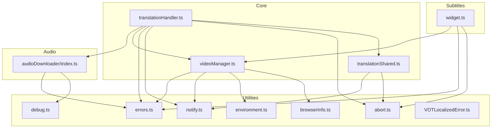
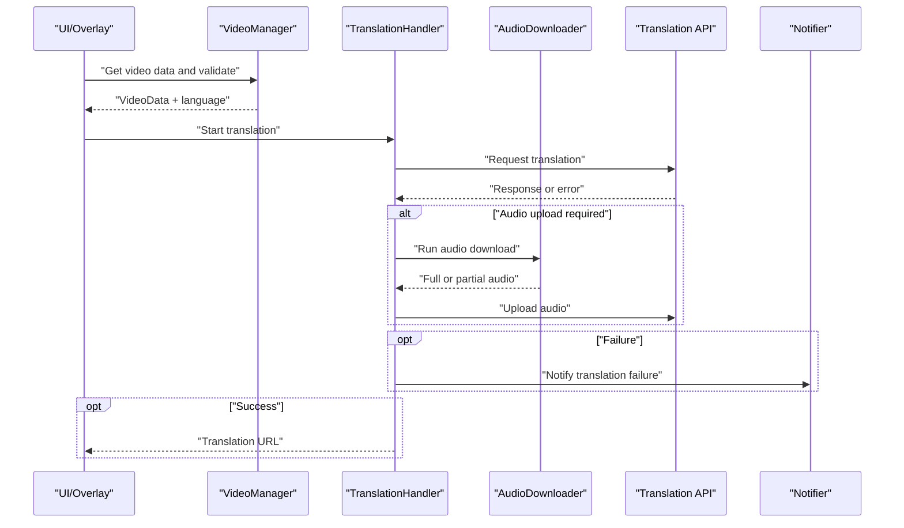
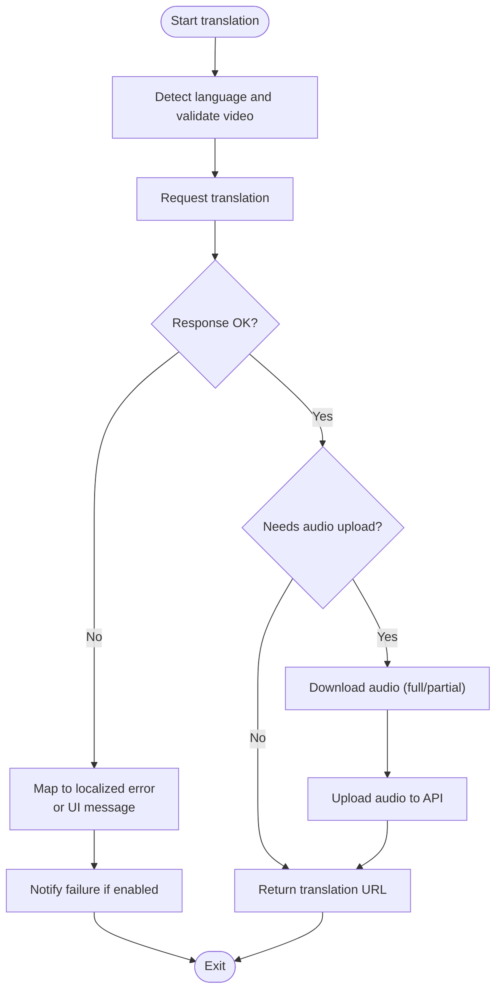
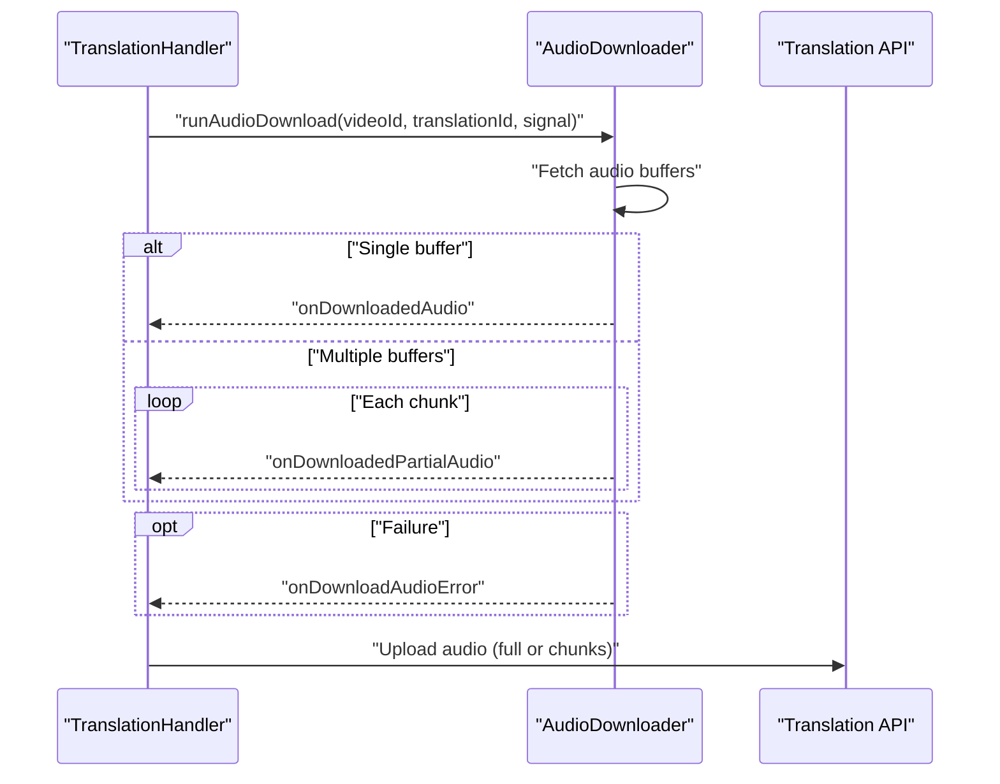
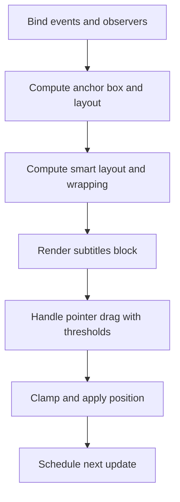
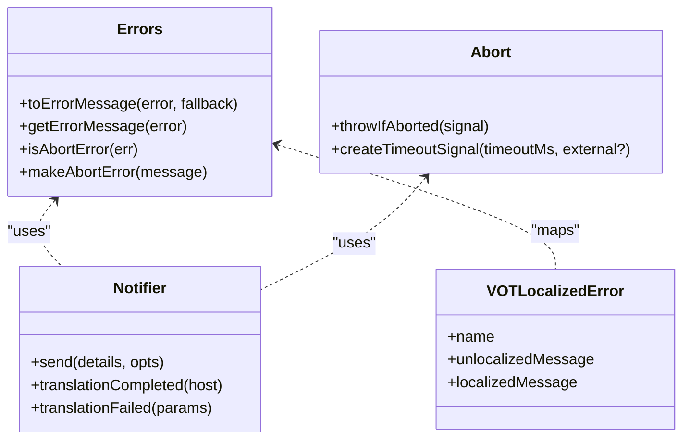
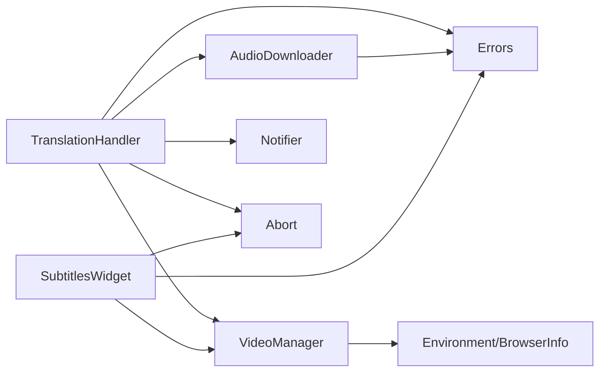

# Troubleshooting & FAQ

<cite>
**Referenced Files in This Document**
- [errors.ts](file://src/utils/errors.ts)
- [debug.ts](file://src/utils/debug.ts)
- [VOTLocalizedError.ts](file://src/utils/VOTLocalizedError.ts)
- [environment.ts](file://src/utils/environment.ts)
- [browserInfo.ts](file://src/utils/browserInfo.ts)
- [notify.ts](file://src/utils/notify.ts)
- [abort.ts](file://src/utils/abort.ts)
- [translationHandler.ts](file://src/core/translationHandler.ts)
- [videoManager.ts](file://src/core/videoManager.ts)
- [runtimeActivation.ts](file://src/bootstrap/runtimeActivation.ts)
- [widget.ts](file://src/subtitles/widget.ts)
- [audioDownloader/index.ts](file://src/audioDownloader/index.ts)
- [translationShared.ts](file://src/videoHandler/modules/translationShared.ts)
</cite>

## Table of Contents
1. [Introduction](#introduction)
2. [Project Structure](#project-structure)
3. [Core Components](#core-components)
4. [Architecture Overview](#architecture-overview)
5. [Detailed Component Analysis](#detailed-component-analysis)
6. [Dependency Analysis](#dependency-analysis)
7. [Performance Considerations](#performance-considerations)
8. [Troubleshooting Guide](#troubleshooting-guide)
9. [Conclusion](#conclusion)
10. [Appendices](#appendices)

## Introduction
This document provides comprehensive troubleshooting guidance and FAQs for the English Teacher extension. It covers installation issues, translation failures, audio and subtitle synchronization problems, performance concerns, error code references, diagnostic tools, platform-specific pitfalls, known limitations, and support resources. The goal is to help users diagnose and resolve issues quickly, with step-by-step workflows and actionable remedies.

## Project Structure
The extension is organized around modular subsystems:
- Core orchestration and translation pipeline
- Audio download and upload pipeline
- Subtitles rendering and layout engine
- Utilities for error handling, notifications, environment detection, and abort signals
- Bootstrap/runtime activation and localization

**Diagram sources**
- [translationHandler.ts:105-564](file://src/core/translationHandler.ts#L105-L564)
- [videoManager.ts:138-436](file://src/core/videoManager.ts#L138-L436)
- [translationShared.ts:1-193](file://src/videoHandler/modules/translationShared.ts#L1-L193)
- [audioDownloader/index.ts:87-189](file://src/audioDownloader/index.ts#L87-L189)
- [widget.ts:110-800](file://src/subtitles/widget.ts#L110-L800)
- [errors.ts:1-110](file://src/utils/errors.ts#L1-L110)
- [debug.ts:1-38](file://src/utils/debug.ts#L1-L38)
- [notify.ts:1-249](file://src/utils/notify.ts#L1-L249)
- [abort.ts:1-94](file://src/utils/abort.ts#L1-L94)
- [environment.ts:1-45](file://src/utils/environment.ts#L1-L45)
- [browserInfo.ts:1-6](file://src/utils/browserInfo.ts#L1-L6)
- [VOTLocalizedError.ts:1-21](file://src/utils/VOTLocalizedError.ts#L1-L21)

**Section sources**
- [translationHandler.ts:105-564](file://src/core/translationHandler.ts#L105-L564)
- [videoManager.ts:138-436](file://src/core/videoManager.ts#L138-L436)
- [audioDownloader/index.ts:87-189](file://src/audioDownloader/index.ts#L87-L189)
- [widget.ts:110-800](file://src/subtitles/widget.ts#L110-L800)
- [errors.ts:1-110](file://src/utils/errors.ts#L1-L110)
- [debug.ts:1-38](file://src/utils/debug.ts#L1-L38)
- [notify.ts:1-249](file://src/utils/notify.ts#L1-L249)
- [abort.ts:1-94](file://src/utils/abort.ts#L1-L94)
- [environment.ts:1-45](file://src/utils/environment.ts#L1-L45)
- [browserInfo.ts:1-6](file://src/utils/browserInfo.ts#L1-L6)
- [VOTLocalizedError.ts:1-21](file://src/utils/VOTLocalizedError.ts#L1-L21)

## Core Components
- Translation orchestrator: Manages translation requests, retries, and audio upload flows. Handles server-side error mapping and user-visible messaging.
- Video manager: Validates videos, detects languages, manages volume, and logs environment-aware decisions.
- Audio downloader: Streams and uploads audio in full or partial chunks, emitting events for success/failure.
- Subtitles widget: Renders and positions subtitles with smart layout, wrapping, and drag-and-drop controls.
- Utilities: Centralized error extraction, abort signaling, notifications, environment info, and localized errors.

**Section sources**
- [translationHandler.ts:105-564](file://src/core/translationHandler.ts#L105-L564)
- [videoManager.ts:138-436](file://src/core/videoManager.ts#L138-L436)
- [audioDownloader/index.ts:87-189](file://src/audioDownloader/index.ts#L87-L189)
- [widget.ts:110-800](file://src/subtitles/widget.ts#L110-L800)
- [errors.ts:1-110](file://src/utils/errors.ts#L1-L110)
- [notify.ts:1-249](file://src/utils/notify.ts#L1-L249)
- [abort.ts:1-94](file://src/utils/abort.ts#L1-L94)
- [environment.ts:1-45](file://src/utils/environment.ts#L1-L45)
- [VOTLocalizedError.ts:1-21](file://src/utils/VOTLocalizedError.ts#L1-L21)

## Architecture Overview
End-to-end translation flow with error handling and diagnostics.

**Diagram sources**
- [videoManager.ts:212-292](file://src/core/videoManager.ts#L212-L292)
- [translationHandler.ts:311-495](file://src/core/translationHandler.ts#L311-L495)
- [audioDownloader/index.ts:103-125](file://src/audioDownloader/index.ts#L103-L125)
- [notify.ts:220-247](file://src/utils/notify.ts#L220-L247)

## Detailed Component Analysis

### Translation Pipeline and Error Handling
- Error normalization and mapping: Converts server/client errors into user-friendly messages and localized errors.
- Retry scheduling: Implements exponential-backoff-like retries with abort safety.
- Audio upload fallback: Uses direct audio upload or a fallback endpoint when appropriate.
- Failure notifications: Emits desktop notifications for async waits and user-configured error reporting.

**Diagram sources**
- [translationHandler.ts:311-495](file://src/core/translationHandler.ts#L311-L495)
- [audioDownloader/index.ts:103-125](file://src/audioDownloader/index.ts#L103-L125)
- [notify.ts:220-247](file://src/utils/notify.ts#L220-L247)

**Section sources**
- [translationHandler.ts:105-564](file://src/core/translationHandler.ts#L105-L564)
- [translationShared.ts:171-193](file://src/videoHandler/modules/translationShared.ts#L171-L193)
- [notify.ts:220-247](file://src/utils/notify.ts#L220-L247)

### Audio Download and Upload
- Chunked vs single audio handling.
- Event-driven completion/failure callbacks.
- Validation of parts count and chunk sizes.

**Diagram sources**
- [audioDownloader/index.ts:103-125](file://src/audioDownloader/index.ts#L103-L125)
- [translationHandler.ts:126-234](file://src/core/translationHandler.ts#L126-L234)

**Section sources**
- [audioDownloader/index.ts:87-189](file://src/audioDownloader/index.ts#L87-L189)
- [translationHandler.ts:126-234](file://src/core/translationHandler.ts#L126-L234)

### Subtitles Rendering and Positioning
- Smart layout and wrapping adapt to anchor box and viewport.
- Drag-and-drop positioning with thresholds and suppression of clicks after drag.
- Video frame callback integration for smooth updates.

**Diagram sources**
- [widget.ts:362-499](file://src/subtitles/widget.ts#L362-L499)
- [widget.ts:718-793](file://src/subtitles/widget.ts#L718-L793)

**Section sources**
- [widget.ts:110-800](file://src/subtitles/widget.ts#L110-L800)

### Error Handling and Notifications
- Canonical abort error creation and detection.
- Human-readable error extraction from diverse shapes.
- Localized error messages and notification deduplication.

**Diagram sources**
- [errors.ts:24-109](file://src/utils/errors.ts#L24-L109)
- [VOTLocalizedError.ts:4-20](file://src/utils/VOTLocalizedError.ts#L4-L20)
- [notify.ts:163-248](file://src/utils/notify.ts#L163-L248)
- [abort.ts:12-93](file://src/utils/abort.ts#L12-L93)

**Section sources**
- [errors.ts:1-110](file://src/utils/errors.ts#L1-L110)
- [VOTLocalizedError.ts:1-21](file://src/utils/VOTLocalizedError.ts#L1-L21)
- [notify.ts:1-249](file://src/utils/notify.ts#L1-L249)
- [abort.ts:1-94](file://src/utils/abort.ts#L1-L94)

## Dependency Analysis
- TranslationHandler depends on VideoManager for validated video data, AudioDownloader for audio upload, and Notifier for user feedback.
- AudioDownloader emits events consumed by TranslationHandler.
- SubtitlesWidget depends on VideoManager for video state and layout metrics.
- Utilities are shared across modules for error handling, environment detection, and abort signaling.

**Diagram sources**
- [translationHandler.ts:105-564](file://src/core/translationHandler.ts#L105-L564)
- [videoManager.ts:138-436](file://src/core/videoManager.ts#L138-L436)
- [audioDownloader/index.ts:87-189](file://src/audioDownloader/index.ts#L87-L189)
- [widget.ts:110-800](file://src/subtitles/widget.ts#L110-L800)
- [errors.ts:1-110](file://src/utils/errors.ts#L1-L110)
- [notify.ts:1-249](file://src/utils/notify.ts#L1-L249)
- [abort.ts:1-94](file://src/utils/abort.ts#L1-L94)
- [environment.ts:19-44](file://src/utils/environment.ts#L19-L44)
- [browserInfo.ts:1-6](file://src/utils/browserInfo.ts#L1-L6)

**Section sources**
- [translationHandler.ts:105-564](file://src/core/translationHandler.ts#L105-L564)
- [videoManager.ts:138-436](file://src/core/videoManager.ts#L138-L436)
- [audioDownloader/index.ts:87-189](file://src/audioDownloader/index.ts#L87-L189)
- [widget.ts:110-800](file://src/subtitles/widget.ts#L110-L800)
- [errors.ts:1-110](file://src/utils/errors.ts#L1-L110)
- [notify.ts:1-249](file://src/utils/notify.ts#L1-L249)
- [abort.ts:1-94](file://src/utils/abort.ts#L1-L94)
- [environment.ts:1-45](file://src/utils/environment.ts#L1-L45)
- [browserInfo.ts:1-6](file://src/utils/browserInfo.ts#L1-L6)

## Performance Considerations
- Minimize redundant language detection by caching per-video shared state.
- Use AbortSignals to cancel long-running tasks and prevent stale updates.
- Defer heavy computations (wrapping, layout) until idle ticks.
- Avoid excessive reflows by batching DOM updates and using requestVideoFrameCallback when available.
- Limit notification spam with deduplication and cooldowns.

[No sources needed since this section provides general guidance]

## Troubleshooting Guide

### Installation and Browser Compatibility
Common symptoms
- Extension does not activate on the site.
- No overlay appears.
- Conflicts with other userscripts or content scripts.

Checklist
- Verify userscript manager compatibility and version.
- Confirm the page is supported and matches content script rules.
- Disable conflicting userscripts/content scripts temporarily.
- Reinstall the extension and reload the page.

Diagnostic steps
- Open browser console and check for initialization logs.
- Use environment info to confirm OS, browser, loader, and script metadata.
- Ensure runtime activation completes without errors.

Resolution
- Update userscript manager to the latest version.
- Adjust content script match patterns if necessary.
- Report environment details when requesting support.

**Section sources**
- [runtimeActivation.ts:20-58](file://src/bootstrap/runtimeActivation.ts#L20-L58)
- [environment.ts:19-44](file://src/utils/environment.ts#L19-L44)
- [browserInfo.ts:1-6](file://src/utils/browserInfo.ts#L1-L6)

### Permission and Authorization Issues
Symptoms
- Login prompts loop.
- Access denied errors.

Resolution
- Ensure you are logged into the service from the same origin as the extension.
- Re-authenticate and reload the page.
- Check that the extension’s auth origin matches the configured server URL.

**Section sources**
- [runtimeActivation.ts:33-36](file://src/bootstrap/runtimeActivation.ts#L33-L36)

### Translation Failures
Common causes
- Network connectivity issues.
- API quota exceeded.
- Unsupported language pair or video constraints.
- Server-side rejection for “Lively voices.”

Diagnosis
- Review translated status and ETA messages.
- Check if the video is too long or a stream.
- Inspect mapped localized errors for actionable hints.

Resolution
- Retry after network stabilization.
- Reduce concurrent translations or wait for quotas to reset.
- Switch to a supported language pair or shorter video.
- Disable “Lively voice” if unavailable for the pair.

**Section sources**
- [translationHandler.ts:311-495](file://src/core/translationHandler.ts#L311-L495)
- [videoManager.ts:294-320](file://src/core/videoManager.ts#L294-L320)

### Audio Upload Problems
Symptoms
- Audio download succeeds but upload fails.
- Partial audio uploads stall.

Diagnosis
- Confirm audio download events fired and chunks count matches expectations.
- Check fallback audio endpoint usage for YouTube when enabled.

Resolution
- Retry translation to re-upload audio.
- Enable/disable audio download toggle based on platform behavior.
- Verify network stability and API availability.

**Section sources**
- [audioDownloader/index.ts:103-125](file://src/audioDownloader/index.ts#L103-L125)
- [translationHandler.ts:126-234](file://src/core/translationHandler.ts#L126-L234)

### Subtitles Synchronization and Rendering
Symptoms
- Subtitles lag behind or jump.
- Misaligned or clipped subtitles.
- Difficult to drag or adjust position.

Diagnosis
- Observe layout metrics and anchor box computation.
- Check smart layout recomputation and wrap thresholds.
- Verify drag thresholds and suppression of clicks after drag.

Resolution
- Allow layout to recompute by resizing or toggling fullscreen.
- Adjust subtitle font size and max width via smart layout.
- Reposition using drag with sufficient movement threshold.

**Section sources**
- [widget.ts:362-499](file://src/subtitles/widget.ts#L362-L499)
- [widget.ts:718-793](file://src/subtitles/widget.ts#L718-L793)

### Performance Problems
Symptoms
- High CPU usage.
- Stuttering during playback.
- Slow UI responsiveness.

Resolution
- Close other tabs or disable competing extensions.
- Reduce subtitle smart layout complexity (disable smart layout).
- Avoid frequent resizes and fullscreen toggles during playback.
- Use AbortSignals to cancel pending operations when switching videos.

**Section sources**
- [widget.ts:423-463](file://src/subtitles/widget.ts#L423-L463)
- [abort.ts:12-31](file://src/utils/abort.ts#L12-L31)

### Error Codes and Messages Reference
- AbortError: Cancellation normalized across environments.
- VOTLocalizedError: Localized error with unlocalized key and resolved message.
- Mapped server errors: Known client errors remapped to user-friendly messages.

Resolution
- Use canonical abort error detection to handle cancellations gracefully.
- Present localized messages to users; fallback to default messages when needed.

**Section sources**
- [errors.ts:84-109](file://src/utils/errors.ts#L84-L109)
- [VOTLocalizedError.ts:4-20](file://src/utils/VOTLocalizedError.ts#L4-L20)
- [translationHandler.ts:68-98](file://src/core/translationHandler.ts#L68-L98)

### Diagnostic Tools and Logging
- Console logging: Use debug logs for verbose traces.
- Environment info: Collect OS, browser, loader, script version, and URL.
- Notifications: Desktop alerts for translation completion and failure (with deduplication and cooldown).

Resolution
- Enable debug mode to surface VOT DEBUG logs.
- Copy environment info when filing bug reports.
- Review notification history for repeated failures.

**Section sources**
- [debug.ts:5-33](file://src/utils/debug.ts#L5-L33)
- [environment.ts:19-44](file://src/utils/environment.ts#L19-L44)
- [notify.ts:163-248](file://src/utils/notify.ts#L163-L248)

### Platform-Specific Notes
- YouTube: Audio upload path differs; fallback endpoint used when enabled.
- External players: Volume control prefers UI aria values for accuracy.
- Mobile viewports: Safe area insets and bottom padding adjustments applied.

Resolution
- On YouTube, enable audio download if encountering upload issues.
- For external players, rely on UI volume controls and avoid direct HTMLMediaElement volume changes.
- On mobile, expect dynamic bottom insets; allow layout to stabilize.

**Section sources**
- [translationHandler.ts:207-233](file://src/core/translationHandler.ts#L207-L233)
- [videoManager.ts:325-372](file://src/core/videoManager.ts#L325-L372)
- [widget.ts:539-615](file://src/subtitles/widget.ts#L539-L615)

### Known Limitations and Workarounds
- Live/stream translation disabled for all hosts.
- Very long videos (>14400 seconds) are rejected.
- Certain language pairs may not support “Lively voice.”
- Subtitles smart layout requires sufficient width; narrow containers may truncate.

Workarounds
- Use pre-recorded videos under length limits.
- Choose supported language pairs.
- Disable “Lively voice” if unavailable.
- Increase container width or disable smart layout for constrained layouts.

**Section sources**
- [videoManager.ts:311-318](file://src/core/videoManager.ts#L311-L318)
- [translationHandler.ts:351-387](file://src/core/translationHandler.ts#L351-L387)

### Feature Requests and Community Support
- Use repository issue templates to report bugs and request features.
- Include environment info, logs, and reproduction steps.
- Engage with maintainers via the configured support channels.

[No sources needed since this section provides general guidance]

## Conclusion
This guide consolidates installation, translation, audio, subtitles, and performance troubleshooting into practical workflows. By leveraging built-in diagnostics, environment info, and standardized error handling, most issues can be resolved quickly. For persistent problems, gather environment details and logs, and escalate through official support channels.

## Appendices

### Quick Fix Reference
- Installation: Update userscript manager, disable conflicts, reinstall.
- Translation: Retry after connectivity fixes; switch language pairs; reduce length.
- Audio: Re-run translation; toggle audio download; verify network/API.
- Subtitles: Rebuild layout; adjust smart layout; drag with threshold.
- Performance: Cancel operations, reduce complexity, close tabs.

[No sources needed since this section provides general guidance]