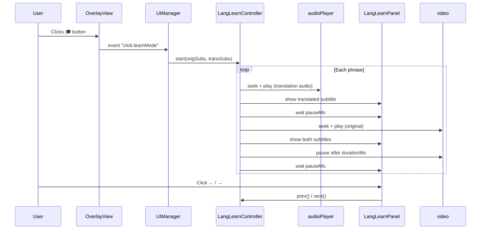

# Language Learning Mode — Implementation Plan

## Summary

Добавляем **режим изучения языка (Lang Learn Mode)** в существующее расширение `voice-over-translation`.

Идея: когда субтитры (оригинал + перевод) уже загружены, пользователь нажимает кнопку «🎓 Учить», и видео начинает воспроизводить фразы по очереди:

```
1. Видео ставится на паузу
2. Для каждой строки субтитров:
   a. Воспроизводится переведённая фраза (звук из аудиодорожки перевода)
   b. Показывается переведённый субтитр (большой, поверх видео)
   c. Пауза (настраивается пользователем, по умолчанию 1.5 с)
   d. Воспроизводится оригинальная фраза (видео seek + play)
   e. Показывается оригинальный + переведённый субтитры
   f. Пауза
   g. Переход к следующей фразе
3. Кнопки «← Пред» и «→ След» позволяют вручную прыгать по фразам
```

> [!IMPORTANT]
> **Браузер**: реализуем как **userscript** (установка через Tampermonkey/Violentmonkey в Chrome или Firefox). Это проще нативного расширения — userscript не требует `manifest.json`, подписи и перезагрузки браузера при обновлении. Финальный вывод — `dist/vot.user.js`, который устанавливается через Tampermonkey одним кликом.

> [!NOTE]
> **Требование к субтитрам**: функция «Learn» активна только тогда, когда загружены субтитры двух языков одновременно — оригинал (from) и перевод (to). VOT уже умеет загружать оба трека через `yandexSubtitles` и `subtitlesWidget`.

---

## Proposed Changes

### New Module: `src/langLearn/phraseSegmenter/`

#### Проблема

Субтитры (особенно автоматически сгенерированные на YouTube) разбиты на короткие строки **без учёта смысла и без пунктуации**. Люди часто говорят без остановок, поэтому использовать паузы (silence gaps) или пунктуацию — ненадёжно.

Например:
```
[0.0–1.2] "and the reason"
[1.2–2.5] "why this works"
[2.5–4.0] "is actually quite simple"
```

Нам нужно объединить их в **одну осмысленную фразу**: `"and the reason why this works is actually quite simple"`

---

#### Решение: Семантическая Сегментация (NLP-first)

Будем использовать специализированную нейросеть для **Sentence Boundary Detection (SBD)** или восстановления пунктуации. Модель запускается **полностью локально в браузере** (WebAssembly/WebGPU) через библиотеку [`@xenova/transformers`](https://github.com/xenova/transformers.js). Сервер не нужен.

**Модель:** `Xenova/punctuation-restoration` или `Xenova/wtpsplit` (или легковесный мультиязычный BERT).
Вес модели: ~40-80 MB. Кешируется в IndexedDB после первой загрузки (дальше работает офлайн и мгновенно).

**Алгоритм:**

1. **Склейка**: Собираем все строки субтитров (или батч из N строк, например, 20-30 сек аудио) в один сплошной текст без переносов.
2. **Анализ**: Скармливаем текст нейросети.
3. **Разметка**: Модель возвращает индексы символов, где, по её мнению, должен стоять знак препинания (конец предложения).
4. **Реконструкция**: Проецируем эти "смысловые разрывы" обратно на тайминги оригинальных `SubtitleLine`.

**Реализация:**

```typescript
import { pipeline } from '@xenova/transformers';

export class SemanticSegmenter {
  private static instance: SemanticSegmenter;
  private classifier: any;

  private constructor(classifier: any) {
    this.classifier = classifier;
  }

  static async load(onProgress?: (p: number) => void): Promise<SemanticSegmenter> {
    if (!this.instance) {
      // Инициализация модели восстановления пунктуации / границ предложений
      const classifier = await pipeline(
        'token-classification',
        'Xenova/punct-restoration', // Пример модели. Точную выберем на этапе имплементации
        { progress_callback: (info) => onProgress?.(info.progress) }
      );
      this.instance = new SemanticSegmenter(classifier);
    }
    return this.instance;
  }

  async segment(lines: SubtitleLine[]): Promise<PhraseBoundary[]> {
    // 1. Склеиваем весь текст
    const fullText = lines.map(l => l.text).join(' ');

    // 2. Нейросеть предсказывает пунктуацию
    const predictions = await this.classifier(fullText);

    // 3. Находим границы предложений и реконструируем тайминги
    const phrases: PhraseBoundary[] = [];
    let currentPhraseLines: SubtitleLine[] = [];
    let currentLineIdx = 0;

    // ... логика сопоставления токенов (predictions) и исходных строк (lines)
    // Когда модель говорит, что здесь конец мысли -> закрываем фразу
    
    return phrases;
  }
}
```

---

#### Шаг 2 — Матчинг оригинала и перевода (Alignment)

Строки оригинала и перевода не всегда совпадают по времени. Используем **временно́е наложение (time overlap)**:

```typescript
function alignTranslation(
  origPhrases: PhraseBoundary[],
  transLines: SubtitleLine[]
): PhraseItem[] {
  return origPhrases.map(orig => {
    const matched = transLines.filter(t =>
      t.startMs < orig.endMs && t.endMs > orig.startMs
    );
    // Fallback: если нет перекрытия — берём ближайшую строку по времени
    const trans = matched.length > 0
      ? matched
      : [transLines.reduce((a, b) =>
          Math.abs(a.startMs - orig.startMs) < Math.abs(b.startMs - orig.startMs) ? a : b
        )];
    return {
      origText: orig.text,
      transText: trans.map(t => t.text).join(' '),
      startMs: orig.startMs,
      endMs: orig.endMs,
      transStartMs: trans[0].startMs,
      transEndMs: trans.at(-1)!.endMs,
    };
  });
}
```

---

#### Итоговый тип данных

```typescript
interface PhraseItem {
  index: number;        // порядковый номер фразы
  origText: string;     // объединённый текст оригинала
  transText: string;    // объединённый текст перевода
  startMs: number;      // начало оригинала в видео
  endMs: number;        // конец оригинала в видео
  transStartMs: number; // начало в аудио перевода
  transEndMs: number;   // конец в аудио перевода
}
```

---

#### [NEW] `src/langLearn/phraseSegmenter/semanticSegmenter.ts`

Экспортирует класс `SemanticSegmenter`, инкапсулирующий логику Transformers.js.

#### [NEW] `src/langLearn/phraseSegmenter/segmenter.test.ts`

Юнит-тесты:
- ✅ Корректно разбивает текст на основе предсказаний мок-модели
- ✅ Корректно матчит перевод при временно́м наложении
- ✅ Fallback на ближайшую строку перевода при отсутствии пересечений

---

#### [NEW] `src/langLearn/LangLearnController.ts`

核心 state machine режима обучения. Не зависит от DOM-специфики конкретного плеера.

**Ответственности:**
- Хранит массив фраз `PhraseItem[]` (индекс, `origLine: SubtitleLine`, `transLine: SubtitleLine`)
- State: `currentIndex`, `isPlaying`, `pauseMs`
- Метод `start(origSubtitles, transSubtitles)` — матчит строки оригинала и перевода по времени
- Метод `playPhrase(index)`:
  1. Вызывает коллбэк `onShowSubtitles(orig, trans)`
  2. Ищет или создаёт audio-элемент для перевода, делает `seek` в аудио перевода
  3. Ожидает `durationMs` фразы перевода
  4. Пауза `pauseMs`
  5. `video.currentTime = origLine.startMs / 1000`, `video.play()`
  6. Ожидает `origLine.durationMs`
  7. `video.pause()`
  8. Пауза `pauseMs`
  9. Переходит к `index + 1`
- Методы: `next()`, `prev()`, `stop()`
- Коллбэки: `onPhraseChange`, `onShowSubtitles`, `onStateChange`

#### [NEW] `src/langLearn/LangLearnPanel.ts`

Плавающая панель управления, отображается как `position: fixed` поверх страницы.

**UI элементы:**
```
┌─────────────────────────────────────────────┐
│  🎓 Режим изучения языка    [✕ Закрыть]     │
│  ─────────────────────────────────────────  │
│  [← Пред]  Фраза 3 / 42  [→ След]          │
│  ─────────────────────────────────────────  │
│  Пауза между фразами: [___1.5___] сек       │
│  ─────────────────────────────────────────  │
│  Исходный язык:  "Hello, how are you?"      │
│  Перевод:        "Привет, как дела?"        │
└─────────────────────────────────────────────┘
```

Стилизация: использует CSS-переменные VOT (`--vot-primary-rgb`, `--vot-surface-rgb` и т.д.) чтобы органично вписаться в тему расширения.

#### [NEW] `src/styles/langLearn.scss`

Стили для панели и субтитров режима обучения:
- Панель: glassmorphism + VOT CSS-переменные
- Субтитры оригинала: большой жёлтый текст внизу видео
- Субтитры перевода: белый текст с тенью выше оригинала

---

### Modified Files

#### [MODIFY] `src/ui/views/overlay.ts`

Добавляем кнопку «🎓» в шапку VOT-меню (рядом с кнопками скачивания и настроек):

```typescript
// в initUI(), в секции VOT Menu Header:
this.learnModeButton = ui.createIconButton(LEARN_ICON, {
  ariaLabel: "Language Learning Mode",
});
this.learnModeButton.hidden = true; // показываем когда есть субтитры

this.votMenu.headerContainer.append(
  this.downloadTranslationButton.button,
  this.downloadSubtitlesButton,
  this.learnModeButton,   // ← новый элемент
  this.openSettingsButton,
);
```

Добавляем событие `"click:learnMode"` в `OverlayViewEventMap`.

#### [MODIFY] `src/types/views/overlay.ts`

Добавляем тип события:
```typescript
"click:learnMode": [];
```

#### [MODIFY] `src/ui/manager.ts`

В `bindOverlayViewEvents()` подписываемся на новое событие:
```typescript
.addEventListener("click:learnMode", () => {
  this.handleLearnModeBtnClick();
})
```

Добавляем метод `handleLearnModeBtnClick()`:
1. Получает `origSubtitles` (оригинальный трек из `videoHandler`)
2. Получает `transSubtitles` (переведённый трек `yandexSubtitles`)
3. Создаёт/показывает `LangLearnController` и `LangLearnPanel`
4. Передаёт `video` элемент в контроллер

#### [MODIFY] `src/ui/icons.ts`

Добавляем SVG-иконку книги/шапки учёного:
```typescript
export const LEARN_ICON = html`<svg>...</svg>`;
```

---

## How It Works (Data Flow)



---

## Verification Plan

### Pre-requisites
```bash
cd /Users/andriibashtoviy/English_Teacher
npm install
```

### 1. Build Check (Automated)
```bash
npm run build
```
✅ Ожидаем: файл `dist/vot.user.js` создан без ошибок TypeScript.

### 2. Unit Tests (Automated)
```bash
npm test
# or: bun test
```
✅ Ожидаем: все существующие тесты проходят (не ломаем ничего).

### 3. Manual Test — Chrome + Tampermonkey

1. Открыть Chrome → установить расширение [Tampermonkey](https://www.tampermonkey.net/)
2. Включить "Режим разработчика" в `chrome://extensions`
3. Tampermonkey → "Установить из файла" → выбрать `dist/vot.user.js`
4. Открыть YouTube → найти **любое видео с английской речью** (например: Ted Talk)
5. Нажать кнопку **«Перевести»** в VOT — дождаться перевода
6. В выпадающем меню VOT нажать **"Субтитры"** → выбрать язык субтитров
7. Убедиться что кнопка **🎓** появилась в шапке меню
8. Нажать **🎓** → должна появиться плавающая панель
9. Видео должно начать воспроизводить первую фразу (translated, затем original)
10. Проверить кнопки **← Пред** и **→ След**
11. Изменить паузу с 1.5 на 3 секунды → убедиться что пауза изменилась
12. Нажать **✕** → панель закрывается, видео возобновляется нормально
